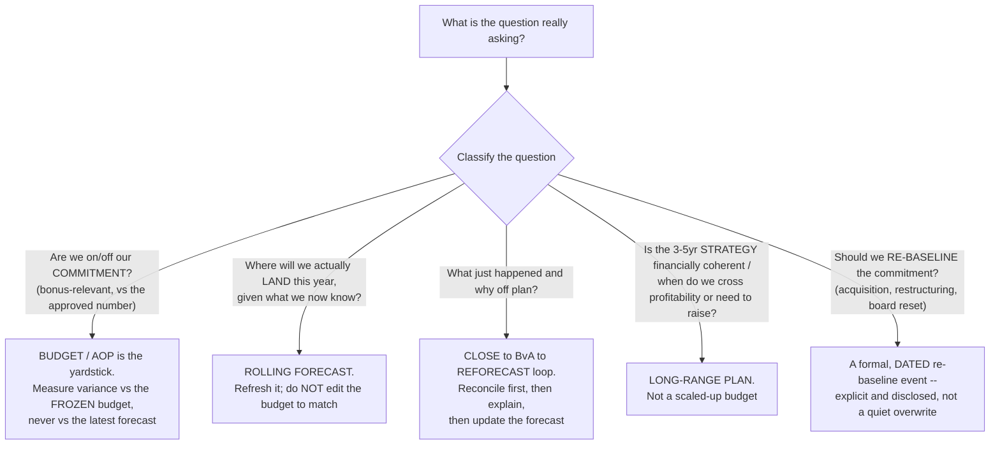
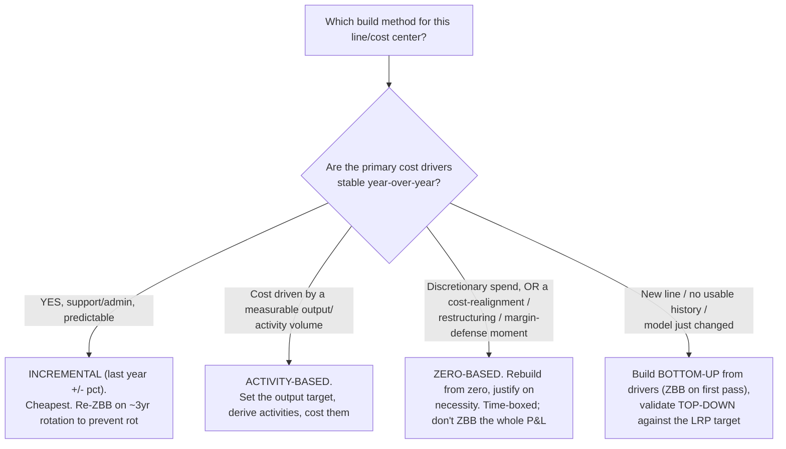
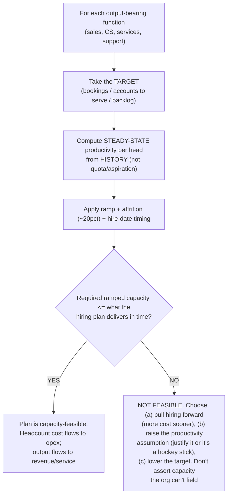

# FP&A operating model & planning — the instruments, the cadence, the people-cost build

> **Last reviewed:** 2026-06-04. Source: this plugin's deep-research synthesis [`../../../docs/research/2026-06-04-finance-domain-depth/fpa-operating-model-and-planning.md`](../../../docs/research/2026-06-04-finance-domain-depth/fpa-operating-model-and-planning.md), built from recognized FP&A authorities (CFI, AFP, Gartner, McKinsey, Bain, FP&A Trends, the Beyond Budgeting / BBRT literature, MIT Sloan, APQC). FP&A is practitioner-framework territory, not codified standard, so `[high]` here means corroboration across ≥2 recognized authorities. Refresh when an engagement surfaces a planning pattern not covered.

This file is the **process-architecture layer** of FP&A. It deliberately does **not** re-teach the forecasting *mechanics* (driver trees, revenue-by-model math — see [`../skills/driver-based-forecasting/SKILL.md`](../skills/driver-based-forecasting/SKILL.md)), the *writing* of variance commentary (see [`../skills/variance-commentary/SKILL.md`](../skills/variance-commentary/SKILL.md) and [`variance-root-cause-triage.md`](./variance-root-cause-triage.md)), or *KPI definition* (see [`../skills/kpi-definition/SKILL.md`](../skills/kpi-definition/SKILL.md)). It is the architecture *around* those: which planning instrument answers which question, which budgeting approach fits, and how headcount/capacity drives the cost plan.

FP&A runs **four distinct instruments**, each answering a different question at a different cadence. The most common structural failure is collapsing two into one (budget = forecast, or LRP = scaled-up budget):

| Instrument | Question | Horizon | Cadence | Owns the number? |
|---|---|---|---|---|
| **Long-Range Plan (LRP)** | "Is the 3–5yr strategy financially coherent?" | 3–5 yrs | Annual, light-touch | Strategy-in-numbers, not a commitment |
| **Annual Operating Plan (AOP) / budget** | "What do we commit to, who's accountable?" | 12 mo | Set once, then **frozen** | **Yes — the commitment baseline** |
| **Rolling forecast** | "Given actuals, where do we now land?" | 12–18 mo, re-extended | Monthly/quarterly | No — a steering tool |
| **Close → BvA → reforecast loop** | "What happened, why off-plan, does our view change?" | Last month + forward | Monthly | No — it *feeds* the forecast |

The LRP sets the trajectory; the AOP translates one year's slice into a costed, owner-assigned commitment; the frozen AOP is the baseline the rolling forecast tracks against; the close produces actuals whose variance feeds the reforecast, which re-extends the horizon and informs next year's AOP and LRP refresh. A serious plan at every horizon **ties out across P&L + balance sheet + cash flow** — most budgets are P&L-only, and a "profitable" plan can still run out of cash. `[high]`

---

## Decision Tree: FP&A — which planning instrument answers this question

**When this applies:** someone asks a planning/performance question and you must pick the right instrument rather than reflexively opening the budget. Picking the wrong one is how "are we on track?" gets answered against a stale forecast, or how a 3-year strategy question gets answered with a scaled-up budget.

**Last verified:** 2026-06-04 against Metapraxis / Abacum (AOP), the rolling-forecast literature, and the Beyond Budgeting "forecast ≠ target" principle.

---

## Decision Tree: FP&A — which budgeting approach

**When this applies:** you are choosing how to build a budget line or cost center. Two independent choices combine: **directional flow** (top-down / bottom-up / counter-flow) and **build method** (incremental / zero-based / activity-based). On flow, the practitioner default is **counter-flow** — issue top-down targets and envelopes, build bottom-up within them, reconcile; a divergence over ~10% is the conversation, not an error to average away.

**Last verified:** 2026-06-04 against CFI, Business LibreTexts, and CFAJournal; consistent with this plugin's `fpa-analyst` "bottoms-up + tops-down triangulation" prior.

---

## Rolling-forecast design and the Beyond Budgeting question

- **Horizon 12–18 months** (18 is better — it always extends past fiscal year-end, removing the Q4 visibility cliff); **cadence matched to decision speed**, not tool capability (revenue may refresh monthly while opex stays quarterly); **driver-based** (the 5–10 drivers that move ~80% of the P&L, not 200 GL lines); and **beside the budget, never overwriting it** — variance is measured vs the frozen budget, forecast accuracy (bias + MAPE) vs the prior forecast. `[high]`
- **The Beyond Budgeting critique (consensus + divergence):** the fixed annual budget creates a "fixed performance contract" that makes managers *make the numbers instead of a difference*. **What survived into the mainstream:** the *tools* — rolling forecasts, driver-based planning, separating the unbiased forecast from the committed target — even while keeping an annual budget. **The credible divergent view:** few organizations abandon the budget entirely, because it does jobs the forecast doesn't (a fixed commitment for bonus/board/covenant, a resource-allocation gate, an accountability anchor). The defensible position is *not* "kill the budget" but **keep the budget as the commitment baseline and add a rolling forecast as the steering layer beside it** — exactly the beside-not-overwriting pattern. `[high]`

## Operating model — calendar, RACI, structure, maturity

- **Calendar** (Dec fiscal year): LRP refresh Q2–Q3 → top-down targets end-Q3 → bottom-up build Q3–Q4 → reconciliation Q4 → approval and **budget lock** late-Q4/early-Q1 → monthly close/BvA/reforecast all year. Engage department leaders **2–3 months before** finalization; a process that starts in Q4 for a January year is already late. `[high]`
- **Ownership:** **the business owns its numbers; FP&A owns the process** — coordinated assumptions, templates, one set of macro drivers, the calendar, and the "effective challenge" back to the business. Exactly one Accountable owner per line. `[high]`
- **Structure:** centralized (consistent, efficient, distant) vs. embedded business-partner (strong decision support, inconsistent methods) — the modern consensus is **hub-and-spoke**: a central center-of-excellence owns standards/consolidation/tooling, spokes embedded in the business own local decision support. `[high]`
- **Maturity ladder:** reactive/annual → driver-based/rolling → predictive/continuous (AI-assisted). This is essentially the incremental adoption of Beyond Budgeting's adaptive-process principles plus modern tooling. `[high]`

---

## Headcount, workforce & capacity planning

People cost is the largest controllable opex line in most service/software businesses, so the headcount plan **is** most of the opex plan. Two layers: the cost build and the capacity gate.

- **Fully-loaded cost per head:** base salary is roughly 70% of true cost; plan on the **~1.25×–1.45× fully-loaded multiplier** (payroll taxes, benefits, variable comp, equity per [`equity-compensation-asc718.md`](./equity-compensation-asc718.md), overhead, amortized recruiting fees). `[high]`
- **The dynamics headcount plans most often get wrong:** model **monthly by start date** (a July 1 hire costs ~half a year); apply **ramp** (revenue/billable roles aren't productive day one); plan **attrition (~20% SaaS sales benchmark) + backfill lag**; respect **span of control** (~6–9 reports for finance/G&A; adding ICs eventually forces adding managers); and **tie headcount into the driver-based forecast** (support off ticket volume, sales off the bookings target via capacity, services off the implementation backlog). The `fpa-analyst` prior — *"headcount math beats opex assumptions; burn comes from people"* — is the anchor. `[high]`

## Decision Tree: FP&A — is the plan capacity-feasible

**When this applies:** a revenue or service plan asserts output that the headcount plan must actually field. This is the load-bearing link from headcount to revenue — a bookings target built on more *ramped* capacity than hiring can deliver is not achievable.

**Last verified:** 2026-06-04 against Kellblog (sales capacity), QuotaPath, Drivetrain, and the CS-capacity literature (Gainsight, ChurnZero, Insight Partners).

Capacity anchors: **sales** — model ARR/rep at steady state from history (not quota), layer ramp (~3–6 mo) + attrition + hire timing; quota coverage typically 1.1×–1.3× the bookings target. **CS** — accounts-or-ARR per CSM by touch model; plan CS to ~5–15% of revenue. **Services** — utilization (~70–80% billable) against the backlog. `[high]` / `[med]`

---

## Common failure modes

- **Budget as an annual political event** disconnected from strategy → tie the AOP to the LRP; counter-flow with explicit envelopes. `[high]`
- **Forecast that re-anchors to budget** (cosmetic freeze) → forecast = unbiased estimate, separate from target; track bias + MAPE; beside-not-overwriting. `[high]`
- **Sandbagging / hockey-stick** → detach comp from a single fixed number; force the driver math for out-years (big moves must be funded and staffed, not asserted). `[high]`
- **Three statements don't tie** → integrate; prove `Assets − Liabilities − Equity = 0` and the cash roll every period. `[high]`
- **Headcount plan ignores ramp/attrition/timing; revenue plan exceeds fieldable capacity** → monthly-by-start-date with ramp/attrition/span; run the capacity gate before locking the revenue plan. `[high]`
- **LRP as a scaled-up budget; cadence mismatch** → the LRP is strategy-in-numbers tied to specific bets; match cadence to decision speed. `[high]` / `[med]`

---

## When to escalate

- **Building the driver tree / revenue model / scenarios** → `financial-modeler` (this plugin) via the [`../skills/driver-based-forecasting/SKILL.md`](../skills/driver-based-forecasting/SKILL.md) skill (this doc places that mechanic inside the four-instrument architecture).
- **Writing the variance story; the close/BvA loop** → `fpa-analyst` / `controller` (this plugin); commentary discipline per [`variance-root-cause-triage.md`](./variance-root-cause-triage.md).
- **Investment cases, unit economics, and decision support inside the plan** → see [`fpa-decision-support-and-unit-economics.md`](./fpa-decision-support-and-unit-economics.md).
- **The board/investor narrative for the plan** → `board-pack-composer` (this plugin).
- **Statistical rigor on a forecast model (bias, accuracy, method selection)** → `applied-statistics`, via the Team Lead.

---

## Citations / sources

Full synthesis with inline confidence tags and source URLs: [`../../../docs/research/2026-06-04-finance-domain-depth/fpa-operating-model-and-planning.md`](../../../docs/research/2026-06-04-finance-domain-depth/fpa-operating-model-and-planning.md) (retrieved 2026-06-04). Corroborated across CFI, AFP, Gartner, McKinsey, Bain, FP&A Trends, the Beyond Budgeting / BBRT literature, MIT Sloan, and APQC. Several authority domains (cfosecrets, Wall Street Prep, CFI, AFP, Scale Army) returned HTTP 403 on fetch; those claims rest on the search excerpt plus an independent corroborating source. FP&A is practitioner-framework territory — `[high]` denotes corroboration across ≥2 recognized authorities, not a codified standard.
