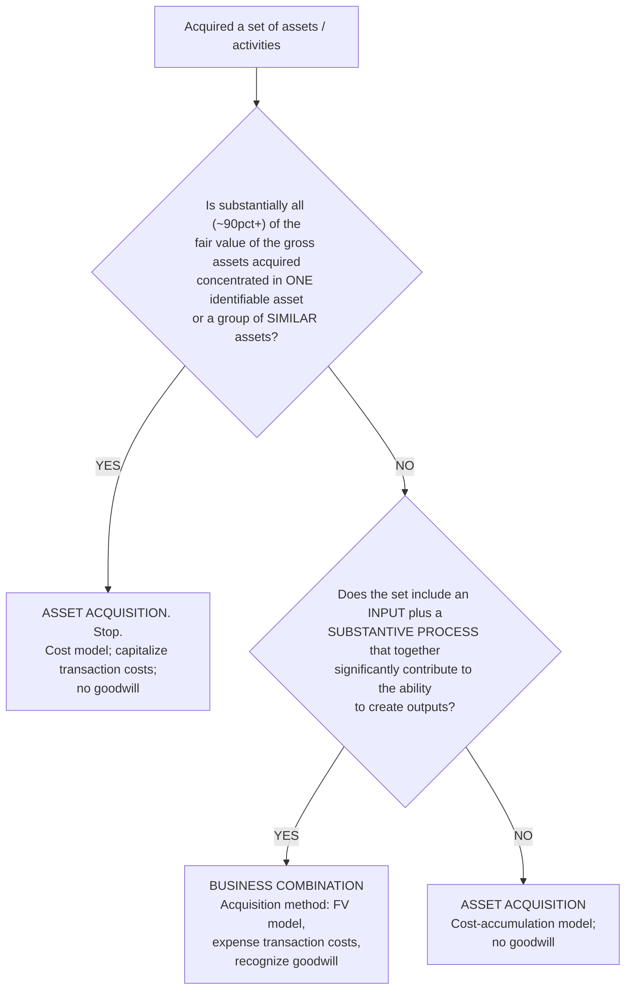
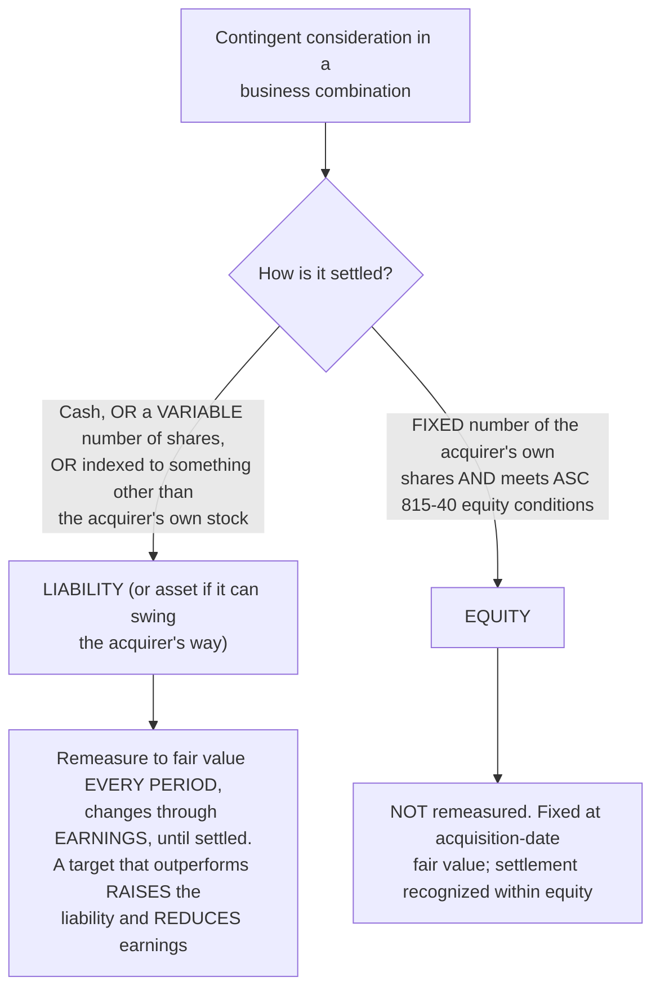

# M&A purchase accounting (ASC 805) — getting the deal on the books right

> **Last reviewed:** 2026-06-04. Source: this plugin's deep-research synthesis [`../../../docs/research/2026-06-04-finance-domain-depth/asc805-purchase-accounting.md`](../../../docs/research/2026-06-04-finance-domain-depth/asc805-purchase-accounting.md), built from the FASB ASC codification (805-10/-20/-30, 350, 805-740) and the Big-4 / large-firm technical guides (Deloitte DART, PwC Viewpoint, KPMG, EY FRD, RSM, BDO, Grant Thornton). Refresh when (a) a new ASU revises business-combinations or goodwill accounting, (b) the FASB reopens the goodwill-amortization project (closed June 2022), or (c) an engagement surfaces a fact pattern not covered here. **Standards move and section numbers shift — confirm against the live codification before relying on a number in a memo or a model.**

When a deal closes, the accounting decisions made in the first 90 days set the depreciation, amortization, tax, and impairment run-rate for years. The recurring failure mode is not arithmetic — it is **picking the wrong framework**: treating an asset acquisition like a business combination, dumping identifiable intangibles into goodwill, defaulting an earnout to equity when it should be a remeasured liability, or forgetting the deferred-tax step-up that feeds the goodwill residual. Two trees below resolve the two forks that drive everything downstream. Traverse them against the deal's actual terms — **do not pattern-match on "we bought a company."**

The acquisition-method spine (for reference): (1) identify the acquirer, (2) fix the acquisition date (control transfers, usually close), (3) recognize and measure identifiable assets/liabilities and any NCI at acquisition-date fair value, (4) recognize **goodwill** (residual) **or** a bargain-purchase gain. `Goodwill = consideration transferred + FV of any previously held interest + NCI − FV of identifiable net assets`. Transaction costs in a business combination are **expensed** as incurred. `[high]`

---

## Decision Tree: M&A — business combination vs. asset acquisition (the screen test)

**When this applies:** you have acquired a set of assets and/or activities and must decide whether to apply the full **acquisition method** (ASC 805 business combination) or **asset-acquisition** (cost-accumulation) accounting. This is the threshold question — the two models diverge sharply on transaction costs, goodwill, and contingent consideration — so resolve it **before** building the purchase entry.

**Last verified:** 2026-06-04 against ASC 805-10-55-5A (the ASU 2017-01 screen / concentration test) and Deloitte DART / Weaver / CohnReznick / GAAP Dynamics excerpts.

**Rationale per leaf:**

- _ASSET ACQUISITION (screen met)_ — the screen is a deliberate shortcut: if value is concentrated in a single asset (or similar group), the set is **not a business** and you skip the inputs–processes–outputs analysis entirely. `[high]` "Substantially all" is read as ~90%+, but the FASB **did not make it a bright line** — apply judgment near the threshold, and exclude goodwill, deferred taxes, and the asset itself from the "gross assets" denominator. `[med]`
- _BUSINESS COMBINATION_ — an input plus a substantive process that significantly contributes to creating outputs is the minimum to be a business; apply the full acquisition method. `[high]`
- _ASSET ACQUISITION (no substantive process)_ — a set with inputs but no substantive process is an asset acquisition even if the screen wasn't met. `[high]`

**Why the fork matters — the four divergences** `[high]`:

| | Business combination | Asset acquisition |
|---|---|---|
| Measurement model | **Fair-value** | **Cost-accumulation** |
| Transaction costs | **Expensed** as incurred | **Capitalized** into asset cost |
| Goodwill | Recognized (residual) | **None**; excess cost allocated on **relative fair value** |
| Contingent consideration | FV at acquisition; liability-classified **remeasured through earnings** | Generally recognized when **probable + estimable**; **capitalized** into asset cost |

---

## Decision Tree: M&A — contingent consideration (earnout) classification and remeasurement

**When this applies:** the deal includes contingent consideration (an earnout, a clawback, a milestone payment) in a **business combination**. The initial classification — liability vs. equity — is the fork that drives every subsequent period, so settle it at acquisition. Recognized at **acquisition-date fair value** as part of consideration transferred; **initial** classification is determined under ASC 480 / 815-40 per ASC 805-30-25-6. `[high]`

**Last verified:** 2026-06-04 against ASC 805-30-25-6 (initial classification under ASC 480) and Deloitte DART 5.7 / GAAP Dynamics excerpts.

**Rationale per leaf:**

- _LIABILITY → remeasure through earnings_ — cash-settled or variable-share earnouts are liabilities remeasured to fair value each period with the change in P&L. This is the **counter-intuitive volatility trap**: a target that beats its targets *increases* the liability and *reduces* reported earnings — operators are routinely blindsided. `[high]` Note: ASC 805 (not ASC 480) governs **subsequent** measurement of a liability-classified earnout. `[high]`
- _EQUITY → not remeasured_ — a fixed number of the acquirer's own shares meeting ASC 815-40 equity conditions is fixed at acquisition-date fair value and never remeasured. Defaulting an earnout to equity to avoid the P&L volatility, when it is really cash/variable-settled, is a common and material error. `[high]`

---

## Where the residual goes — goodwill, bargain purchase, and the tax step-up

- **Goodwill vs. bargain purchase.** If consideration + NCI + prior-held interest **< FV of identifiable net assets**, you have a *potential* bargain purchase. **Before booking any gain**, ASC 805-30 requires a **mandatory reassessment** that every asset/liability (including unrecognized intangibles) and every FV input is correct. Only an excess that **persists after reassessment** is recognized — as a **gain in earnings on the acquisition date** (US GAAP: always P&L, never OCI/equity). Typical legitimate causes are distressed/forced sales and regulatory divestitures. `[high]`
- **Identifiable intangibles — don't dump them into goodwill.** An intangible is identifiable if it is **separable** OR **arises from contractual/legal rights**. The common set and their standard methods: customer relationships → **MPEEM** (multi-period excess earnings, applied last, net of contributory-asset charges); developed technology and trade names → **relief-from-royalty**; non-competes → **with-and-without**; IPR&D → income approach, **indefinite-lived until completed or abandoned**. Workforce is **not** separable — it stays in goodwill (but is a contributory asset in MPEEM). `[high]`
- **Deferred-tax step-up.** In a **nontaxable** deal (tax basis carries over), book bases step up to fair value but tax bases don't → a **DTL** on the step-up. The DTL **reduces net identifiable assets**, which **increases goodwill**. Where tax-deductible goodwill exists, the DTA is solved by an **iterative "simultaneous-equations" loop** (the DTA changes goodwill, which changes the temporary difference, which changes the DTA). **No DTL** is recorded on the excess of book goodwill over tax-deductible goodwill (ASC 805-740-25-9) — a deliberate exception to avoid circular grossing-up. **Omitting the step-up DTL is one of the most common — and most material — errors.** `[high]`

## The measurement period

A window of up to **one year** after the acquisition date in which the acquirer adjusts **provisional** amounts for new information about facts existing at the acquisition date. It is **not a one-year blank check** — it ends when the information is obtained. Under **ASU 2015-16**, measurement-period adjustments are booked **prospectively, in the period determined** (with a current-period catch-up to depreciation/amortization), **not** by retrospective restatement; the offset is to **goodwill**. After the period closes, changes are error corrections or normal post-acquisition events and no longer touch goodwill. `[high]`

## Goodwill after the deal (ASC 350)

- **Public / non-electing entities:** the simplified **one-step** test (ASU 2017-04) — compare a reporting unit's fair value to its carrying amount; impairment = `carrying amount − fair value`, **capped at the goodwill balance**. An optional qualitative "Step 0" can skip the quantitative test. `[high]`
- **Private-company alternative (ASU 2014-02):** eligible private companies may **amortize goodwill straight-line over ≤10 years** and test only on a triggering event. `[high]`
- **The amortization-for-all project is dead** — the FASB **removed goodwill subsequent-accounting from its agenda in June 2022**. Public companies stay impairment-only; **do not assume amortization is coming.** `[high]`

---

## US GAAP vs. IFRS 3 — the divergences that change a number

- **NCI / goodwill:** US GAAP — partial method only (NCI at proportionate share). IFRS 3 — **policy choice per transaction** (full-goodwill at NCI fair value, or partial). `[high]`
- **Measurement-period adjustments:** US GAAP **prospective** (ASU 2015-16); IFRS **retrospective** to the acquisition-date accounting. `[high]` (This is the cleanest divergence to remember.)
- **Bargain purchase:** both recognize a gain in P&L after reassessment. `[med]`

---

## Common practitioner errors

- **"Everything into goodwill."** Failing to identify separable/contractual intangibles overstates goodwill, understates amortization, and invites restatement. `[high]`
- **Mis-classifying contingent consideration** — defaulting a cash/variable earnout to equity (no remeasurement), or being blindsided when a strong target *raises* the liability and cuts earnings. `[high]`
- **Ignoring the deferred-tax step-up** — omitting the DTL on the book-vs-tax basis difference, which both misstates the balance sheet and understates goodwill, and skipping the iterative goodwill/DTA loop. `[high]`
- **Wrong framework** — skipping the screen test and treating an asset acquisition like a business combination (or vice versa). `[high]`
- **Treating the measurement period as a one-year blank check** — pushing routine post-close estimate changes through goodwill, or restating retrospectively (pre-ASU-2015-16 muscle memory). `[high]`
- **Skipping the bargain-purchase reassessment** — booking a "gain" that is actually a missed intangible or an unrecognized liability. `[high]`

---

## When to escalate

- **PPA / intangible valuation, or the iterative goodwill/DTA step-up math** → `financial-modeler` (this plugin) to build the allocation and the step-up loop; pull in `valuation-analyst` for the intangible fair values (MPEEM, relief-from-royalty).
- **Goodwill impairment testing or a reporting-unit fair value** → `valuation-analyst` (this plugin); the WACC for the test follows [`wacc-cost-of-capital-sourcing.md`](./wacc-cost-of-capital-sourcing.md).
- **Opening-balance journal entries, the DTL booking, and the close mechanics** → `controller` (this plugin); cutoff and reconciliation discipline per [`accrual-and-cutoff-discipline.md`](./accrual-and-cutoff-discipline.md).
- **The tax-provision consequences of the step-up and acquired carryforwards** → see [`tax-provision-asc740.md`](./tax-provision-asc740.md); a regulated-entity deal also routes through `regulatory-compliance`.
- **A deal narrative for the board** → `board-pack-composer` (this plugin).
- **A live filing-grade conclusion** → escalate to `ravenclaude-core` `deep-researcher` to confirm the current codification and any post-2026 ASUs before it ships.

---

## Citations / sources

Full synthesis with inline confidence tags and source URLs: [`../../../docs/research/2026-06-04-finance-domain-depth/asc805-purchase-accounting.md`](../../../docs/research/2026-06-04-finance-domain-depth/asc805-purchase-accounting.md) (retrieved 2026-06-04). Anchored on the FASB ASC codification (805-10-55-5A screen test, 805-30 contingent consideration and bargain purchase, 805-740-25-9 tax step-up, 350-20 goodwill) and ASU 2015-16 / 2017-01 / 2017-04 / 2014-02 / 2025-03, cross-corroborated across Deloitte DART, PwC Viewpoint, KPMG, EY FRD, RSM, BDO, and Grant Thornton. Several Big-4 pages returned HTTP 403 on fetch; load-bearing claims were corroborated across ≥2 independent sources before being tagged `[high]`. Currency note from the research: **ASU 2025-03 (May 2025) revised the VIE accounting-acquirer rule** — check adoption timing before relying on the legacy "VIE primary-beneficiary is always the acquirer" rule.
