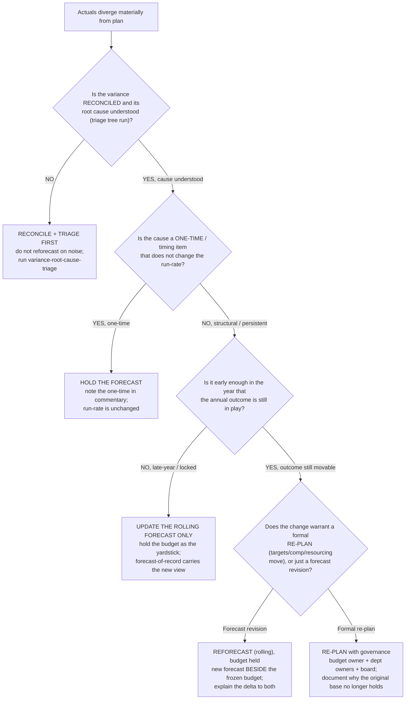

# Decision tree — reforecast vs. hold the budget (and what to tell the board)

> **Last reviewed:** 2026-06-05. Source: this plugin's `fpa-analyst` / `board-pack-composer` opinions, the `driver-based-forecasting` skill, [`fpa-operating-model-and-planning.md`](./fpa-operating-model-and-planning.md), and standard rolling-forecast / Beyond-Budgeting practice. Refresh when an agent's opinion on reforecast cadence changes or an engagement surfaces a leaf not on the tree. Framings are domain-standard, not engagement advice — confirm against the entity's planning calendar and governance norms.

This tree complements the forecast-method tree in [`finance-decision-trees.md`](./finance-decision-trees.md): that one chooses *how* to forecast a line; this one decides *whether to revise the forecast at all* when actuals diverge from plan, and how to present the divergence without destroying the budget's value as a yardstick. **Traverse top-to-bottom — do NOT reflexively re-base the plan to the latest actuals (it launders away the miss and the accountability), and do NOT defend a forecast you know is wrong (house opinion: a forecast that never moves is a number stuck in time).**

**When this applies:** a period closed with actuals materially off the budget/forecast, and the question is what to *do* with the plan. Observable trigger: a quarter's variance breaches materiality, a re-plan request, a board cycle, or a forecast-accuracy review showing persistent bias.

**Last verified:** 2026-06-05 against this plugin's `fpa-analyst` ("forecast revisions are normal"; "treat the forecast as a tool for steering, not a number to defend") and the rolling-forecast-beside-the-budget best practice.

**Rationale per leaf:**

- _RECONCILE + TRIAGE FIRST_ — never reforecast on an unreconciled variance; you'd be chasing noise (§3 #3, "reconcile before you narrate"). Run the variance-root-cause triage first so the reforecast responds to signal, not a cutoff artifact.
- _HOLD THE FORECAST_ — a genuine one-time or timing item doesn't move the run-rate, so the forecast shouldn't move either. Note it in commentary; re-basing the forecast for a one-time launders a non-recurring item into the trend.
- _UPDATE THE ROLLING FORECAST ONLY_ — late in the year the annual outcome is largely set; revise the **rolling forecast** to carry the honest forward view but **hold the budget** as the frozen yardstick (you still need to measure against the commitment).
- _REFORECAST (rolling), budget held_ — the default for a structural change early enough to matter: revise the rolling forecast and present it **beside** the frozen budget, never overwriting it. The delta-to-budget *is* the accountability signal; overwriting destroys it.
- _RE-PLAN with governance_ — a re-plan (moving targets, comp, resourcing) is a **process**, not a spreadsheet edit; it needs the budget owner, department owners, and board involvement, and a written rationale for why the original base no longer holds. Reserve it for changes big enough to move commitments.

**Tradeoffs summary:**

| Outcome | When | Budget treatment | Accountability preserved? |
|---|---|---|---|
| Reconcile + triage first | cause not yet understood | unchanged | n/a (prevents acting on noise) |
| Hold the forecast | one-time / timing, run-rate unchanged | unchanged | yes |
| Update rolling forecast only | late-year, outcome locked | held as yardstick | yes |
| Reforecast, budget held | structural, outcome still movable | held beside the forecast | yes — delta-to-budget is the signal |
| Formal re-plan | targets/comp/resourcing must move | re-based with governance | yes — documented rationale |

The "hold the budget beside the forecast" discipline runs through every leaf — see [`../best-practices/fpa-rolling-forecast-beside-the-budget.md`](../best-practices/fpa-rolling-forecast-beside-the-budget.md). The reconcile-first gate is [`../best-practices/reconcile-before-you-narrate.md`](../best-practices/reconcile-before-you-narrate.md); the triage itself is [`variance-root-cause-triage.md`](./variance-root-cause-triage.md). For the board narrative around the change, route to `board-pack-composer` (open with the narrative, not the table).

**When to escalate:**

- A re-plan that moves comp or headcount → `fpa-analyst` coordinates with the budget owner and dept owners; this is the planning-calendar/RACI process in [`fpa-operating-model-and-planning.md`](./fpa-operating-model-and-planning.md), not a unilateral forecast edit.
- The change needs to be told to a board / lender → `board-pack-composer` owns the narrative arc; `fpa-analyst` supplies the variance and the new forecast.
- Persistent forecast bias (same-direction misses) surfaces in the accuracy review → that's a calibration problem in the forecast *method*, not a reason to re-base; route to the forecast-method tree and the bias/MAPE loop.
