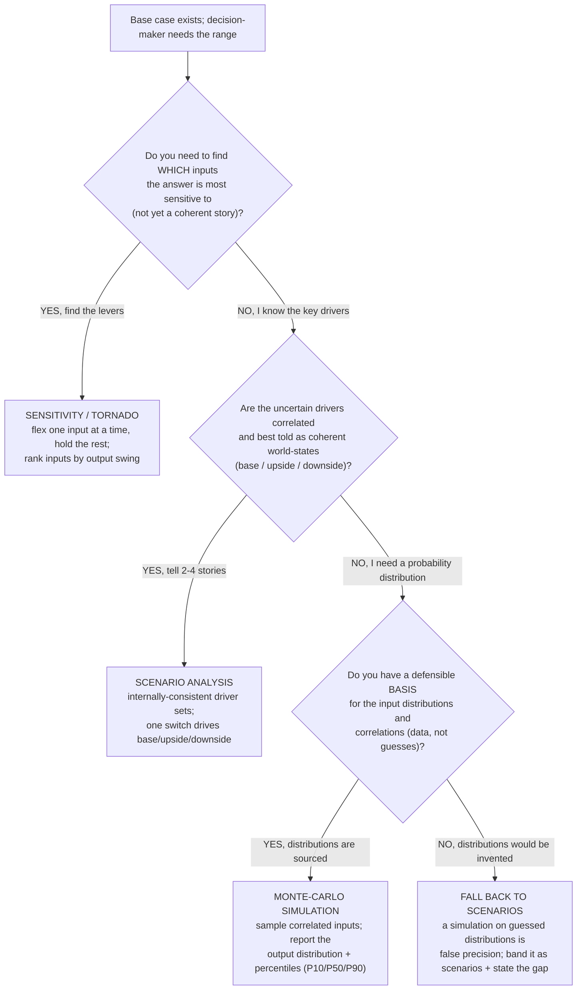

# Decision tree — scenario vs sensitivity vs Monte-Carlo simulation

> **Last reviewed:** 2026-06-05. Source: this plugin's `financial-modeler` / `fpa-analyst` opinions, the `driver-based-forecasting` and `dcf-valuation` skills, and standard corporate-finance uncertainty-analysis framing. Refresh when an agent's opinion on uncertainty analysis changes, a new skill adds a method this tree should branch to, or an engagement surfaces a leaf not on the tree. Method definitions here are domain-standard framings, not engagement advice — confirm against the live deliverable's purpose.

This tree complements the forecast-method, valuation-method, and build-vs-buy trees in [`finance-decision-trees.md`](./finance-decision-trees.md). It codifies a "how should I model the uncertainty?" decision the modeling and FP&A agents make whenever a base-case number is about to be presented as if it were certain. **Traverse top-to-bottom before picking a technique — do NOT default to "I'll just flex a couple of cells," and do NOT reach for Monte Carlo because it looks rigorous.** The wrong pick either under-states risk (a single point estimate) or manufactures false precision (a simulation on guessed distributions).

**When this applies:** a base case exists (a forecast, a model output, a valuation, a budget) and a decision-maker needs to understand how wrong it could be. Observable trigger: "what if revenue is 10% lower?", "what's the downside?", "give me a range, not a number", a board / lender / investment-committee ask, or house opinion #4 (a single forecast is false precision).

**Last verified:** 2026-06-05 against this plugin's `financial-modeler` ("three scenarios, always"; "scenarios driven by one switch") and `fpa-analyst` opinions.

**Rationale per leaf:**

- _SENSITIVITY / TORNADO_ — when you don't yet know which inputs matter, flex each one alone and rank by the swing it produces. This is the **diagnostic** step: it tells you where to spend modeling effort, and it precedes scenario design (you scenario the inputs the tornado flagged). It is **not** a risk story on its own — one-at-a-time flexing ignores that real drivers move together.
- _SCENARIO ANALYSIS_ — the default for a decision-grade range: 2–4 internally-consistent world-states (a recession case isn't just "revenue down" — it's revenue down *and* longer collections *and* hiring freeze). Drive them from **one switch** so the model is auditable and a reviewer can flip between worlds. House opinion #4: a single forecast is false precision; present the range with the scenario assumptions.
- _MONTE-CARLO SIMULATION_ — only when you can defend the input **distributions and their correlations** from data (e.g. historical volatility, a fitted distribution). Then sampling produces an output distribution and percentiles (P10/P50/P90) a decision-maker can price. **requires:** sourced distributions + a correlation structure — without them, the rigor is cosmetic.
- _FALL BACK TO SCENARIOS_ — if a Monte Carlo would run on **guessed** distributions, it is *less* honest than a banded scenario set, because the smooth output curve hides that every input was a guess. Band it as scenarios and state the calibration gap rather than manufacture a distribution.

**Tradeoffs summary:**

| Method | Effort | What it answers | Key risk | Use when |
|---|---|---|---|---|
| Sensitivity / tornado | low | which inputs matter most | ignores input correlation | Finding the levers before designing scenarios |
| Scenario analysis | medium | coherent best/base/worst stories | only N discrete worlds | Decision-grade range; correlated drivers |
| Monte-Carlo simulation | high | full output distribution + percentiles | false precision on guessed inputs | Distributions + correlations are data-sourced |
| Fall back to scenarios | medium | honest band + stated gap | not a probability | Distributions would have to be invented |

These compose: run **sensitivity first** to find the drivers, then **scenario** those drivers, and escalate to **Monte-Carlo only** when the distributions are defensible. The scenario switch ties to [`../best-practices/model-present-scenarios-driven-by-one-switch.md`](../best-practices/model-present-scenarios-driven-by-one-switch.md); the underlying drivers come from the forecast-method tree in [`finance-decision-trees.md`](./finance-decision-trees.md).

**When to escalate:**

- A Monte-Carlo result is about to gate an irreversible decision (a financing structure, an acquisition price) → have `financial-modeler` defend the distributions and correlation assumptions explicitly; an undefended distribution is the named "false precision" anti-pattern.
- The uncertainty is in a **valuation** terminal value or WACC → route through the `valuation-analyst` and the terminal-value tree in [`finance-decision-trees.md`](./finance-decision-trees.md) before simulating.
- Any input distribution is pulled from training/memory rather than the entity's data → mark it `[unverified — training knowledge]` and source it before it gates the decision (§3 #1).
