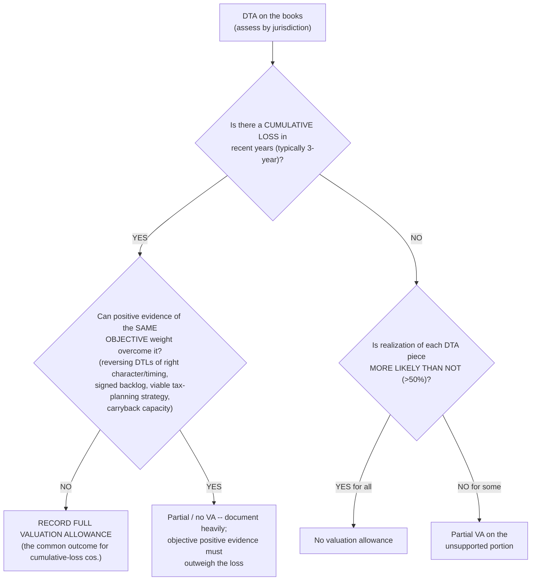
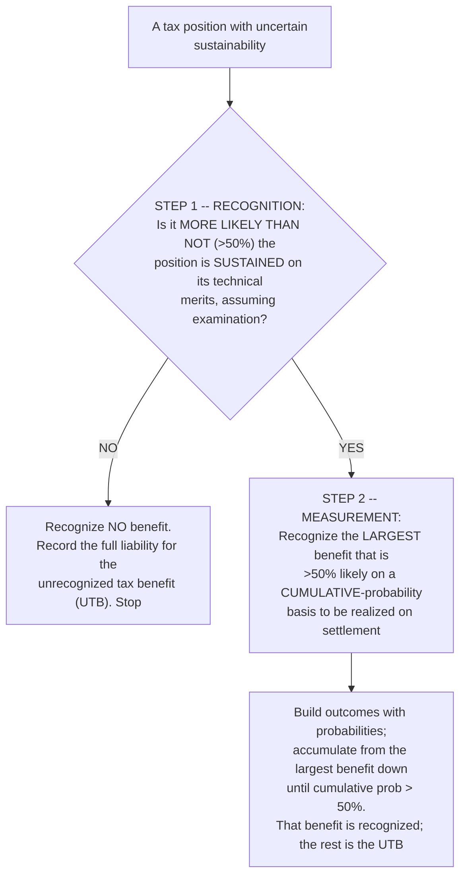

# Tax provision (ASC 740) — the deferred roll, the rate rec, and the judgment calls

> **Last reviewed:** 2026-06-04. Source: this plugin's deep-research synthesis [`../../../docs/research/2026-06-04-finance-domain-depth/asc740-tax-provision.md`](../../../docs/research/2026-06-04-finance-domain-depth/asc740-tax-provision.md), built from the FASB ASC codification (740-10, 740-270) and the Big-4 / large-firm income-tax guides (Deloitte Roadmap, PwC Income Taxes, KPMG handbook, RSM, BDO, The Tax Adviser, Bloomberg Tax). Refresh when (a) a new ASU revises income-tax accounting or disclosure (e.g., ASU 2023-09), (b) a federal/state rate change is enacted, or (c) an engagement surfaces a fact pattern not covered. **Rates and section numbers move — confirm the enacted rate and the live codification before relying on a number in a provision or a model.**

The total provision is `current tax + deferred tax`, but the failure modes cluster in two places: the **deferred roll-forward** (modelers who compute "temporary differences × rate" instead of rolling the deferred balances, and lose the items that bypass the income statement) and the **judgment estimates** — the valuation allowance and uncertain tax positions. Two trees below resolve those judgments. The mechanical spine, for reference:

```
Pre-tax BOOK income
  +/- Permanent differences   -> affects current tax and the ETR only
  +/- Temporary differences   -> affects current tax now; reverses into deferred
  = Taxable income
  x current statutory rate - credits = CURRENT tax expense (-> taxes payable)
Roll the DTA/DTL schedule (begin -> end), incl. VA change and enacted-rate remeasurement
  = DEFERRED tax expense
CURRENT + DEFERRED = TOTAL provision -> ties to ETR x pre-tax book income
```

Two rules that anchor everything: ASC 740 is a **balance-sheet (liability) method** — deferreds come from comparing book carrying amount to tax basis, measured at the **enacted** rate expected on reversal (not an expected-to-be-enacted or "substantively enacted" rate); and a rate change is a **discrete item in the period of enactment**, applied to all deferreds. `[high]`

---

## Decision Tree: Tax — do we need a valuation allowance?

**When this applies:** you hold a deferred tax asset (NOLs, credits, deductible temporaries) and must decide whether to reduce it by a valuation allowance. This is the most-second-guessed estimate in the provision — work it by **jurisdiction / tax-paying component**, weighing **all** positive and negative evidence.

**Last verified:** 2026-06-04 against ASC 740-10-30 (the more-likely-than-not threshold and the four sources of taxable income at 740-10-30-18), corroborated across Deloitte §5.3, PwC §5.2, KPMG, and The Tax Adviser.



**Rationale & rules baked in:**

- **More-likely-than-not (>50%)** is the recognition gate; a VA reduces the DTA to the realizable amount. `[high]`
- **Objectivity beats optimism.** Verifiable history outweighs projections — "the more negative evidence exists, the more positive evidence is necessary." A **cumulative loss in recent years is significant negative evidence that is hard to overcome** and is the first thing a reviewer looks for. `[high]`
- **The four sources of future taxable income** (ASC 740-10-30-18) that can support a DTA: (1) future reversals of existing taxable temporary differences, (2) future taxable income exclusive of reversals, (3) carryback to prior years where permitted, (4) prudent, feasible tax-planning strategies. `[high]`
- **Naked credits aren't a source.** A DTL on goodwill or an indefinite-lived intangible ("naked"/"hanging" credit) generally **cannot** support a finite-lived DTA — its reversal timing is unknowable (indefinite-future sale/impairment). Post-TCJA, indefinite-lived NOLs can absorb *some* of it. `[high]` / `[med]`
- **VA release** (full → none after sustained profitability) is a large favorable discrete hit to the ETR and an **earnings-quality flag** auditors scrutinize. `[high]`

---

## Decision Tree: Tax — uncertain tax position (the two-step model)

**When this applies:** the return takes a position whose sustainability on the merits is uncertain. ASC 740-10 keeps a **two-step** model (legacy FIN 48), assuming the position *will* be examined by an authority with full knowledge of the facts.

**Last verified:** 2026-06-04 against ASC 740-10-25 (recognition) and 740-10-30-7 (measurement), corroborated across Bloomberg Tax, KPMG, and Deloitte Ch. 4.



**Worked Step 2:** for a $100 deduction with outcomes {$100 @ 25%, $80 @ 30%, $60 @ 25%, $0 @ 20%}, cumulative probability first exceeds 50% at the **$80** level (25%+30%=55%) → recognize **$80**; the $20 is the unrecognized tax benefit. `[high]` Interest and penalties carry a **policy election** (tax expense vs. interest/other expense), applied consistently; a statute-of-limitations lapse re-measures the UTB as a **discrete** item. `[high]` / `[med]`

---

## The ETR / rate reconciliation, intraperiod allocation, and interim reporting

- **Why permanents move the ETR and temporaries don't.** A temporary difference changes *when* tax is paid, not the lifetime total relative to book income, so it nets to zero in the rate rec; a **permanent** difference changes the total permanently and is a standing reconciling item. The rate rec bridges statutory (21% US federal) to effective: permanents (↑), tax-exempt income (↓), state tax net of federal (↑), FTC and R&D credits (↓, dollar-for-dollar), GILTI (↑ net) / FDII (↓), **VA changes** (often the largest single swing), UTP build/release, and **SBC windfalls/shortfalls** (↓/↑). `[high]`
- **SBC ETR volatility** — post-ASU 2016-09 the stock-comp windfall/shortfall runs through the **provision** as a discrete item tied to the share price, making the ETR **inherently volatile and hard to forecast** (a top "why did our ETR move?" surprise and a recurring interim-modeling miss). `[high]` See [`equity-compensation-asc718.md`](./equity-compensation-asc718.md).
- **Disclosure (ASU 2023-09):** public business entities must disaggregate any rate-rec item ≥ **5%** of `pre-tax income × statutory rate` (effective for PBE annual periods beginning after Dec 15, 2024) — "other" buckets that used to hide drivers now need standalone disclosure. `[high]` / `[med]`
- **Intraperiod allocation** spreads total tax across continuing ops, discontinued ops, OCI, and equity without changing the total (compute continuing-ops tax first, allocate the rest incrementally). **ASU 2019-12 removed** the old exception that considered other components when there was a continuing-ops loss — a frequently-missed simplification. `[high]`
- **Interim (ASC 740-270)** is **not** "this quarter's pre-tax income × statutory rate." Project an **estimated annual effective tax rate (AETR)** on ordinary income, apply it to YTD ordinary income, subtract prior-interim tax, then **add discrete items** in the period they occur. **Discrete** items include enacted rate changes, changes to a **prior-year-end** VA, UTP settlements/SOL lapses, and SBC windfalls/shortfalls — **but a change to a VA on a DTA created in the current year goes *into* the AETR**, not discrete (a frequently-missed split). `[high]` / `[med]`

---

## US GAAP vs. IAS 12 — the divergences that change numbers

- **Uncertain tax positions:** US GAAP **two-step** (recognition then measurement); IFRIC 23 **single-step** (most-likely-amount or expected-value) — different numbers. `[high]`
- **DTA realizability:** US GAAP recognizes the DTA in full then reduces it with a **valuation allowance**; IAS 12 recognizes a DTA **only to the extent realization is probable** (no separate VA account). `[high]`
- **Rate basis:** US GAAP **enacted** only; IAS 12 **enacted or substantively enacted** — the recognition period for a rate change can differ. `[high]`
- **Classification is converged:** all DTAs/DTLs are **noncurrent** under both (US GAAP since ASU 2015-17). `[high]`

---

## Where it lands and the close mechanics

- **Income statement:** total provision (continuing-ops portion) as income tax expense. **Balance sheet:** taxes payable/receivable (current); net **DTA/DTL** as a single **noncurrent** amount per jurisdiction; UTB liability. **Cash flow:** start from net income, **add back deferred tax expense** (non-cash); change in taxes payable is working capital; cash taxes paid is a supplemental disclosure. `[high]`
- **Return-to-provision (RTP) true-up:** when the return is filed, **permanent-item** differences hit **tax expense**; **temporary-item** differences are generally a **reclass** between payable/receivable and the DTA/DTL (no expense impact). Distinguish a *change in estimate* (prospective) from an *error* (restatement). `[high]`
- **Modeler's caution:** the deferred provision is the **roll-forward of the deferred balances**, not "temporaries × rate." Items that bypass the income statement (OCI, equity, business-combination opening balances, rate-change remeasurement) move the balance without touching continuing-ops tax expense — backing them out is where naive three-statement models break. `[high]`

---

## Common practitioner errors

- **Wrong enacted rate / enactment timing** — using an expected (not enacted) rate, or recognizing a rate change in the wrong period (it's discrete in the enactment period, applied to all deferreds). `[high]`
- **Missing a VA trigger** — ignoring a cumulative loss as significant negative evidence, or over-relying on un-verifiable projections. `[high]`
- **Blending current and deferred incorrectly** — a permanent in the deferred roll, or a temporary in the ETR. `[high]`
- **Naive interim ETR** — YTD statutory rate instead of the AETR, or mis-sorting discrete items (esp. current-year vs. prior-year-end VA changes). `[high]`
- **Forgetting RTP true-ups** or mis-classifying them (permanent → expense vs. temporary → balance-sheet reclass). `[high]`
- **SBC windfall/shortfall surprises; treating naked credits as a source of taxable income; a deferred roll-forward that doesn't tie to the prior year.** `[high]`

---

## When to escalate

- **Building the provision into a three-statement model or the deferred roll-forward** → `financial-modeler` (this plugin); the SBC-driven ETR volatility ties to [`equity-compensation-asc718.md`](./equity-compensation-asc718.md).
- **Booking the provision, the deferred schedule, and close cutoff** → `controller` (this plugin); cutoff/recon discipline per [`accrual-and-cutoff-discipline.md`](./accrual-and-cutoff-discipline.md).
- **The deferred-tax step-up in a deal** → see [`m-and-a-purchase-accounting-asc805.md`](./m-and-a-purchase-accounting-asc805.md).
- **A regulated entity, transfer pricing, or a return position with legal exposure** → `regulatory-compliance`; complex positions also warrant a qualified tax advisor (the agents flag, the Team Lead routes).
- **A live filing-grade provision** → `ravenclaude-core` `deep-researcher` to confirm the current enacted rate and any post-2026 ASUs before it ships.

---

## Citations / sources

Full synthesis with inline confidence tags and source URLs: [`../../../docs/research/2026-06-04-finance-domain-depth/asc740-tax-provision.md`](../../../docs/research/2026-06-04-finance-domain-depth/asc740-tax-provision.md) (retrieved 2026-06-04). Anchored on the FASB ASC codification (740-10-30 valuation allowance and the four sources, 740-10-25/-30-7 UTP two-step, 740-270 interim) and ASU 2015-17 / 2019-12 / 2023-09, cross-corroborated across Deloitte Roadmap, PwC Income Taxes, KPMG, RSM, BDO, The Tax Adviser, and Bloomberg Tax. Deloitte DART, RSM PDFs, and Bloomberg Tax returned HTTP 403 on fetch; those claims rest on search excerpts plus a second source. Some outside-basis / APB-23 details are tagged `[med]`/`[unverified]` in the research and should be confirmed against the codification before use.
