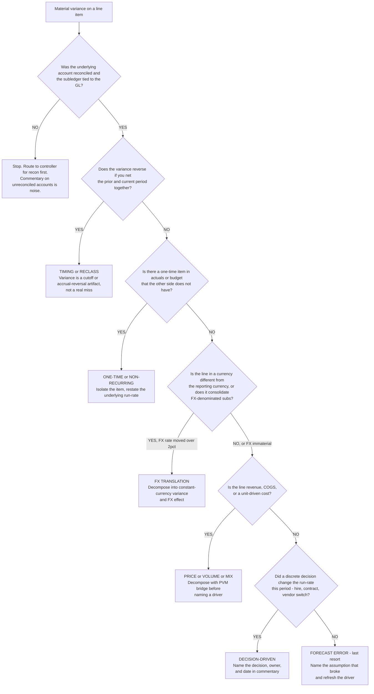

# Variance root-cause triage — picking the right driver on the first pass

> **Last reviewed:** 2026-05-22. Source: CFI's 10-question variance framework, CFO Secrets' bridge methodology, Numeric's 2025 variance guide, and Phoenix Strategy Group's FP&A practitioner notes. Refresh when (a) the underlying accounting standard for revenue or lease recognition changes in a way that shifts what counts as "timing," (b) a major FP&A vendor publishes a revised PVM (price-volume-mix) decomposition, or (c) at least one engagement surfaces a leaf that isn't on the tree.

The natural impulse on an unexpected variance is to grab the most familiar explanation — "the forecast was wrong," "sales missed," "costs ran hot" — and write that into commentary. The CFI variance framework calls out "accepting the first explanation" as the dominant analyst pitfall, and the CFO Secrets bridge methodology shows that a single P&L line can hide three different drivers pointing in opposite directions. The cost of the wrong first pick is real: it routes remediation at the wrong target — cutting opex when the issue is a one-time accrual that reverses next period, calling out a sales rep when the issue is a customer-mix shift, or restating a forecast when the actual is just a timing reclass between periods. This file gives finance agents a decision tree to traverse before naming a cause.

---

## Decision Tree: FP&A — Budget-vs-actual variance root-cause triage

**When this applies:** a P&L, balance-sheet, or cash line is off plan by a material amount (per the engagement's stated threshold — typically the greater of $50K or 5%) and you are about to write commentary that names the cause. **Traverse this tree top-to-bottom before selecting a driver — do NOT pattern-match on the line label or on the first explanation a stakeholder offered.**

**Last verified:** 2026-05-22 against CFI, CFO Secrets, Numeric, and Phoenix Strategy Group practitioner guidance current as of Q2 2026.

**Rationale per leaf:**

- _RECON_ — variance commentary on an unreconciled account describes bookkeeping noise, not business performance. Reconciliation is a precondition, not a parallel task.
- _TIMING_ — if netting two periods makes the variance disappear, the actual was always going to land where budget said — it just landed in the wrong month. Naming this as "we missed" causes the next period's commentary to flip the other way and erodes credibility.
- _ONE-TIME_ — a one-time gain or charge in either side of the comparison distorts the run-rate read. Isolate it, restate the underlying trend, and commentary should describe both ("$1.2M favorable, of which $900K is a one-time legal settlement; underlying $300K favorable").
- _FX_ — if the line consolidates FX-denominated subs and the rate moved, part of the variance is mathematical translation, not operating performance. Constant-currency decomposition is the standard fix.
- _PVM_ — revenue and unit-driven costs almost always have three drivers (price, volume, mix) moving simultaneously. Writing "revenue missed by $X" without the PVM split hides which lever to pull.
- _DECISION_ — if a discrete decision (a hire, a contract signed, a vendor switch) drove the variance, the commentary is short and the owner is named. This is the cleanest leaf and the most actionable.
- _FORECAST_ — only after the other branches are ruled out. "The forecast was wrong" is the right answer surprisingly rarely; when it is right, name the specific assumption that broke (e.g., "we assumed 4% churn, actual was 6.2%") so the forecast can be refreshed.

**Tradeoffs summary:**

| Leaf     | Time to confirm                | What it triggers downstream                            | Approval gate?                              | Use when                                                |
| -------- | ------------------------------ | ------------------------------------------------------ | ------------------------------------------- | ------------------------------------------------------- |
| RECON    | hours                          | controller picks up; commentary deferred               | No, but blocks commentary                   | Subledger does not tie to GL or open recon items remain |
| TIMING   | minutes (net two periods)      | reverse in next month's commentary; no remediation     | No                                          | Variance disappears across periods                      |
| ONE-TIME | minutes (read the JE/contract) | isolate in commentary; restate run-rate                | No                                          | Discrete non-recurring item present                     |
| FX       | hour (constant-currency build) | call out the rate move; FX hedge review optional       | No                                          | Multi-currency consol with >2pct rate move              |
| PVM      | half-day (build the bridge)    | sales / pricing / product owner each get a slice       | No                                          | Revenue, COGS, or unit-driven cost lines                |
| DECISION | minutes (point to decision log)| name owner + date in commentary                        | No                                          | Discrete decision changed run-rate                      |
| FORECAST | hours (review assumption deck) | refresh the driver; update model assumptions           | **YES** — model-owner sign-off              | All other branches ruled out                            |

If two leaves both fit (e.g., a one-time item AND an FX move), name both in commentary and split the variance — do not pick one and discard the other. The tree resolves the _first_ driver; bridges are additive.

---

## Common false signals

- **"Sales said the deal slipped, so it's a sales miss."** It may be timing (deal closes next period) or a decision (sales chose to discount to close it) — confirm before naming.
- **"Opex ran hot, so we overspent."** Check for an accrual reversal or a one-time true-up first; a real overrun shows up as a sustained trend, not a single-month spike.
- **"The forecast was wrong."** Almost always the last branch, not the first. If you reach it on the first pass without traversing the tree, you have probably misdiagnosed.
- **"FX moved, so it's all FX."** Decompose into constant-currency and FX components — operating variance is usually still present underneath.

---

## When to escalate

- **Recon not complete** → `controller` (this plugin) before any commentary ships.
- **PVM bridge needs to span a customer-mix or product-mix change that crosses the segment boundary** → `board-pack-composer` (this plugin) to align with the segment narrative going to the board.
- **FX decomposition requires a hedge-effectiveness read** → `treasury-analyst` (this plugin).
- **The "forecast was wrong" leaf is genuinely the right answer and the assumption that broke is a model driver** → `financial-modeler` (this plugin) to refresh the driver before the next forecast cycle.

---

## Citations / sources

- CFI — _10 Essential Questions for Budget Variance Analysis_ — https://corporatefinanceinstitute.com/resources/fpa/analyze-budget-variances-10-essential-questions/ (retrieved 2026-05-22). Source for the "accept the first explanation" pitfall warning and the one-time-vs-trend distinction.
- CFO Secrets — _Don't go chasing waterfalls: the art and science of variance analysis_ — https://www.cfosecrets.io/p/art-and-science-of-variance-analysis (retrieved 2026-05-22). Source for the worked example showing one P&L line hiding three drivers, and for the Full-Year-Effect vs Part-Year-Effect distinction.
- Numeric — _Complete Guide to Variance Analysis in 2025_ — https://www.numeric.io/blog/variance-analysis-guide (retrieved 2026-05-22). Source for the structural-vs-timing language and the "investigation bottleneck" failure mode where analysts stop testing hypotheses after the fourth or fifth pivot.
- Phoenix Strategy Group — _FP&A Tips for Better Variance Analysis_ — https://www.phoenixstrategy.group/blog/fpa-tips-better-variance-analysis (retrieved 2026-05-22). Source for the price/volume/mix decomposition guidance and the practitioner note that finance, planning-tool, and self-reported variance numbers routinely disagree.
