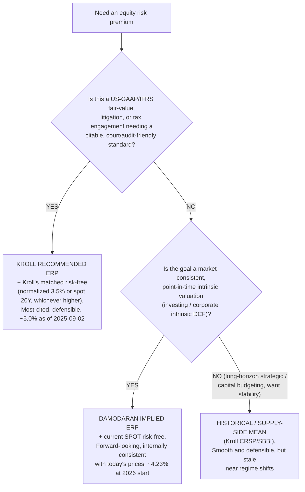
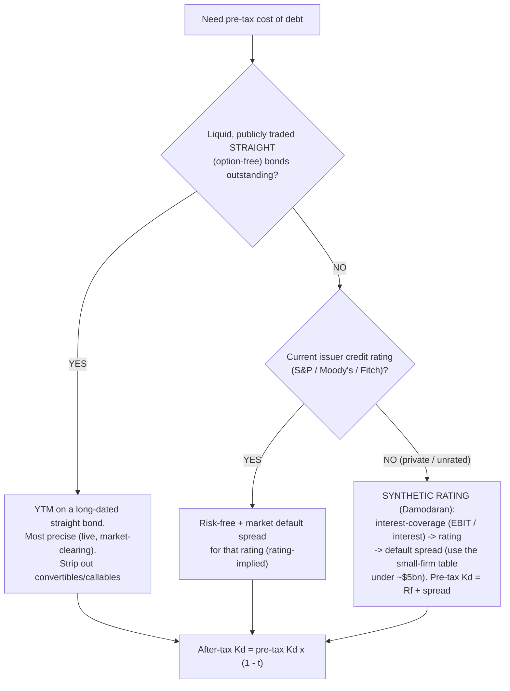
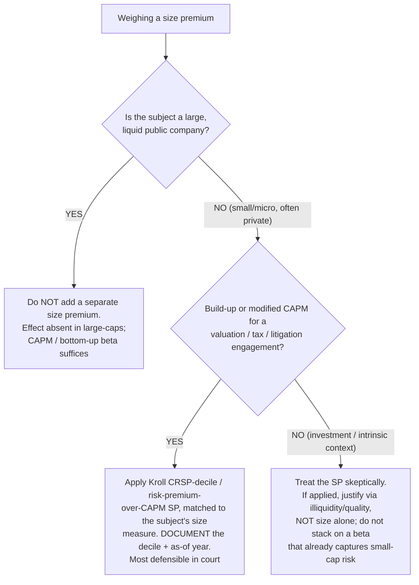

# WACC / cost-of-capital sourcing — defensible inputs, not plausible ones

> **Last reviewed:** 2026-06-04. Source: this plugin's deep-research synthesis [`../../../docs/research/2026-06-04-finance-domain-depth/wacc-cost-of-capital-sourcing.md`](../../../docs/research/2026-06-04-finance-domain-depth/wacc-cost-of-capital-sourcing.md), built from Aswath Damodaran (NYU Stern), Kroll / Duff & Phelps (Cost of Capital Navigator), the AQR size-effect white paper, peer-reviewed size-effect reviews, and valuation-practice references (NACVA, ValuSource, Wall Street Prep, Macabacus). Refresh when (a) a school revises its method, or (b) an engagement surfaces a fact pattern not covered. **Every recommended figure here is point-in-time and moves — Damodaran re-computes the ERP monthly; Kroll re-issues guidance several times a year. Re-pull the source on the valuation date; never carry these numbers forward.** This plugin's `dcf-valuation` skill and [`../best-practices/valuation-build-wacc-from-sourced-components.md`](../best-practices/valuation-build-wacc-from-sourced-components.md) are the operating surface; this file is the sourcing discipline behind them.

A WACC is only as defensible as its weakest-sourced input, and the recurring failures are not in the formula — they are **inconsistency** (mixing an ERP from one school with a risk-free convention from another, or relevering at a target structure but weighting at the current one) and **double-counting risk** (a small-peer beta *plus* a full size premium *plus* a company-specific premium, all pricing the same illiquidity). The cardinal rule running through every section: **pick one school's conventions and stay inside them, document the as-of date of every figure, and decide once where each risk lives.** The trees below resolve the three contested sourcing forks.

The core consistency rule for the **risk-free rate**: match the Treasury tenor to the duration of the cash flows (a going concern → a long bond), then hold it constant across the model. The modal choice is the **10-year** US Treasury (Damodaran's default); **Kroll pairs a 20-year** with its recommended ERP. Source: the US Treasury constant-maturity curve (Fed H.15), spot yield on the valuation date. `[high]`

---

## Decision Tree: Valuation — which ERP source for this engagement

**When this applies:** you are building a cost of equity and must choose an equity-risk-premium source. The ERP is the single most consequential and most contested WACC input; the choice must be **paired consistently** with the risk-free convention (§ below) — do not mix schools.

**Last verified:** 2026-06-04 against Damodaran's implied-ERP method (riskfree.pdf / Data Update 2 for 2026), Kroll's recommended ERP (via BVResources), and the Ibbotson→Kroll CRSP/SBBI historical method.

**Rationale per leaf** (figures are as-of and move — re-pull):

- _KROLL recommended_ — a reconciliation of multiple models plus judgment, published as a single number *designed to be paired with Kroll's risk-free*. ~**5.0%** (USD), reaffirmed **2025-09-02** (had been raised to 5.5% in April 2025 on tariff volatility, then cut back). Court- and audit-friendly. `[high]`
- _DAMODARAN implied_ — solve for the IRR equating the index level to expected cash flows; model-agnostic, re-computed monthly, reflects *today's* pricing (rises when prices fall). **~4.23%** at the start of 2026. Built off **spot** rates → pair with a **spot** risk-free. `[med]`
- _HISTORICAL / supply-side_ — long-run realized arithmetic mean (Ibbotson, now Kroll CRSP/SBBI); the supply-side adjustment strips the unrepeatable P/E-expansion component (~1pp below raw). Smooth but backward-looking and start-date-sensitive. `[high]` (method) / `[unverified]` (exact current print)

**Cardinal rule:** never mix an ERP from one school with a risk-free convention from another. Kroll's 3.5% normalized rate is *designed* for Kroll's 5.0% ERP; pairing Kroll-normalized with Damodaran-implied (built on spot) double-distorts. Document the as-of date of the ERP print used. `[high]`

---

## Decision Tree: Valuation — pre-tax cost of debt

**When this applies:** you need the pre-tax cost of debt, to be tax-affected by the **same** marginal rate used in unlevering beta and in the FCF. Use the company's **current marginal** borrowing cost (what it would issue at *today*), not the legacy coupon — but weight it at the **target** structure (and re-estimate the rating spread at the target leverage if the rating shifts).

**Last verified:** 2026-06-04 against Damodaran's synthetic-rating method (syntrating / ratings pages) and standard practitioner references.

**Rationale:** traded YTM is the most precise (a real market-clearing rate); a current rating maps to a market default spread; for a private/unrated firm, Damodaran's **synthetic rating** maps the interest-coverage ratio to a rating and spread (separate tables for large vs. small firms). Do **not** use book interest ÷ book debt — it reflects past borrowing, not today's marginal cost. `[high]`

---

## Decision Tree: Valuation — should you add a size premium?

**When this applies:** you are building a cost of equity and weighing an additive size premium (SP) over CAPM-beta. The SP is the live debate in cost-of-capital practice; the safe default is **don't add one to a large, liquid company**, and **don't stack it** on a beta that already captures small-cap risk.

**Last verified:** 2026-06-04 against the Kroll CRSP Deciles Size Study, the AQR "Fact, Fiction, and the Size Effect" white paper, van Dijk's "Is Size Dead?", and McLean & Pontiff (post-publication decay).

**The debate (capture both camps):**

- **Consensus:** a *raw* size effect existed historically (concentrated in microcaps and January), but it has **weakened materially** since its early-1980s discovery — some studies find it vanishes post-1981, and anomalies decay ~half their Sharpe post-publication. `[high]`
- **Divergent — "dead / data artifact":** the premium is fragile (microcap-, January-, and survivorship-driven); adding 3–5% to a small-company cost of equity may price a phantom. `[high]`
- **Divergent — AQR "size is fine once you control for junk":** the standard critiques *dissolve* once you control for **quality** — small + low-quality (distressed, illiquid) stocks drag the raw factor; control for quality and a stable, robust, international size premium emerges. Asness: there is no *simple* standalone size premium. `[high]`
- **Valuation-practice camp:** keep applying an SP for genuinely small private firms (Kroll CRSP/SBBI data) — the subject *is* illiquid and low-quality, exactly the profile where even critics concede excess return. `[med]`

**The double-counting trap:** a bottom-up beta from *small* peers (already high) + a full SP + a company-specific premium triple-counts small-company risk. Decide where it lives — **beta OR SP OR CSRP** — and don't stack. `[high]`

---

## Beta, weights, and country risk

- **Beta — bottom-up is the defensible path.** (1) Identify a clean pure-play peer set (peer-set discipline is the load-bearing judgment). (2) Pull each peer's levered beta and **unlever** via Hamada `βU = βL / [1 + (1 − t)(D/E)]`. (3) **Average the unlevered betas first, then relever** (averaging cuts the standard error ~√n; unlevering noisy individuals first compounds noise). (4) **Relever at the subject's *target* D/E.** The **Blume** adjustment `β_adj = ⅔·β_raw + ⅓·1.0` shrinks a raw regression beta toward 1.0 (betas mean-revert) — but a low-noise peer-average beta need **not** be Blume-adjusted on top, or you over-shrink. `[high]`
- **Capital-structure weights.** **Equity weight: always market value** (book equity is an accounting residual unrelated to the market claim). **Debt weight: market preferred, book an acceptable proxy** near par; mark distressed debt to market. **Use the *target* (long-run sustainable) structure**, not a transient current mix; resolve the WACC↔equity-value circularity by iteration, or (what most do) adopt a fixed target. The relevering D/E (beta), the weights, and the rating used for Kd must all describe the **same** structure. `[high]`
- **Country-risk premium (cross-border).** Damodaran's preferred **melded** estimator: `CRP = sovereign default spread × [σ(country equity) / σ(country bond)]`. Attach it via **add-to-ERP** (uniform exposure: `Ke = Rf + β·mature-ERP + CRP`) or the **lambda** method (`+ λ·CRP`, scaling by the share of operations actually exposed — an exporter earning hard currency has λ < 1). Match the CRP currency to the cash-flow currency; never apply a CRP to cash flows already risk-adjusted (scenario-weighted). `[high]`

---

## Common practitioner errors (the defensibility checklist)

| Error | Fix |
|---|---|
| **Mismatched risk-free tenor** (T-bill/2Y to discount perpetual cash flows) | Match maturity to cash-flow duration; default 10Y or 20Y govt. |
| **Mixing ERP schools with risk-free conventions** (Kroll-normalized Rf + Damodaran-spot ERP) | Pick one school and stay inside it. |
| **Double-counting small-company risk** (small-peer beta + SP + CSRP) | Decide where it lives — beta *or* SP *or* CSRP. |
| **Book-value equity weights** | Market value for equity, always. |
| **Stale / unadjusted single regression beta** | Bottom-up peer beta, averaged-then-relevered; Blume-adjust raw betas. |
| **Current-structure relevering with target-structure weights** | Use the *same* target structure for relevering, weights, and the rating for Kd. |
| **Legacy-coupon cost of debt** | Current marginal Kd (YTM / rating spread / synthetic spread). |
| **Mixing nominal and real; inconsistent marginal tax rate** | Both nominal or both real; one marginal `t` everywhere. |
| **CRP on already-risk-adjusted cash flows** | CRP in the discount rate XOR scenario-weighted cash flows, not both. |

---

## When to escalate

- **Building the WACC into a DCF, the iterative weight/value loop, or sensitivities** → `financial-modeler` (this plugin); the `dcf-valuation` skill is the playbook.
- **Method selection (DCF vs. comps vs. precedent), peer-set construction, and the football-field cross-check** → `valuation-analyst` (this plugin); see the valuation tree in [`finance-decision-trees.md`](./finance-decision-trees.md).
- **The goodwill-impairment discount rate** → ties to [`m-and-a-purchase-accounting-asc805.md`](./m-and-a-purchase-accounting-asc805.md).
- **The risk-free / ERP figures for a live valuation of record** → `ravenclaude-core` `deep-researcher` to re-pull the current Damodaran/Kroll prints on the valuation date (the figures here are as-of 2026-06-04 and move).
- **Statistical rigor on a regression beta or a peer-set selection** → `applied-statistics` (regression/forecasting review), via the Team Lead.

---

## Citations / sources

Full synthesis with inline confidence tags and source URLs: [`../../../docs/research/2026-06-04-finance-domain-depth/wacc-cost-of-capital-sourcing.md`](../../../docs/research/2026-06-04-finance-domain-depth/wacc-cost-of-capital-sourcing.md) (retrieved 2026-06-04). Anchored on Damodaran (NYU Stern — risk-free, implied ERP, bottom-up beta, synthetic ratings, country risk), Kroll / Duff & Phelps (recommended ERP, normalized risk-free, CRSP/SBBI size data, via BVResources corroboration), the AQR "Fact, Fiction, and the Size Effect" white paper, and peer-reviewed size-effect reviews (van Dijk; Asness et al.; McLean & Pontiff). `kroll.com`, `pages.stern.nyu.edu`, and `aqr.com` returned HTTP 403 on fetch, so several primary figures rest on search excerpts plus secondary corroboration. **All recommended figures are as-of 2026-06-04 and move — re-pull on the valuation date before relying on a number.**
