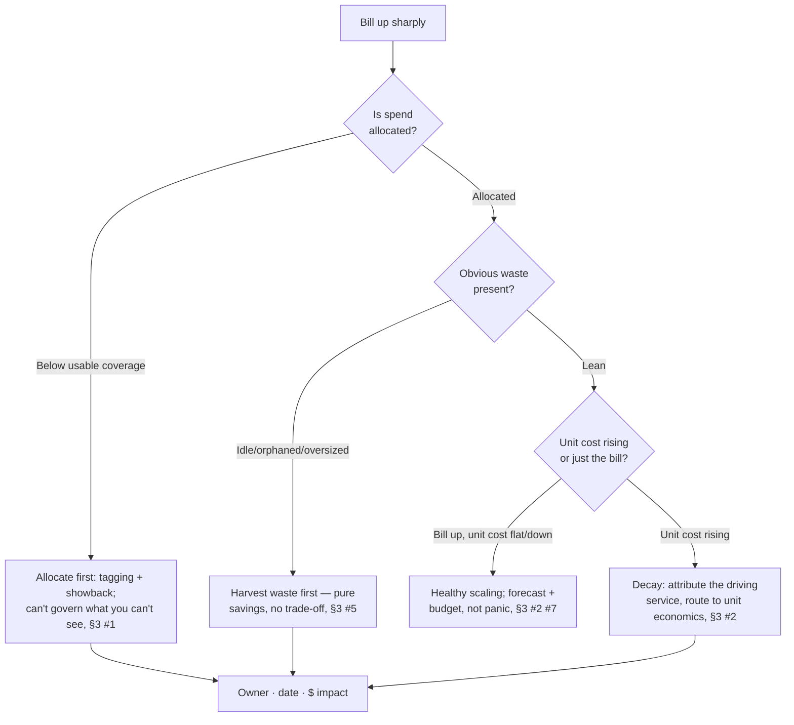
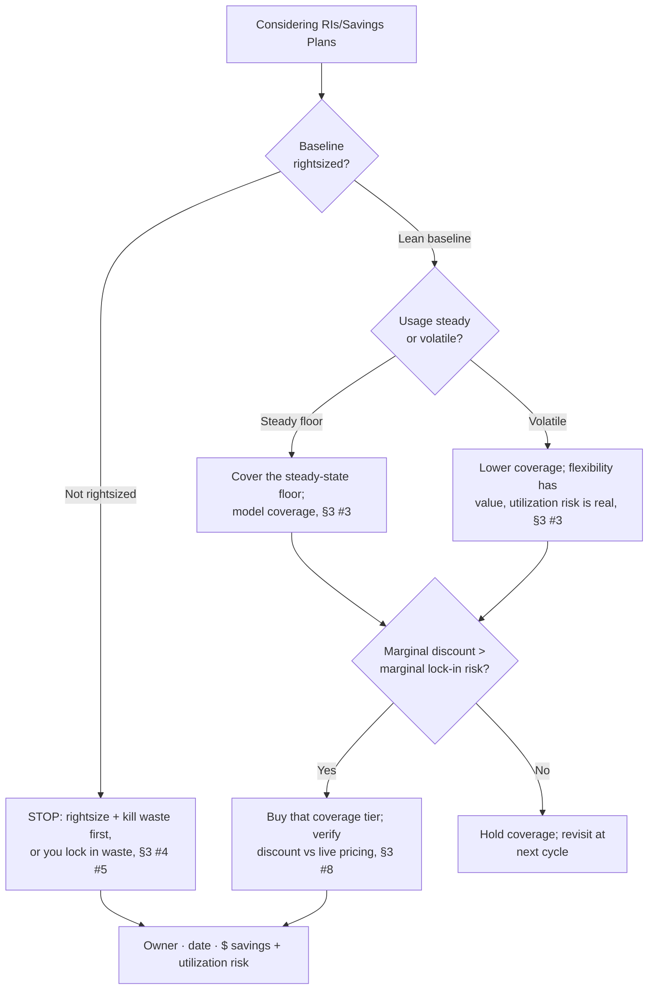

# FinOps & Cloud Cost Decision Trees

> Mermaid decision trees for the three most common triage paths. Traverse top-to-bottom and pick the smaller-blast-radius leaf — don't keyword-match the symptom to a method. Each tree encodes the team's house opinions (CLAUDE.md §3).

## Tree 1 — Bill jumped, where to start



## Tree 2 — Bill grows faster than revenue

```mermaid
flowchart TD
    A[Spend outpaces revenue] --> B{Allocated to a<br/>unit denominator?}
    B -- "No unit" --> B1[Pick the unit (customer/txn/<br/>feature) and allocate, §3 #1 #2]
    B -- "Has units" --> C{Cost per unit<br/>trend?}
    C -- "Falling" --> C1[Healthy: growth is buying<br/>efficiency; forecast it, §3 #2 #7]
    C -- "Rising" --> D{Which service<br/>drives it?}
    D -- "Idle/oversized" --> D1[Waste/rightsizing problem,<br/>route to commitments, §3 #5 #4]
    D -- "Genuine usage growth" --> D2[Architecture/efficiency review;<br/>frame, route design to authority, §2]
    C1 --> E[Owner · date · expected unit-cost movement]
    D1 --> E
    D2 --> E
```

## Tree 3 — Should we buy commitments?



## How to read these

- **Decompose before you act** — the first node of each tree is usually a STOP that prevents acting on an aggregate you haven't yet split.
- **Fix the constraint before adding volume** — more input into a leaking process wastes resource.
- Every leaf ends in the §6 Output Contract: owner · date · expected metric movement.
