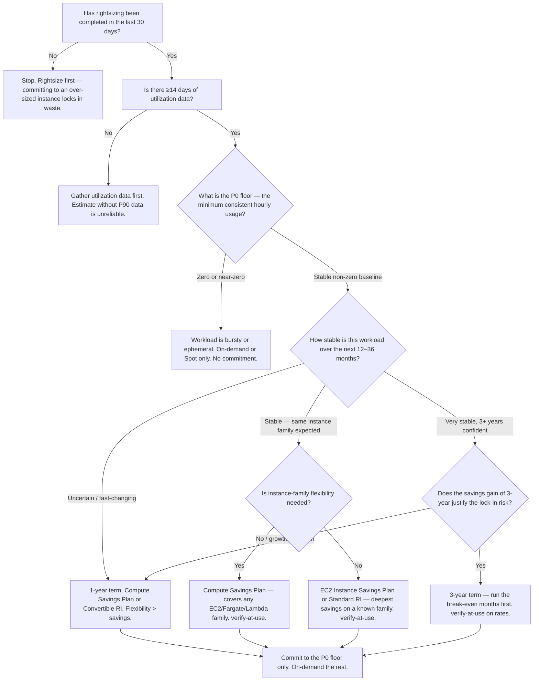
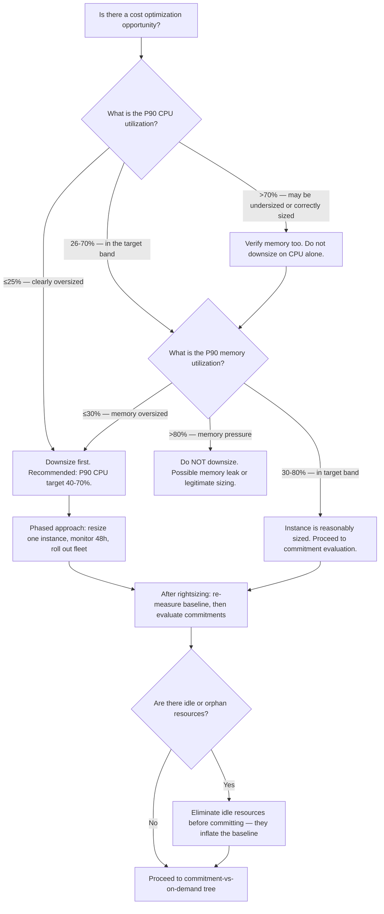
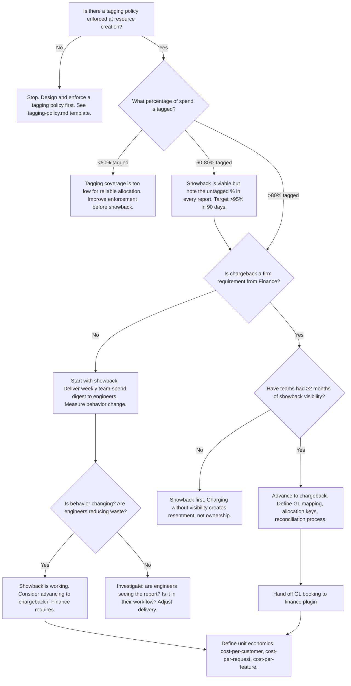

# FinOps & Cloud Cost — Decision Trees + 2026 Capability Map

> Canonical knowledge bank for `finops-cloud-cost`. **Traverse the relevant Mermaid tree
> top-to-bottom before recommending** — the proactive complement to the Capability Grounding
> Protocol. Volatile product/pricing/version facts carry a retrieval date and a re-verify-at-use
> rider. Market positions and prices change faster than any training corpus.

---

## Decision Tree: Commitment vs on-demand (covering the steady-state baseline)

**Leaf rule:** commit only to the P0 steady-state floor — the usage you would have anyway in your
worst week. Everything above runs on-demand or spot. A commitment beyond the floor is a stranded
cost if usage drops. Use `finops_calc.py break_even()` and `commitment_coverage()` for the math
before any purchase.

---

## Decision Tree: Rightsize before you commit

**Leaf rule:** the optimization sequence is invariant — rightsize, then eliminate idle, then commit.
Compressing or skipping steps means committing to waste. The savings from each step are not additive
if you buy commitments before rightsizing; they must be calculated on the post-rightsizing baseline.

---

## Decision Tree: Allocation model (tag → showback → chargeback)

**Leaf rule:** tagging is the prerequisite for everything downstream. Showback before chargeback —
charging teams for costs they cannot verify creates political resistance, not ownership. Unit
economics is the mature outcome: a single cost-per-unit metric that connects engineering decisions
to business outcomes.

---

## FinOps maturity staging (crawl/walk/run)

| Stage | What it looks like | Gap to fix |
|---|---|---|
| **Crawl** | No tagging policy or <60% tagged; cloud bill is Finance's problem; no team-level visibility; no commitments; cost reviews quarterly if at all. | Tagging policy + enforcement; showback to engineers; anomaly alerts. |
| **Walk** | Tagging >80%; weekly showback to teams; some commitments purchased but ad hoc; rightsizing done occasionally; FinOps function exists but informal. | Systematic rightsizing before commitment purchase; commitment coverage tracked; anomaly detection automated. |
| **Run** | Tagging >95%; automated anomaly alerts; commitments reviewed monthly; unit economics tracked (cost-per-customer); FinOps team has a charter and an OKR; AI token cost is budgeted. | Continuous optimization loop; forecasting; AI cost governance; chargeback to cost centres. |

---

## 2026 capability map — cross-cloud FinOps tooling (dated, re-verify at use)

_Retrieved 2026-06-08. Product capabilities, pricing, and availability are volatile — re-confirm
before making a purchase recommendation. This is orientation, not a procurement evaluation._

| Category | Tools (2026) | Notes |
|---|---|---|
| **Native cloud billing & cost management** | AWS Cost Explorer + Cost and Usage Report (CUR 2.0), AWS Budgets, AWS Compute Optimizer; Azure Cost Management + Billing (formerly Cost Management + Billing); GCP Cloud Billing + BigQuery billing export | First stop. Must be configured before buying third-party. CUR 2.0 (parquet, hourly) is the modern AWS data layer. [verify-at-use] |
| **FinOps Foundation FOCUS spec** | FinOps Foundation FOCUS (FinOps Open Cost and Usage Specification) — normalizes billing data across clouds into a common schema. v1.0 ratified 2024; v1.1 in progress 2025-2026. [verify-at-use] | Adopted by AWS, Azure, GCP, Oracle, and major third-party tools. Column names and schema version evolve — always check the current spec before implementing. |
| **Third-party cost management platforms** | CloudHealth (VMware/Broadcom, acquired) / Apptio Cloudability (IBM); Vantage (strong developer UX, AWS-first, expanding); Finout (virtual tagging, showback); Anodot (anomaly detection-focused); Spot.io (CloudCheckr + optimization) [verify-at-use: acquisition/product status changes fast] | All marked verify-at-use — acquisition activity in this space is high. Validate current company/product status before recommending. |
| **Kubernetes cost allocation** | OpenCost (CNCF, open source, Prometheus-native); Kubecost (commercial + OSS, OpenCost upstream contributor) | OpenCost is the CNCF-blessed spec; Kubecost is the commercial implementation. Use either for namespace-level cost attribution in shared clusters. [verify-at-use] |
| **RI/SP management & optimization** | AWS native RI/SP recommendations (Cost Explorer); CloudHealth RI management; Spot.io Eco (RI/SP automation); ProsperOps (automated RI/SP management, AWS-focused) [verify-at-use] | Automated RI/SP management tools can over-commit — always verify the steady-state baseline before delegating commitment purchases to automation. |
| **Anomaly detection** | AWS Cost Anomaly Detection (native, ML-based); Azure Cost Management alerts; Anodot (third-party, ML anomaly); custom z-score/percentage-baseline via CloudWatch Metrics Insights / Pub/Sub [verify-at-use] | Native tools are the first layer; third-party for cross-cloud aggregation. See `scripts/finops_calc.py anomaly_z_score()` for the roll-your-own calculation. |
| **AI/LLM inference cost** | AWS Bedrock Cost Explorer (per-model usage); Azure AI Foundry (Azure OpenAI) billing; GCP Vertex AI billing; Anthropic Console usage dashboard; OpenAI usage dashboard; LangSmith (LangChain observability, includes token cost); Helicone (open-source LLM observability + cost); Portkey [verify-at-use: all rapidly evolving] | Provider dashboards are the first stop. Token cost observability tooling is nascent — verify availability and capabilities at use. |
| **FinOps practice and framework** | FinOps Foundation (finops.org) — the authoritative framework, maturity model, and FOCUS spec. The crawl/walk/run model, the inform/optimize/operate loop, and persona definitions all originate here. | Foundation membership and certification are legitimate signals of FinOps practice maturity. [verify-at-use for membership structure] |

> Provenance: FinOps Foundation framework documentation, AWS/Azure/GCP billing documentation, CNCF
> landscape, and vendor websites retrieved 2026-06-08. Acquisition status, product names, and
> pricing are volatile — re-verify at use. No invented products or capabilities.

---

## See also

- [`../CLAUDE.md`](../CLAUDE.md) — team constitution & seams.
- [`../best-practices/README.md`](../best-practices/README.md) — the named, citable rules.
- Neighbour decision trees: `aws-cloud`, `azure-cloud`, `gcp-cloud`, `observability-sre`,
  `terraform-iac`, `finance`.

_Last reviewed: 2026-06-08 by `claude`._
