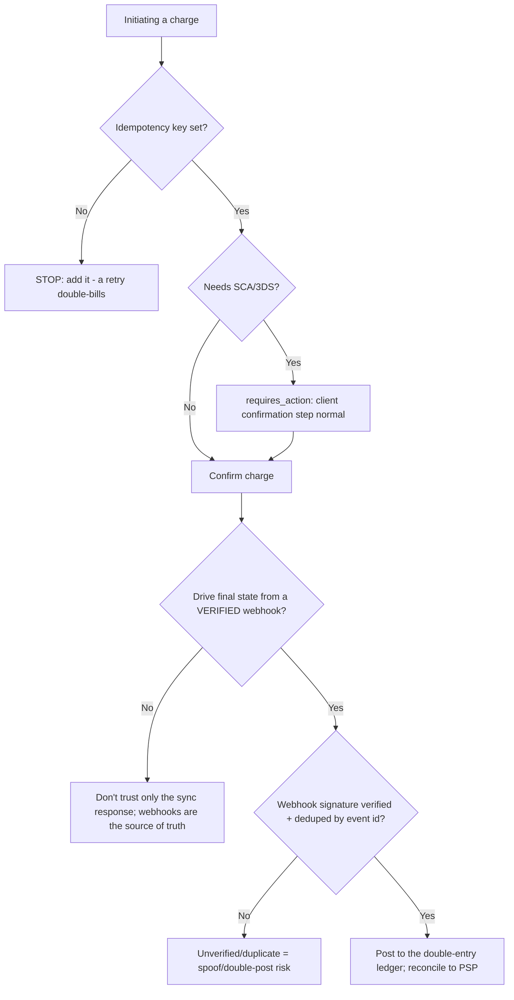
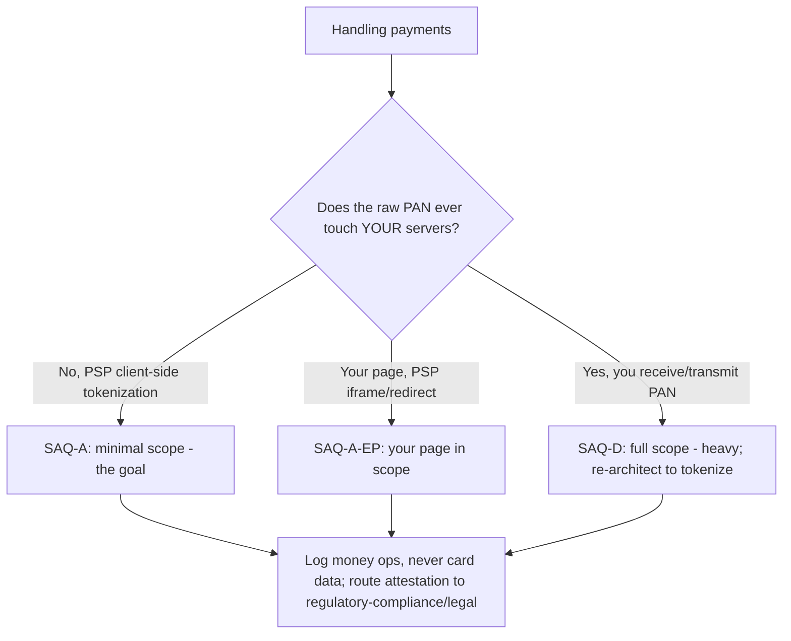
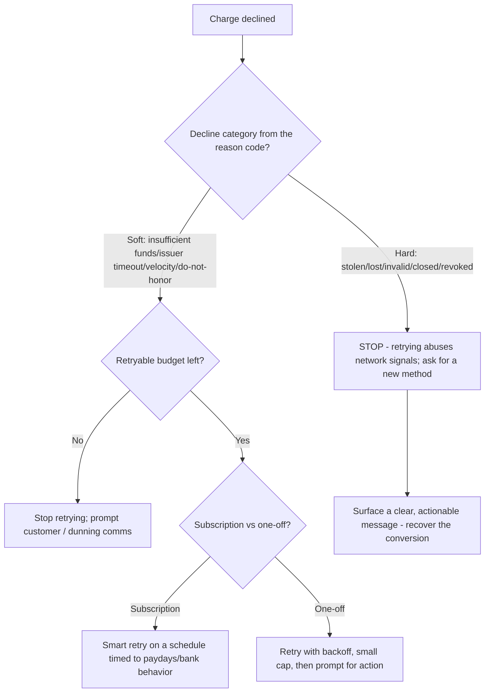
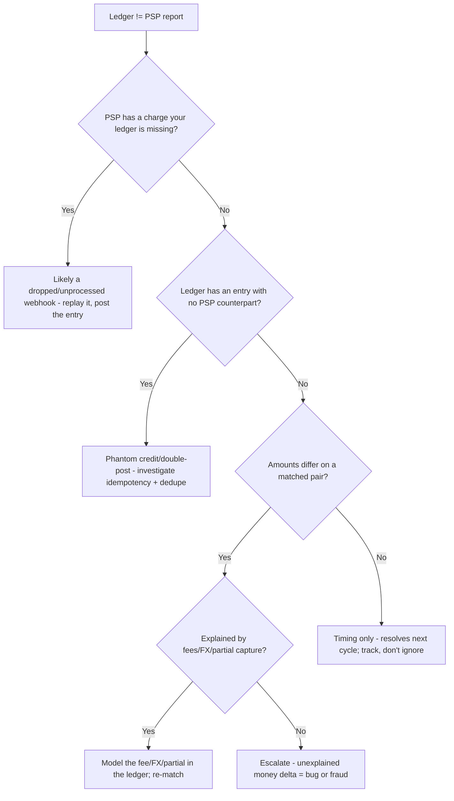
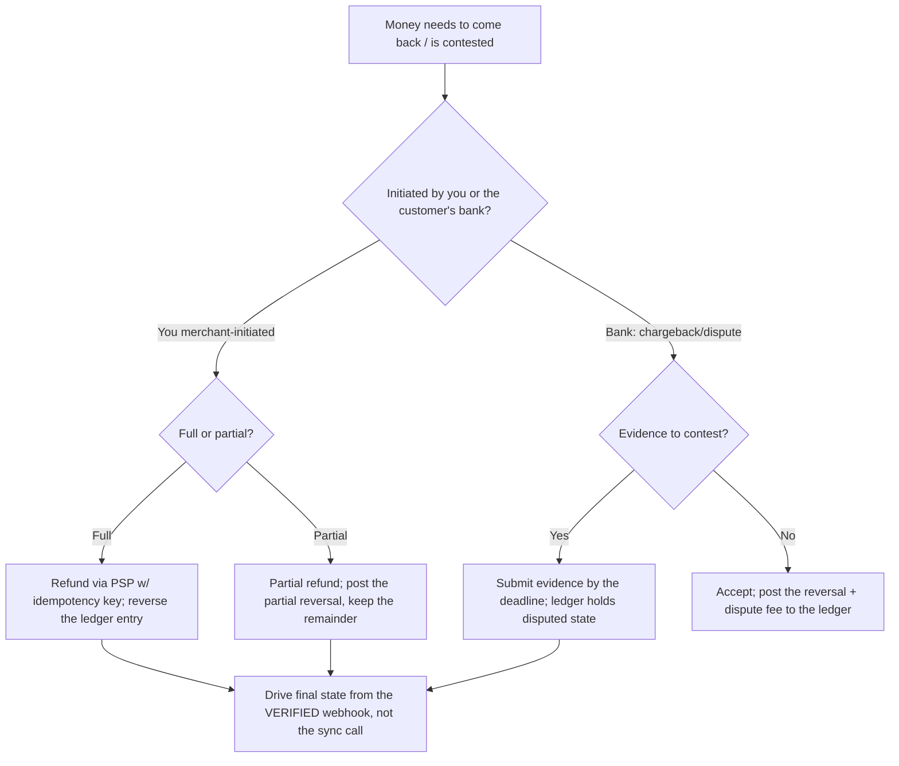
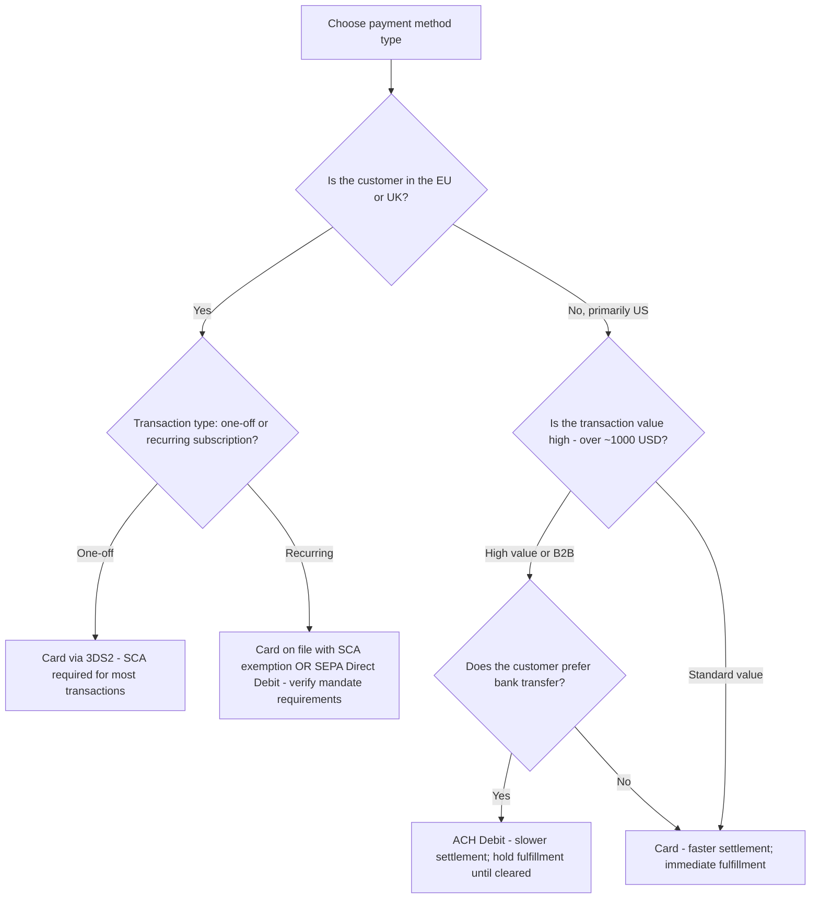
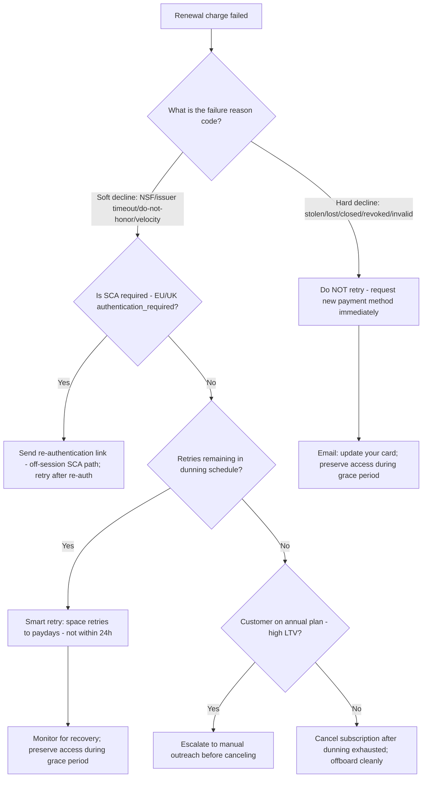
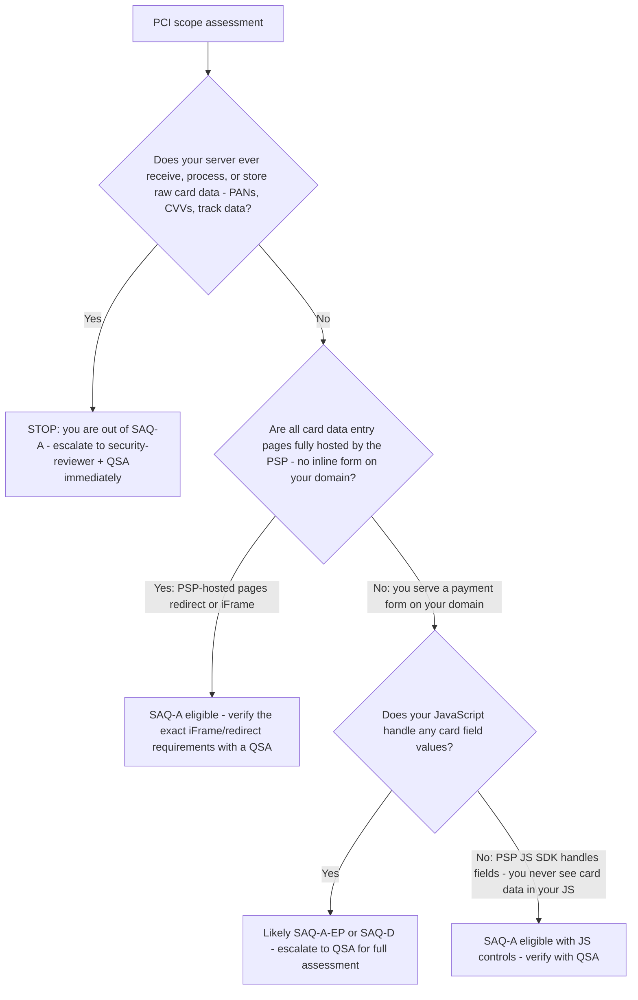

# Fintech & Payments — Decision Trees

_Decision trees + a dated capability map. Capability rows are `[verify-at-build]` — re-check against the vendor before quoting. Last reviewed: 2026-06-04._

Traverse before building a charge flow or assessing PCI scope. Accounting -> finance, regulation -> regulatory-compliance, verdict -> security-reviewer.

## Decision Tree: Charge flow correctness

Make money move exactly once, driven by verified webhooks.

_Every money op idempotent; the ledger (not the PSP) is your source of truth._

## Decision Tree: PCI scope: which SAQ?

Architecture determines scope; tokenization is the dominant strategy.

## Decision Tree: Retry or stop after a decline?

Branch on the decline category from the issuer reason code; never blanket-retry.

_Map every reason code to hard-or-soft up front; guessing turns a recoverable failure into a network-flagged merchant account._

## Decision Tree: Reconciliation discrepancy triage

A non-zero difference is a defect with an owner until proven otherwise — never written off.

_The longer a discrepancy sits, the more entries pile on the error. Mystery money is a bug or a breach until shown otherwise._

## Decision Tree: Refund, dispute, or chargeback path?

Each is a distinct state-machine transition driven by verified webhooks, posted to the ledger.

_A late refund or a chargeback arriving weeks after success is why the charge must be a state machine, not a paid boolean._

## Capability map (dated — verify at build)

| Capability | 2026 state `[verify-at-build]` | Notes |
|---|---|---|
| Stripe/Adyen/Braintree intents + tokenization | GA | Client-side elements -> SAQ-A |
| Idempotency keys (PSP-supported) | GA | On every money op |
| Webhook signing | GA | Verify; handle idempotently |
| 3DS2 / SCA | in force (esp. EU) | requires_action is normal |
| PCI-DSS v4.0 | in force | v3.2.1 retired; verify SAQ specifics |
| Double-entry ledger pattern | established | Source of truth, reconcile to PSP |

---

## Decision Tree: Which payment method type for this use case?

**When this applies:** Designing a payment integration and choosing between card, bank transfer (ACH/SEPA), digital wallet, or other payment method types. Observable triggers: "should we support ACH?"; "what payment methods do we need for EU customers?"; "can we use bank transfer for subscription renewals?"

**Last verified:** 2026-06-05 against standard payment method selection practice.

_ACH and SEPA have settlement delays; fulfillment gates on the confirmed webhook._

**Rationale per leaf:**
- *Card via 3DS2 (EU/UK one-off)* — SCA mandatory for most EU/UK card transactions; 3DS2 is the standard path.
- *Card on file / SEPA (EU/UK recurring)* — subscription renewals can use a SCA exemption for recurring charges OR SEPA Direct Debit which has its own mandate flow `[verify-at-build]`.
- *ACH debit (US high-value/B2B)* — lower interchange cost for large B2B transactions; 1-3 day settlement delay is acceptable.
- *Card (US standard)* — fastest settlement, best cardholder protection; the default for consumer transactions.

**Tradeoffs summary:**

| Method | Settlement | SCA needed | Chargeback risk | Use when |
|---|---|---|---|---|
| Card (on-session) | Instant | Yes (EU/UK) | Higher | Consumer one-off; fast settlement needed |
| Card (off-session) | Instant | SCA exemption needed | Higher | Subscription renewal; mandate in place |
| ACH debit | 1-3 days | No | Lower | High-value B2B; cost-sensitive |
| SEPA direct debit | 3-5 days | Mandate only | Lower (different dispute window) | EU recurring; bank-to-bank preferred |

---

## Decision Tree: Subscription renewal failure — which dunning path?

**When this applies:** A subscription renewal charge has failed and a dunning decision must be made. Observable triggers: a `invoice.payment_failed` or `charge.failed` webhook; a subscription moving to `past_due`; "how should we handle failed renewals?"

**Last verified:** 2026-06-05 against standard dunning practice and PSP documentation.

_A hard decline retried is a fraud signal to the card network — never retry a hard decline._

**Rationale per leaf:**
- *No retry (hard decline)* — retrying a hard decline trains the card network that this merchant abuses the network; it can result in the merchant account being flagged.
- *Re-authentication link (SCA)* — the `authentication_required` error code means the card is valid but the cardholder needs to re-authenticate; a new payment attempt requires a new SCA flow.
- *Smart retry* — soft declines are often timing-related (insufficient funds near payroll); spacing retries to likely recovery times (end of month, after payday) recovers more.
- *Manual outreach (high LTV)* — high-value annual customers warrant a human touch before cancellation; automated dunning alone is insufficient.
- *Cancel cleanly* — after dunning exhaustion, cancel with a clean offboarding flow and a "re-subscribe" path; harsh cancellation increases support tickets.

---

## Decision Tree: PCI scope assessment — which SAQ applies?

**When this applies:** Assessing the PCI-DSS scope for a payment integration. Observable triggers: "what is our PCI scope?"; "do we need a QSA assessment?"; "how do we stay on SAQ-A?"

**Last verified:** 2026-06-05 against PCI-DSS v4.0 SAQ guidance `[verify-at-build — SAQ specifics change; consult a QSA for authoritative scope assessment]`.

_PCI scope is a compliance verdict: this tree guides engineering design, not regulatory clearance. Always verify with a QSA._

**Rationale per leaf:**
- *Out of SAQ-A (server receives card data)* — if card numbers touch your server in any form, you are out of SAQ-A scope; QSA engagement is mandatory.
- *SAQ-A eligible (PSP-hosted pages)* — the simplest path: redirect or iFrame to the PSP's hosted page so no card data touches your domain.
- *SAQ-A-EP or SAQ-D (your JS handles fields)* — if your JavaScript can access card field values (even transiently), you carry a larger scope; QSA assesses which SAQ applies.
- *SAQ-A with JS controls (PSP SDK)* — PSP-provided JS elements (Stripe Elements, Adyen Web, etc.) inject iFrames that keep card data in the PSP's origin; your code never sees the values. SAQ-A eligible subject to QSA confirmation.

**Tradeoffs summary:**

| Integration pattern | PCI scope | Implementation complexity | Developer experience |
|---|---|---|---|
| PSP-hosted redirect page | SAQ-A (smallest) | Lowest | Lower control over UX |
| PSP JS SDK elements | SAQ-A (with controls) | Low | Good UX; card in PSP iFrame |
| Your JS form + PSP tokenize | SAQ-A-EP or higher | Medium | More UX control; larger scope |
| Server receives card data | SAQ-D or custom (largest) | High | Full control; maximum compliance cost |
