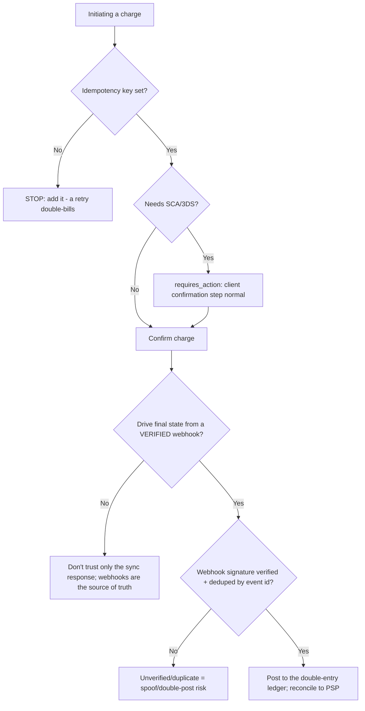
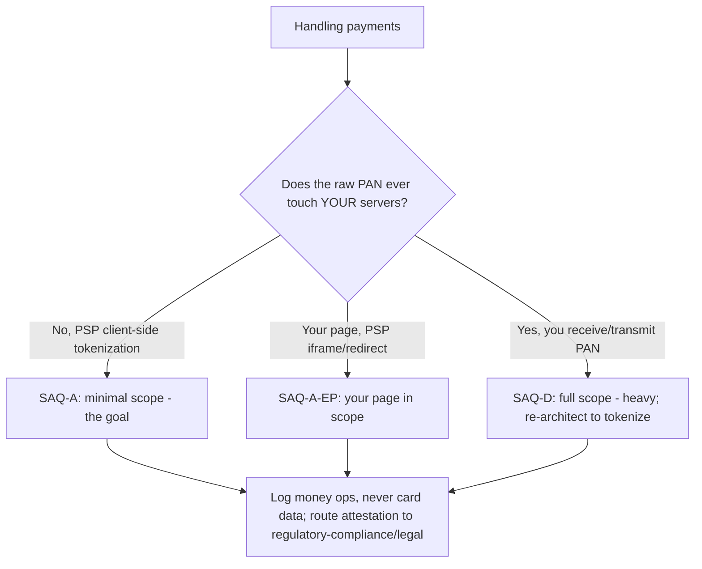

# Fintech & Payments — Decision Trees

_Decision trees + a dated capability map. Capability rows are `[verify-at-build]` — re-check against the vendor before quoting. Last reviewed: 2026-06-04._

Traverse before building a charge flow or assessing PCI scope. Accounting -> finance, regulation -> regulatory-compliance, verdict -> security-reviewer.

## Decision Tree: Charge flow correctness

Make money move exactly once, driven by verified webhooks.

_Every money op idempotent; the ledger (not the PSP) is your source of truth._

## Decision Tree: PCI scope: which SAQ?

Architecture determines scope; tokenization is the dominant strategy.

## Capability map (dated — verify at build)

| Capability | 2026 state `[verify-at-build]` | Notes |
|---|---|---|
| Stripe/Adyen/Braintree intents + tokenization | GA | Client-side elements -> SAQ-A |
| Idempotency keys (PSP-supported) | GA | On every money op |
| Webhook signing | GA | Verify; handle idempotently |
| 3DS2 / SCA | in force (esp. EU) | requires_action is normal |
| PCI-DSS v4.0 | in force | v3.2.1 retired; verify SAQ specifics |
| Double-entry ledger pattern | established | Source of truth, reconcile to PSP |
