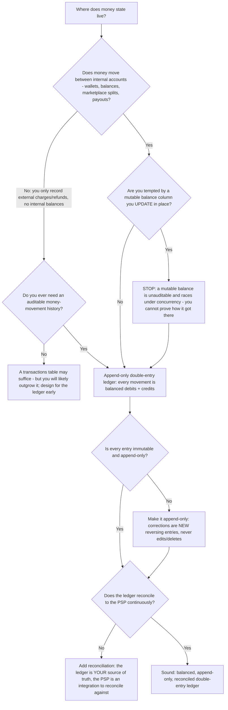
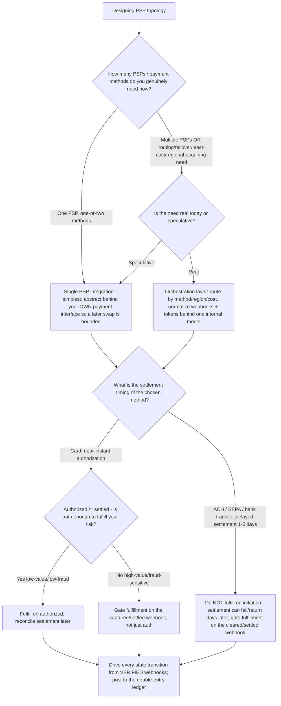

# Fintech & Payments — Ledger & PSP-Topology Decision Trees

_Two topic-specific decision trees complementing the charge-flow / PCI-scope / decline / reconciliation / method-selection / dunning trees in [`fintech-payments-engineering-decision-trees.md`](fintech-payments-engineering-decision-trees.md). This file covers the two design decisions that file leaves open: **how to model the ledger** and **how to shape the PSP topology + settlement timing**. Last reviewed: 2026-06-05._

Traverse before designing the money-storage model or choosing a single-PSP vs. orchestration topology. Accounting (revenue recognition, GL) → `finance`; financial regulation → `regulatory-compliance`; the security verdict → `ravenclaude-core/security-reviewer`.

---

## Decision Tree: Ledger model — single-entry table, balance column, or double-entry?

**When this applies:** Designing where money lives in your system. Observable triggers: "how should we store balances / track money?"; "do we need a ledger or is a `balance` column enough?"; "our balances don't match the PSP / each other"; building wallets, payouts, marketplace splits, or anything that moves money between internal accounts.

**Last verified:** 2026-06-05 against the established double-entry ledger pattern for payment systems (the house opinion in CLAUDE.md §2 #3).

_Every money movement is balanced debits and credits in an append-only ledger; balances are **derived** (sum of entries), never stored-and-mutated. Corrections are reversing entries, not edits._

**Rationale per leaf:**
- *A transactions table may suffice (no internal money movement, no audit need)* — a thin product that only records external charges/refunds and never moves money between internal accounts can start with a transactions table — but most payment systems grow wallets/splits/payouts, so design toward the ledger early rather than retrofit it after the balances diverge.
- *STOP — mutable balance column* — an `UPDATE balance = balance + x` is the cardinal ledger anti-pattern: it is unauditable (you can't prove the sequence that produced the number), it races under concurrency, and a single missed/double-applied event corrupts the balance silently. The double-entry ledger replaces it.
- *Append-only double-entry* — every movement records balanced debits and credits across accounts; the sum is always zero, which is a built-in invariant you can assert. Balances are derived by summing entries for an account.
- *Append-only / reversing entries* — never edit or delete a posted entry; a correction is a new reversing entry, preserving the full history (this is what makes it auditable and what `finance` needs for the GL).
- *Reconcile continuously* — the ledger is your source of truth, the PSP is an external integration; reconcile the two continuously (see the reconciliation-triage tree in the companion file) so a dropped webhook or a fee/FX delta is caught while it's one entry, not a month of compounding error.

**Tradeoffs summary:**

| Model | Auditable | Concurrency-safe | Outgrows quickly | Use when |
|---|---|---|---|---|
| Mutable `balance` column | No | No (races) | n/a — anti-pattern | Never for money |
| Single transactions table | Partial | Partial | Yes, once money moves internally | Thin record-only product; design toward the ledger early |
| Append-only double-entry ledger | Yes | Yes (entries don't conflict) | No | Any wallet / split / payout / balance system — the default |

> **Boundary:** this tree designs the *engineering* ledger (the money-movement record). **Revenue recognition (ASC 606), GL postings, and the chart of accounts route to `finance`** — this team produces the ledger + money events, that team does the accounting on top (CLAUDE.md §3).

---

## Decision Tree: PSP topology + settlement timing — single PSP, orchestration layer, and sync vs. async fulfillment

**When this applies:** Choosing how many payment processors to integrate and how to time fulfillment against settlement. Observable triggers: "one PSP or several?"; "do we need a payment orchestration layer?"; "can we fulfill immediately or do we wait for settlement?"; "we're adding ACH / SEPA / a second processor"; cross-border or multi-method expansion.

**Last verified:** 2026-06-05. Method-settlement timings cross-checked against the method-selection tree in the companion file. ISO 20022 cross-border facts cited below.

_Authorized is not settled, and initiated is not cleared. Gate irreversible fulfillment on the settlement signal that matches the method's risk — always from a verified webhook, always posted to the ledger._

**Rationale per leaf:**
- *Single PSP, abstracted* — most products need one PSP. The leverage is to put your own payment interface in front of it (normalize charges, refunds, webhooks, tokens to *your* model) so adding/swapping a PSP later is a bounded change, not a rewrite. Don't build an orchestration layer you don't need.
- *Orchestration layer (real need)* — justified by a concrete need: least-cost / smart routing, failover across PSPs, regional acquiring (e.g. a local acquirer for better approval rates), or many payment methods. It normalizes multiple PSPs' webhooks, tokens, and error codes behind one internal model. Build it when the need is real, not speculatively — it's significant surface area and its own reconciliation burden.
- *Card — fulfill on authorized (low risk)* — authorization holds funds near-instantly but is **not** settlement; for low-value, low-fraud goods the auth is usually enough to fulfill, reconciling settlement after.
- *Card — gate on captured/settled (high risk)* — for high-value or fraud-sensitive fulfillment, wait for capture/settlement rather than auth alone; an auth can still fail to settle.
- *ACH / SEPA / bank transfer — gate on cleared* — these settle in **1-5 days** and can **fail or be returned after apparent success** (insufficient funds discovered later, disputes with a longer window); never fulfill on initiation — gate irreversible fulfillment on the cleared/settled webhook. (Settlement windows are method/region-specific — `[verify-at-use]`; cross-check the method-selection tradeoff table in the companion file.)
- *Drive from verified webhooks → ledger* — every transition (authorized → captured → settled → refunded/disputed) comes from a verified, deduped webhook and posts to the double-entry ledger; the sync API response is a hint, the webhook is the truth (see the charge-flow tree in the companion file).

**Tradeoffs summary:**

| Topology / timing | Complexity | When it earns its cost |
|---|---|---|
| Single PSP, abstracted | Low | Default — one PSP, 1-2 methods; the interface makes a future swap bounded |
| Orchestration layer | High | Real routing/failover/least-cost/regional-acquiring or many-method need — never speculative |
| Fulfill on authorization | Low risk-handling | Low-value, low-fraud card goods; reconcile settlement after |
| Gate on capture/settlement | Higher latency to fulfill | High-value or fraud-sensitive card |
| Gate on cleared (ACH/SEPA) | Days of latency | Always, for delayed-settlement bank methods — they can return after success |

> **Cross-border note (`[verify-at-use]`):** if you operate cross-border bank payments over Swift, the **MT message family was retired in favour of ISO 20022 (MX/CBPR+) at the end of the coexistence period on 22 November 2025** — new cross-border bank-payment integrations should assume ISO 20022 messaging, not legacy MT. This is a messaging-standard fact for the *bank-rail* integration, not a card-PSP concern. Sources retrieved 2026-06-05; ISO 20022 / Swift timelines are volatile — confirm against Swift/your bank before quoting. (https://www.swift.com/standards/iso-20022/iso-20022-financial-institutions-focus-payments-instructions ; https://www.pymnts.com/news/cross-border-commerce/cross-border-payments/2025/what-cross-border-chief-financial-officers-can-expect-from-iso-20022-migration-november-22)

---

## Sources (retrieved 2026-06-05)

- ISO 20022 / Swift MT retirement (coexistence ends 22 Nov 2025) — Swift ISO 20022 for Financial Institutions: https://www.swift.com/standards/iso-20022/iso-20022-financial-institutions-focus-payments-instructions ; PYMNTS, Nov 22 cutover: https://www.pymnts.com/news/cross-border-commerce/cross-border-payments/2025/what-cross-border-chief-financial-officers-can-expect-from-iso-20022-migration-november-22
- The double-entry ledger pattern and reconcile-to-PSP discipline are the marketplace house opinion (CLAUDE.md §2 #3) and are cross-referenced to the companion decision-tree file's reconciliation tree.

_Capability / standard / timing facts above are dated and `[verify-at-use]` — re-check against the vendor/standard body before quoting in a deliverable._
