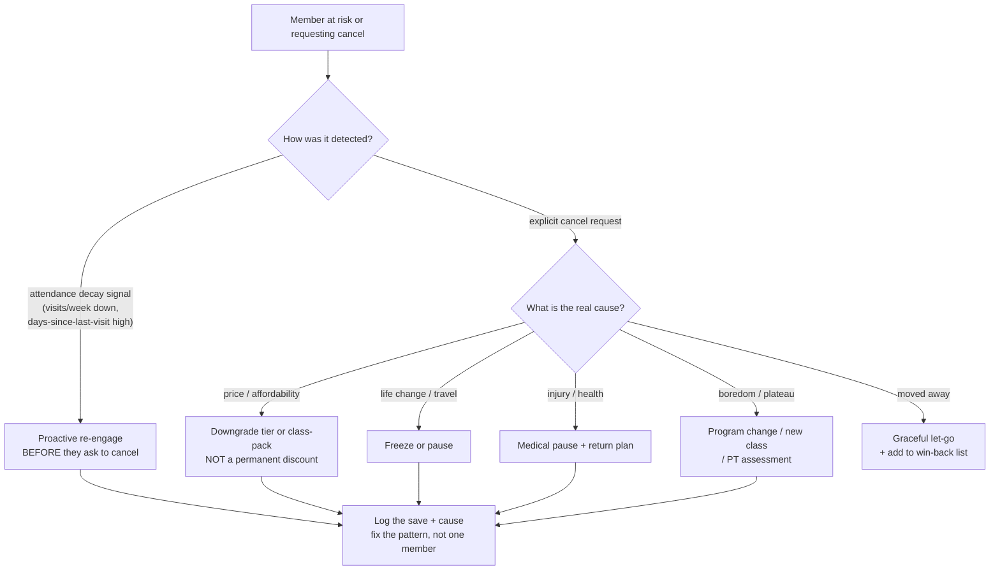
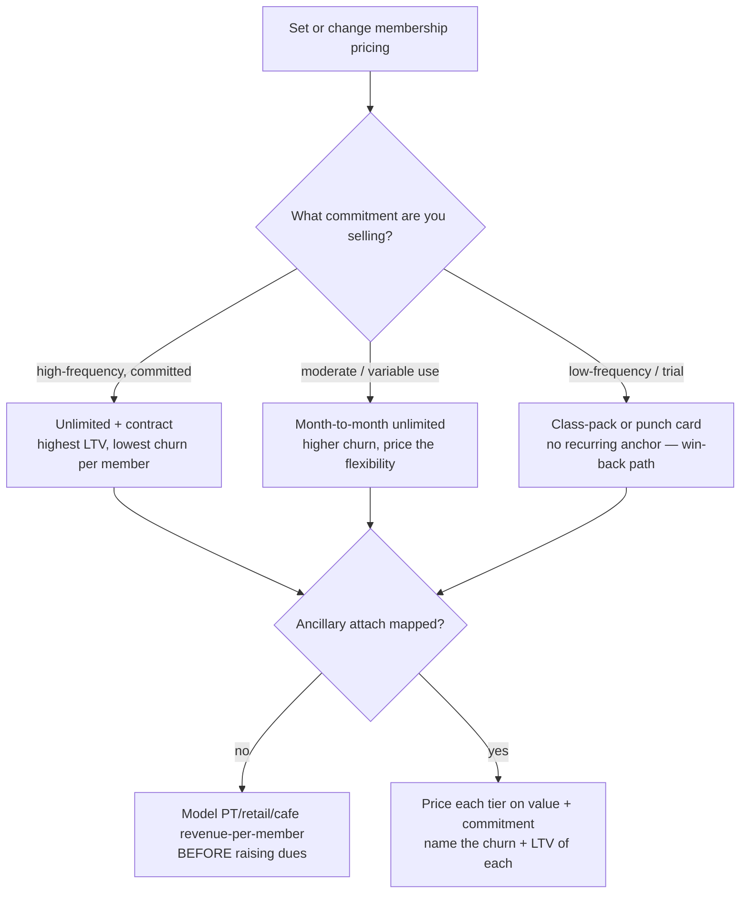
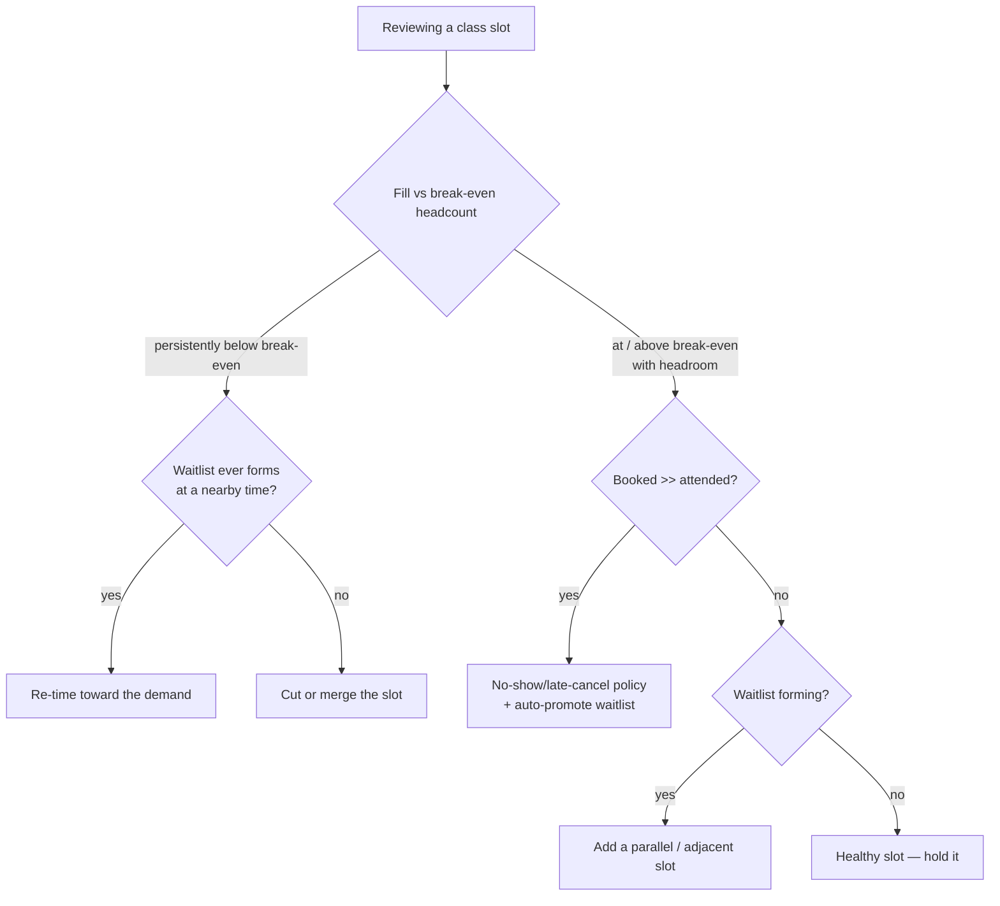
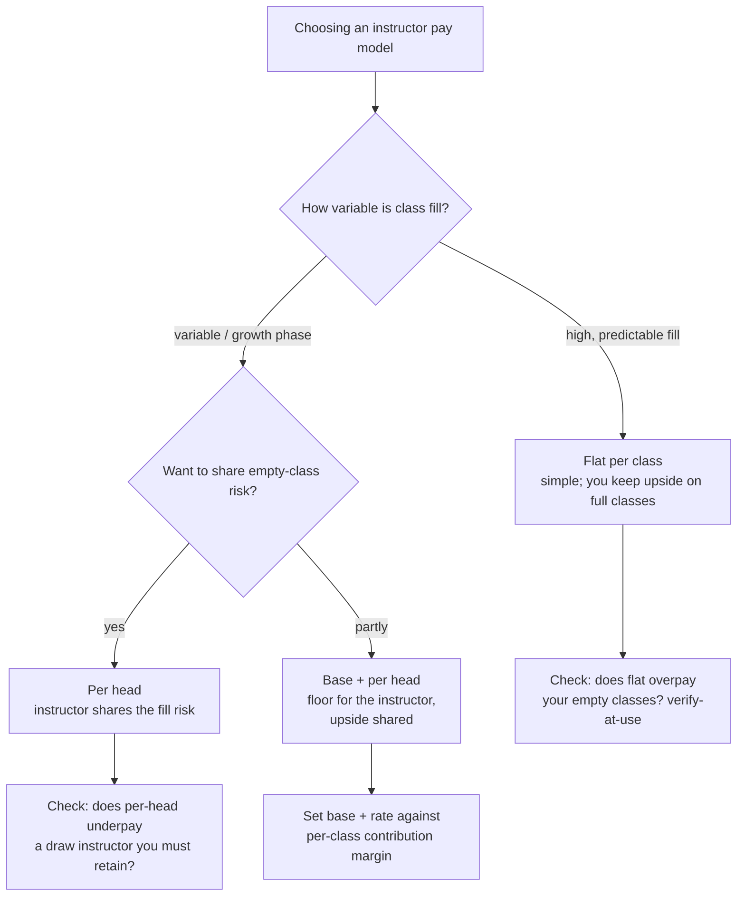

# Fitness Studio / Gym Operations — Decision Trees

> Reference decision trees for the `fitness-studio-gym-operations` team. Agents **traverse the relevant tree top-to-bottom before deciding** (the proactive complement to the Capability Grounding Protocol). Each `## Decision Tree` section is a Mermaid graph plus the rule it encodes.
>
> **Advisory operations knowledge, not legal, financial, or medical/exercise-prescription advice.** Anything touching a churn/LTV benchmark, class-fill target, or instructor-pay norm is `[verify-at-use]` — confirm against your own books and current market data before acting. No member PII.
>
> _Last reviewed: 2026-07-02 by `claude`. Principles are durable; dated benchmarks and concepts live in [`fitness-studio-reference-2026.md`](fitness-studio-reference-2026.md)._

---

## Decision Tree: churn-save triage — catch and keep a member

**Rule:** churn is predicted by **attendance decay, not the cancel form** — catch it early. When a cancel does come, **match the save to the cause**; a blanket discount cuts LTV and trains the threat. Benchmarks `[verify-at-use]`.

---

## Decision Tree: membership pricing / tier model

**Rule:** price on **value and commitment**, not the competitor's sign. Contract/unlimited, month-to-month, and class-pack are distinct churn + LTV profiles — architect them deliberately, and check ancillary headroom before defaulting to a dues increase. All numbers `[verify-at-use]`.

---

## Decision Tree: schedule the class grid on fill

**Rule:** schedule the grid on **demand, not habit**. Defend a slot with its fill against a known break-even headcount, reclaim held-but-no-show seats with policy, and add capacity only where a waitlist proves demand. Fill targets `[verify-at-use]`.

---

## Decision Tree: instructor pay model

**Rule:** match the pay model to **fill economics and contribution margin**, not convenience. Flat-per-class overpays empty classes and undersells packed ones; per-head shares the risk; base+per-head balances. Know the per-class break-even before you commit. Pay norms `[verify-at-use]`.

---

## See also

- [`fitness-studio-reference-2026.md`](fitness-studio-reference-2026.md) — dated concepts + benchmarks (verify-at-use).
- Skills: [`../skills/membership-growth-and-churn/SKILL.md`](../skills/membership-growth-and-churn/SKILL.md), [`../skills/member-onboarding-and-retention/SKILL.md`](../skills/member-onboarding-and-retention/SKILL.md), [`../skills/class-schedule-and-instructor-utilization/SKILL.md`](../skills/class-schedule-and-instructor-utilization/SKILL.md), [`../skills/ancillary-revenue-mix/SKILL.md`](../skills/ancillary-revenue-mix/SKILL.md).
