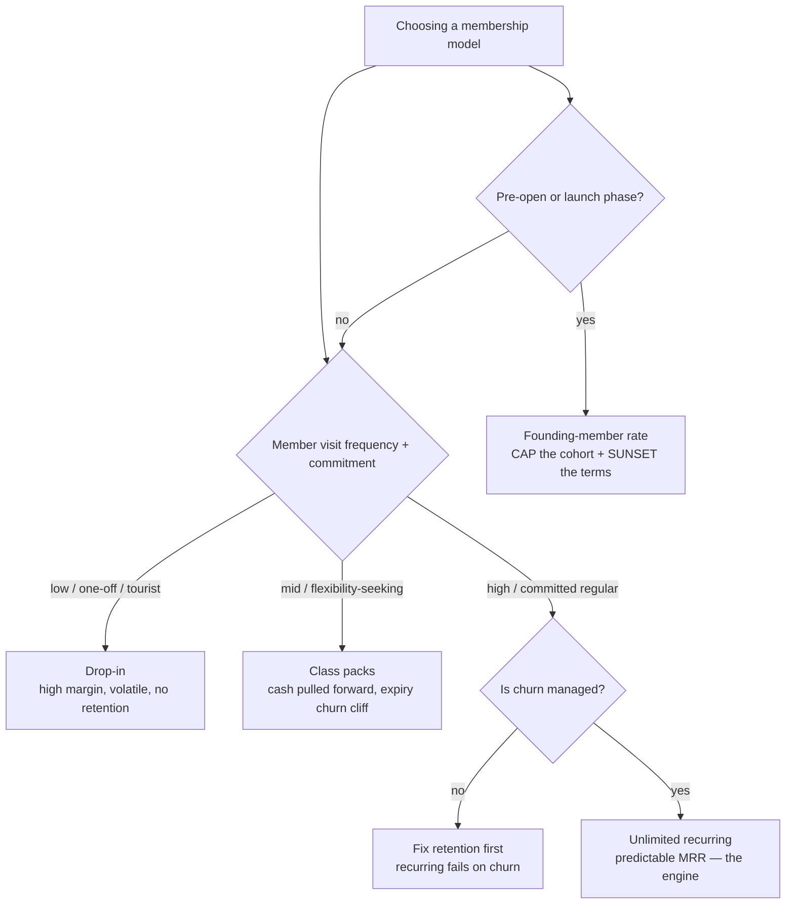
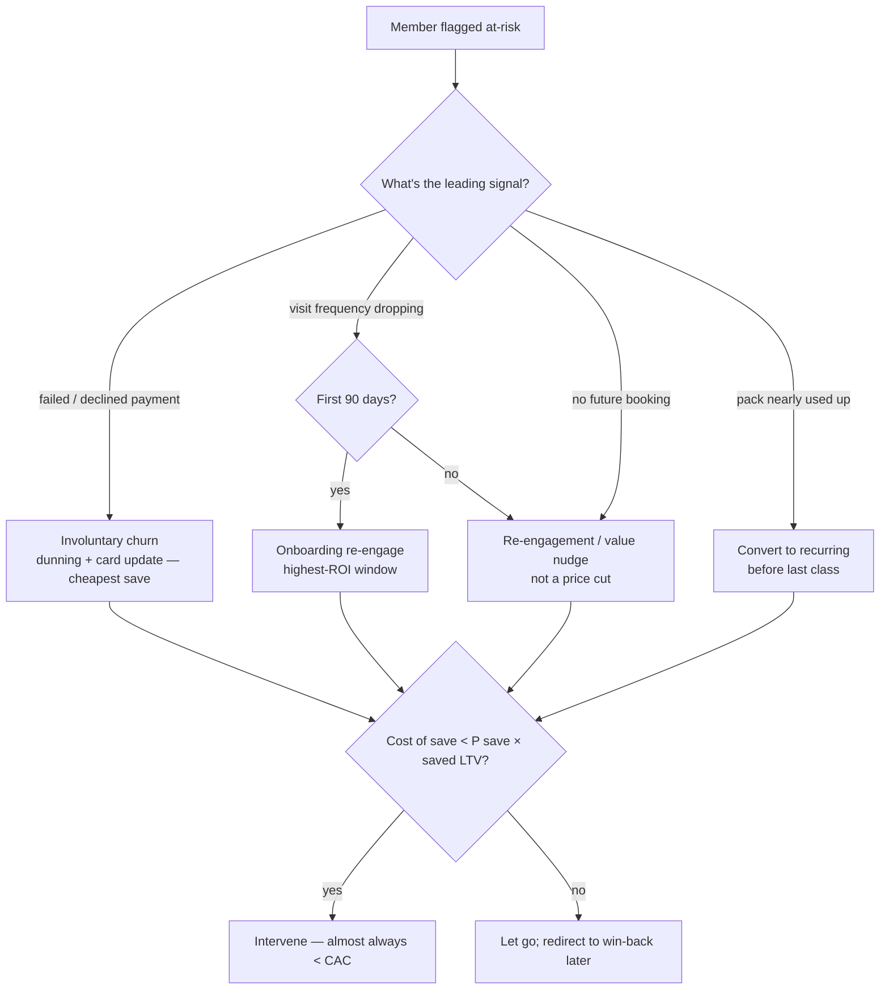
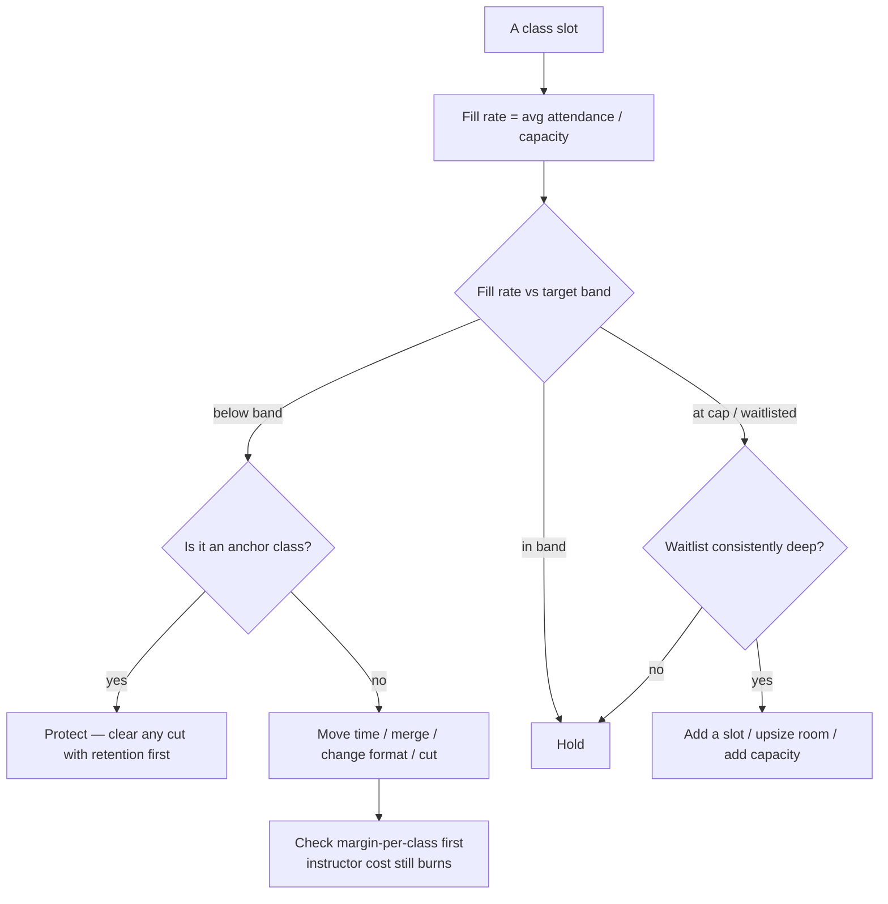
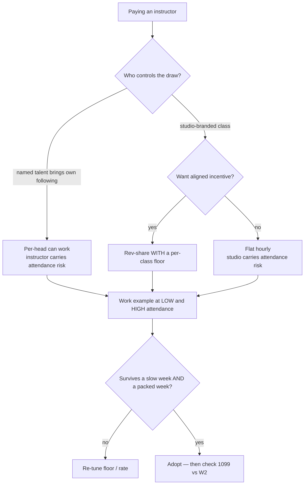
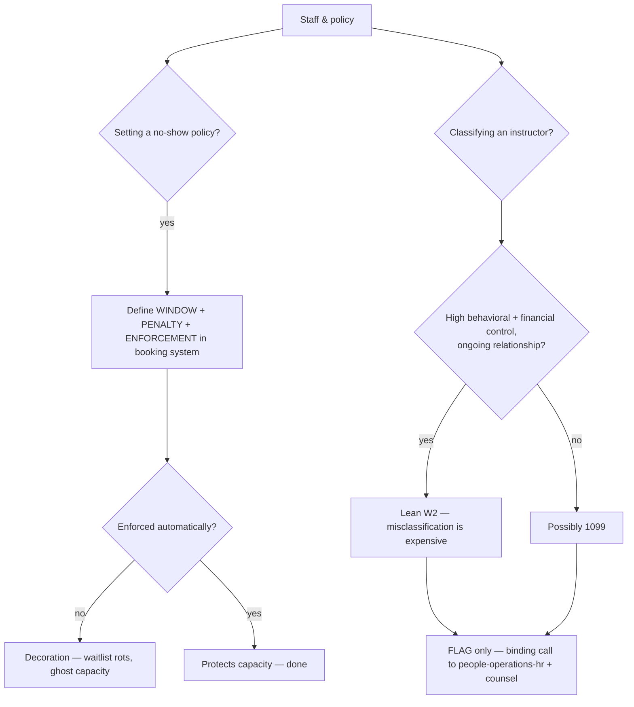

# Fitness Studio Operations — Decision Trees

> Reference decision trees for the `fitness-studio-operations` team. Agents **traverse the relevant tree top-to-bottom before choosing** (the proactive complement to the Capability Grounding Protocol). Each `## Decision Tree` section is a Mermaid graph plus the rule it encodes.
>
> _Last reviewed: 2026-06-25 by `claude`. Principles are durable; specific platform/fee/benchmark names live (dated) in [`fitness-studio-operations-reference-2026.md`](fitness-studio-operations-reference-2026.md)._

---

## Decision Tree: which membership model?

**Rule:** name the cash-flow and retention *shape* before the price. Drop-in is volatile high margin; packs pull cash forward but hide an expiry churn cliff; unlimited recurring is the predictable engine but only if churn is managed; founding-member pricing funds the launch at the cost of capped lifetime value, so cap the cohort and sunset the terms.

---

## Decision Tree: retention intervention (at-risk member)

**Rule:** at-risk is a *leading* signal (frequency drop, failed payment, no future booking, pack ending), not the cancel itself. Match the intervention to the signal; lead with value/re-engagement, not a default price cut. Intervene when cost of save < P(save) × saved LTV — which is almost always cheaper than CAC.

---

## Decision Tree: class capacity (prune / hold / grow)

**Rule:** capacity is utilization per *slot*, not headcount. Below the target fill band and not an anchor class → move/merge/cut, but put margin-per-class (instructor cost still burns on an empty class) on the table first. At cap with a deep waitlist → unmet demand, add capacity before members leave.

---

## Decision Tree: instructor pay model

**Rule:** pick the pay model on who carries attendance risk and who controls the draw — hourly (studio), per-head (instructor), rev-share (shared, usually needs a floor). Always work an example at low *and* high attendance; the model must survive both. Then run the classification check.

---

## Decision Tree: no-show / late-cancel & the 1099-vs-W2 flag

**Rule:** a no-show policy needs a window, a penalty, and an *enforcement mechanism* wired into booking, or it's decoration. For classification, more control + a permanent, integral relationship leans W2 — but **flag** the risk; the binding determination belongs to `people-operations-hr` and counsel, and the filing to `accounting-bookkeeping`.

---

## See also

- [`fitness-studio-operations-reference-2026.md`](fitness-studio-operations-reference-2026.md) — dated tooling/benchmark map (re-verify before quoting platforms, fees, or benchmarks).
- Skills: [`../skills/design-membership-model/SKILL.md`](../skills/design-membership-model/SKILL.md), [`../skills/compute-studio-unit-economics/SKILL.md`](../skills/compute-studio-unit-economics/SKILL.md), [`../skills/analyze-retention-and-churn/SKILL.md`](../skills/analyze-retention-and-churn/SKILL.md), [`../skills/optimize-class-schedule/SKILL.md`](../skills/optimize-class-schedule/SKILL.md), [`../skills/design-instructor-pay-model/SKILL.md`](../skills/design-instructor-pay-model/SKILL.md).
