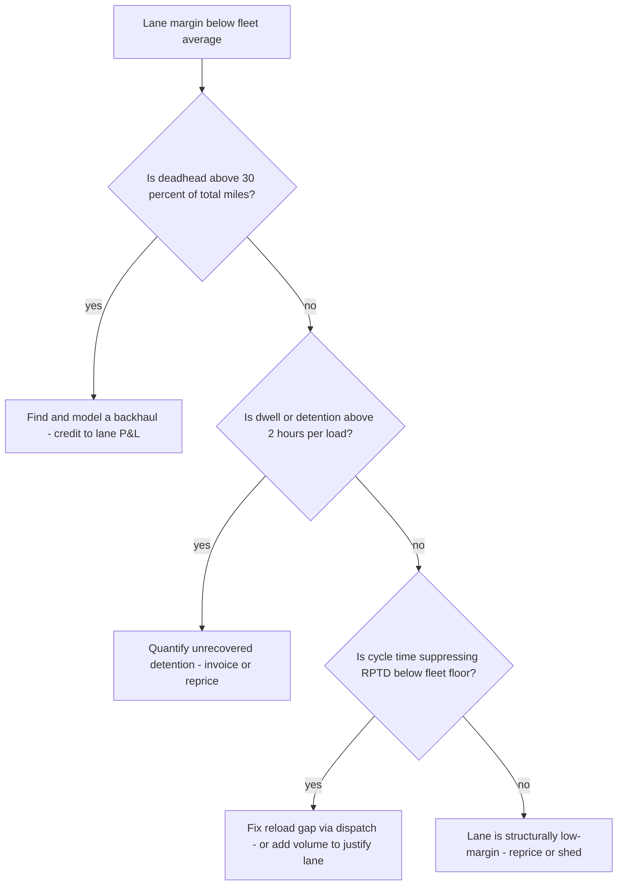
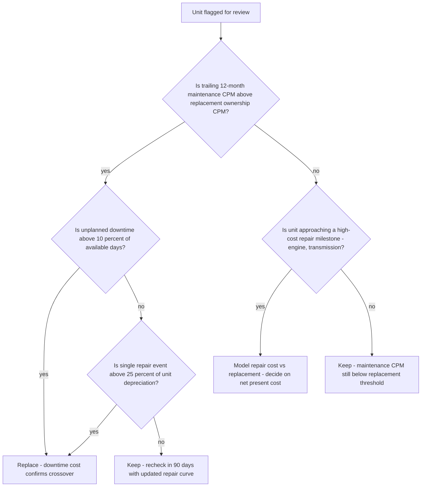
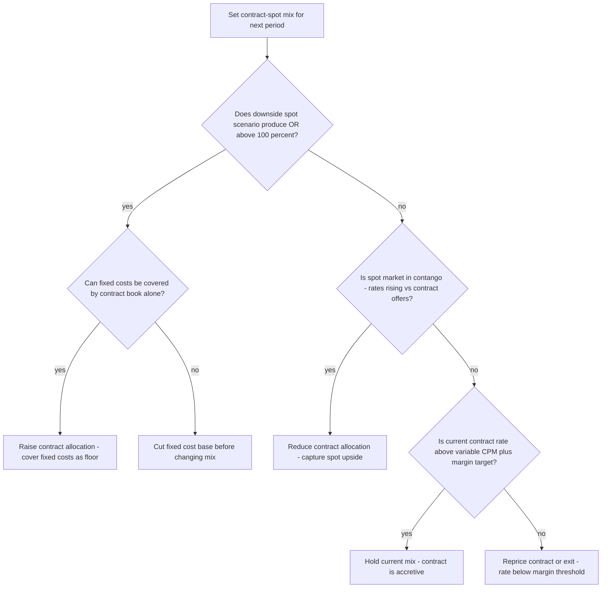

# Fleet decision trees

Which analysis for which symptom — traverse top-to-bottom before picking a method.

## Decision Tree: Losing money per mile

1) Build CPM bottom-up (§3 #1). 2) Read the OR (§3 #2). 3) Check deadhead/utilization (§3 #3). 4) Check maintenance and turnover (§3 #4, #5).

## Decision Tree: Rate looks fine, margin doesn't

1) Price the lane against CPM + deadhead (§3 #6). 2) Measure utilization (§3 #3). 3) Find the backhaul.

## Decision Tree: Repair costs rising

1) Read maintenance CPM (§3 #5). 2) Split planned vs unplanned. 3) Call lifecycle replacement.

## How to read these trees

Traverse top-to-bottom and stop at the first matching branch — the order encodes the cheap-checks-before-expensive-checks discipline (§3). Each leaf names a skill, a specialist, or a house-opinion to apply. Never skip a higher branch because a lower one looks more interesting; a denominator, seasonal, or definitional artifact masquerades as a finding more often than not.

## Decision Tree: Which skill for which task

- **Build cost-per-mile bottom-up** → use when: Build CPM from fixed and variable components, isolating fuel and the non-fuel marginal, so the cost is visible where it lives. ([`../skills/build-cost-per-mile/SKILL.md`](../skills/build-cost-per-mile/SKILL.md))
- **Manage the operating ratio** → use when: Read the operating ratio (expenses ÷ revenue) as the survival headline and decompose it before acting. ([`../skills/manage-the-operating-ratio/SKILL.md`](../skills/manage-the-operating-ratio/SKILL.md))
- **Reduce deadhead and raise utilization** → use when: Read empty miles and truck utilization and build a routing/backhaul plan to lift the loaded-mile ratio. ([`../skills/reduce-deadhead/SKILL.md`](../skills/reduce-deadhead/SKILL.md))
- **Run preventive maintenance to CPM** → use when: Run a PM program against maintenance CPM and downtime so a deferred PM doesn't become a roadside failure. ([`../skills/run-preventive-maintenance/SKILL.md`](../skills/run-preventive-maintenance/SKILL.md))
- **Quantify driver retention cost** → use when: Read driver turnover as a quantified unit-economics cost across recruiting, training, and unseated trucks. ([`../skills/quantify-driver-retention/SKILL.md`](../skills/quantify-driver-retention/SKILL.md))

## Decision Tree: Which specialist owns this

- **The engagement** → [`fleet-engagement-lead`](../agents/fleet-engagement-lead.md)
- **Movement** → [`dispatch-routing-specialist`](../agents/dispatch-routing-specialist.md)
- **The iron** → [`fleet-maintenance-specialist`](../agents/fleet-maintenance-specialist.md)
- **The numbers** → [`logistics-cost-analyst`](../agents/logistics-cost-analyst.md)

When two leaves apply, route to the **lead** first to scope and sequence — overlapping symptoms usually mean two drivers at once, and the lead keeps the analysis from collapsing into a single-cause story.

## Decision Tree: Which house-opinion gates the call

Before picking any method, check whether one of the standing biases (§3) already decides the framing:

1. Cost-per-mile is the master number — build it bottom-up — if this is in question, apply §3 #1 before any method.
2. The operating ratio is the survival metric — if this is in question, apply §3 #2 before any method.
3. Deadhead and utilization are the revenue leaks — if this is in question, apply §3 #3 before any method.
4. Driver turnover is a unit-economics problem, not HR overhead — if this is in question, apply §3 #4 before any method.
5. Preventive maintenance is cheaper than the breakdown — if this is in question, apply §3 #5 before any method.
6. Rate-per-mile is meaningless without the cost and the lane — if this is in question, apply §3 #6 before any method.
7. Fuel is the swing variable — manage it, don't just absorb it — if this is in question, apply §3 #7 before any method.
8. Cite the source and date for every benchmark — if this is in question, apply §3 #8 before any method.

## Escalation & guardrails

- Anything touching client PII / regulated records → stop and route to `ravenclaude-core` `security-reviewer`.
- Any external figure entering a deliverable → carry a source URL + retrieval date, or mark it `[unverified — training knowledge]` / `[ESTIMATE]` (§3, final house opinion).
- A recommendation ships only with an owner, a date, and an expected metric movement.
## Sourcing note

Figures in this file are from the author's domain knowledge and are marked `[unverified — training knowledge]` or `[ESTIMATE]` at point of use. Validate against a primary source before putting any figure in a client deliverable (§3 cite-or-mark rule).

---

## Decision Tree: Fleet — Lane Is Thin but Rate Looks Fine

**When this applies:** The lane P&L shows margin below the fleet average but the contracted rate appears competitive. The symptom is "we're not making money on this lane but the rate is fair." This tree sequences the diagnostic before any rate or shed decision.

**Last verified:** 2026-06-05 against ATRI operational cost methodology and standard carrier yield-management practice.

**Rationale per leaf:**
- *Find and model a backhaul* — deadhead is the cheapest margin leak to fix; backhaul revenue credited to the lane often restores margin without a rate conversation.
- *Quantify unrecovered detention* — if dwell is high and detention is not billed, the margin gap is an invoicing failure, not a rate failure.
- *Fix reload gap via dispatch* — a long idle between the drop and the next load suppresses RPTD; a dispatch fix may be faster than a rate increase.
- *Reprice or shed* — after ruling out deadhead, detention, and cycle time, a rate increase or lane exit is the correct action.

**Tradeoffs summary:**

| Method | Cost / time | Blast radius | Approval gate? | Use when |
|---|---|---|---|---|
| Backhaul search | Low / 1-3 days | Lane only | No | Deadhead above 30% |
| Detention invoicing | Low / immediate | Shipper relationship risk | Account manager | Dwell above 2 hrs, underbilled |
| Dispatch cycle fix | Medium / 1-2 weeks | Dispatch schedule | Dispatch manager | RPTD below floor |
| Reprice or shed | High / next renewal | Customer relationship | Sales + leadership | All other causes ruled out |

---

## Decision Tree: Fleet — Truck Replacement Timing

**When this applies:** A unit is flagged for high repair cost, downtime, or age, and the question is whether to replace it now, defer, or accelerate the replacement. The tree prevents both premature replacement (cost) and late replacement (downtime + hidden CPM).

**Last verified:** 2026-06-05 against standard fleet lifecycle management practice.

**Rationale per leaf:**
- *Replace - downtime confirmed* — when both CPM crossover and downtime align, deferring adds hidden cost in missed loads and driver disruption.
- *Monitor 90 days* — a single-event spike without downtime may not represent the trend; 90 days of additional data refines the repair curve before a capital decision.
- *Model repair vs replacement* — an upcoming major repair changes the economics; net the repair cost against the residual value and replacement cost before deciding.
- *Keep* — below the CPM crossover and no imminent major repair, replacement adds capital cost without a savings case.

**Tradeoffs summary:**

| Method | Cost / time | Blast radius | Approval gate? | Use when |
|---|---|---|---|---|
| Replace now | High / 30-60 days | Capital budget | Finance + Ops | CPM crossover + downtime confirmed |
| Monitor 90 days | None / 90 days | Single unit | Maintenance manager | CPM spike but no downtime |
| Model major repair | Low / 1-2 days | None | Maintenance + Finance | Major component near end of life |
| Keep | None | None | Maintenance manager | CPM below replacement threshold |

---

## Decision Tree: Fleet — Spot vs. Contract Allocation for Next Period

**When this applies:** The carrier is entering a contract renewal season or freight-cycle shift, and the question is how to allocate available capacity between committed contract freight and spot-market exposure. The symptom is "what percentage should we commit to contracts this year?"

**Last verified:** 2026-06-05 against standard carrier revenue management practice.

**Rationale per leaf:**
- *Raise contract allocation* — if the downside scenario loses money and fixed costs can be covered by contracts, increasing contract volume reduces the loss in a soft market.
- *Cut fixed cost base* — if even full contract coverage doesn't cover fixed costs, the cost structure problem must be solved before the mix question.
- *Reduce contract allocation* — in a rising spot market, over-committing to contract at below-market rates leaves money on the table.
- *Hold current mix* — when the downside is survivable and contract rates are accretive, change costs more than it earns.
- *Reprice or exit* — a contract rate below variable CPM plus margin loses money on every mile; no allocation decision fixes that.

**Tradeoffs summary:**

| Method | Cost / time | Blast radius | Approval gate? | Use when |
|---|---|---|---|---|
| Raise contract allocation | Low / next renewal | Revenue ceiling risk | Sales + leadership | Downside scenario shows OR above 100% |
| Cut fixed cost base | High / weeks-months | Operations | Finance + Ops | Fixed costs not covered at any mix |
| Reduce contract allocation | Medium / renewal | Shipper relationship | Sales | Spot market rising vs contract offers |
| Hold current mix | None | None | None | Downside survivable, contract accretive |
| Reprice or exit | High / renewal negotiation | Customer | Sales + leadership | Contract rate below variable CPM floor |
