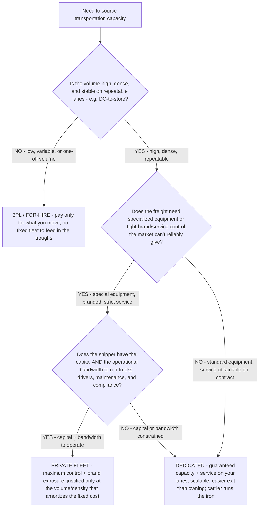

# Fleet sourcing decision tree — run a private fleet vs. dedicated vs. 3PL/for-hire

**Last reviewed:** 2026-06-05 · **Confidence:** medium (private-vs-dedicated-vs-outsourced industry framing, web-verified this date). Cost, volume, and service figures are shipper- and lane-specific — they carry inline `[verify-at-use]` / `[ESTIMATE]` markers and must be validated against the shipper's actual volume, lane mix, and service requirements before any deliverable (CLAUDE.md §3 #8).

> Canonical decision tree for the [`fleet-engagement-lead`](../agents/fleet-engagement-lead.md) (scoping) with the numbers owned by [`logistics-cost-analyst`](../agents/logistics-cost-analyst.md). This is the **make-vs-buy** decision for transportation capacity, distinct from the **lease-vs-buy-vs-rent** tree (which assumes you've already chosen to run your own iron). Traverse top-to-bottom before committing to (or dissolving) a private fleet. The decision is **not** "owning a fleet gives you control so do it" — it is a volume + lane-stability + service-requirement + capital-bandwidth trade, and a **mix** is common (private fleet on the dense, stable, branded core; dedicated/3PL on variable or long-haul lanes). Decision-support for the shipper/operator, not licensed financial advice (CLAUDE.md §2).

---

## When this applies

A shipper or operator is deciding how to source transportation capacity: **private fleet** (own trucks + employ drivers), **dedicated fleet** (a carrier provides trucks/drivers exclusively on contract), or **3PL / for-hire / spot** (variable outsourced capacity). Common triggers: a private-fleet expansion or wind-down, a dedicated-contract renewal, a service-failure review, or a volume shift that no longer matches the built infrastructure.

## The tree



## Rationale per leaf

- **3PL / FOR-HIRE (low/variable volume)** — when volume is thin, variable, or one-off, an outsourced/for-hire model lets the shipper **pay only for what it moves**, with no fixed fleet to feed in the troughs and the ability to flex capacity with volume. A private fleet against variable volume strands fixed cost in idle trucks. This is the same utilization logic as the lease/buy and in-house-lab trees: fixed capacity only pays off at high, steady utilization.
- **DEDICATED (high volume, but service obtainable on contract OR capital/bandwidth constrained)** — a dedicated fleet gives **guaranteed capacity and service on your specific lanes**, **predictable pricing**, and **easier scale-up/down and exit** than owning, while the carrier carries the trucks, drivers, maintenance, and the risk of fleet ownership. It's the usual answer for high-volume, repeatable lanes with tight service (e.g. DC-to-store) when the shipper doesn't want — or can't resource — running its own iron. *"Getting out of a dedicated contract is much easier than undoing a private-fleet build if volumes don't match the infrastructure."*
- **PRIVATE FLEET (high volume + special/branded service + capital + bandwidth)** — owning gives **maximum control, brand exposure, freight prioritization, and guaranteed specialized equipment** — but it is **costly and operationally heavy** (you now run drivers, maintenance, compliance, and carry the turnover and downtime problems this plugin's other trees address). It earns its place **only** at the volume and density that amortize the fixed cost, **and** when the shipper has both the capital and the operational bandwidth. A private fleet built ahead of stable volume is the most expensive way to be wrong.

## The economic test (the load-bearing arithmetic)

A private fleet is a **fixed-cost commitment**; outsourced capacity is **variable**. The comparison is fixed-cost-amortization vs. pay-per-move:

```
PRIVATE all-in cost  = (fixed fleet cost: equipment + drivers + maintenance + insurance + compliance + overhead)
                       spread over actual loaded volume  → a cost-per-mile / cost-per-load
DEDICATED cost       = contracted rate (capacity guaranteed; carrier carries fleet risk) per load/mile
3PL/FOR-HIRE cost    = market/spot rate per load — pay only for what you move, no fixed base
```

If the shipper's volume can't keep a private fleet's trucks loaded near the utilization that amortizes the fixed cost, dedicated or for-hire wins on cost. Build the private-fleet CPM bottom-up and compare it honestly to the dedicated/market rate on the *same* lanes — [`../scripts/fleet_calc.py`](../scripts/fleet_calc.py) `cost-per-mile` builds the private-fleet number; the [`fleet-decision-trees.md`](fleet-decision-trees.md) lane-profitability and spot-vs-contract trees frame the rate side.

## Gotchas

- **Control has a fixed-cost price tag.** "We want control" is real, but a private fleet's fixed cost (drivers, turnover, maintenance, downtime, compliance) is the price of that control — quantify it before choosing it. Dedicated buys most of the control with far less fixed risk.
- **Exit cost is asymmetric.** Unwinding a private fleet when volume drops is slow and expensive (sell trucks, lay off drivers); exiting a dedicated contract is comparatively easy. If your volume is uncertain, that optionality is worth real money.
- **A private fleet inherits every other problem in this plugin.** Once you own it, you own driver turnover (often 90%+ at large TL), maintenance-CPM, deadhead, and HOS/ELD compliance — the rest of this knowledge bank applies. Don't model a private fleet as just "trucks."
- **The mix is often right.** Private on the dense, stable, branded core; dedicated/3PL on the variable or long-haul tail. Don't force one model across all lanes.

## Escalation & guardrails

- Capital structure / financing of a private-fleet build → licensed financial advisor (the team frames the operating trade, not the financing — CLAUDE.md §2).
- Once private/dedicated is chosen and you're acquiring units → the **lease-vs-buy-vs-rent** tree ([`fleet-lease-vs-buy-vs-rent-decision-tree.md`](fleet-lease-vs-buy-vs-rent-decision-tree.md)).
- Driver, maintenance, deadhead, and HOS/ELD implications of running your own fleet → the respective specialists and the [`fleet-decision-trees.md`](fleet-decision-trees.md) trees.
- Every figure entering a deliverable carries a source URL + retrieval date or an `[unverified — training knowledge]` / `[ESTIMATE]` mark (CLAUDE.md §3 #8).

## Sources (retrieved 2026-06-05)

- Jones Logistics — *Dedicated Fleet vs Private Fleet: Choosing the Right Model in 2025*: https://www.joneslogistics.com/blog/dedicated-fleet-vs.-private-fleet-how-to-choose-the-right-model-in-2025
- RXO — *Private vs. Dedicated Fleet* (dedicated best on high-volume repeatable lanes like DC-to-store; easier exit): https://rxo.com/resources/shipper/private-vs-dedicated-fleet/
- Transforce — *Private Fleet Trucking: Advantages & Disadvantages* (control + brand vs. cost + bandwidth): https://www.transforce.com/carriers/carrier-resources/private-fleet-trucking-advantages-disadvantages
- Trinity Logistics — *Private Fleets or Outsourced Logistics? Which is Better?*: https://trinitylogistics.com/blog/private-fleets-or-outsourced-logistics-which-is-better
