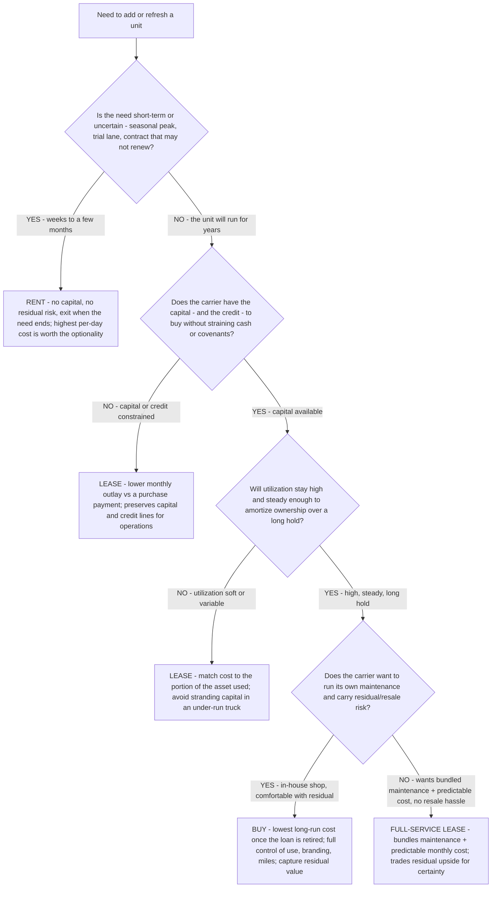

# Fleet acquisition decision tree — lease vs. buy vs. rent

**Last reviewed:** 2026-06-05 · **Confidence:** medium (KPMG/Ryder TCO framing + ATRI equipment-cost benchmark + standard fleet-finance practice, web-verified this date). Payment, residual, utilization, and tax figures are carrier- and deal-specific — they carry inline `[verify-at-use]` / `[ESTIMATE]` markers and must be validated against the carrier's actual quotes, utilization, and tax position before any deliverable (CLAUDE.md §3 #8).

> Canonical decision tree for the [`logistics-cost-analyst`](../agents/logistics-cost-analyst.md) (the numbers) with an assist from [`fleet-maintenance-specialist`](../agents/fleet-maintenance-specialist.md) (full-service-lease maintenance bundling). Complements the existing **Truck Replacement Timing** tree in [`fleet-decision-trees.md`](fleet-decision-trees.md): that tree decides *when a unit leaves the fleet*; this one decides *how the next unit comes in*. Traverse top-to-bottom before signing an acquisition. The decision is **not** "buy is always cheaper long-term" — it is a utilization + capital + duration + maintenance-appetite trade, and the answer is often a **mix** (own the steady core, lease the planned-growth tranche, rent the peaks). Decision-support for the carrier, not licensed financial or tax advice (CLAUDE.md §2).

---

## When this applies

A carrier is adding or refreshing capacity and must choose an acquisition structure: **buy** (own the asset), **lease** (full-service or finance lease), or **rent** (short-term). Common triggers: a growth tranche, a replacement cycle (after the replacement-timing tree says "replace"), a seasonal peak, or a contract win with an uncertain renewal.

## The tree



## Rationale per leaf

- **RENT (short-term / uncertain)** — for a seasonal peak, a trial lane, or a contract that may not renew, renting carries **no capital outlay and no residual risk** and lets the carrier exit the moment the need ends. The per-day cost is the highest of the three, but you are buying **optionality**, not the truck — don't capitalize a temporary need.
- **LEASE (capital/credit constrained)** — leasing typically means a **lower monthly payment than a purchase**, because it's priced on the portion of the asset used rather than the whole asset, and it **preserves capital and credit** for operations. KPMG/Ryder analysis found leasing can save **up to ~19%** for *certain* fleets vs. buying — but that is deal- and utilization-specific [verify-at-use], not a universal rule.
- **LEASE (soft/variable utilization)** — when a truck won't run enough to amortize ownership, buying **strands capital** in an under-utilized asset; leasing matches cost to use. This mirrors the in-house-lab amortization logic — fixed capital only pays off at sufficient utilization.
- **BUY (high steady utilization, long hold, in-house maintenance)** — buying is usually the **lowest long-run cost**: once the loan is retired (typically 4–5 years), the unit runs for years with no financing payment, and the carrier keeps **full control** (use, branding, no mileage limits) and captures the **residual/resale value**. It earns its place only when utilization is high enough to amortize it and the carrier can run its own maintenance and carry residual risk.
- **FULL-SERVICE LEASE (wants bundled maintenance + certainty)** — a full-service lease **bundles maintenance** and gives a predictable monthly cost with no resale hassle, trading away residual upside for certainty. Good for carriers without an in-house shop or who value cash-flow predictability over long-run lowest cost.

## The economic test (the load-bearing arithmetic)

Compare on **total cost of ownership over the hold period**, not the monthly payment in isolation. KPMG/Ryder's central finding: **TCO is widely under-estimated** because owners omit cost factors (maintenance, downtime, residual, the cost of capital). The honest comparison nets:

```
BUY TCO   = purchase price − residual value + financing interest + maintenance + downtime + opportunity cost of the capital
LEASE TCO = Σ lease payments (+ maintenance if not bundled) + any end-of-term/mileage charges − $0 residual
RENT TCO  = Σ rental days × day rate  (use only for short/uncertain durations — back-to-back renting of a long-term need loses to both)
```

Cross-check the per-mile equipment cost against the ATRI benchmark — truck/trailer payments ran **~$0.39/mi** in 2024 (up from $0.36) — so an acquisition that pushes equipment CPM well above that needs a utilization or rate justification. [`../scripts/fleet_calc.py`](../scripts/fleet_calc.py) `replace-repair` computes the ownership CPM of a replacement (payment + insurance ÷ miles) for the keep-vs-replace half of the call.

## Gotchas

- **Monthly payment ≠ total cost.** A lower lease payment can lose to a buy over a long hold once the loan retires; back-to-back leasing of a permanent need can exceed buying one truck outright (no asset, no residual at the end). Compare TCO over the hold, not the headline payment.
- **Residual value is real money.** A bought unit has a trade-in/resale value; a lease ends at $0 to the carrier. Omitting residual flatters the lease; omitting the cost of capital flatters the buy. Model both.
- **Utilization flips the answer.** The same way an idle in-house analyzer strands capital, an under-run owned truck strands capital — the buy case **requires** high, steady utilization. Re-run on *your* miles/truck, not an average (`[verify-at-use]`).
- **Tax treatment is carrier-specific and not this team's call.** Lease vs. depreciation, Section 179, etc. are licensed-advisor territory — flag, don't rule (CLAUDE.md §2).
- **The mix is usually right.** Own the steady core, lease the planned-growth tranche, rent the peaks — don't force one structure across the whole fleet.

## Escalation & guardrails

- Tax / depreciation / financing structure → licensed financial/tax advisor; the team frames the operating trade, it does **not** give financial advice (CLAUDE.md §2).
- *When* to retire the unit being replaced → the **Truck Replacement Timing** tree in [`fleet-decision-trees.md`](fleet-decision-trees.md).
- Every figure entering a deliverable carries a source URL + retrieval date or an `[unverified — training knowledge]` / `[ESTIMATE]` mark (CLAUDE.md §3 #8).

## Sources (retrieved 2026-06-05)

- KPMG & Ryder — *Lease or buy? Understanding Total Cost of Ownership (TCO) for Class 8 truck fleets* (TCO under-estimated; leasing up to ~19% savings for certain fleets): https://kpmg.com/us/en/articles/2024/lease-or-buy.html
- TrueNorth — *Lease vs. Buy in 2025: An Owner-Operator's Guide to Truck Financing* (own free-and-clear after loan; back-to-back lease vs. buy): https://www.truenorth.com/articles/business/lease-vs-buy-trucks-2025
- Penske Truck Leasing — *Lease vs. Own* (full-service-lease maintenance bundling, predictable cost): https://www.pensketruckleasing.com/truck-leasing/leasing-benefits/lease-vs-own/
- FleetMaintenance — ATRI 2025 cost components (truck/trailer payments ~$0.39/mi in 2024): https://www.fleetmaintenance.com/equipment/article/55301363/american-transportation-research-institute-atri-breakdown-of-atri-2025-operational-costs-report
