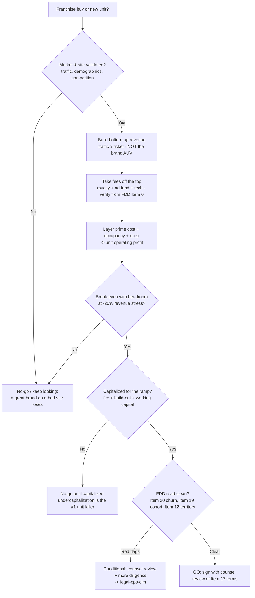

# New-unit go/no-go decision tree

> **Last reviewed:** 2026-07-07. Confidence: **high** on the framework (underwrite bottom-up, load the
> royalty, capitalize the ramp); **volatile** on any specific fee/figure. Every fee percentage, Item-19
> number, and investment figure is **[verify-at-use]** from the current FDD. This is business
> decision-support, **not** legal, financial, or investment advice — binding FDD/agreement review routes
> to `legal-ops-clm`; deep model mechanics route to `finance`.

## Reading the tree

- **Site before brand.** A validated market/site is the precondition; brand strength can't rescue a bad location.
- **Fees off the top, then the P&L.** The royalty-loaded model is the real one.
- **Ramp capital is part of the decision**, not an afterthought — model the months of negative cash.
- **Item 20 churn + Item 19 cohort + Item 12 territory** are the FDD reads that most change a go/no-go.
- **Every path to GO still routes the agreement terms (Item 17) to `legal-ops-clm`.**

## The franchise fee stack (verify each from the current FDD)

| Fee | Item | Note `[verify-at-use]` |
|---|---|---|
| Initial franchise fee | 5 | One-time, at signing |
| Royalty | 6 | Ongoing % of gross revenue — off the top |
| Ad / brand fund | 6 | Ongoing % of gross — off the top |
| Tech / other recurring | 6 | POS, software, required services |
| Required purchases | 8 | Approved suppliers — a margin (and rebate) issue |

## Re-verify each time you use this file

- The exact royalty / ad-fund / fee percentages (Items 5, 6) from the current FDD edition.
- Item 19 cohort definition and whether an FPR is even provided.
- Item 20 outlet table (openings / closures / transfers) for the last 3 years.
- State registration/relationship-law specifics (route to counsel).
