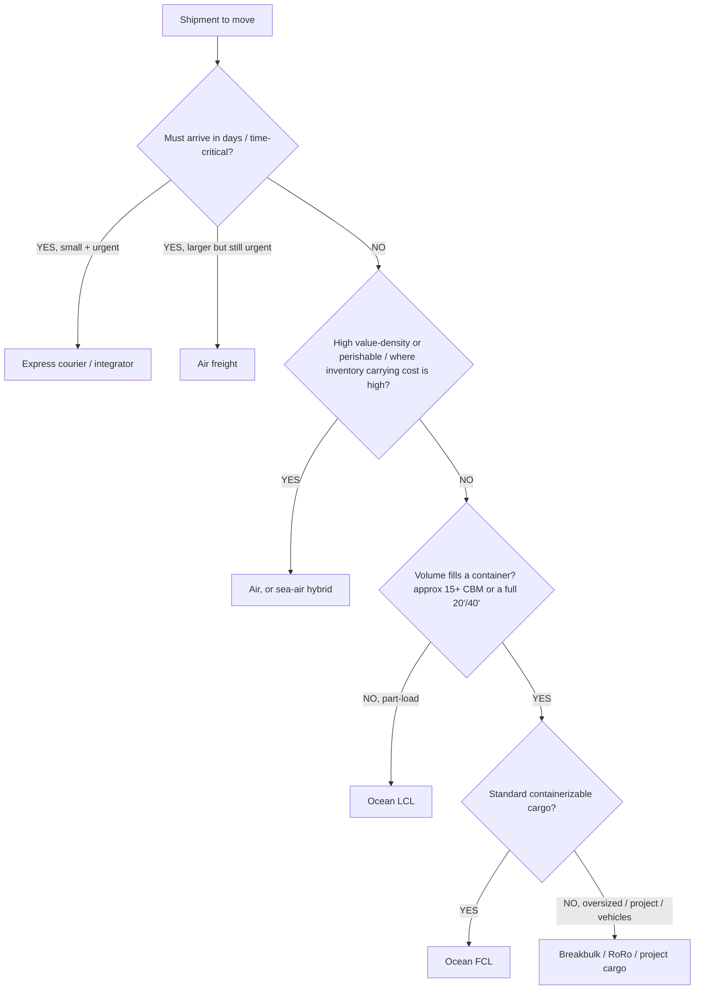
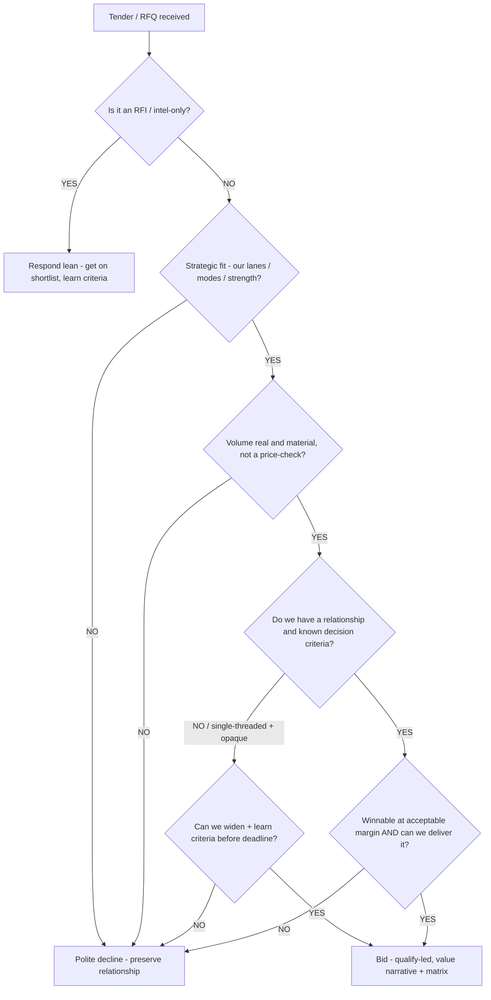
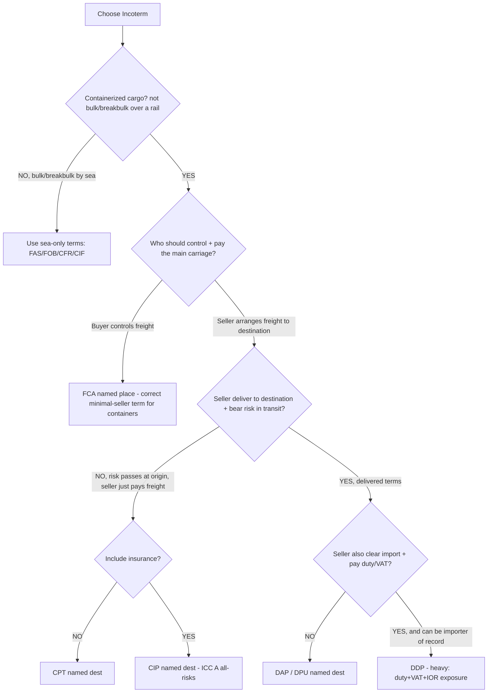
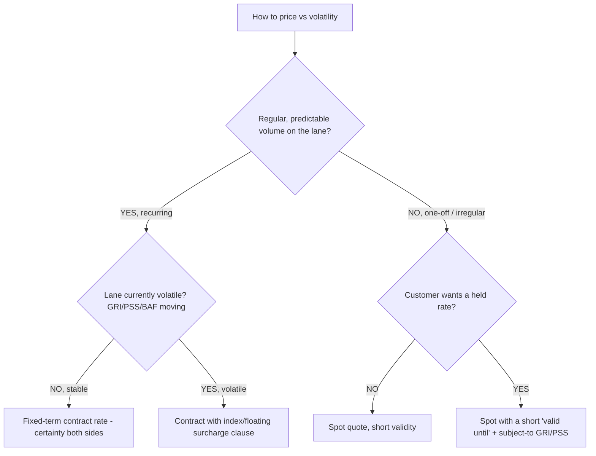
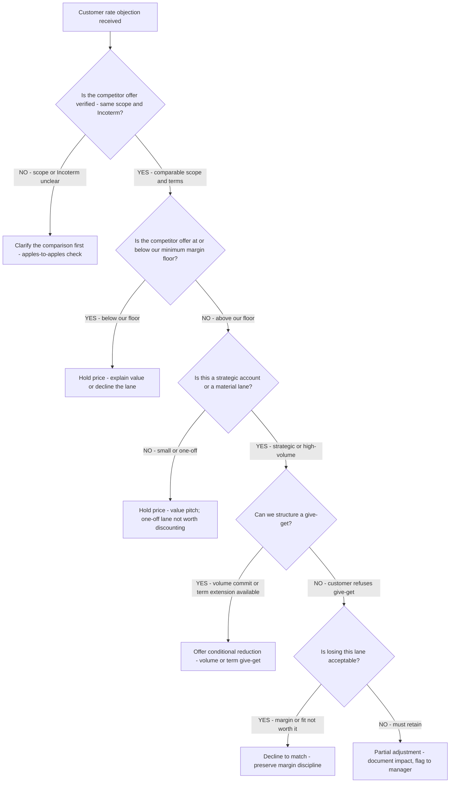
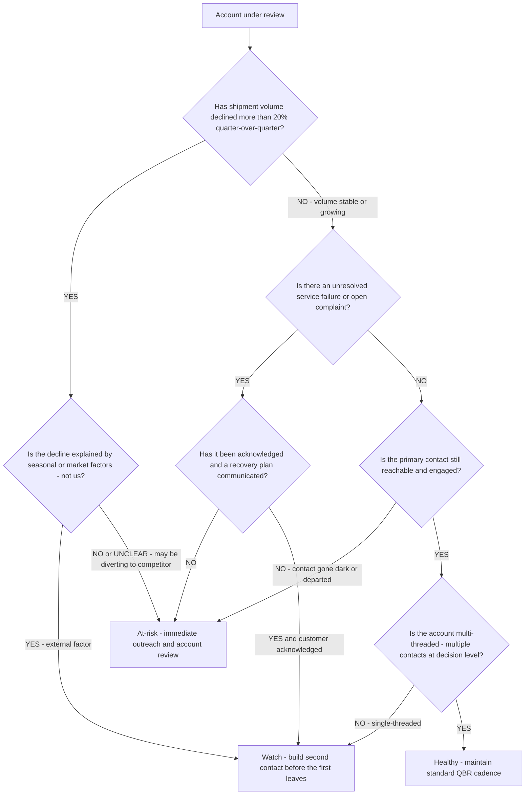
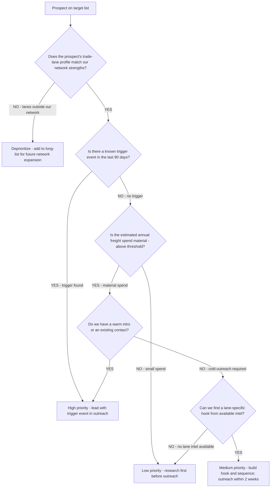
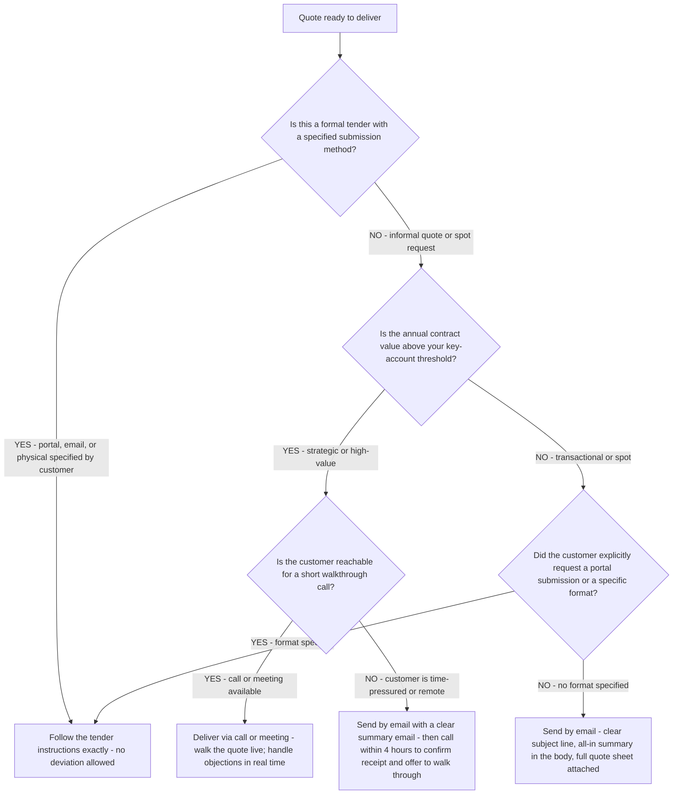
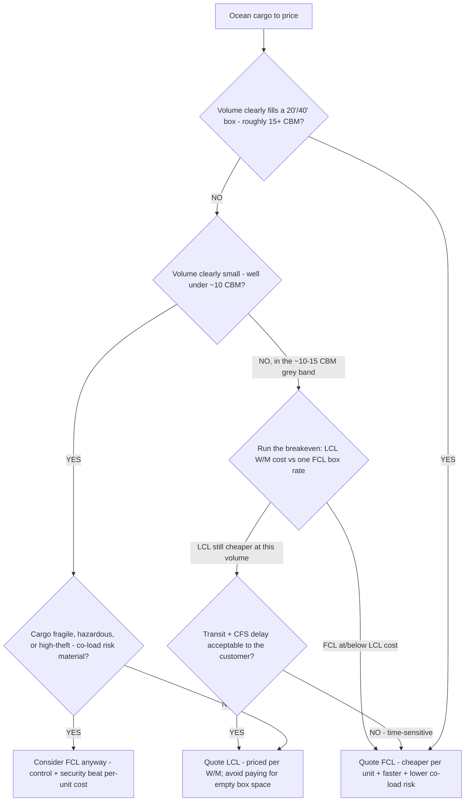
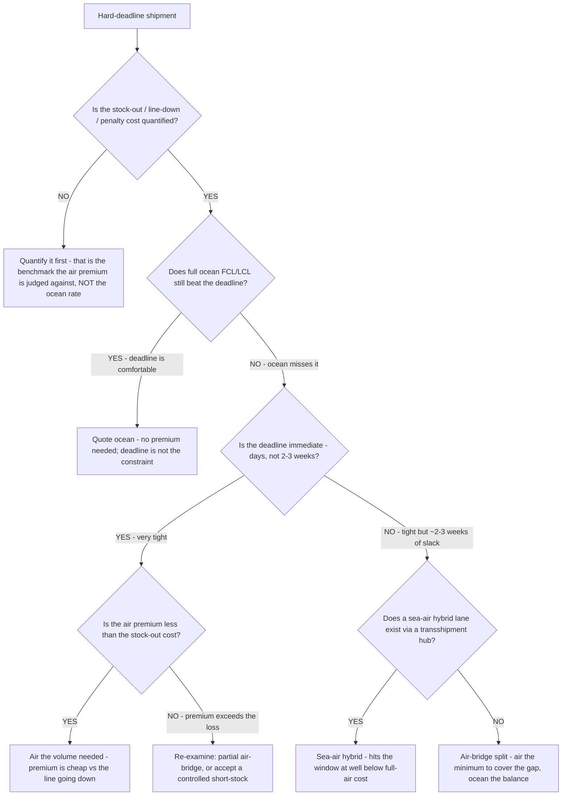

# Freight-sales decision trees

> **Last reviewed: 2026-06-04 by `claude`.** Canonical decision trees for the recurring routing/strategy calls a freight-forwarding sales manager makes. Each tree has an observable entry condition, a `Last verified` date, a Mermaid graph, per-leaf rationale, and a tradeoffs table where there are ≥3 leaves. These encode **industry-standard** practice (mode economics, tender qualification, Incoterms 2020, spot/contract strategy) — not any one carrier's confidential method. Crossover thresholds are heuristics: **calibrate to your own lanes and rates.**
>
> **Decision-tree traversal (priors).** When a situation matches an entry condition, traverse the relevant graph **top-to-bottom** before deciding — do **not** pattern-match on keywords in the request. The first branch that resolves cleanly is the leaf to apply.

Refresh triggers: a new Incoterms revision (next ICP cycle), a structural shift in mode economics (e.g., sustained air/ocean rate inversion), or a change in how tenders are commonly run.

---

## Decision Tree: Mode selection

**When this applies:** a shipment or lane needs a transport mode and you want the right cost/transit/risk fit before quoting.

**Last verified:** 2026-06-04 against standard forwarding practice (urgency × density × value × volume).

**Rationale per leaf:**
- **Express** — door-to-door speed for small, urgent, high-value parcels; priced on chargeable weight (often /5000 divisor); least paperwork burden on the shipper.
- **Air** — fast, reliable transit for time-sensitive or high-value-density cargo; expensive per kg, charged on chargeable weight; the right call when the inventory carrying cost or st-out cost beats the freight premium.
- **Air / sea-air** — sea-air hybrids trade some transit for big cost savings vs pure air on the right lanes; consider for medium urgency + high value.
- **LCL** — part-loads that don't justify a full box; priced per W/M; carries CFS handling and longer transit (consolidation/deconsolidation) but avoids paying for empty container space.
- **FCL** — once volume approaches a container, FCL usually beats LCL per unit and is faster/lower-risk (no co-loading); the LCL→FCL break-even is roughly **~13–15 CBM** but **calibrate to the lane**.
- **Breakbulk / RoRo / project** — for cargo that won't containerize (oversized, heavy-lift, vehicles, plant); specialist handling and quoting.

**Tradeoffs summary:**

| Leaf | Speed | Cost | Best for | Watch-out |
|---|---|---|---|---|
| Express | Fastest | Highest/kg | Small urgent parcels | Volumetric /5000 inflates bulky |
| Air | Fast | High/kg | Time-/value-sensitive | Chargeable weight, fuel/security surcharges |
| Sea-air | Medium | Medium | Cost-aware but not slow | Lane availability, transshipment |
| LCL | Slow | Low (part) | Part-loads | CFS charges, consolidation delay/risk |
| FCL | Medium | Low/unit at volume | Container-fill volume | Demurrage/detention if box held |
| Breakbulk | Slow | Variable | Oversized/project | Specialist, bespoke quoting |

---

## Decision Tree: Quote vs qualify (bid / no-bid)

**When this applies:** an RFQ/RFP/tender has landed and you must decide whether to invest hours pricing it.

**Last verified:** 2026-06-04 against standard tender-qualification practice.

**Rationale per leaf:**
- **Lean (RFI)** — don't over-invest before it's a real bid; respond enough to shortlist and learn the criteria.
- **Decline** — a fast, reasoned, relationship-preserving no on a poor-fit / unreal-volume / un-winnable / undeliverable tender returns the week to winnable bids and keeps you on the next list. Declining well is a skill, not a failure.
- **Bid** — only when fit + real volume + a relationship/criteria path + winnable economics + deliverability all hold. Then compete on the value narrative, not price alone.

**Tradeoffs summary:**

| Leaf | When | Cost to you | Upside |
|---|---|---|---|
| Lean | RFI / very early | Low | Shortlist + intel |
| Decline | Poor fit / unreal / un-winnable | Near-zero | Time back, relationship kept |
| Bid | All qualifiers pass | High (pricing hours) | Real win probability |

---

## Decision Tree: Incoterms selection

**When this applies:** you're proposing terms for a deal and must pick the Incoterm 2020 that fits the customer's capability and your service scope.

**Last verified:** 2026-06-04 against ICC Incoterms® 2020 (standard interpretation; cite ICC text for binding questions).

**Rationale per leaf:**
- **Sea-only terms** — FAS/FOB/CFR/CIF assume goods crossing the ship's side; correct for bulk/breakbulk, **wrong for containers** (risk-gap at the CY/CFS). CIF insurance is minimum ICC C.
- **FCA** — the correct minimal-seller term for **containerized** cargo; risk passes at hand-over to the carrier, not at the rail.
- **CPT / CIP** — seller pays main carriage to a named destination but **risk passes at origin** (first carrier); CIP carries **all-risks (ICC A)** insurance by default — don't confuse with CIF's minimum cover.
- **DAP / DPU** — delivered terms; seller bears risk to destination (DPU also unloads); buyer handles import + duty.
- **DDP** — seller pays **everything incl. import duty + VAT** and usually must be/appoint the importer of record; propose only when the seller can actually carry that compliance and cost. EXW (the mirror extreme) puts export clearance awkwardly on the buyer — usually prefer FCA over EXW.

**Tradeoffs summary:**

| Leaf | Seller burden | Risk passes | Key trap |
|---|---|---|---|
| FCA | Low | Origin hand-over | The right container term (vs FOB misuse) |
| CPT/CIP | Medium | Origin (1st carrier) | Cost ≠ risk point; CIP = ICC A |
| CFR/CIF | Medium | On board (origin) | Sea-only; CIF = ICC C minimum |
| DAP/DPU | High | Destination | DPU = seller unloads |
| DDP | Highest | Destination | Duty/VAT + importer-of-record exposure |

---

## Decision Tree: Spot vs contract rate

**When this applies:** you're deciding how to price against rate volatility — a held/fixed rate, a contract, or a spot/floating quote.

**Last verified:** 2026-06-04 against standard ocean/air pricing practice.

**Rationale per leaf:**
- **Contract** — recurring, stable lanes: a fixed-term rate gives both sides certainty and protects the relationship; you carry some volatility risk, so price it in.
- **Index / floating-surcharge contract** — recurring but volatile lanes: lock the base but pass through BAF/GRI via an agreed index or clause, so neither side is whipsawed.
- **Spot** — one-off/irregular: quote at the live spot with **short validity**; don't hold a price you can't buy tomorrow.
- **Held spot** — customer wants a held number on a one-off: give a short "valid until" and mark GRI/PSS/BAF as subject-to-change, or fold them into a priced-in all-in.

**Tradeoffs summary:**

| Leaf | Certainty | Your risk | Best for |
|---|---|---|---|
| Contract | High both sides | You carry volatility | Stable recurring lanes |
| Index/floating | Medium | Shared via clause | Volatile recurring lanes |
| Spot | Low | Minimal | One-off/irregular |
| Held spot | Short-term | Bounded by validity | One-off with a price ask |

---

## Decision Tree: Rate Objection — Hold, Adjust, or Give-Get

**When this applies:** a customer has responded to a quote or renewal with a price objection — they say the rate is too high, they have a lower offer from a competitor, or they ask for a better rate. The seller must decide whether to hold price, adjust, or offer a conditional give-get. The decision gates a discount.

**Last verified:** 2026-06-05 against standard freight-forwarding commercial practice.

**Rationale per leaf:**
- *Clarify the comparison* — a competitor quote at "lower price" often includes a different Incoterm scope, a different routing, or excludes surcharges the customer will discover at invoice; clarify before any concession.
- *Hold price / decline the lane* — below the margin floor is a hard stop; accepting below-margin freight to retain volume is a margin-erosion decision, not a relationship decision.
- *Hold with value pitch* — small or one-off lanes don't justify training the customer that asking always produces a discount; hold and present value.
- *Give-get* — the right structure for strategic accounts: a rate concession tied to a volume commitment or term extension recovers the margin over time.
- *Walk* — a lane the forwarder can't competitively serve at acceptable margin is better declined; the capacity goes to margin-positive freight.
- *Partial adjustment* — only when losing the lane is genuinely unacceptable; must be documented and flagged, not silently absorbed.

**Tradeoffs summary:**

| Method | Margin impact | Relationship | Use when |
|---|---|---|---|
| Clarify comparison | Neutral | Constructive | Scope or Incoterm unclear |
| Hold price + value pitch | Preserved | Moderate risk | Non-strategic; competitor scope unclear |
| Give-get reduction | Recovered over time | Strong | Strategic account, real volume commitment |
| Walk from lane | Margin protected | One-time friction | Below floor or poor-fit lane |
| Partial adjustment | Degraded | Preserved | Must-retain account, no give-get path |

---

## Decision Tree: Account Risk Classification — Healthy, Watch, or At-Risk

**When this applies:** the account manager is reviewing the customer portfolio and must classify each account's retention risk before the next QBR cycle. The observable entry: volume or shipment frequency has changed, a service failure occurred, the customer has gone quiet, or a competitor has been in contact.

**Last verified:** 2026-06-05 against standard key account management practice in logistics.

**Rationale per leaf:**
- *Watch* — accounts with an external volume decline or a single-contact risk are not immediately at risk but need attention before they become so; schedule a check-in.
- *At-risk* — volume diversion to a competitor, an unacknowledged service failure, or a dark primary contact are early churn signals; escalate immediately.
- *Healthy* — stable volume, no open issues, and multi-threaded relationship: maintain the QBR cadence and look for whitespace.
- *Single-threaded watch* — the single most preventable account loss in freight sales is when the one contact the seller knows leaves; build the second contact now.

**Tradeoffs summary:**

| Classification | Action required | Cadence | Key risk |
|---|---|---|---|
| Healthy | Standard QBR + whitespace | Quarterly | Complacency |
| Watch | Check-in within 2 weeks | Monthly | External becomes internal driver |
| At-risk | Immediate outreach + recovery plan | Weekly until resolved | Churn if not acted on fast |

---

## Decision Tree: New Business Pursuit — Prioritize or Deprioritize

**When this applies:** the seller has a list of prospective accounts to develop and limited prospecting hours. The question is how to allocate pursuit effort across the list. Observable entry: a target list exists, a territory plan is being built, or a pipeline review shows an under-populated early stage.

**Last verified:** 2026-06-05 against standard freight-forwarding ICP and territory-planning practice.

**Rationale per leaf:**
- *Deprioritize (network mismatch)* — time spent pursuing lanes you cannot competitively serve is time not spent on winnable business; defer until network coverage improves.
- *High priority with trigger* — a trigger event (new sourcing country, carrier service cut, trade lane disruption) is the best opening for outreach; act within 5 days of the trigger.
- *High priority with warm intro* — a warm introduction converts cold outreach into a warm conversation; prioritize regardless of trigger event status.
- *Medium priority* — material spend with a lane hook is winnable business; build the sequence and move quickly.
- *Low priority / research first* — cold outreach without a hook is spam; invest 30 minutes in research before moving to outreach or move the prospect down the list.
- *Automated nurture* — small-spend prospects are not worth direct outreach time but should remain in a light-touch sequence in case their volume grows.

**Tradeoffs summary:**

| Priority | Action | Time investment | Win probability |
|---|---|---|---|
| High (trigger/warm) | Direct outreach within 5 days | High | High |
| Medium (material + hook) | Sequence within 2 weeks | Medium | Medium |
| Low (no hook available) | Research, then sequence | Low upfront | Low until hook found |
| Deprioritize | Long-list, no active outreach | Near-zero | Low until network match |

---

## Decision Tree: Quote delivery method — email, portal, or in-person presentation?

**When this applies:** A quote or tender response is ready to submit and the seller must choose the delivery method. Observable entry: a completed all-in quote sheet or RFQ response pack exists and the next question is how to put it in front of the customer to maximise conversion probability.

**Last verified:** 2026-06-05 against standard freight-forwarding commercial practice and the `rfq-tender-strategist` agent constitution.

**Rationale per leaf:**
- *Follow tender instructions* — non-compliance with a submission method disqualifies the bid regardless of price or quality; this is a hard rule with no exceptions.
- *Present live* — a strategic, high-value quote delivered in a walkthrough call allows the seller to explain the value narrative, address scope questions immediately, and handle the "your rate is higher" objection before it becomes a written rejection.
- *Email with rapid follow-up* — when a live walk-through is not possible for a high-value account, an email alone is insufficient; a follow-up call within 4 hours confirms the customer has received it and opens the door to a verbal explanation.
- *Clean email for transactional* — spot and transactional accounts expect a quick, clear email with the all-in rate prominent in the body and the full sheet attached; no meeting needed.

**Tradeoffs summary:**

| Method | Conversion advantage | Effort | Best for |
|---|---|---|---|
| Live walk-through (call or meeting) | Highest — real-time objection handling | High | Strategic accounts, high-value RFQs |
| Email with follow-up call | Medium — asynchronous but personal | Medium | High-value when meeting is unavailable |
| Portal submission | Compliant — required for formal tenders | Variable | Any formal tender with specified method |
| Clean email only | Lowest | Low | Transactional and spot accounts |

---

## Decision Tree: LCL vs FCL — consolidate or take a full box (build-out 2026-06-05)

**When this applies:** ocean cargo is sub-container or near a container-fill, and you must decide whether to quote **LCL** (priced per W/M revenue ton) or **FCL** (priced per box). The observable entry: a CBM + weight figure exists for the shipment and the per-unit cost flips somewhere in the ~13–15 CBM band. This **complements** the urgency-first Mode-selection tree above by doing the *ocean-only volume/cost crossover* that tree only points at.

**Last verified:** 2026-06-05 against standard LCL/FCL forwarding economics (the LCL→FCL breakeven is a heuristic band — **calibrate to your lane's LCL per-W/M rate and FCL box rate**).

**Rationale per leaf:**
- **FCL (clear volume)** — once volume approaches a full box, FCL almost always beats LCL per unit, ships faster, and avoids consolidation/deconsolidation (CFS) handling and co-load risk. Watch demurrage/detention if the box is held.
- **LCL (clear small volume)** — part-loads that don't justify a full box; priced per **W/M** (the greater of 1,000 kg or 1 CBM per revenue ton). Carries CFS charges and longer transit, but you don't pay for empty container space.
- **FCL for protection** — even at low volume, fragile / hazardous / high-theft cargo can justify a full box for control and security over the lowest per-unit cost.
- **Grey-band breakeven** — in the ~10–15 CBM band the answer is **arithmetic, not instinct**: compare the LCL W/M charge at this volume against one FCL box rate (use `scripts/freight_calc.py ocean` to settle the W/M basis first), then let transit-sensitivity break the tie. The crossover point moves with the LCL per-W/M rate and the box rate on the day — recompute per lane.

**Tradeoffs summary:**

| Leaf | Cost basis | Speed | Best for | Watch-out |
|---|---|---|---|---|
| FCL (clear volume) | Per box | Faster | ~15+ CBM, container-fill | Demurrage/detention if box held |
| LCL (clear small) | Per W/M ton | Slower | Part-loads well under breakeven | CFS handling + consolidation delay |
| FCL for protection | Per box | Faster | Fragile/hazardous/high-theft | Pays more per unit for control |
| Grey-band → breakeven | Computed | Tie-broken by transit | ~10–15 CBM | Crossover moves with lane rates — recompute |

---

## Decision Tree: Deadline mode-shift — air, sea-air, or air-bridge split (build-out 2026-06-05)

**When this applies:** a shipment has a **hard deadline** (a stock-out, a launch, a contractual delivery date) and the reflex answer "put it all on air" needs a total-landed-cost check before it burns the customer's money. The observable entry: a delivery date, a stock-out/line-down cost, and a chargeable weight exist. This **complements** the urgency-first Mode-selection tree by doing the *cost-vs-deadline crossover* — judging the air premium against the stock-out cost, not against the ocean rate.

**Last verified:** 2026-06-05 against standard air/ocean mode economics (air ≈ 4–10× ocean per kg; ocean FCL door-to-door ≈ 25–42 days; sea-air hybrid trades transit for cost on the right lanes — all **lane- and date-volatile; confirm against live rates/schedules**).

**Rationale per leaf:**
- **Quantify first** — the decision is a **total-landed-cost** trade. The air premium is judged against the **stock-out / line-down / penalty cost**, never against the ocean rate. Skipping this is how "all air" becomes a reflex instead of a decision.
- **Ocean** — if ocean still beats the deadline, there is no premium to pay; the deadline was never the binding constraint.
- **Air (full)** — when the deadline is immediate **and** the air premium is smaller than the stock-out cost, full air is correct and rational, not extravagant. Settle **chargeable weight** (volumetric vs actual, `freight_calc.py air`) before quoting so the premium is real.
- **Sea-air hybrid** — for tight-but-not-immediate windows on lanes with a viable transshipment hub: trades some transit for large savings vs pure air. Check lane availability.
- **Air-bridge split** — air only the minimum needed to bridge the gap (e.g., cover a stock-out), ocean the balance; usually the lowest total-landed-cost option that still protects the deadline.
- **Re-examine** — if the air premium genuinely exceeds the loss it prevents, that's a signal to revisit a partial air-bridge or a controlled, managed short-stock rather than overspend on freight.

**Tradeoffs summary:**

| Leaf | Speed | Relative cost | Best for | Watch-out |
|---|---|---|---|---|
| Ocean | Slowest | Lowest | Deadline has comfortable slack | Confirm it actually beats the date |
| Air (full) | Fastest | Highest (≈4–10× ocean/kg) | Immediate deadline, premium < stock-out cost | Chargeable weight inflates bulky cargo |
| Sea-air hybrid | Medium | Medium | ~2–3 weeks of slack, hub lane exists | Lane/hub availability, transshipment |
| Air-bridge split | Mixed | Lower total than full air | Bridge a stock-out, ocean the rest | Coordinating two modes / two ETAs |
