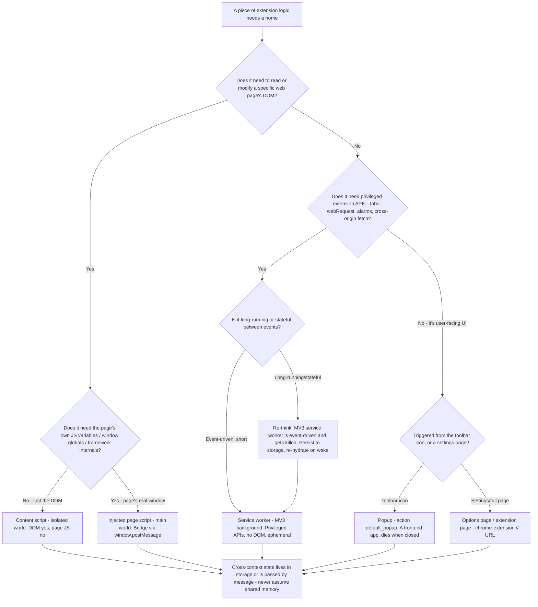
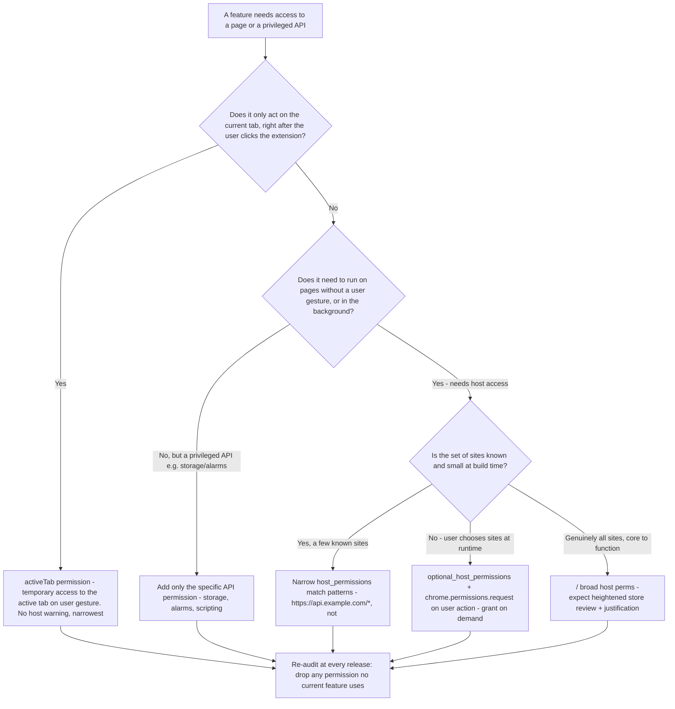

# Browser-Extension Engineering — Decision Trees & MV3 Map

_Where extension logic lives, the Manifest V3 (MV3) permissions model (least-privilege), messaging between execution contexts, storage, cross-browser (Chrome/Edge/Firefox WebExtensions) portability, and the store review/publishing pipeline. Architectural priors plus version-volatile platform facts (marked `[verify-at-use]`); MV3 specifics are **especially volatile** — re-check against the vendor before quoting. Last reviewed: 2026-06-22._

Traverse the relevant Mermaid tree top-to-bottom **before** committing — a browser extension is a multi-context distributed system in miniature, and the cost of putting logic in the wrong context (or asking for a broad permission) is paid in store-review rejections and security surface, not just refactors.

> **Why this lives in `frontend-engineering`:** an extension's popup/options/UI is a frontend app (React/state/bundle/a11y all apply — seam to the existing agents below). What's *distinctive* is the MV3 execution model and permission/store discipline, which a normal SPA never sees. This doc carries that distinctive part; the UI itself routes to the existing specialists.

## Decision Tree: Where should this logic live?

An extension has up to four distinct execution contexts, each with different DOM access, lifetime, and privilege. Putting code in the wrong one is the most common MV3 mistake. The durable rule: **least-privileged context that can do the job, and keep the privileged background ephemeral.**



**How to read it:**

- **Content script (isolated world)** runs in the page but in an **isolated JavaScript world** — it sees and mutates the page's **DOM**, but **not** the page's own JS variables, functions, or framework internals (and the page can't see the content script's). This isolation is a feature: it keeps your script from colliding with the page's globals. Declare via `content_scripts` in the manifest, or inject on demand with `chrome.scripting.executeScript` (preferred for least-privilege — see the permissions tree). No access to most privileged `chrome.*` APIs beyond messaging and a small allow-listed subset `[verify-at-use]`.
- **Injected page script (main world)** is the escape hatch for when you genuinely need the page's *real* `window` — its variables, a framework's internals, a global the page set. You inject a `<script>` into the page's **main world** (via `chrome.scripting.executeScript` with `world: "MAIN"` `[verify-at-use]`, or by appending a script element from the content script). It has **no** extension privileges and **no** isolation — treat it as untrusted, and bridge it to your content script via `window.postMessage` with strict origin + shape checks. Use only when the isolated content script cannot do the job; it is the highest-collision, lowest-trust context.
- **Service worker (MV3 background)** replaced MV2's persistent background page. It holds the privileged logic (`tabs`, `alarms`, `webRequest`/`declarativeNetRequest`, cross-origin `fetch`), has **no DOM**, and is **event-driven and ephemeral** — the browser **terminates it when idle** (historically on the order of ~30s of inactivity `[verify-at-use]`) and restarts it on the next event. So: **no in-memory state you can't lose**, register all event listeners at the top level (synchronously, on every load — not inside an async callback, or the wake-up event is missed), and persist anything durable to `chrome.storage`. (See `keep-the-mv3-service-worker-stateless-and-ephemeral.md`.)
- **Popup** (the toolbar `action` `default_popup`) and **options/extension pages** are ordinary web pages served from `chrome-extension://` — this is where your **React/Svelte/Vue UI lives, and the existing frontend agents own it** (component craft, state, bundle, a11y). The popup's document is **destroyed every time it closes**, so it holds no durable state either — read from storage on open, write on change.

> **Seam:** the popup/options **UI** is a frontend app → [`react-implementation-engineer`](../agents/react-implementation-engineer.md) (components, a11y, forms), [`frontend-state-and-data-engineer`](../agents/frontend-state-and-data-engineer.md) (state/cache — note `chrome.storage` is the persistence layer, not a global store), and [`frontend-performance-engineer`](../agents/frontend-performance-engineer.md) (a popup must open *fast*; bundle discipline matters more, not less, in a popup). This doc owns only the MV3-distinctive layer.

_Name the trade: the isolated content script is collision-safe but can't touch page JS; the main-world injected script can touch everything and is collision-prone and untrusted; the service worker is privileged but ephemeral; the popup is a real UI but transient. Pick the **least-privileged context that works**, and never assume two contexts share memory._

## Decision Tree: MV3 permissions — least-privilege progression

Store reviewers reject (and users distrust) over-broad permissions. The model has **three escalating tiers** plus the special `activeTab` grant. The durable rule: **start at the narrowest tier that works and only escalate when a concrete feature forces it** — and justify every escalation in the store listing.



**How to read it (narrowest → broadest):**

1. **`activeTab`** — the narrowest host access. Grants **temporary** access to the **currently active tab** only, and only **after a user gesture** invokes the extension (clicking the toolbar icon, a context-menu item, a command). It shows **no install-time host-permission warning**, which is why it's the preferred default for "do something to the page the user is looking at, when they ask." If your feature is user-initiated and acts on the current tab, you almost certainly want `activeTab`, not host permissions.
2. **Specific API permissions** — for privileged `chrome.*` APIs that aren't host access (`storage`, `alarms`, `scripting`, `contextMenus`, `notifications`). Request the **exact** ones you use, nothing speculative.
3. **Narrow `host_permissions` match patterns** — when you must run **without** a per-use gesture (background sync, content script on specific sites). List **specific** patterns (`https://api.example.com/*`), never `<all_urls>` unless genuinely unavoidable. Each host pattern is a permission the user sees and a reviewer scrutinizes.
4. **`optional_permissions` / `optional_host_permissions`** — declare broad-ish access as *optional* and request it **at runtime** with `chrome.permissions.request()` on a user action, so the install-time footprint stays minimal and users grant access in context. This is the right pattern for "works on whatever site the user adds."
5. **`<all_urls>` / broad host permissions** — only when running on arbitrary sites **is** the core function (an ad blocker, a universal reader-mode). Expect **heightened, slower store review** and a required justification; many extensions that reach for this don't actually need it.

> **Re-audit every release:** permissions accrete and rarely get removed. At each version bump, drop any permission no current feature uses — unused permissions are pure risk and a review-flag. (See `request-the-narrowest-extension-permissions.md`.)

_Name the trade: broader permissions buy fewer runtime permission prompts and simpler code, and pay in user distrust, slower/stricter store review, and a larger attack surface if the extension is ever compromised. `activeTab` + optional-on-demand is more code (request flows, handling denial) and buys trust + faster review._

## Manifest V3 essentials

- **`manifest_version: 3`** is the current standard; **MV2 is deprecated/sunset** across Chromium and Firefox is on its own WebExtensions MV3 track `[verify-at-use]`. New extensions target MV3.
- **Background = service worker**, declared as `background.service_worker` (`background.scripts` in Firefox's MV3 flavor `[verify-at-use]`) — event-driven, no persistent page, no DOM. Register listeners at top level.
- **`action`** (unified MV2 `browser_action`/`page_action`) — the toolbar button, with `default_popup`, `default_icon`, `default_title`.
- **Network interception** moved from blocking `webRequest` to **`declarativeNetRequest`** (declarative rules the browser applies, for privacy + performance) — blocking `webRequest` is restricted in MV3 `[verify-at-use]`.
- **Remotely-hosted code is disallowed** — all executable JS must ship in the package; you can fetch *data*, not *code* (`eval`/remote `<script>` for logic is a rejection). This is a core MV3 security change.
- **`content_security_policy`** is tightened (object src restrictions, no remote script). **`web_accessible_resources`** must explicitly list any extension file a page is allowed to load, scoped by `matches`.
- **`scripting` API** (`chrome.scripting.executeScript` / `insertCSS`) replaces MV2's `tabs.executeScript` for programmatic injection — pairs with `activeTab`/host perms for least-privilege on-demand injection.

## Messaging between contexts

| From → To | Mechanism `[verify-at-use]` |
|---|---|
| Content script ↔ service worker | `chrome.runtime.sendMessage` / `onMessage` (one-shot) or `chrome.runtime.connect` (long-lived `Port`) |
| Service worker → a specific tab's content script | `chrome.tabs.sendMessage(tabId, …)` |
| Popup / options ↔ service worker | `chrome.runtime.sendMessage` (same APIs; popup is just an extension page) |
| Content script (isolated) ↔ injected page script (main world) | `window.postMessage` + `message` listener — **the only bridge across worlds**; validate `event.origin`, `event.source`, and message shape |
| Any context → shared durable state | `chrome.storage` + `chrome.storage.onChanged` (the closest thing to a shared store) |

- **Message handlers are async-fragile under MV3:** if you return a Promise / use `sendResponse` asynchronously, return `true` from the listener to keep the channel open `[verify-at-use]`, and remember the **service worker may be asleep** when a message arrives (it wakes for the event — don't rely on prior in-memory state).
- **Treat every cross-context message as untrusted input**, especially anything that crossed `window.postMessage` from the page's main world. Check origin and validate the shape before acting (see `isolate-content-scripts-from-the-page.md`).

## Storage

- **`chrome.storage.local`** — per-device, larger quota; the default for most extension state.
- **`chrome.storage.sync`** — synced across the user's signed-in browsers, **small quota** (per-item + total byte limits `[verify-at-use]`) — for user preferences, not bulk data.
- **`chrome.storage.session`** — in-memory, cleared on browser restart; useful for ephemeral state the service worker needs to survive its own restart **within** a session.
- All are **async** and **shared across contexts** with a `onChanged` event — this is how the ephemeral service worker, the transient popup, and the content script stay coherent. Don't use `localStorage` in the service worker (no DOM; not available) and avoid it in content scripts (it's the *page's* storage, not yours).

## Cross-browser (Chrome / Edge / Firefox WebExtensions)

- **Edge is Chromium** — Chrome MV3 extensions run on Edge with little to no change; Edge has its own Partner Center store.
- **Firefox** implements the **WebExtensions** standard and supports MV3, but with **differences** `[verify-at-use]`: it uses the **`browser.*`** namespace returning **Promises** (Chrome's `chrome.*` is callback-first, though Promise support has expanded), background can be `background.scripts`/event pages rather than a strict service worker, and some APIs (`declarativeNetRequest` scope, host-permission handling) differ. Firefox also **requires** an `browser_specific_settings.gecko.id` and reviews/signs every extension.
- **Portability tactics:** code against the **`browser.*`** Promise API and use the **`webextension-polyfill`** to run the same code on Chrome `[verify-at-use]`; keep browser-specific manifest keys behind a build step; feature-detect APIs rather than assuming parity. Don't assume a Chrome-only API (or a specific service-worker lifetime) exists identically on Firefox.

## Store review & publishing pipeline

```text
build (no remote code) → self-review permissions → package (zip) →
  submit to store(s) → automated + human review → fix rejections → publish → staged rollout → monitor
```

- **Chrome Web Store** — developer account (one-time fee), upload the zip, declare a **privacy policy** and **data-use disclosures**, justify **each permission** and any broad host access. **Broad permissions + remote-code patterns drive longer/stricter review and rejections.**
- **Edge Add-ons** — Microsoft Partner Center; largely the same Chromium package; separate listing + review.
- **Firefox AMO (addons.mozilla.org)** — **every** version is reviewed and **signed**; unsigned extensions won't install in release Firefox. Source-code submission may be required if you ship minified/bundled code so reviewers can reproduce the build.
- **Pre-submit checklist (also in [`skills/build-browser-extension/SKILL.md`](../skills/build-browser-extension/SKILL.md)):** minimal permissions (re-audited), no remote code, accurate privacy policy + data disclosures, icons/screenshots/listing copy, version bumped, tested on each target browser, `declarativeNetRequest` rules (if any) validated, content-script match patterns as narrow as the feature allows.
- **After publish:** use **staged/percentage rollout** where the store supports it, and monitor reviews + error telemetry — a service-worker lifetime bug or a permission prompt regression shows up in user reports first.

## Capability map (dated — verify at use)

| Capability | 2026 state `[verify-at-use]` | Notes |
|---|---|---|
| Manifest V3 | current standard; MV2 deprecated/sunset on Chromium | Target MV3 for new work |
| MV3 background = service worker | event-driven, terminated when idle (~30s historical) | No persistent state; top-level listeners |
| Blocking `webRequest` | restricted in MV3 → `declarativeNetRequest` | Declarative rules for network mods |
| Remotely-hosted code | disallowed in MV3 | Ship all JS in the package; fetch data not code |
| `activeTab` | narrowest host access, no install warning | Preferred for user-initiated, current-tab actions |
| `optional_host_permissions` + runtime request | supported | Grant broad access on demand, keep install minimal |
| Firefox MV3 | supported, with `browser.*`/Promise + manifest differences | Use `webextension-polyfill`; feature-detect |
| `chrome.storage.sync` quota | small per-item + total byte caps | Preferences only, not bulk data |
| Store review on broad permissions | heightened/slower; justification required | Least-privilege shortens review |

> **Verify-at-use note (load-bearing):** MV3 platform specifics — service-worker idle/termination timing, exact `declarativeNetRequest` limits, `storage.sync` quotas, per-API Chrome/Firefox parity, and store-review policy — **change frequently and differ by browser**. Every row above and every `[verify-at-use]` marker means: confirm against the current [Chrome Extensions docs](https://developer.chrome.com/docs/extensions) / [MDN WebExtensions](https://developer.mozilla.org/en-US/docs/Mozilla/Add-ons/WebExtensions) / [Firefox MV3 migration](https://extensionworkshop.com/documentation/develop/manifest-v3-migration-guide/) before quoting it in a durable doc or gating an action on it.
