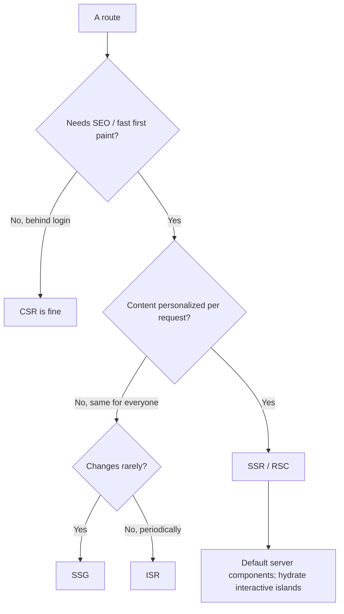
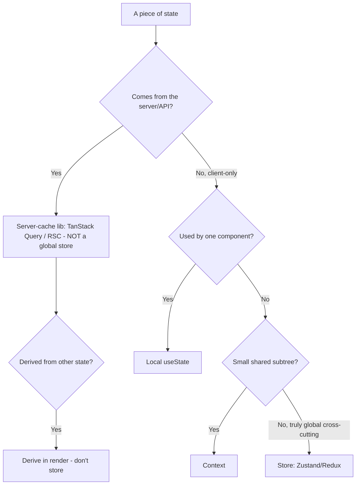

# Frontend Engineering — Decision Trees

_Decision trees + a dated capability map. Capability rows are `[verify-at-build]` — re-check against the vendor before quoting. Last reviewed: 2026-06-04._

Traverse before choosing a rendering mode or a place for state.

## Decision Tree: Rendering strategy per route

Match each route to its real need; don't force one global mode.

_One global rendering mode is a mismatch on some route._

## Decision Tree: Where should this state live?

Server data is a cache; client state goes at the narrowest workable scope.

## Capability map (dated — verify at build)

| Capability | 2026 state `[verify-at-build]` | Notes |
|---|---|---|
| React Server Components | GA in Next App Router | Default server, hydrate islands |
| TanStack Query / SWR | mature | Server-cache, not client state |
| INP (Core Web Vital) | replaced FID (2024) | Main-thread responsiveness |
| Code-splitting / dynamic import | standard | Per-route + heavy components |
| TypeScript strict | standard | Type the boundaries; no `any` |
| Vite / Next build | mature | Lean builds; analyze the bundle |
