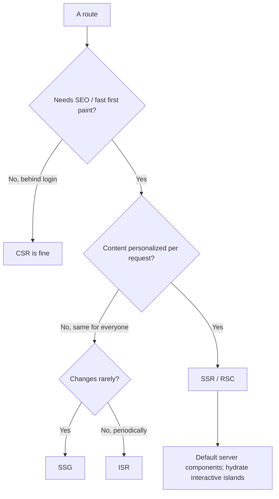
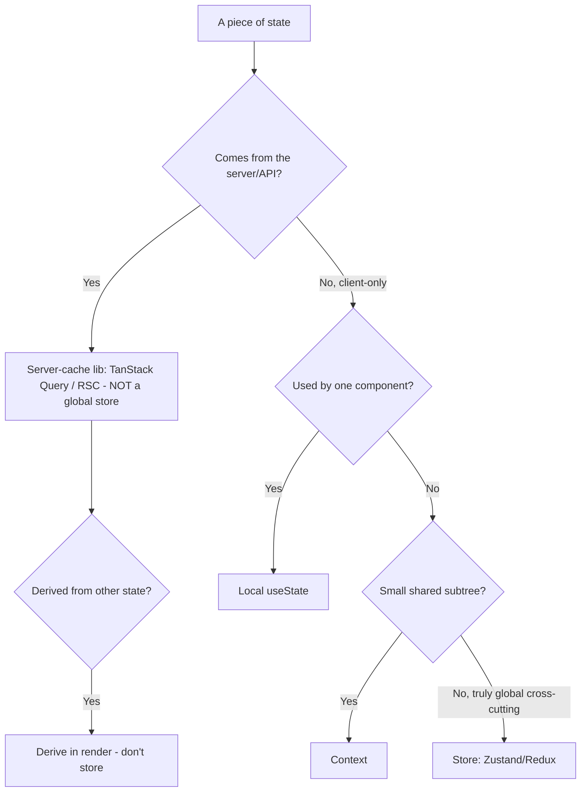
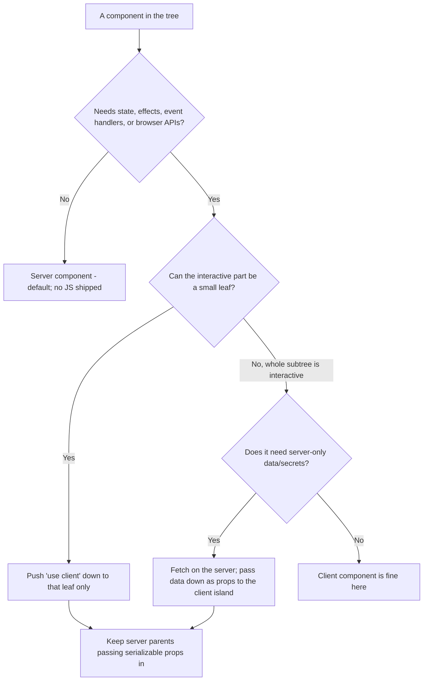
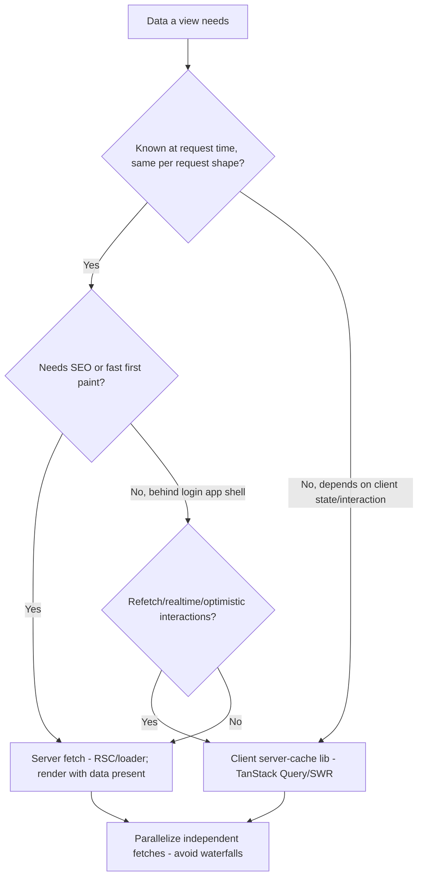
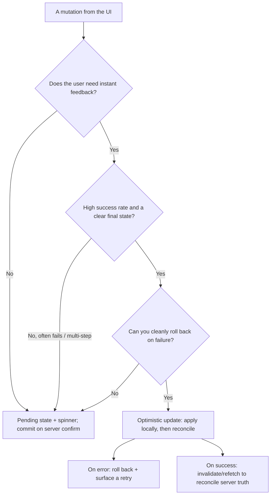
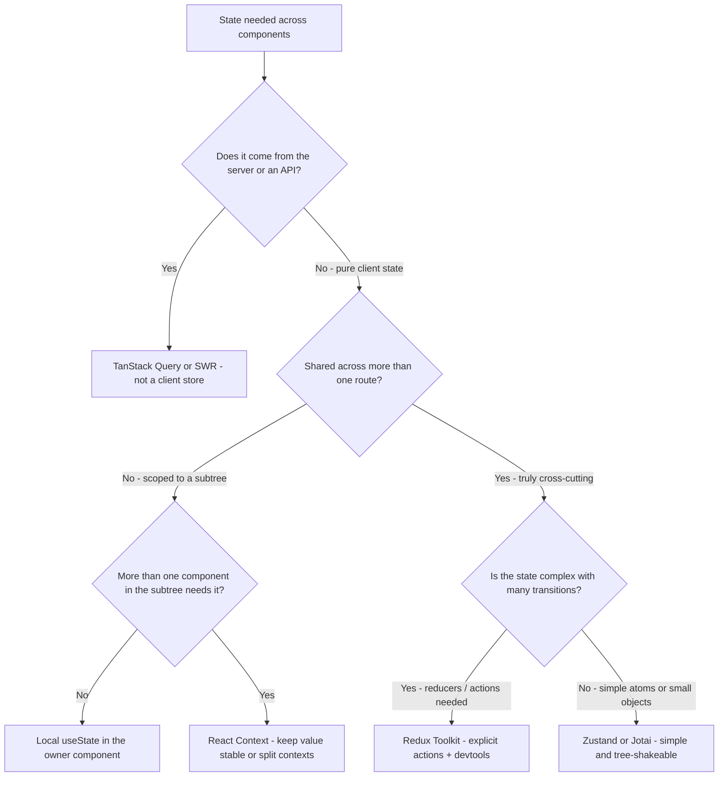
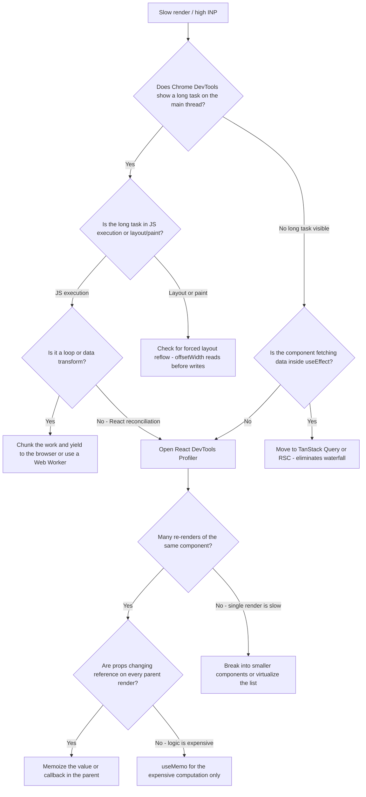
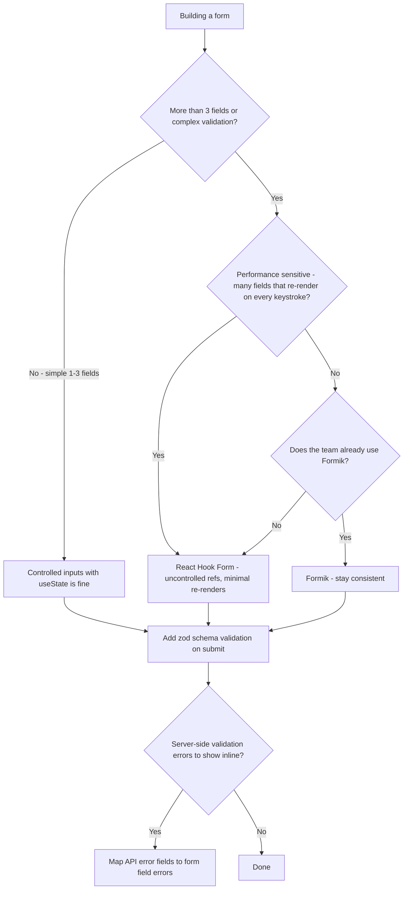

# Frontend Engineering — Decision Trees

_Decision trees + a dated capability map. Capability rows are `[verify-at-build]` — re-check against the vendor before quoting. Last reviewed: 2026-06-04._

> **Update 2026-06-25 — React 19.2 baseline + React Compiler 1.0.** **React 19.2** (released 2025-10-01) is the current baseline; the patch line is ~19.2.4 (Jan 2026). The **React Compiler reached 1.0 (Oct 2025) and is production-ready** — it is a build-time tool that performs **automatic memoization**, optimizing components and hooks without rewrites and removing the need for most manual `useMemo` / `useCallback` / `React.memo`. **Where the trees below say "memoize the value or callback" or "`useMemo` for the expensive computation," treat that as: if the React Compiler is enabled, it has already handled this — reach for manual memoization only when the compiler is off or the Profiler proves a specific gap.** Source: [React 19.2](https://react.dev/blog/2025/10/01/react-19-2) and [React Compiler v1.0](https://react.dev/blog/2025/10/07/react-compiler-1) (retrieved 2026-06-25).

Traverse before choosing a rendering mode or a place for state.

## Decision Tree: Rendering strategy per route

Match each route to its real need; don't force one global mode.

_One global rendering mode is a mismatch on some route._

## Decision Tree: Where should this state live?

Server data is a cache; client state goes at the narrowest workable scope.

## Decision Tree: Server component or client component?

Default to a server component; reach for `"use client"` only where the browser is genuinely needed.

_Marking a high node `"use client"` forces its whole subtree to the client and ships their JS — keep the boundary as low and as small as the interactivity actually requires._

## Decision Tree: Client-side or server-side data fetching?

Fetch on the server by default; fetch on the client only when the data depends on the client.

_Effect-based fetching deep in a leaf is the waterfall trap: the child can't start until the parent renders. Hoist and parallelize, or fetch on the server._

## Decision Tree: Optimistic update or wait for the server?

Show instant feedback when the write almost always succeeds and a rollback is cheap.

_Optimistic UI is a bet that the write succeeds; only take it when the rollback is clean and the failure rate low, or you'll flicker the user's data on every error._

## Capability map (dated — verify at build)

| Capability | 2026 state `[verify-at-build]` | Notes |
|---|---|---|
| React (baseline version) | 19.2 (released 2025-10-01); patch line ~19.2.4 (Jan 2026) | Current baseline; Activity, Performance Tracks, `useEffectEvent`, partial pre-rendering |
| React Compiler | 1.0, production-ready (Oct 2025) | Build-time **automatic memoization** — removes most manual `useMemo`/`useCallback`/`memo`; enable via Vite/Next/Expo |
| React Server Components | GA in Next App Router | Default server, hydrate islands |
| TanStack Query / SWR | mature | Server-cache, not client state |
| INP (Core Web Vital) | replaced FID (2024) | Main-thread responsiveness |
| Code-splitting / dynamic import | standard | Per-route + heavy components |
| TypeScript strict | standard | Type the boundaries; no `any` |
| Vite / Next build | mature | Lean builds; analyze the bundle |

## Decision Tree: Which global state library, if any?

**When this applies:** You have a piece of client state that is used across multiple routes or components that do not share a natural ancestor, and you are deciding whether to introduce a state management library and which one.

**Last verified:** 2026-06-05 against React documentation, Zustand, Redux Toolkit, and Jotai docs.

**Rationale per leaf:**
- *TanStack Query / SWR* — server data is a cache with a TTL and invalidation story, not client state; shoving it into Redux is the #1 React state bug.
- *Local useState* — the right default; always the smallest blast radius.
- *Context* — good for stable cross-subtree values (theme, user, locale); poor for frequently-updating state (every consumer re-renders).
- *Redux Toolkit* — warranted when state has complex transitions, needs time-travel debugging, or is shared across a large team with many contributors.
- *Zustand / Jotai* — simple external store for cross-route client state without Redux's boilerplate.

**Tradeoffs summary:**

| Method | Cost / time | Blast radius | Approval gate? | Use when |
|---|---|---|---|---|
| Local useState | Minimal | Single component | None | One component owns it |
| Context | Low | All consumers re-render | None | Stable cross-subtree values |
| Zustand / Jotai | Low-medium | Explicit subscribers | None | Cross-route simple client state |
| Redux Toolkit | High | Explicit selectors | Team agreement | Complex transitions / large team |

## Decision Tree: Fix a slow render — where is the bottleneck?

**When this applies:** A component or interaction feels slow, or the React DevTools Profiler shows an unexpectedly expensive render. You need to determine whether the cost is in rendering, data, or the main thread.

**Last verified:** 2026-06-05 against React DevTools Profiler documentation and Core Web Vitals tooling.

**Rationale per leaf:**
- *Chunk / Web Worker* — JS long tasks block input handling; yielding or offloading is the correct fix.
- *React Profiler* — the browser timeline is too coarse for React rendering; the Profiler shows component-level render time.
- *TanStack Query / RSC* — useEffect-based data fetching creates cascading waterfalls that look like slow renders.
- *Memoize* — only when profiling confirms the reference instability is the cause, not by default. **With the React Compiler 1.0 (production-ready, Oct 2025) enabled, this memoization is automatic** — the compiler memoizes values and callbacks at build time, so reach for manual `useMemo`/`useCallback`/`memo` only when the compiler is off or the Profiler proves it missed a specific case.
- *Virtualize* — rendering 500 list items is the fix, not memoization.

**Tradeoffs summary:**

| Method | Cost / time | Blast radius | Approval gate? | Use when |
|---|---|---|---|---|
| Chunk / yield | Low | Async behavior change | None | JS long task in user interaction |
| Move to server cache | Low | Data-flow change | None | useEffect fetch waterfall |
| Memoize | Low-medium | Stale closure risk | None | Proven reference instability |
| Virtualize | Medium | Scrolling behavior change | None | Long lists - 100+ items |

## Decision Tree: Choose a form library or roll your own?

**When this applies:** You are building a form and deciding whether to use a form library (React Hook Form, Formik) or manage state manually.

**Last verified:** 2026-06-05 against React Hook Form and Formik documentation.

**Rationale per leaf:**
- *Manual useState* — correct for small simple forms; adds complexity only when you don't need it.
- *React Hook Form* — registers uncontrolled inputs, minimizes re-renders, pairs well with zod for validation; the default for medium-to-large forms.
- *Formik* — controlled model, more magic, larger bundle; warranted only when the team already uses it.
- *Zod validation* — always use a schema library for validation, even on simple forms; do not write ad-hoc `if (!email.includes('@'))` logic.

**Tradeoffs summary:**

| Method | Cost / time | Blast radius | Approval gate? | Use when |
|---|---|---|---|---|
| Manual useState | Minimal | Single component | None | 1-3 fields, no complex validation |
| React Hook Form | Low | Low re-render count | None | Default for medium-large forms |
| Formik | Low | Controlled model | Team agreement | Existing Formik codebase |
