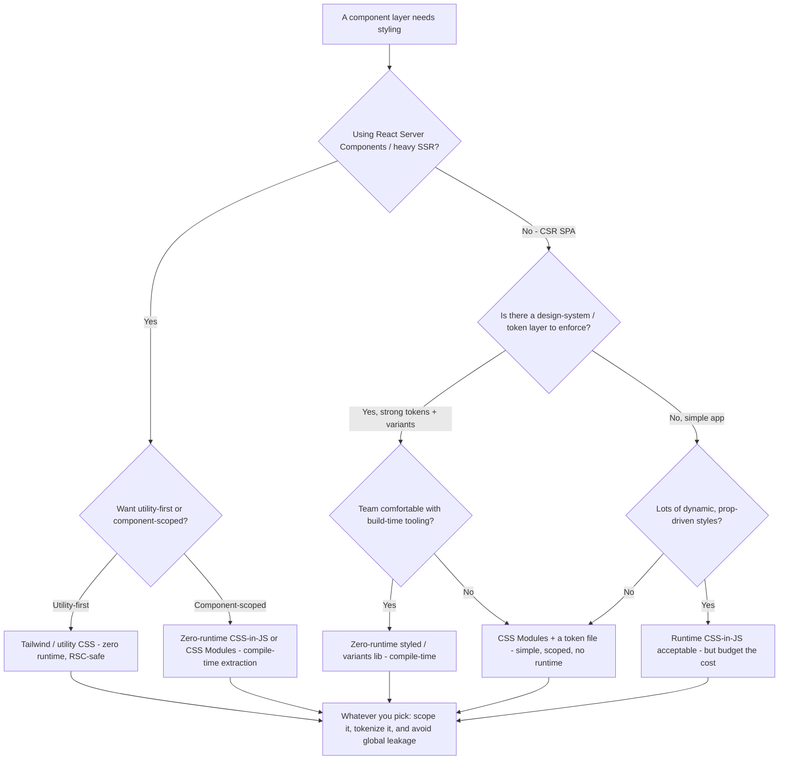
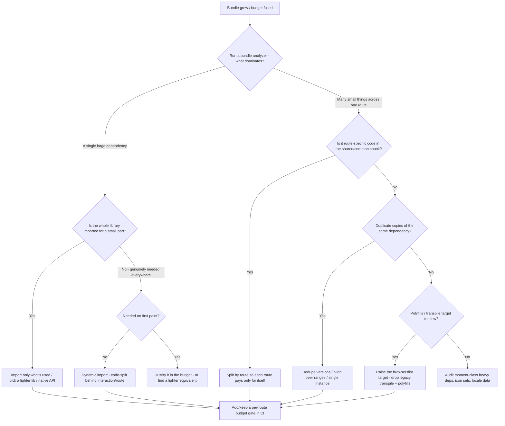

# Styling-Approach & Bundle-Size Decision Trees

_Two decision trees for choices the existing [`frontend-engineering-decision-trees.md`](frontend-engineering-decision-trees.md) does not cover: **which styling approach** to adopt for a component layer, and **how to triage a bundle-size regression**. Architectural priors plus some version-volatile capability facts (marked `[verify-at-use]`); re-check specifics against the vendor before quoting. Last reviewed: 2026-06-05._

Traverse the relevant graph top-to-bottom **before** committing — don't pattern-match on the loudest recent blog post.

## Decision Tree: Which styling approach?

There is no single "best" CSS approach — the right one depends on your rendering model (RSC vs. CSR), your design-system posture, and your runtime-cost tolerance. The one durable rule: **prefer zero-runtime / compile-time styling for server-rendered and performance-sensitive surfaces**, because a runtime CSS-in-JS engine that executes during render adds main-thread cost and can fight React Server Components.

**How to read it:**

- **RSC changes the math.** A runtime CSS-in-JS library that styles *during render* generally needs to run on the client and has had a rocky relationship with Server Components; the ecosystem has moved toward **zero-runtime / compile-time** extraction (utility CSS, CSS Modules, or build-time styled APIs) for server-rendered apps. `[verify-at-use]` — specific library RSC-compatibility status changes release to release; check the library's current docs before committing on an RSC project.
- **Zero-runtime is the lower-regret default for performance-sensitive UI.** Styles resolved at build time ship as plain CSS — no style-computation cost on the main thread during interaction (helps INP), no extra JS for the styling engine (helps the bundle budget). Runtime CSS-in-JS buys ergonomic prop-driven styles and pays in render-time work and bundle weight; take that trade only where the dynamism is real and measured.
- **CSS Modules are the boring, safe choice** — scoped class names, no runtime, works everywhere, pairs with a token file for a design system. "Boring" is a feature when the alternative is a runtime cost you didn't budget.
- **Utility-first (Tailwind-class) wins on consistency + zero runtime** at the cost of markup verbosity; it's RSC-safe because it's just classes resolving to a static stylesheet.
- **Whatever you pick: scope it and tokenize it.** Global stylesheet leakage and one-off magic numbers are the long-term cost, independent of the engine. The seam to **brand, the design system, and visual/UX decisions is `web-design`** — this tree is about the *implementation mechanism*, not the visual language.

> **Seam:** the **visual design, brand, and the design-token *values*** are `web-design`'s lane; this team picks the *styling mechanism* and implements it. We consume the tokens they define.

_Name the trade: zero-runtime/compile-time styling buys main-thread + bundle savings (and RSC-safety) and pays in build-tooling setup and less runtime dynamism; runtime CSS-in-JS buys prop-driven dynamism and ergonomics and pays in render cost + bundle weight + RSC friction._

## Decision Tree: A bundle-size regression — where did the weight come from?

A route or app got heavier and a CI bundle budget (or a user report) flagged it. Find the *cause* before reaching for a fix — the fix differs by cause, and the wrong fix (e.g. lazy-loading the wrong thing) can hurt other metrics.

**How to read it:**

- **Always start with an analyzer, never a guess.** A bundle analyzer (source-map-explorer, the bundler's analyze mode, or a CI bundle-stats report) tells you *what* dominates; optimizing without it is shooting in the dark.
- **The most common single offender is a heavy library imported wholesale for a sliver of its API** (date libs, lodash-style toolkits, icon sets, full locale data). The fix order: import only the used members → swap for a lighter/tree-shakeable equivalent → use a native platform API (`Intl`, `structuredClone`, `Array` methods) where it now exists `[verify-at-use]`.
- **Route-specific code leaking into the shared chunk** makes every route pay for one route's dependency. Split by route so the home page doesn't ship the admin editor's code.
- **Duplicate dependency copies** (two versions of the same lib pulled by mismatched peer ranges) silently double weight — dedupe and align ranges.
- **A too-low transpile target** ships polyfills and down-leveled syntax no current browser needs. Raising the `browserslist`/build target to your actual supported browsers drops dead weight `[verify-at-use]` — confirm against your real support matrix first.
- **Lazy-load is for what's *not* needed on first paint** — behind a route or an interaction. Never lazy-load the LCP element or first-paint-critical code; that trades bundle size for a worse LCP.
- **Close the loop with a CI budget gate** so the regression can't silently return (the recurring lesson from the perf-budget scenario).

> **Seam:** Core Web Vitals *tuning* on marketing/brand surfaces overlaps `web-design`'s CWV work; the in-code bundle/code-split engineering is this team's. The runnable budget helper is [`../scripts/perf_budget.py`](../scripts/perf_budget.py).

_Name the trade: every byte you ship is first-load latency and INP risk; code-splitting buys a smaller first load and pays in a request waterfall if over-split or mis-split (lazy-loading first-paint code). Split by need, measured against a budget — not reflexively._

## Capability map (dated — verify at use)

| Capability | 2026 state `[verify-at-use]` | Notes |
|---|---|---|
| Zero-runtime CSS-in-JS / compile-time extraction | mainstream for RSC | Lower main-thread + bundle cost than runtime engines |
| Runtime CSS-in-JS + React Server Components | friction; check per-library | Many runtime engines need client components |
| Tailwind / utility-first | mature, RSC-safe | Static stylesheet, zero runtime |
| CSS Modules | universal, zero runtime | The boring, safe default |
| Bundle analyzers (source-map-explorer, bundler analyze) | standard | Always diagnose before optimizing |
| Native platform APIs replacing libs (`Intl`, `structuredClone`) | expanding | Re-check availability vs. your support matrix |
