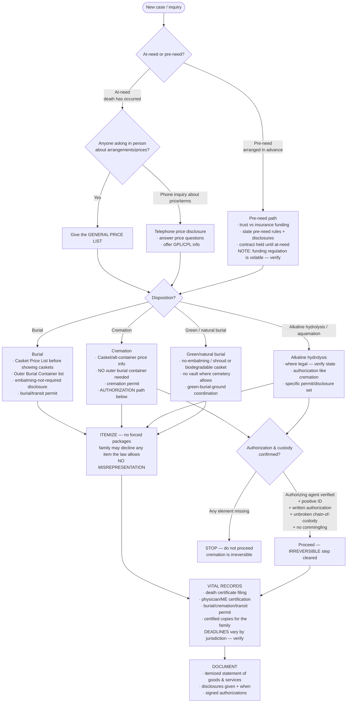

# Knowledge — Deathcare compliance decision tree

> **Last reviewed:** 2026-07-09 · **Confidence:** Medium-High on the durable structure (the FTC Funeral Rule's itemization + disclosure logic, the at-need/pre-need split, the disposition-specific requirement sets, cremation authorization & chain-of-custody); **Low-Medium on jurisdiction-specific specifics — the Funeral Rule is periodically revised and state/country law varies widely, so every permit, deadline, licensing, and price-list line is volatile and carries a retrieval date.**
>
> **Not legal advice.** This tree gets the *structure* right — which disclosures and authorizations a path triggers. The *letter* (your state's permit forms, filing deadlines, authorizing-agent priority, and the current text of the FTC Funeral Rule as revised) must be confirmed with counsel and your state licensing board before you rely on it. _(FTC Funeral Rule structure retrieved 2026-07-09 — re-verify against the current Rule; the FTC has reviewed/updated it and further revisions are possible.)_

The most consequential deathcare question is **"which disclosures, authorizations, and permits does *this* case trigger?"** — and it depends on at-need vs pre-need, the disposition, and the jurisdiction. This is the decision tree the `funeral-arrangement-and-compliance-specialist` traverses **before** any pricing, disposition, or authorization step, plus the disclosure-trigger table and the seams to adjacent functions.

The agents' discipline: **name the disposition and the at-need/pre-need context first, then the disclosures and authorizations fall out of it — never pattern-match a form to the request.**

---

## Decision Tree: which disclosures, authorizations & permits fire

Traverse top-to-bottom. Gate on **at-need vs pre-need** first, then **disposition**, then the **price-list & disclosure** requirements, then **authorization & permits**.

---

## Disclosure-trigger table (FTC Funeral Rule — structure, verify current text)

| Trigger | Required disclosure / document | Notes |
|---|---|---|
| Someone asks **in person** about arrangements or prices | **General Price List (GPL)** — given to keep | The itemized list of individual goods & services + required disclosures; offered at the start of an in-person arrangement discussion |
| Before showing **caskets** | **Casket Price List (CPL)** | Prices for the caskets you offer, shown before the family views them |
| Before showing **outer burial containers / vaults** | **Outer Burial Container Price List** | Cremation generally needs none — say so rather than implying it's required |
| A **telephone** inquiry about price or terms | **Telephone price disclosure** | Answer price/terms questions and tell callers a GPL/CPL exists |
| Any arrangement | **Embalming-not-required disclosure** | Embalming is rarely legally required; may not represent it as mandatory — offer refrigeration / a closed timeline as the alternative |
| Any arrangement | **Itemization + no forced packages** | A family may buy only what it wants; no item the law lets them decline may be a condition of buying another |
| Any arrangement | **No misrepresentation** | On legal requirements, preservative value of embalming/caskets, cash-advance items, etc. |
| Any arrangement | **Itemized statement of goods & services selected** | Given after selections; the compliance record |

> **Volatile:** the exact price-list contents, the disclosure wording, and whether the Rule has been revised (e.g., online/electronic price-disclosure requirements) change. Treat this table as a 2026-07 structural snapshot and **re-verify against the current FTC Funeral Rule and your state law before relying on it.**

---

## Cremation authorization & chain-of-custody (the irreversible-step gate)

Cremation (and alkaline hydrolysis) cannot be undone — the authorization gate is the plugin's single hardest stop. Confirm **all** of these before proceeding:

1. **Authorizing agent** — the person with statutory priority to authorize (spouse → adult children → parents → …; the order and any documented decedent directive are **state-specific — verify**).
2. **Positive identification** — the decedent is confirmed identified per the process (viewing / wristband / documented ID), never assumed.
3. **Written authorization** — signed, informed, itemizing what will and won't be returned (implants, valuables policy).
4. **Chain-of-custody / tracking** — an unbroken, documented custody record from removal through the retort and return of cremated remains.
5. **No commingling** — one decedent per cremation cycle unless a documented, authorized exception; container/tracking discipline throughout.

If **any** element is missing → **STOP**. An irreversible step never proceeds on an incomplete authorization.

---

## Vital records & permits (all dispositions)

- **Death certificate** — the informant/decedent data the funeral home collects, plus the **physician or medical-examiner certification** of cause; filed with the local/state registrar within the jurisdiction's deadline.
- **Disposition permit** — a **burial, cremation, or transit permit** (naming varies) authorizing the specific disposition; often gated on the filed death certificate.
- **Transit / removal** — additional permits for out-of-state or international transport of remains.
- **Certified copies** — the family needs multiple certified copies for estate, benefits, insurance, and account closures.

> **Deadlines, forms, and the certifier of record are jurisdiction-specific and volatile** — confirm with the state registrar / vital-records office and counsel. _(Retrieved 2026-07-09 — re-verify.)_

---

## Pre-need considerations (structure only — funding regulation is volatile)

- **Funding vehicle:** a **pre-need trust** (funds held in trust, regulated for how much must be trusted and how it's invested) vs **pre-need insurance** (a policy assigned to the funeral home). The split, the trusting percentage, and the disclosures are **state-regulated and volatile — verify.**
- **The promise is a future at-need liability** — price guarantees, what's guaranteed vs "growth-funded," and portability if the family moves must be disclosed honestly. Over-promising pre-need is the classic future insolvency trap (§3 #8 in CLAUDE.md).
- Pre-need still triggers the **at-need Funeral Rule disclosures** when the death occurs and the arrangement is finalized.

---

## Seams (deathcare operations is not everything adjacent to death)

- **Cemetery grounds / interment / grave opening & closing / plot operations** → **out of scope** (adjacent deathcare vertical). The funeral home *coordinates with* the cemetery — schedules the graveside, confirms the vault/outer-container requirement the *cemetery* sets — but does not run the grounds.
- **Clinical grief / bereavement therapy** → `behavioral-health-practice` (this team refers via aftercare; it does not treat).
- **The books / payroll / tax / the accounting behind the itemized statement** → `accounting-bookkeeping`.
- **Business / staffing / capacity / pre-need economics / margins** → `funeral-operations-lead` (this plugin) — the compliance specialist owns the arrangement & the law, not the ledger.

---

## Provenance

- FTC Funeral Rule structure (GPL, CPL, Outer Burial Container list, telephone price disclosure, itemization / no-forced-packages, embalming-not-required, no-misrepresentation, itemized statement) — consensus framing of the Rule reviewed 2026-07-09. **The Rule is periodically revised; re-verify the current text with the FTC and counsel before relying on any specific line.**
- Cremation authorization / chain-of-custody / no-commingling and vital-records/permit sequencing — consensus deathcare-operations practice, reviewed 2026-07-09; **authorizing-agent priority, permit forms, and filing deadlines are state-specific and volatile — verify with the licensing board + registrar.**
- Pre-need trust-vs-insurance framing — structural only; **funding regulation (trusting percentage, disclosures, portability) is state-regulated and volatile — verify.**
- **This document is not legal advice.** Confirm every jurisdiction-specific and Funeral-Rule item with counsel and your state licensing board before acting.
