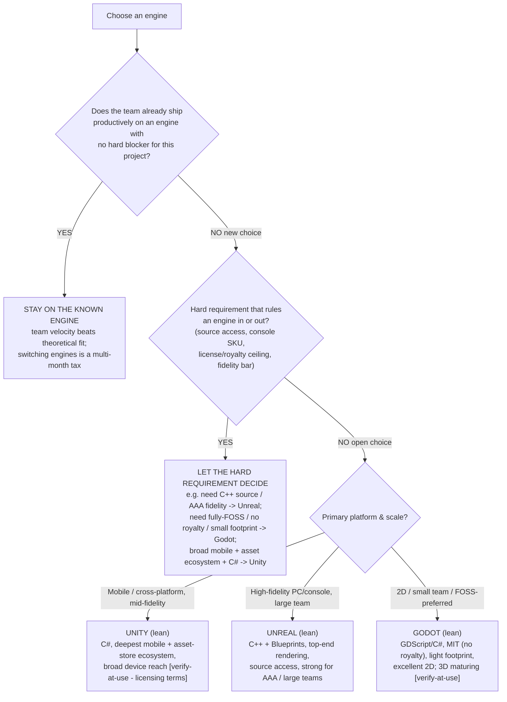
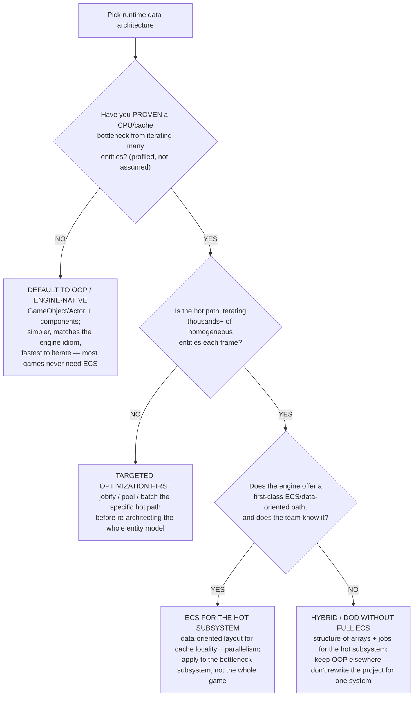
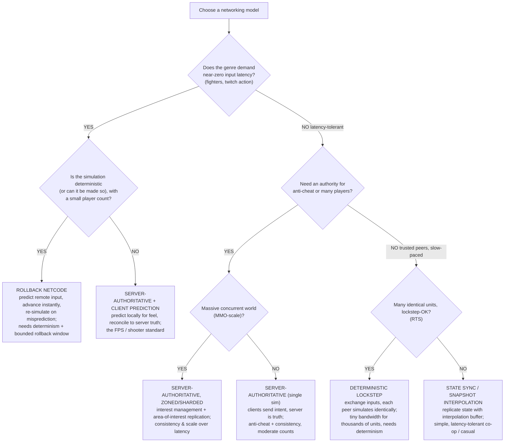

# Game architecture & networking decision trees

The up-front engineering-architecture choices that are expensive to reverse: which **engine**, which **runtime data architecture** (ECS vs OOP), and which **networking model**. Traverse the relevant tree top-to-bottom before committing code. These complement the production/design trees in [`gamedev-decision-trees.md`](gamedev-decision-trees.md) and the runtime-performance trees in [`gamedev-runtime-performance-decision-trees.md`](gamedev-runtime-performance-decision-trees.md); this file is owned primarily by [`gameplay-engineer`](../agents/gameplay-engineer.md), with the lead synthesizing when an engine choice has business/budget weight.

**Last verified:** 2026-06-05 against standard game-architecture practice. Engine market/feature specifics are version-volatile and marked `[verify-at-use]`; the structural reasoning (felt-metric → model, data-layout → architecture) is durable.

## How to read these trees

Each tree resolves a decision against the project's **observable constraints**, not against what's fashionable. The default leaf is the **lowest-blast-radius / least-coupling** option that meets the constraint — an engine the team already knows, OOP until a data-oriented bottleneck is proven, the simplest networking model the genre's felt metric tolerates. Escalate to a higher-cost leaf only when the constraint demonstrably forces it.

---

## Decision Tree: Which engine for this project

**When this applies:** a new project (or a deliberate re-platform) is choosing an engine. Observable inputs: team's existing expertise, target platforms, genre/3D-vs-2D, source-access / royalty constraints, and whether a hard technical requirement rules an engine in or out.

**Rationale per leaf:**
- *Stay on the known engine* — the dominant cost in an engine switch is the team relearning the toolchain, asset pipeline, and gotchas; a known engine with no hard blocker almost always wins on shipped-velocity. This is the first gate for a reason.
- *Let the hard requirement decide* — a genuine blocker (need C++ engine source, a specific console SKU's support, a royalty/license ceiling, a fidelity bar) is decisive and short-circuits the comparison.
- *Unity / Unreal / Godot* — the open-choice leaves are **leans, not verdicts**: Unity for mobile/cross-platform breadth and the C#/asset ecosystem; Unreal for high-fidelity PC/console and large teams with its source access; Godot for 2D / small-team / FOSS-no-royalty. **Licensing and pricing terms for all three are volatile** `[verify-at-use]` — re-confirm current royalty/seat/runtime-fee terms before putting an engine recommendation in a deliverable; do not quote pricing from memory.

**Tradeoffs summary:**

| Engine | Sweet spot | Language | License note `[verify-at-use]` |
|---|---|---|---|
| Unity | mobile / cross-platform, mid-fidelity, asset reuse | C# | seat/runtime terms volatile — verify |
| Unreal | high-fidelity PC/console, large teams | C++ + Blueprints | royalty model volatile — verify |
| Godot | 2D / small team / FOSS, light footprint | GDScript / C# | MIT, no royalty — verify still current |

> The single biggest engine-selection mistake is switching engines mid-project for a feature the current engine could deliver — re-confirm the *hard requirement* is real before paying the switch tax.

---

## Decision Tree: ECS vs OOP for the runtime data architecture

**When this applies:** deciding how to structure the game's runtime entities — classic object/component OOP (GameObjects/Actors with inheritance/composition) vs a data-oriented Entity-Component-System. Observable inputs: entity count at peak, whether a data-layout/cache bottleneck is *proven* (not assumed), team familiarity, and the engine's native idiom.

**Rationale per leaf:**
- *Default to OOP / engine-native* — most games never reach the entity counts where ECS's cache-locality and parallelism win pays for its complexity and ecosystem friction; the engine-native object model is simpler, faster to iterate, and matches the tooling. ECS is an optimization, not a starting posture.
- *Targeted optimization first* — even with a proven bottleneck, if it isn't "many homogeneous entities per frame," jobify/pool/batch the specific path before re-architecting.
- *ECS for the hot subsystem* — when you're iterating thousands of like entities every frame and the engine has a real ECS path the team knows, apply ECS **to that subsystem**, not the whole game.
- *Hybrid / DOD without full ECS* — get most of the cache/parallelism benefit with structure-of-arrays + a job system for the hot subsystem, without adopting a full ECS framework — the right call when the engine's ECS is immature or the team is new to it.

**Tradeoffs summary:**

| Choice | Win | Cost | Use when |
|---|---|---|---|
| OOP / engine-native | simplicity, iteration speed, tooling fit | poor cache locality at scale | the default — no proven scale bottleneck |
| Targeted optimization | cheap, localized | doesn't fix systemic layout | bottleneck not "many homogeneous entities" |
| ECS (hot subsystem) | cache locality + parallelism at scale | complexity, ecosystem friction | thousands of like entities/frame, engine ECS exists |
| Hybrid SoA + jobs | most of the win, less buy-in | hand-rolled, less tooling | engine ECS immature / team new to ECS |

> "Use ECS because it's fast" with no profiled bottleneck is premature optimization that buys complexity for free — the same anti-pattern as premature microservices. Prove the bottleneck first.

---

## Decision Tree: Which networking model for this multiplayer game

**When this applies:** a multiplayer game is choosing its core netcode model. Observable inputs: the genre's **felt metric** (input latency vs world-state consistency vs scale vs anti-cheat), player count, whether the simulation is (or can be made) deterministic, and the authority/cheat requirements.

**Rationale per leaf:**
- *Rollback* — precise low-player-count PvP spends nothing on input latency; predict + re-simulate keeps local input instant and hides error on the remote entity. **Requires a deterministic sim and a bounded rollback window** — the prerequisite that's easy to miss.
- *Server-authoritative + client prediction* — the shooter standard: prediction for feel, the server for truth and anti-cheat; reconciliation corrects mispredictions.
- *Server-authoritative zoned/sharded (MMO)* — massive worlds trade latency for consistency and scale; interest management / area-of-interest replication is the load-bearing technique.
- *Server-authoritative single sim* — moderate counts needing an authority for anti-cheat/consistency without MMO scale.
- *Deterministic lockstep* — RTS with thousands of units: exchange only inputs, every peer simulates identically — tiny bandwidth, but the whole match runs at the slowest peer's pace and **requires determinism**.
- *State sync / snapshot interpolation* — latency-tolerant co-op/casual: replicate state with an interpolation buffer; simplest to build when the genre forgives latency.

**Tradeoffs summary:**

| Model | Optimizes for | Hard prerequisite | Genre fit |
|---|---|---|---|
| Rollback | input latency (feel) | deterministic sim, bounded window | fighters, twitch PvP, small count |
| Server-auth + prediction | feel + anti-cheat | server infra | shooters / action |
| Server-auth zoned (MMO) | consistency + scale | interest management, server fleet | MMOs, large worlds |
| Server-auth single sim | consistency + anti-cheat | server infra | moderate-count authoritative |
| Deterministic lockstep | bandwidth at unit-scale | determinism | RTS |
| State sync / snapshot | simplicity | none major | co-op / casual, latency-tolerant |

> The recurring trap (see [`../scenarios/2026-06-05-netcode-lag-rollback.md`](../scenarios/2026-06-05-netcode-lag-rollback.md)): treating a "laggy" complaint as a *tuning* problem (add a buffer) when it's a *model* problem. A jitter buffer trades latency for smoothness — the wrong trade for a twitch genre. The felt metric selects the model **before** you write networking code.

---

## Escalation & guardrails

- These are **expensive-to-reverse** decisions — surface the trade-offs and the default-low-blast-radius leaf to the human (the team's Output Contract / design-check-in discipline) rather than silently committing to a re-platform, a full ECS rewrite, or a netcode model.
- Engine market/license/pricing facts and engine-native ECS/networking feature availability are version-volatile `[verify-at-use]` — confirm against the vendor's current docs before any deliverable; never quote engine pricing or royalty terms from memory.
- Any external benchmark/market figure carries a source + date or an `[unverified — training knowledge]` / `[ESTIMATE]` mark (§3 #8).

## Sourcing note

The structural reasoning (felt-metric → netcode model; proven-bottleneck → ECS; known-engine-first → engine choice) is durable game-architecture practice. The engine-specific and pricing facts are volatile and marked `[verify-at-use]`. Validate engine/license claims against the vendor before a client deliverable.
