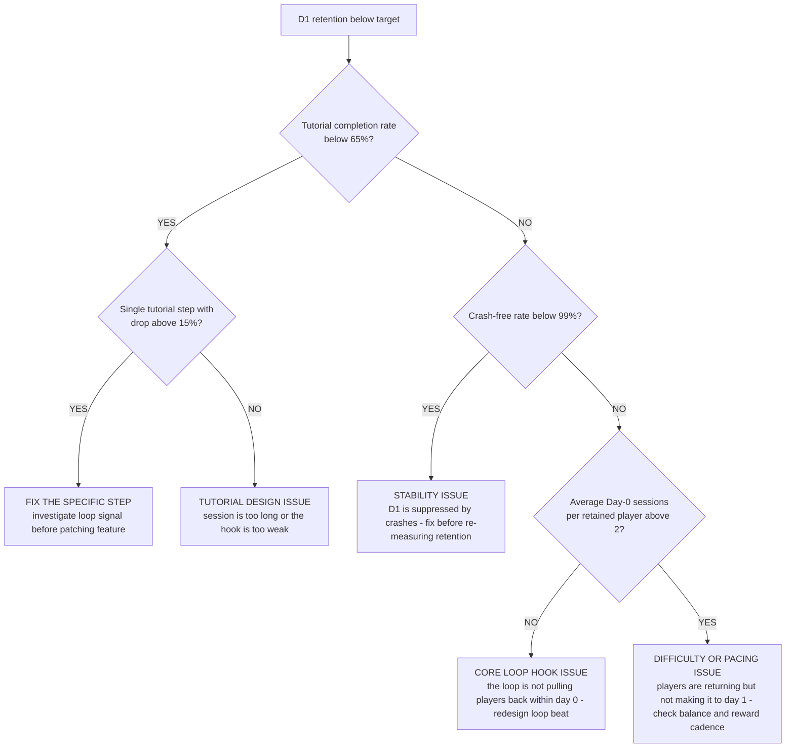
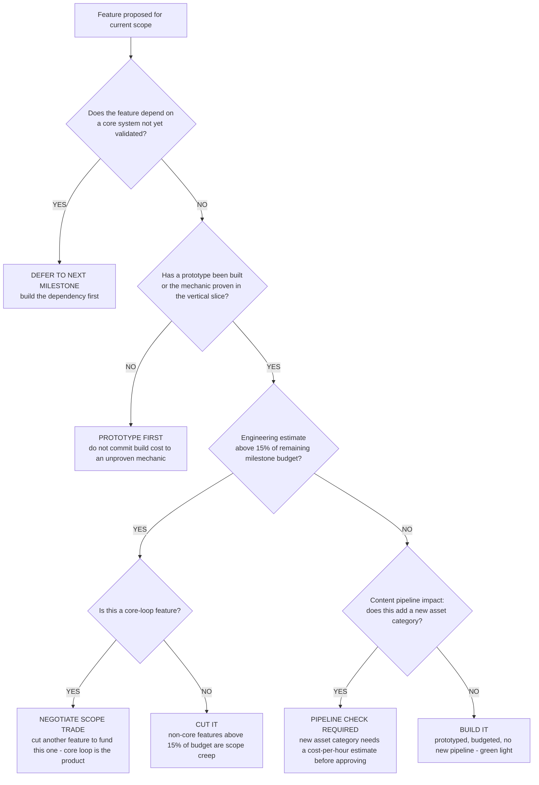
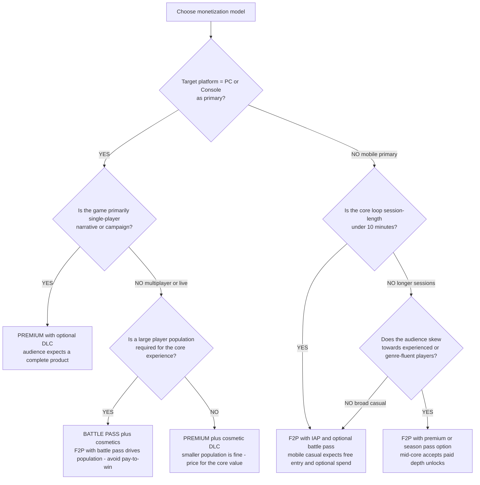

# Game-development decision trees

Which analysis for which symptom — traverse top-to-bottom before picking a method.

## Decision Tree: Will we ship on budget?

1) Scope to a vertical slice (§3 #1). 2) Burn down risk, not tasks (§3 #3). 3) Budget content cost-per-hour (§3 #6).

## Decision Tree: Retention is dropping

1) Read D1/D7/D30 and the drop-off (§3 #4). 2) Check the core loop (§3 #2). 3) Check the economy (§3 #5).

## Decision Tree: Is monetization healthy?

1) Confirm retention first (§3 #4). 2) Read ARPDAU/conversion. 3) Check the economy balance (§3 #5).

## How to read these trees

Traverse top-to-bottom and stop at the first matching branch — the order encodes the cheap-checks-before-expensive-checks discipline (§3). Each leaf names a skill, a specialist, or a house-opinion to apply. Never skip a higher branch because a lower one looks more interesting; a denominator, seasonal, or definitional artifact masquerades as a finding more often than not.

## Decision Tree: Which skill for which task

- **Scope to a vertical slice** → use when: Scope the project to a vertical slice that proves the core loop is fun before scaling content, to de-risk the build. ([`../skills/scope-to-vertical-slice/SKILL.md`](../skills/scope-to-vertical-slice/SKILL.md))
- **Design the core loop** → use when: Design the second-to-second and session-to-session core loop before features, since retention lives there. ([`../skills/design-the-core-loop/SKILL.md`](../skills/design-the-core-loop/SKILL.md))
- **Balance the game economy** → use when: Design the economy as a system of sources, sinks, and progression pacing, not a price list, so it doesn't inflate or starve. ([`../skills/balance-the-economy/SKILL.md`](../skills/balance-the-economy/SKILL.md))
- **Burn down production risk** → use when: Track and burn down the riskiest unknowns (fun, tech, content cost) first, not just a task list, since scope kills games. ([`../skills/burn-down-risk/SKILL.md`](../skills/burn-down-risk/SKILL.md))
- **Read live-ops vital signs** → use when: Read retention (D1/D7/D30) and monetization together, gating monetization on retention, to operate the live game. ([`../skills/read-live-ops/SKILL.md`](../skills/read-live-ops/SKILL.md))

## Decision Tree: Which specialist owns this

- **The engagement** → [`gamedev-producer`](../agents/gamedev-producer.md)
- **Design** → [`game-designer`](../agents/game-designer.md)
- **Build feasibility** → [`gameplay-engineer`](../agents/gameplay-engineer.md)
- **The numbers** → [`live-ops-analyst`](../agents/live-ops-analyst.md)

When two leaves apply, route to the **lead** first to scope and sequence — overlapping symptoms usually mean two drivers at once, and the lead keeps the analysis from collapsing into a single-cause story.

## Decision Tree: Which house-opinion gates the call

Before picking any method, check whether one of the standing biases (§3) already decides the framing:

1. Prove the fun in a vertical slice before the full build — if this is in question, apply §3 #1 before any method.
2. The core loop is the product — design it before the features — if this is in question, apply §3 #2 before any method.
3. Scope is the enemy — burn down risk, not just tasks — if this is in question, apply §3 #3 before any method.
4. Retention before monetization — D1/D7/D30 are the vital signs — if this is in question, apply §3 #4 before any method.
5. Design the economy as a system, not a price list — if this is in question, apply §3 #5 before any method.
6. Content cost-per-hour is a real constraint — budget it — if this is in question, apply §3 #6 before any method.
7. Live-service is an operating model, not a launch — if this is in question, apply §3 #7 before any method.
8. Date and source any benchmark or market figure — if this is in question, apply §3 #8 before any method.

## Escalation & guardrails

- Anything touching client PII / regulated records → stop and route to `ravenclaude-core` `security-reviewer`.
- Any external figure entering a deliverable → carry a source URL + retrieval date, or mark it `[unverified — training knowledge]` / `[ESTIMATE]` (§3, final house opinion).
- A recommendation ships only with an owner, a date, and an expected metric movement.
## Sourcing note

Figures in this file are from the author's domain knowledge and are marked `[unverified — training knowledge]` or `[ESTIMATE]` at point of use. Validate against a primary source before putting any figure in a client deliverable (§3 cite-or-mark rule).

---

## Decision Tree: D1 retention is low — root cause diagnosis

**When this applies:** D1 retention is below the team's target threshold or benchmark for the genre. Observable inputs: tutorial completion rate, day-0 session count, session length distribution, and crash-free rate.

**Last verified:** 2026-06-05 against standard mobile/F2P retention-diagnosis practice.

**Rationale per leaf:**
- *Fix the Specific Step* — a > 15% drop at a single tutorial step is a named, fixable signal; address it as a loop-design question before adding feature polish.
- *Tutorial Design Issue* — diffuse low completion without a single step spike indicates the tutorial as a whole is too long or fails to surface the core-loop hook; the issue is structural.
- *Stability* — crashes suppress D1 without any design failure; fix crashes before attributing D1 to design.
- *Core Loop Hook Issue* — players who complete the tutorial and don't return for a second Day-0 session didn't find a reason to continue; the loop isn't hooking them.
- *Balance/Pacing Issue* — players returning for multiple Day-0 sessions but not reaching D1 suggests they're engaged but hitting a wall; check difficulty curve and reward timing.

**Tradeoffs summary:**

| Root cause | Fix type | Time to validate | Use when |
|---|---|---|---|
| Tutorial step drop | Loop-design fix + retest | days | Single step above 15% |
| Tutorial structure | Structural redesign | weeks | Diffuse low completion |
| Stability | Bug fix | days | Crash rate above 1% |
| Core loop hook | Loop redesign | weeks | Low Day-0 session count |
| Balance or pacing | Balance tune + retest | days-weeks | Day-0 sessions good, D1 low |

---

## Decision Tree: Feature feasibility — build or cut

**When this applies:** a feature proposal is on the table and the team must decide whether to build it in the current scope, defer it, or cut it. Observable inputs: the feature's dependency on core systems, estimated engineering cost, content-pipeline impact, and whether a prototype exists.

**Last verified:** 2026-06-05 against game production scope-management practice.

**Rationale per leaf:**
- *Defer* — building on an unvalidated core dependency is building on a moving target; defer until the dependency is stable.
- *Prototype First* — engineering estimate for an unproven mechanic is a guess; the prototype converts the guess into data.
- *Negotiate Scope Trade* — core-loop features are non-negotiable for the game's quality; cutting them is trading the product for the schedule.
- *Cut* — a non-core feature that consumes > 15% of the remaining milestone budget is a scope-creep candidate regardless of its individual merit.
- *Pipeline Check* — a new asset category is a content-cost commitment that often exceeds the feature's direct engineering cost; the cost-per-hour estimate is required before approval.
- *Build* — all checks passed; green-light without further debate.

**Tradeoffs summary:**

| Decision | Production cost | Scope risk | Relationship cost | Use when |
|---|---|---|---|---|
| Defer | low delay | reduces | low | Core dependency unvalidated |
| Prototype first | days-weeks | reduces | low | Mechanic unproven |
| Negotiate scope trade | other feature deferred | neutral | medium | Core-loop feature over budget |
| Cut | none | reduces | low-medium | Non-core and over budget |
| Pipeline check | hours | reduces | low | New asset category |
| Build | full feature cost | adds | low | All gates cleared |

---

## Decision Tree: Monetization design — which model for this game

**When this applies:** a new game project is evaluating which monetization model to build around. Observable inputs: target platform, target audience, core-loop type, and competitive genre context.

**Last verified:** 2026-06-05 against game monetization design practice.

**Rationale per leaf:**
- *Premium with DLC* — single-player narrative audiences on PC/console expect a complete game at purchase; F2P entry damages the premium perception and rarely works in this category.
- *Battle Pass plus Cosmetics* — multiplayer games on PC/console need population; F2P maximizes addressable audience; cosmetic-only avoids pay-to-win backlash.
- *Premium plus Cosmetic DLC* — smaller-population multiplayer (co-op, asynchronous) can sustain a premium model with cosmetic DLC for ongoing revenue.
- *F2P with IAP* — mobile casual expects free entry; the session-length and loop-style are designed for quick-spend IAP and optional battle pass.
- *F2P with Premium Option* — mid-core mobile audiences will pay for depth unlocks but start free; a premium unlock option converts high-engagement players to a higher LTV segment.

**Tradeoffs summary:**

| Model | Barrier to entry | LTV potential | Community tone risk | Use when |
|---|---|---|---|---|
| Premium with DLC | high | medium | low | PC console single-player |
| Battle pass plus cosmetics | none | high | low if cosmetic-only | PC console multiplayer - population dependent |
| Premium plus cosmetic DLC | medium | medium | low | Smaller-pop multiplayer |
| F2P with IAP | none | variable | medium - whale concentration | Mobile casual - short sessions |
| F2P with premium option | none | high for mid-core | low | Mobile mid-core - longer sessions |
