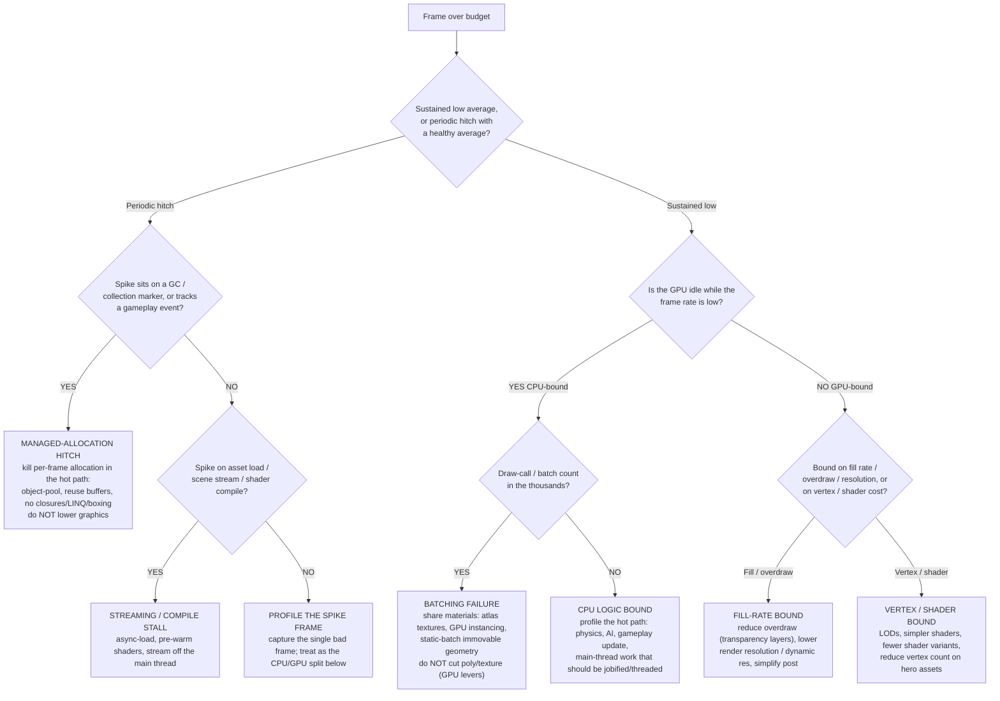
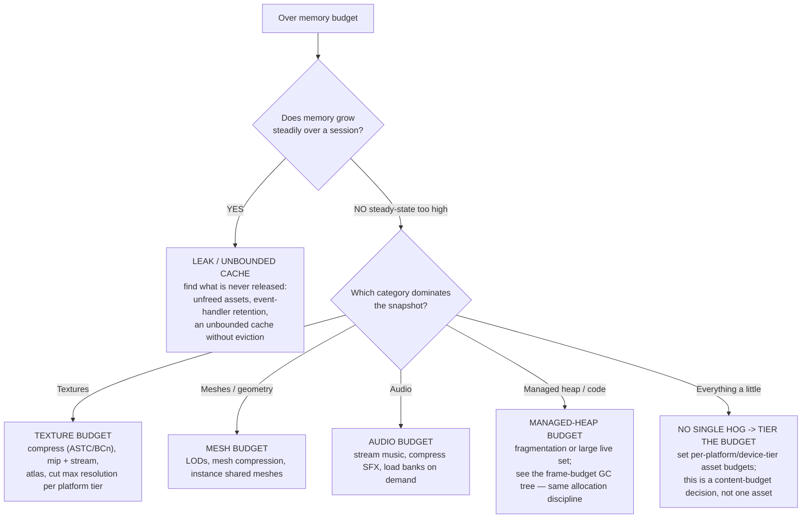

# Game runtime-performance decision trees

Which subsystem owns a performance symptom — traverse top-to-bottom before reaching for a fix. These complement the production/design/live-ops trees in [`gamedev-decision-trees.md`](gamedev-decision-trees.md); this file is the **runtime/engineering** lane (frame budget, memory budget), owned primarily by [`gameplay-engineer`](../agents/gameplay-engineer.md).

**Last verified:** 2026-06-05 against standard real-time-rendering / game-runtime profiling practice. The arithmetic (frame budget) is exact; the engine-specific tool names are `[verify-at-use]` per engine/version.

## How to read these trees

Traverse top-to-bottom and stop at the first matching branch. The order encodes the **measure-before-you-optimize** discipline: a profile that names *which subsystem and which thread* is the bottleneck comes before any fix, because the single most common failure is optimizing the wrong subsystem (grinding GPU-side asset levers on a CPU-bound frame, or lowering graphics to "fix" a GC hitch). Convert the target frame rate to a **per-frame millisecond budget** first — that is the denominator every measurement is read against:

| Target | Frame budget | Note |
|---|---|---|
| 30 FPS | 33.3 ms | console/cinematic floor |
| 60 FPS | 16.67 ms | the common real-time target |
| 120 FPS | 8.33 ms | high-refresh / competitive |
| 90 FPS | 11.1 ms | typical VR comfort floor `[verify-at-use — per-headset]` |

"60 FPS average" is **not** "no frame exceeded 16.67 ms." A hitch is a tail-latency event — read the **99th-percentile and max** frame time, never the mean (the §3 "metric needs a window + baseline" discipline applied to frame time).

---

## Decision Tree: The frame is over budget — which subsystem owns it

**When this applies:** the game misses its frame-time budget — either a low *average* frame rate (sustained over budget) or a periodic *hitch* (occasional spike over budget while the average looks fine). Observable inputs: target FPS → ms budget, a captured frame profile, the CPU-vs-GPU split, draw-call count, and managed-allocation-per-frame.

**Rationale per leaf:**
- *Managed-allocation hitch* — a periodic spike on a tracing-GC runtime (Unity Mono/IL2CPP, any GC'd scripting layer) is a Gen-0 collection until proven otherwise; the fix is to remove the per-frame garbage (pool, reuse, hoist), not to tune `GC.Collect()` and not to touch graphics.
- *Streaming/compile stall* — a spike tied to a load/stream/first-use-of-a-shader is an I/O or compile stall; move it off the main thread (async load, shader pre-warm).
- *Batching failure* — thousands of draw calls with an idle GPU is CPU/render-thread-bound on draw-call *submission*; collapse calls by sharing material state (atlas/instancing/static-batch). Cutting poly/texture does nothing here.
- *CPU logic bound* — an idle GPU with a sane draw-call count points at gameplay/physics/AI on the main thread; jobify or thread the hot path.
- *Fill-rate bound* — GPU-bound and sensitive to resolution/transparency means you're pushing too many pixels; cut overdraw and resolution before geometry.
- *Vertex/shader bound* — GPU-bound and sensitive to geometry/shader complexity; LODs and simpler shaders are the lever.

**Tradeoffs summary:**

| Bottleneck | Telltale | First lever | Anti-lever (does nothing) |
|---|---|---|---|
| Managed-alloc hitch | periodic spike on GC marker | pool / reuse / remove allocation | lowering graphics tier |
| Streaming/compile stall | spike on load / first-shader-use | async load, pre-warm shaders | render settings |
| Batching failure | thousands of draw calls, idle GPU | atlas, instancing, static batch | cutting poly/texture |
| CPU logic bound | idle GPU, sane draw calls | jobify/thread the hot path | GPU asset levers |
| Fill-rate bound | GPU-bound, resolution-sensitive | cut overdraw, lower resolution | LODs |
| Vertex/shader bound | GPU-bound, geometry-sensitive | LODs, simpler shaders | resolution |

---

## Decision Tree: Memory budget exceeded — out-of-memory / eviction / hitching on load

**When this applies:** the build is over its platform memory budget — OOM crashes on low-end devices, texture eviction/pop-in, or memory-pressure hitches. Observable inputs: the platform memory budget, a memory snapshot broken down by category (textures, meshes, audio, code/managed heap), and whether usage grows over a session.

**Rationale per leaf:**
- *Leak / unbounded cache* — memory that only grows is a release failure (unfreed assets, retained handlers, a cache with no eviction policy); fix the release path, don't raise the budget.
- *Texture / mesh / audio budget* — a single dominant category is attacked with that category's compression + streaming + LOD levers, per platform tier.
- *Managed-heap budget* — a large or fragmented managed heap shares the allocation discipline of the frame-budget GC leaf.
- *Tier the budget* — when nothing dominates, the answer is a **per-device-tier asset budget** (a content-cost decision, §3 #6), not chasing one asset.

**Tradeoffs summary:**

| Symptom | Cause | Lever |
|---|---|---|
| Memory grows all session | leak / unbounded cache | fix release / add eviction |
| Textures dominate | uncompressed / no streaming | compress, mip-stream, atlas, per-tier max res |
| Meshes dominate | no LOD / no instancing | LODs, mesh compression, instance |
| Audio dominates | all in memory | stream music, load banks on demand |
| Managed heap large | live set / fragmentation | the GC allocation discipline |
| Diffuse / no single hog | budget not tiered | per-device-tier asset budgets |

---

## Escalation & guardrails

- Always **measure against the ms budget and the percentile, not the average**, before optimizing — and name *which subsystem and which thread* owns the cost. A fix that can't be attributed to a moved profiler number is a guess (§3 #1 / #8 applied to runtime metrics).
- Engine-specific profiler/tool names (Unity Profiler / Frame Debugger, Unreal Insights / `stat unit` / RenderDoc, Godot's profiler + monitors) and the exact term for "draw calls" (batches / set-pass / draw primitives) are `[verify-at-use]` per engine + version — confirm the current name before quoting it in a deliverable.
- Any benchmark figure (a device's memory budget, a genre's frame target) carries a source + date, or is marked `[unverified — training knowledge]` / `[ESTIMATE]` (§3 #8).

## Sourcing note

The frame-budget arithmetic and the CPU-vs-GPU / draw-call / GC reasoning are standard real-time-rendering and game-runtime profiling practice. Engine tool names are version-volatile and marked `[verify-at-use]`. Validate against the actual game's profile before any client deliverable — a profile of *this* build beats any general tree.
