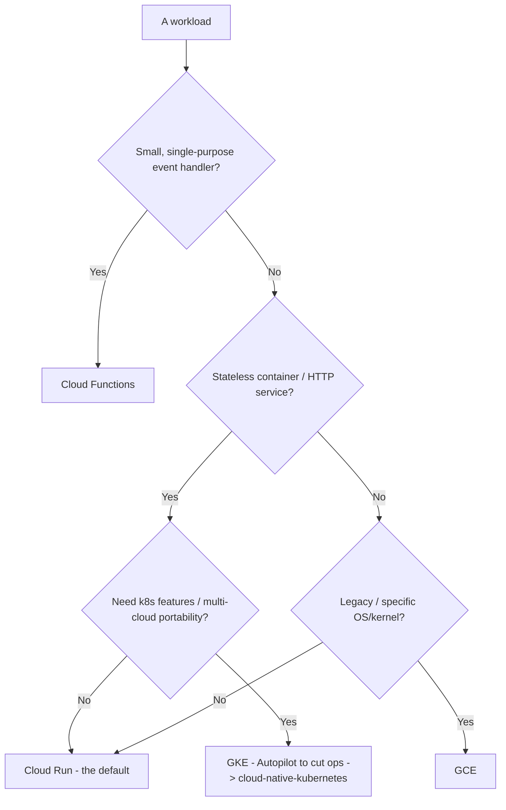
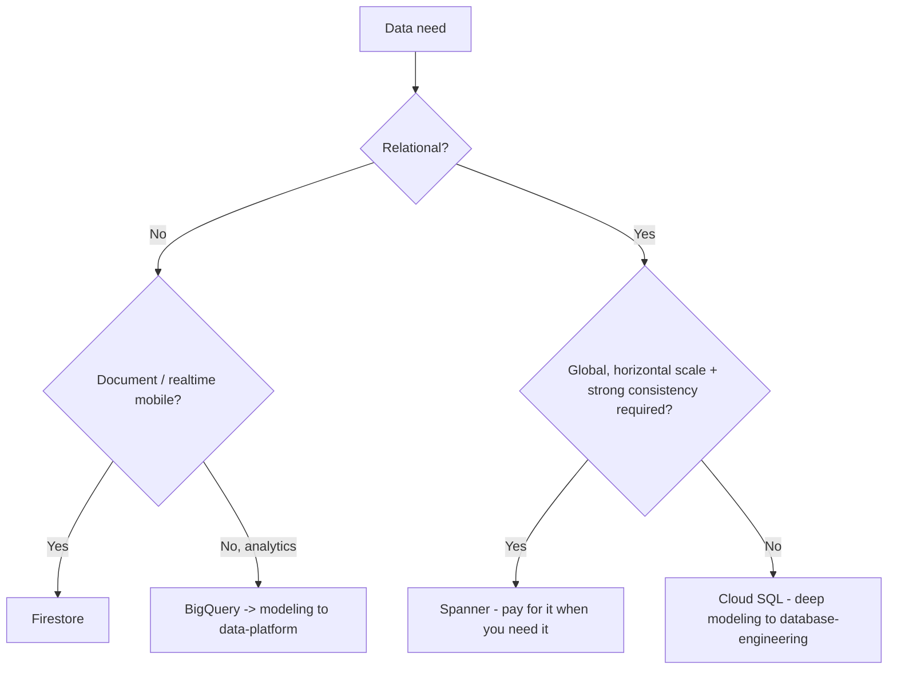

# Google Cloud — Decision Trees

_Decision trees + a dated capability map. Capability rows are `[verify-at-build]` — re-check against the vendor before quoting. Last reviewed: 2026-06-04._

Traverse before choosing compute or laying out the hierarchy.

## Decision Tree: GCP compute selection

Cloud Run is the default; GKE must earn its cluster ops.

_Don't reach for GKE when Cloud Run fits._

## Decision Tree: GCP data store selection

Pick by access pattern and the scale you actually need.

## Capability map (dated — verify at build)

| Capability | 2026 state `[verify-at-build]` | Notes |
|---|---|---|
| Cloud Run | GA | Scale-to-zero; default for services |
| GKE Autopilot | GA | Managed nodes; less ops |
| Workload Identity Federation | GA | Replace SA key files |
| Org Policy constraints | GA | Inherited preventive guardrails |
| Shared VPC | GA | Multi-project networking |
| BigQuery | GA | Service here; analytics -> data-platform |
| Spanner | GA | Global relational; cost-justify |
