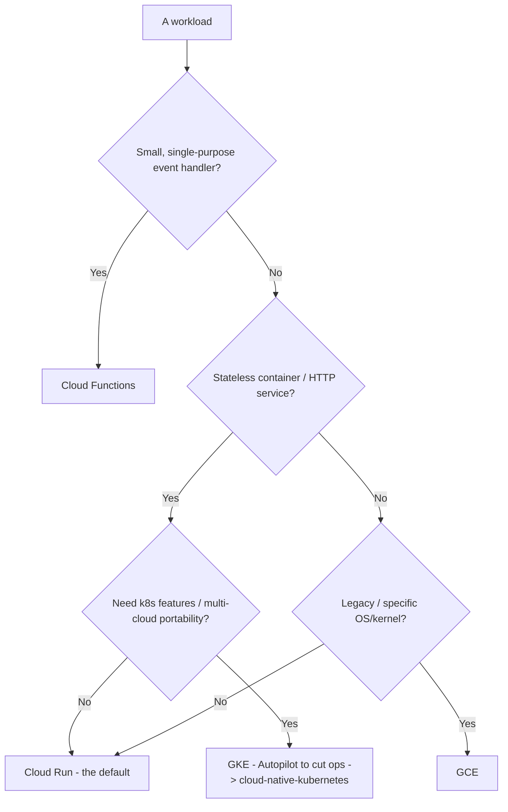
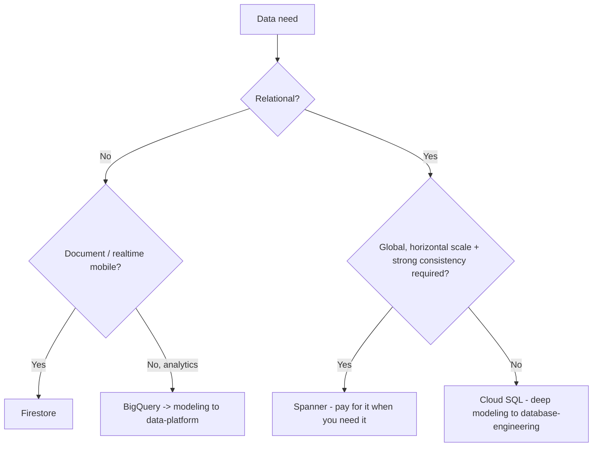
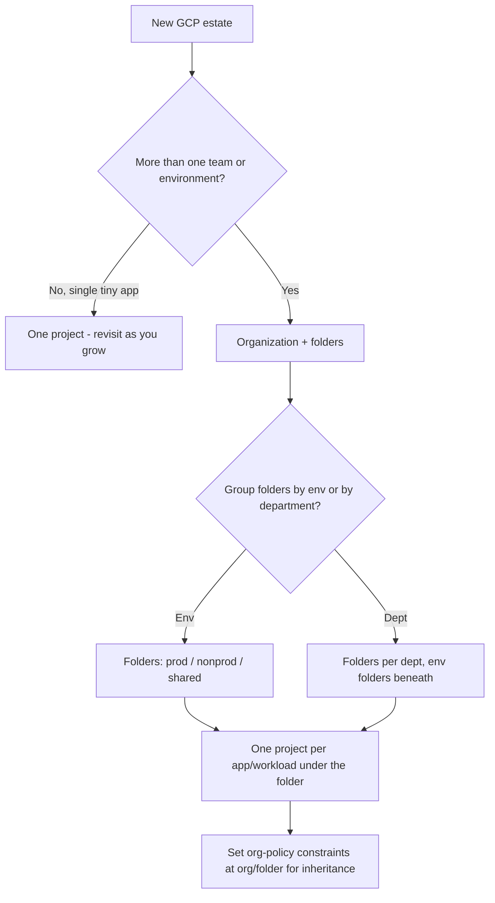
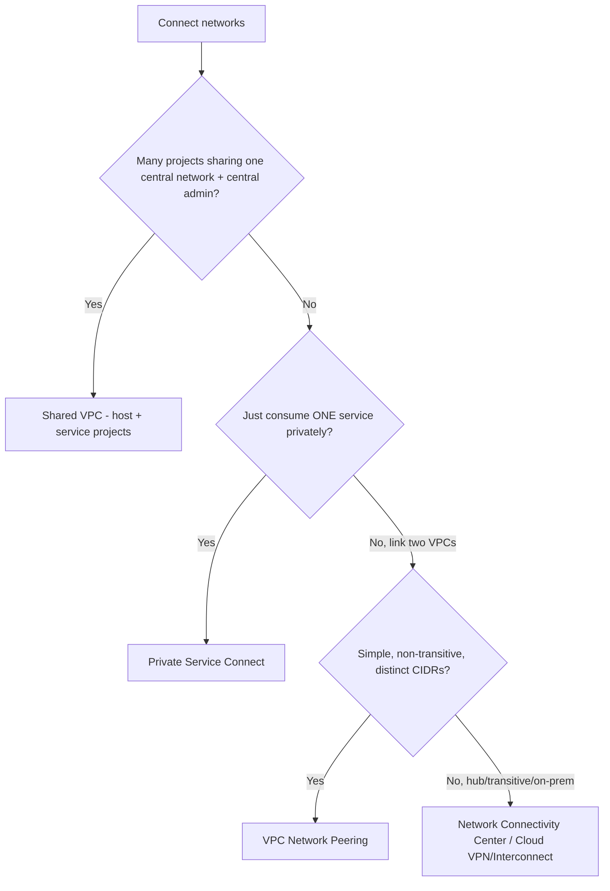
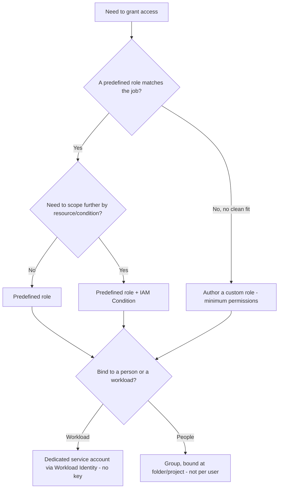

# Google Cloud — Decision Trees

_Decision trees + a dated capability map. Capability rows are `[verify-at-build]` — re-check against the vendor before quoting. Last reviewed: 2026-06-04._

Traverse before choosing compute or laying out the hierarchy.

## Decision Tree: GCP compute selection

Cloud Run is the default; GKE must earn its cluster ops.

_Don't reach for GKE when Cloud Run fits._

## Decision Tree: GCP data store selection

Pick by access pattern and the scale you actually need.

## Decision Tree: How to lay out the hierarchy?

Folders bound blast radius and inherit policy; projects are the unit of isolation.

_One project per workload is the GCP equivalent of an account boundary; a flat pile of resources in one project has no isolation and no clean billing._

## Decision Tree: How to connect projects/networks?

Shared VPC for centrally-managed multi-project; PSC for private service exposure; peering only for simple non-transitive links.

_Peering isn't transitive; Shared VPC centralizes network control across projects; PSC exposes a service without joining networks._

## Decision Tree: Which IAM grant?

Match the role to the job and bind it at the right hierarchy level; primitive roles are almost never the answer.

_Owner/Editor 'to make it work' is the most common over-grant; reach for predefined first, custom when none fits, primitive essentially never in prod._

## Capability map (dated — verify at build)

| Capability | 2026 state `[verify-at-build]` | Notes |
|---|---|---|
| Cloud Run | GA | Scale-to-zero; default for services |
| GKE Autopilot | GA | Managed nodes; less ops |
| Workload Identity Federation | GA | Replace SA key files |
| Org Policy constraints | GA | Inherited preventive guardrails |
| Shared VPC | GA | Multi-project networking |
| BigQuery | GA | Service here; analytics -> data-platform |
| Spanner | GA | Global relational; cost-justify |
