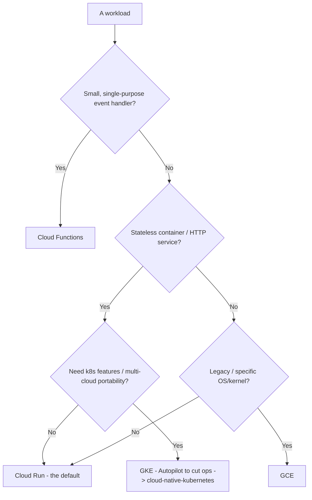
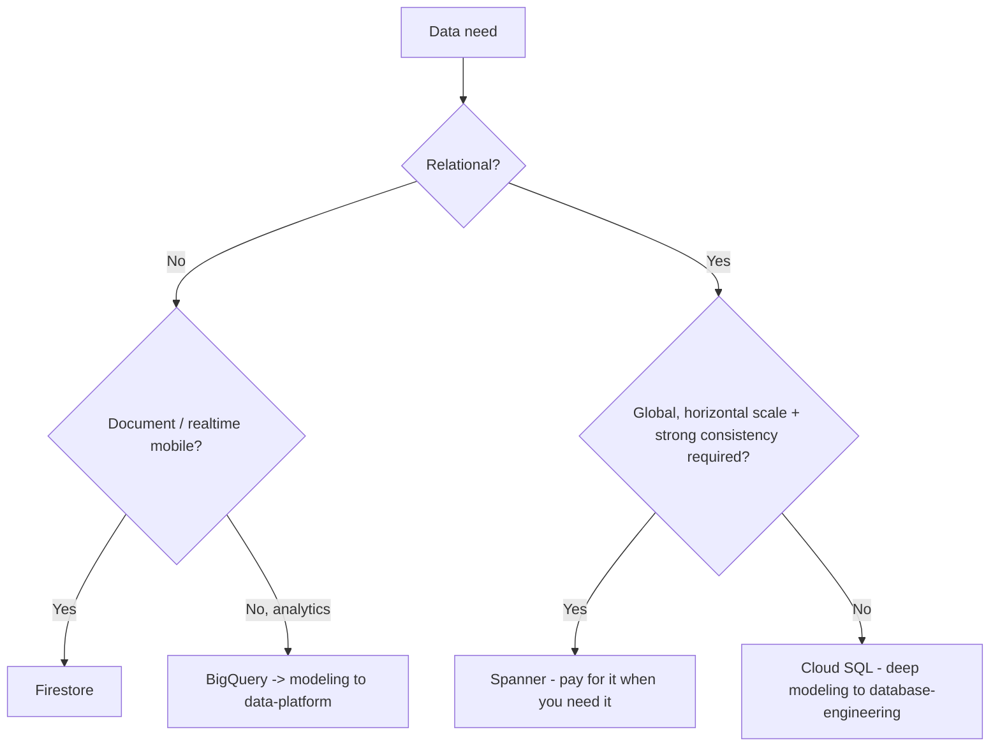
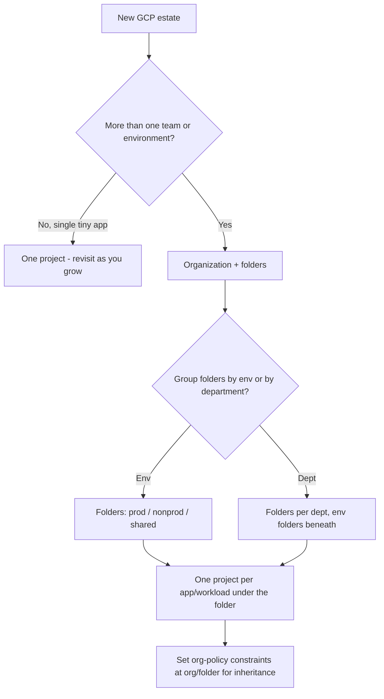
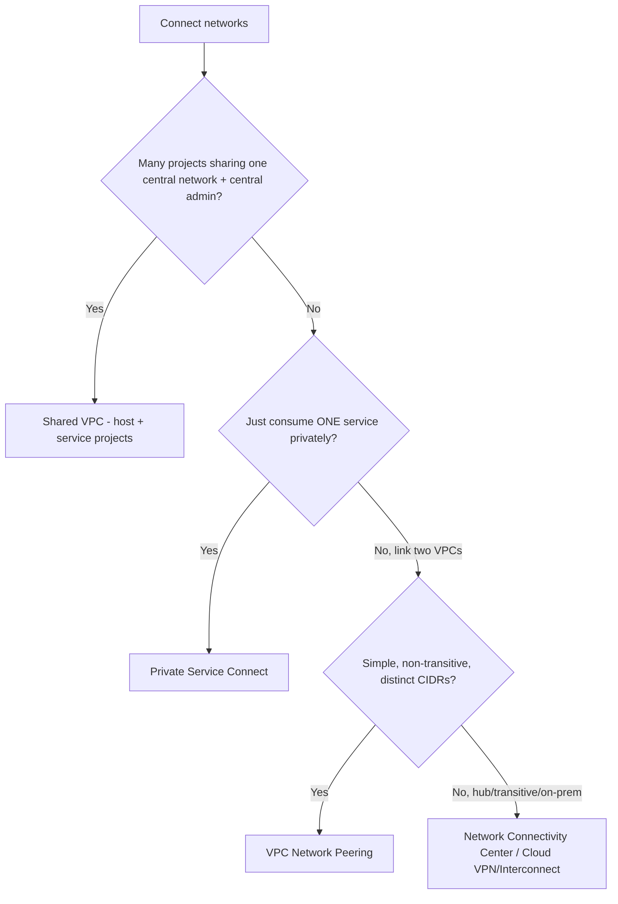
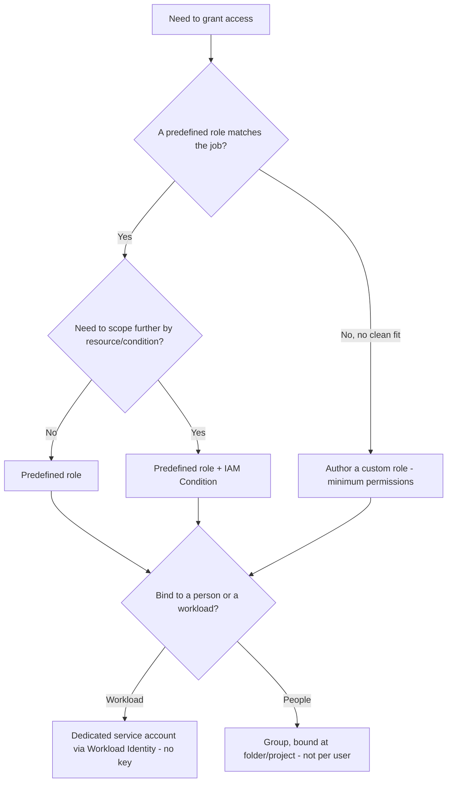
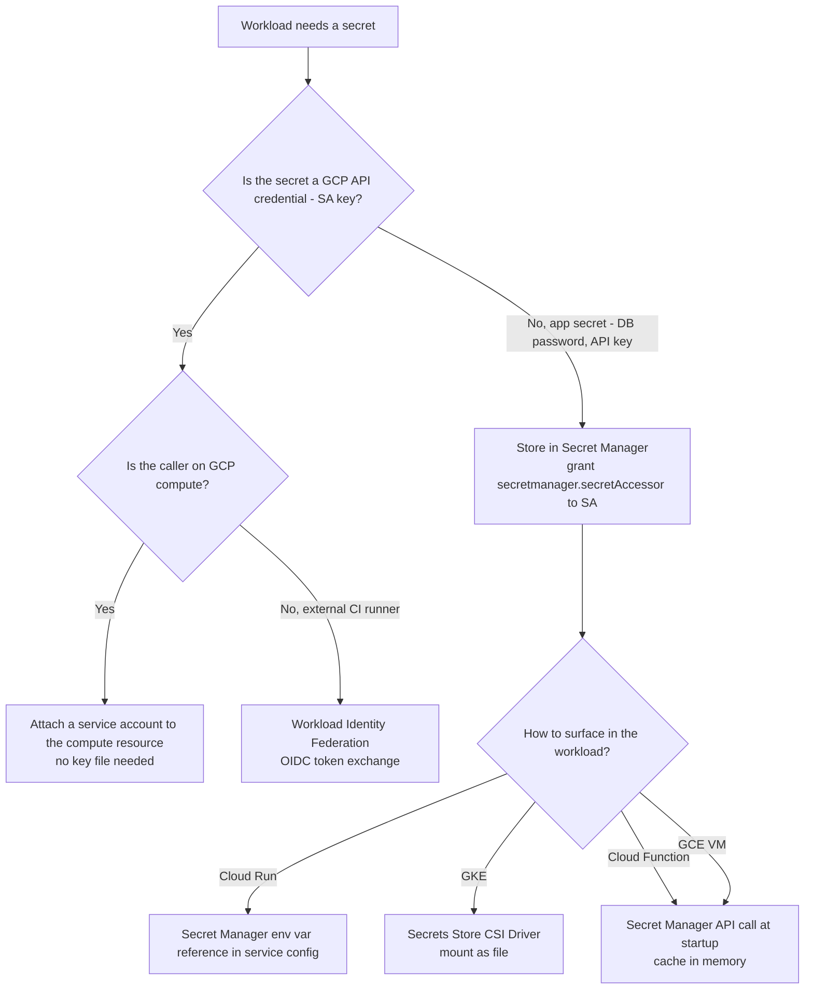
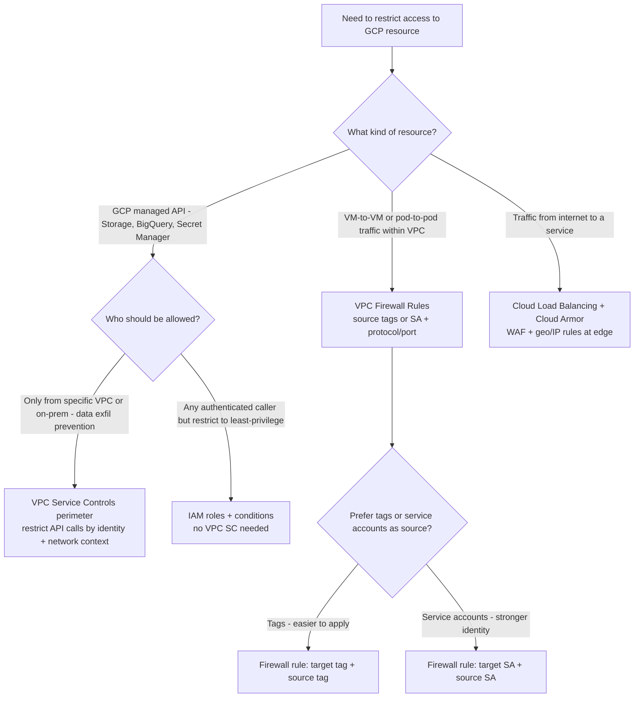
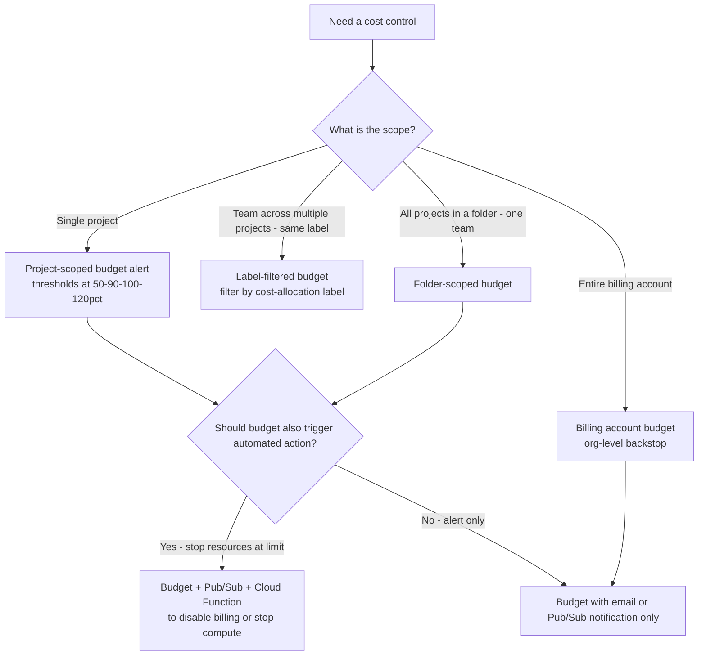

# Google Cloud — Decision Trees

_Decision trees + a dated capability map. Capability rows are `[verify-at-build]` — re-check against the vendor before quoting. Last reviewed: 2026-06-04._

Traverse before choosing compute or laying out the hierarchy.

## Decision Tree: GCP compute selection

Cloud Run is the default; GKE must earn its cluster ops.

_Don't reach for GKE when Cloud Run fits._

## Decision Tree: GCP data store selection

Pick by access pattern and the scale you actually need.

## Decision Tree: How to lay out the hierarchy?

Folders bound blast radius and inherit policy; projects are the unit of isolation.

_One project per workload is the GCP equivalent of an account boundary; a flat pile of resources in one project has no isolation and no clean billing._

## Decision Tree: How to connect projects/networks?

Shared VPC for centrally-managed multi-project; PSC for private service exposure; peering only for simple non-transitive links.

_Peering isn't transitive; Shared VPC centralizes network control across projects; PSC exposes a service without joining networks._

## Decision Tree: Which IAM grant?

Match the role to the job and bind it at the right hierarchy level; primitive roles are almost never the answer.

_Owner/Editor 'to make it work' is the most common over-grant; reach for predefined first, custom when none fits, primitive essentially never in prod._

## Capability map (dated — verify at build)

| Capability | 2026 state `[verify-at-build]` | Notes |
|---|---|---|
| Cloud Run | GA | Scale-to-zero; default for services |
| GKE Autopilot | GA | Managed nodes; less ops |
| Workload Identity Federation | GA | Replace SA key files |
| Org Policy constraints | GA | Inherited preventive guardrails |
| Shared VPC | GA | Multi-project networking |
| BigQuery | GA | Service here; analytics -> data-platform |
| Spanner | GA | Global relational; cost-justify |

---

## Decision Tree: GCP secret management — how should a workload access a secret?

**When this applies:** A GCP workload (Cloud Run, GKE pod, Cloud Function, GCE VM) needs to access a credential, API key, or other secret at runtime. The observable inputs are: where the workload runs, whether it is a GCP-native workload, and whether the secret is a cloud identity credential or an application secret.

**Last verified:** 2026-06-05 against GCP Secret Manager and Workload Identity documentation.

**Rationale per leaf:**
- *Attach SA* — GCP-native compute resources (Cloud Run, GKE nodes, GCE) can impersonate a service account without any key file; the metadata server provides rotating credentials.
- *Workload Identity Federation* — external callers (GitHub Actions, GitLab, on-prem) exchange an OIDC token for short-lived GCP credentials; no key to store.
- *Secret Manager env var reference* — Cloud Run reads the secret at deploy time and surfaces it as an environment variable at runtime; the secret value never appears in the service spec.
- *Secrets Store CSI Driver* — GKE pods mount Secret Manager secrets as files; the Kubernetes Secret object remains base64 plaintext, so CSI bypasses it.
- *API call at startup* — Cloud Functions and GCE can call the Secret Manager API directly using the attached SA; cache the result in memory to avoid per-request latency.

**Tradeoffs summary:**

| Method | Requires SA key? | Auditable access? | Use when |
|---|---|---|---|
| Attached SA | No | Yes via Audit Logs | GCP-native compute |
| WIF | No | Yes via Audit Logs | External CI/CD callers |
| Secret Manager env ref | No | Yes per-version | Cloud Run secrets |
| CSI Driver | No | Yes | GKE pod secrets |
| SM API call in code | No | Yes per call | Cloud Functions/GCE |

---

## Decision Tree: GCP network isolation — firewall rules vs VPC Service Controls

**When this applies:** A team needs to control access to GCP resources: either restricting which VMs/pods can talk to each other (network-layer), or restricting which identities/networks can call GCP APIs (API-layer). These are two different controls that are often confused.

**Last verified:** 2026-06-05 against GCP VPC firewall and VPC Service Controls documentation.

**Rationale per leaf:**
- *VPC Firewall Rules* — layer 4 controls (IP/port/protocol) for VM and pod traffic within the VPC; tag-based rules are convenient but service account-based rules are more precise identities.
- *VPC Service Controls perimeter* — prevents data exfiltration by restricting GCP API calls to specific VPCs and identities; the right control when you need to prevent a compromised VM from calling `gsutil` and copying data out.
- *IAM roles* — sufficient when the concern is least-privilege, not network perimeter; a storage.objectViewer binding on a bucket is a data-access control, not a network control.
- *Cloud Load Balancing + Cloud Armor* — for internet-origin traffic, the LB is the entry point and Cloud Armor is the WAF.

**Tradeoffs summary:**

| Control | Layer | What it restricts | Use when |
|---|---|---|---|
| VPC Firewall Rules | L4 | VM/pod to VM/pod traffic | East-west network isolation |
| VPC Service Controls | API | API calls by identity and network | Data exfil prevention for GCP APIs |
| IAM roles | Identity | API access by permission | Least-privilege access to any GCP resource |
| Cloud Armor | L7 | HTTP from internet | Public-facing services |

---

## Decision Tree: GCP billing — project, folder, or org budget?

**When this applies:** A team needs to set cost controls on GCP spend. The observable inputs are: the scope of spend to control (one project, one team across multiple projects, the whole org), and whether the team wants to alert or also block resource creation when the budget is hit.

**Last verified:** 2026-07-08 against GCP Cloud Billing budget documentation and [Share committed use discounts across projects](https://cloud.google.com/compute/docs/instances/committed-use-discounts-overview).

**Rationale per leaf:**
- *Project-scoped budget* — the most specific; identifies the project generating the spend; the primary control for individual workload cost.
- *Label-filtered budget* — when one team owns resources across multiple projects, a label filter (e.g., `team=payments`) gives a single budget view across project boundaries.
- *Folder-scoped budget* — when a folder represents a business unit or team and all spend there has a shared limit.
- *Billing account budget* — the org-level backstop; fires last but catches everything; useful as a high-water-mark alarm.
- *Pub/Sub + Cloud Function* — only use automated budget responses (disabling billing/stopping VMs) in dev/test; never in prod without extensive testing and runbook.
- **Note (2026-06-16):** new Cloud Billing accounts now default to **billing-account-scoped resource-based CUD sharing ON** — one commitment applies across every linked project (existing accounts with no active commitments were auto-switched). If you use project- or folder-scoped budgets for chargeback/cost isolation, **verify CUD sharing scope**, because a shared commitment can subsidize projects outside the intended cost center. [Share CUDs across projects](https://cloud.google.com/compute/docs/instances/committed-use-discounts-overview) `[verify-at-use]`

**Tradeoffs summary:**

| Budget scope | Granularity | Cost attribution clarity | Use when |
|---|---|---|---|
| Project | Finest | Per workload | Single workload or project team |
| Label filter | Medium | Per label dimension | Team spanning multiple projects |
| Folder | Team/BU level | Per org unit | Folder = cost center |
| Billing account | Coarsest | Entire org | High-water-mark backstop |
