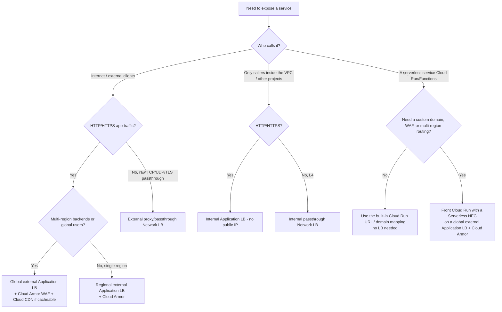
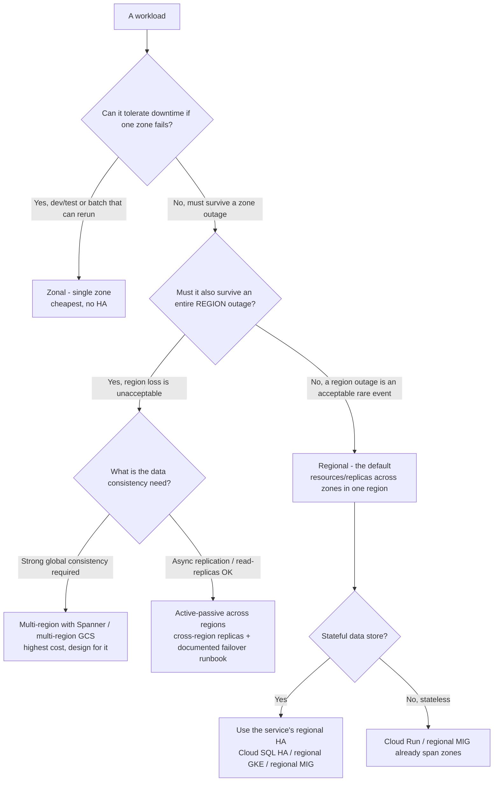

# GCP — Edge Exposure & Resilience Decision Trees

_Two decision trees for choices the existing [`gcp-cloud-decision-trees.md`](gcp-cloud-decision-trees.md) does not cover: **how to expose a service at the edge** (which load balancer / ingress), and **what resilience tier** a workload's region/zone footprint should buy. Architectural priors, not version-volatile facts — but specific product capabilities marked `[verify-at-use]` move; re-check against the vendor before quoting. Last reviewed: 2026-07-08 against Google Cloud Load Balancing and locations/SLA documentation._

Traverse the relevant graph top-to-bottom **before** picking an LB type or a regional footprint — do not default to "global external HTTPS LB" or "multi-region" reflexively; each tier has a real cost.

## Decision Tree: Which load balancer / edge exposure?

**Match the LB to the traffic shape and the audience, then add the WAF.** GCP's load balancers split first on **HTTP(S) vs. TCP/UDP** (L7 vs L4) and then on **external vs internal** — picking the wrong axis is the most common over-build (a global external HTTPS LB fronting a service only ever called from inside the VPC).

**How to read it:**

- **External vs. internal is the first cut, and getting it wrong is the most common over-build.** A service only ever called from inside the VPC or from sibling projects wants an **internal** LB (no public IP at all) — fronting it with an external LB needlessly widens the attack surface and usually drags in a public IP you then have to defend. This is the `private-by-default-gcp` best-practice applied at the edge.
- **L7 (Application LB) vs. L4 (Network LB) follows the protocol, not preference.** HTTP/HTTPS app traffic → an **Application LB** (it can route on path/host, terminate TLS, and attach Cloud Armor + Cloud CDN). Raw TCP/UDP or TLS pass-through → a **Network LB**. Don't reach for L7 features on traffic that isn't HTTP.
- **Global vs. regional buys cross-region failover + a single anycast IP — and you pay for it.** A **global** external Application LB is the right call when backends span regions or users are worldwide (it routes to the nearest healthy backend and survives a regional outage). A single-region service does **not** need it — a **regional** external Application LB is cheaper and simpler. `[verify-at-use]`: the exact global-vs-regional feature matrix (e.g. which Cloud Armor / advanced-routing features are global-only) shifts — confirm against the current Load Balancing docs.
- **Cloud Armor is the WAF, and it belongs on every public-facing Application LB.** Geo/IP rules, rate limiting, and managed WAF rules (OWASP-style) live at the edge LB, not in the app — this is the `cloud-armor-on-public-load-balancers` best-practice. Cloud CDN bolts onto the same LB when the content is cacheable.
- **Serverless (Cloud Run/Functions) often needs no LB at all.** The built-in service URL or a domain mapping covers the simple case. Reach for a **Serverless NEG on a global external Application LB** only when you need a custom domain *with* WAF, multi-region routing, or CDN — don't stand one up for a plain HTTPS endpoint.

> **Seam:** running the workload itself (which compute) is the [`## Decision Tree: GCP compute selection`](gcp-cloud-decision-trees.md) tree's lane; the **edge in front of it** is this one. GKE ingress / Gateway-API mesh routing inside a cluster → `cloud-native-kubernetes`; this tree is the GCP-managed LB choice.

_Name the trade: a global external Application LB buys anycast + cross-region failover + the full Cloud Armor/CDN surface and pays a higher per-rule/data cost and more config; an internal or regional LB buys a smaller blast radius and a simpler bill and pays by not surviving a region loss or reaching global users._

## Decision Tree: What resilience tier — zonal, regional, or multi-region?

**Buy the resilience the workload's RTO/RPO actually justifies, no more.** Region/zone footprint is a direct cost-and-complexity dial: zonal is cheapest and dies with its zone; multi-region is the most expensive and survives a region loss. Most workloads should default to **regional**; reserve multi-region for the genuinely can't-go-down tier.

**How to read it:**

- **Regional is the default; zonal is for things that can die and rerun.** A single zone is the cheapest footprint but offers **no** HA — a zone outage takes the workload down. Use zonal only for dev/test, scratch, or batch that can simply be re-run. Everything that should survive a zone failure goes **regional** (resources spread across zones within one region) — this is the `regional-by-default` best-practice, and for most production workloads it is the right stopping point.
- **Multi-region is a real cost and complexity step — make a region outage's unacceptability explicit before buying it.** A regional outage is a rare event; for many workloads "down for the duration of a Google regional incident" is an acceptable, documented risk. Step up to **multi-region** only when the business genuinely cannot tolerate that — and then design *for* it (it is not a flag you flip late).
- **Consistency need drives the multi-region shape.** If you need **strong global consistency**, that points at services built for it — **Spanner** (global relational, see the data-store tree) and **multi-region GCS** — at their (real) cost. If async replication / read-replicas are acceptable, an **active-passive** cross-region design with replicas and a **written, tested failover runbook** is cheaper and often sufficient. The most common DR failure is an untested runbook, not a missing replica.
- **Let the managed service provide the regional HA where it can.** Cloud SQL HA (regional), regional GKE clusters, and regional managed instance groups give you cross-zone resilience without hand-rolling it. Stateless serverless (Cloud Run) and regional MIGs already span zones — the hard part of resilience is almost always the **stateful** tier, so that's where the design effort goes.
- For a **stateless Cloud Run** tier, Cloud Run *service health* (GA, June 2026) gives native, managed multi-region failover AND failback via readiness-probe health aggregation behind a global/cross-region internal Application LB + serverless NEGs — prefer it over hand-rolling active-passive routing for the stateless serverless case; the hard DR problem remains the **stateful data tier**. `[verify-at-use]`
- `[verify-at-use]`: per-product SLAs, the exact multi-region location set, and which services offer a regional-HA configuration all move — confirm RTO/RPO-relevant numbers against the current locations/SLA docs before committing a number to a design.

> **Seam:** the resilience *posture* (the architecture choice above) is `gcp-architect`'s lane; provisioning it as IaC → `terraform-iac`; SLOs/error budgets that *justify* a tier → `observability-sre`. This tree picks the footprint; those neighbours set the targets and build it.

_Name the trade: each step up (zonal → regional → multi-region) buys a larger survivable failure (zone → region) and pays in replicated infrastructure cost, cross-region data-egress, and design complexity — match the tier to the workload's actual RTO/RPO, don't buy multi-region because it sounds safe._

## Capability map (dated — verify at build)

| Capability | 2026 state `[verify-at-use]` | Notes |
|---|---|---|
| Global external Application LB | GA | Anycast IP, cross-region, Cloud Armor + CDN attach |
| Regional external Application LB | GA | Cheaper single-region L7 |
| Internal Application LB | GA | No public IP; in-VPC / cross-project L7 |
| Network LB (passthrough/proxy) | GA | L4 TCP/UDP/TLS |
| Cloud Armor | GA | WAF + rate-limit + geo/IP at the edge LB |
| Serverless NEG (Cloud Run on an LB) | GA | Custom domain + WAF + multi-region for serverless |
| Cloud SQL regional HA | GA | Cross-zone failover within a region |
| Spanner multi-region | GA | Strong global consistency; cost-justify |
| Multi-region GCS | GA | Strongly consistent object storage across a multi-region |
| Cloud Run service health (multi-region auto failover/failback) | GA | Readiness-probe health aggregated per region via serverless NEGs; a global external / cross-region internal Application LB diverts traffic from an unhealthy region and fails back on recovery. [Cloud Run service health](https://docs.cloud.google.com/run/docs/configuring/configure-service-health) `[verify-at-use]` |
</content>
