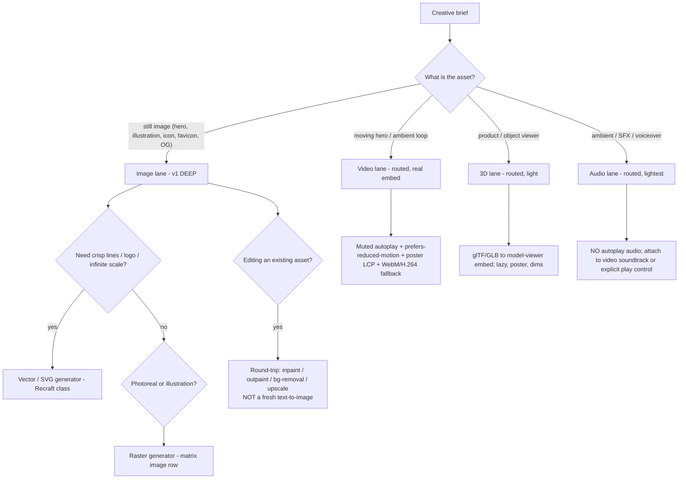
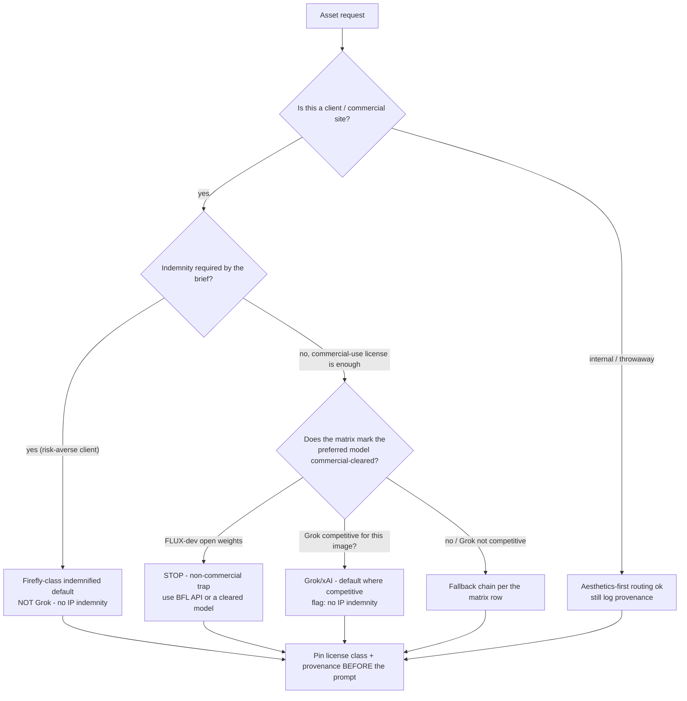
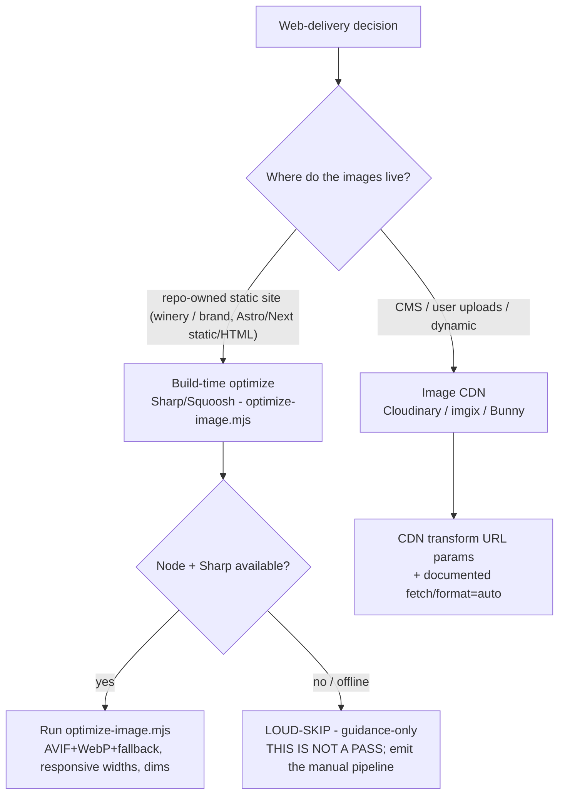

# Generative Web Media — Decision Trees

> Reference decision trees for the `generative-web-media` team. Agents **traverse the relevant tree top-to-bottom before deciding** (the proactive complement to the Capability Grounding Protocol). Each `## Decision Tree` section is a Mermaid graph plus the rule it encodes.
>
> **Generative-media engineering judgment, not legal advice.** Anything touching a provider, model, price, or license term is `[verify-at-use]`; **every price is `[unverified — confirm on provider pricing page]`.** No secrets stored.
>
> _Last reviewed: 2026-07-13 by `claude`. Principles are durable; dated provider/price/license specifics live in [`provider-model-matrix-2026.md`](provider-model-matrix-2026.md) and [`legal-and-provenance-2026.md`](legal-and-provenance-2026.md)._

---

## Decision Tree: which modality, and how deep?



**Rule:** pick the lane on what the asset *is*, then pick depth. Images are the deep lane — and **editing an existing asset is a round-trip (inpaint/outpaint/bg-removal/upscale), never a fresh generation** when a round-trip will do (cheaper, keeps brand-locked composition). Video/3D/audio are routed with real web-delivery patterns, not raw pointers. All model/price specifics `[verify-at-use]`.

---

## Decision Tree: license-first → Grok-lean → fallback



**Rule:** the **license gate outranks the Grok/aesthetic default.** For a risk-averse client with `indemnity_required`, route to a Firefly-class indemnified provider (Grok has **no IP indemnity**). FLUX-dev open weights are **non-commercial** — never on a client asset without an explicit override to the paid BFL API. Grok/xAI is the default for images *where competitive*, with the no-indemnity risk flagged. Pin the license class and provenance **before** generating. See [`provider-model-matrix-2026.md`](provider-model-matrix-2026.md).

---

## Decision Tree: build-time optimize vs image CDN



**Rule:** the consumer's brand/winery sites lean **static + repo-owned**, so **build-time (Sharp) is the default**; the CDN path is documented for CMS/upload-driven sites. When Node/Sharp is absent the optimizer **LOUD-SKIPs** ("THIS IS NOT A PASS") and the pipeline degrades to guidance-only — never a silent claim of success. See [`web-media-pipeline.md`](web-media-pipeline.md).

---

## Decision Tree: which output format?

```mermaid
flowchart TD
    A[Optimized image] --> B{Content type?}
    B -- "photographic hero / photoreal" --> C[AVIF primary, WebP fallback, JPEG safety net]
    B -- "flat illustration / few colors / UI" --> D[AVIF/WebP; consider SVG if truly vector]
    B -- "logo / icon / line art" --> E[SVG (vector) - infinite scale, tiny, crisp]
    B -- "needs transparency" --> F[WebP/AVIF with alpha; PNG safety net]
    C --> G[<picture>: 3-5 responsive widths, explicit width/height]
    D --> G
    E --> H[Inline or  SVG; no raster pipeline needed]
    F --> G
    G --> I{Is this the LCP hero?}
    I -- yes --> J[eager + fetchpriority=high - cap 1-2 per page]
    I -- no --> K[loading=lazy below the fold]
```

**Rule:** **AVIF-first / WebP-fallback / JPEG (or PNG for alpha) safety net** via `<picture>` with 3–5 responsive widths and **explicit `width`/`height` (CLS)**; true vector (logo/icon) ships as **SVG**, not a raster pipeline. The LCP hero is `eager` + `fetchpriority="high"` (cap 1–2 per page); everything below the fold is `loading="lazy"`. See [`web-media-pipeline.md`](web-media-pipeline.md).

---

## See also

- Provider/model/price matrix (prices `[unverified]`): [`provider-model-matrix-2026.md`](provider-model-matrix-2026.md)
- Web pipeline detail: [`web-media-pipeline.md`](web-media-pipeline.md)
- License / copyright / provenance / EU disclosure: [`legal-and-provenance-2026.md`](legal-and-provenance-2026.md)
