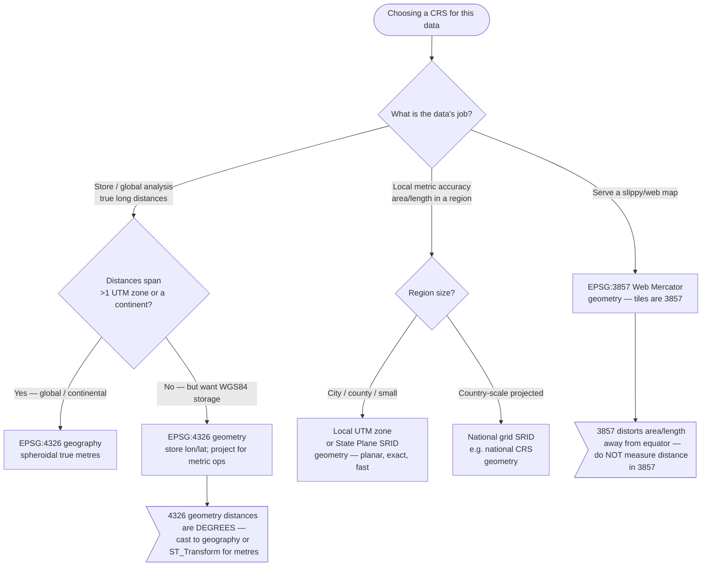
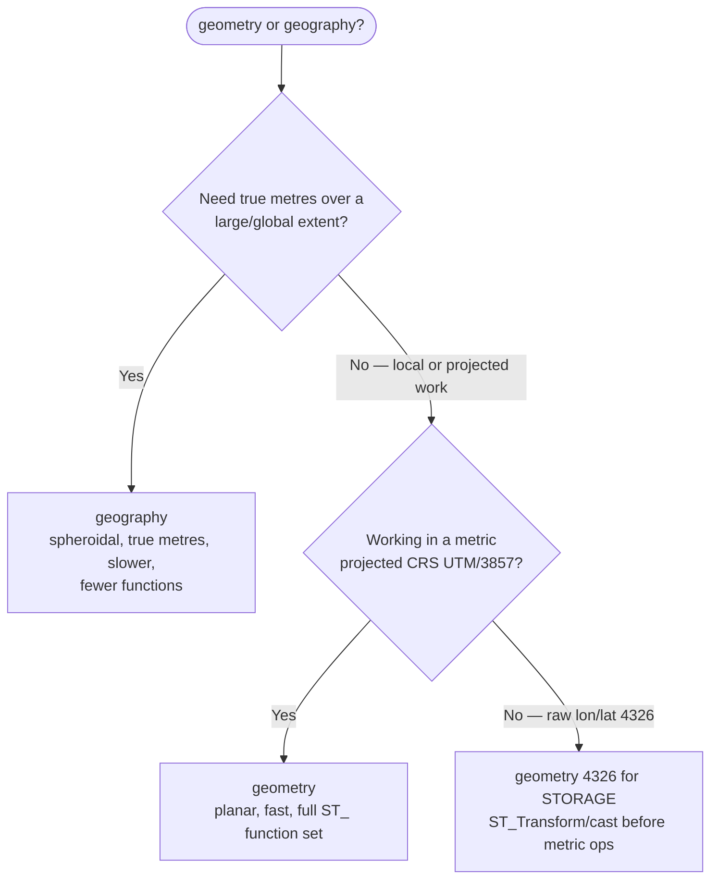

# Knowledge — Projection & CRS decision tree

> **Last reviewed:** 2026-06-17 · **Confidence:** High (canonical PostGIS / OGC / EPSG consensus; see Provenance).
> This file is the **CRS-selection decision tree** for the plugin: given a use-case, pick the SRID (coordinate reference system) and the geometry-vs-geography storage type **before** writing any DDL or query.
>
> **How the agents use it:** traverse the graph **top-to-bottom before naming an SRID** (the pre-action decision-tree traversal the Capability Grounding Protocol requires). Resolve each node against the *job the data does* — am I serving a web map, storing for global analysis, or measuring locally? — not against the data's incoming format.

---

## Decision Tree: which CRS for this job?

**When this applies:** You are about to create a geometry/geography column, reproject a dataset, or write a distance/area query and must choose a coordinate reference system. Not for "which index" (that's GiST regardless) or "which tile format" (see the serve-vector-tiles skill).

**Last verified:** 2026-06-17 against PostGIS documentation (geometry vs geography), the EPSG registry, and OGC CRS guidance — see Provenance.

### Per-leaf rationale

- **EPSG:3857 (Web Mercator), `geometry`** — the projection every web tile (MapLibre / Mapbox / Google / OSM) uses. Store or serve in 3857 when the job is *display*. **Never measure distance or area in 3857** — it is conformal, not equal-area, and distorts badly away from the equator.
- **EPSG:4326, `geography`** — WGS84 lon/lat on a spheroid. `ST_Distance`/`ST_DWithin` return **true metres** over any extent. The default for *global storage + correct long-distance measurement*; slower than planar `geometry`.
- **EPSG:4326, `geometry`** — store raw lon/lat, but remember distances are **degrees**; project (`ST_Transform`) or cast to `geography` for any metric operation.
- **Local UTM zone / State Plane, `geometry`** — a projected, metric, planar CRS exact for a city/county. Fastest and most accurate for *local* area/length; pick the zone the data falls in.

### Tradeoffs

| Choice | Distance/area units | Accuracy | Speed | Use when |
|---|---|---|---|---|
| 3857 geometry | distorted (don't measure) | display-only | fast | web map serving / tiles |
| 4326 geography | true metres, global | high everywhere | slower (spheroid) | global storage + true distances |
| 4326 geometry | degrees (project first) | n/a until projected | fast | WGS84 storage, project for ops |
| UTM / State Plane geometry | metres/feet, local | exact locally, wrong outside zone | fastest | local accuracy (city/county) |

---

## Geometry vs geography — the second decision

- **`geography`** — spheroidal calculations, results in metres, correct anywhere on Earth, but **slower** and supports a **smaller** set of `ST_` functions. Reach for it when correctness over a continent matters.
- **`geometry`** — planar (Cartesian) math in the column's projection. **Fast**, full function set, but distances/areas are in the projection's units (and meaningless if that projection is 4326 = degrees). Reach for it in a metric projected CRS (UTM / state-plane / 3857-for-display).
- **The trap:** `geometry(…, 4326)` distances are degrees. Either store as `geography(…, 4326)` (metres) or `ST_Transform` to a metric CRS before measuring.

---

## Provenance

- PostGIS documentation — "When to use Geography vs Geometry data type" and the projected-vs-geographic CRS guidance.
- EPSG registry — 4326 (WGS84 geographic), 3857 (Web Mercator), UTM and State Plane SRIDs.
- OGC / Web Mercator convention for slippy-map tiles (XYZ).

> Verify the specific UTM/state-plane SRID for a region against the EPSG registry before pinning it in a client deliverable — `[unverified — region-specific]` until you confirm the zone.

---

_Last reviewed: 2026-06-17 by `claude`_
