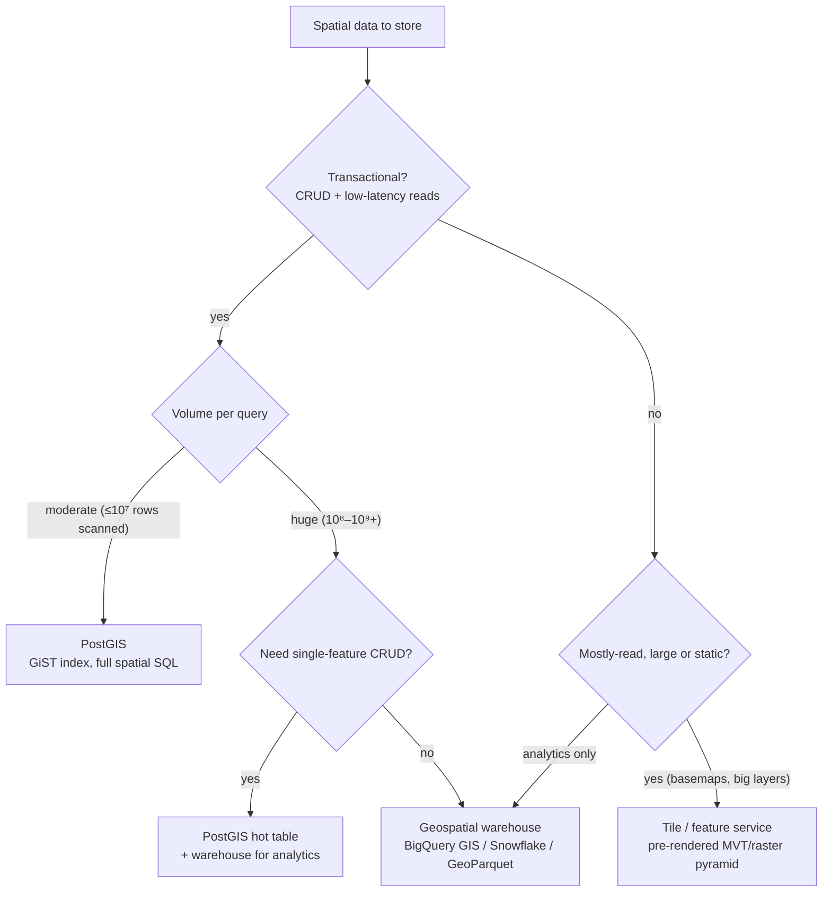
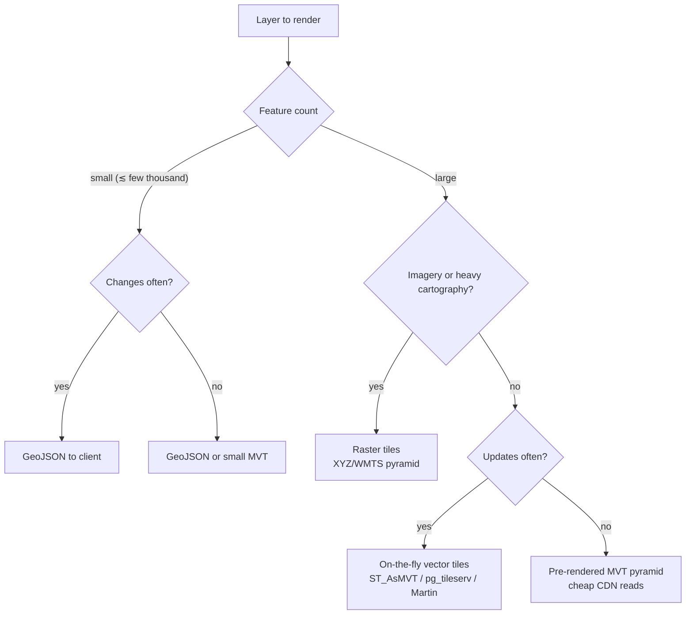

# Knowledge — Storage & web-serving decision trees

> **Last reviewed:** 2026-06-22 · **Confidence:** High (canonical PostGIS / warehouse / MVT consensus; see Provenance).
> Two CRS-adjacent decision trees the [`projection-decision-tree.md`](projection-decision-tree.md) deliberately leaves out: **where spatial data should live** (storage class) and **how to serve a layer to a web map** (serving format). The projection tree picks the *coordinate system*; these two pick the *system of record* and the *transport*.
>
> **How the agents use it:** traverse the relevant graph **top-to-bottom before choosing** a storage backend or a serving format (the pre-action decision-tree traversal the Capability Grounding Protocol requires) — resolve each node against the *workload*, not the data's incoming shape. The `geospatial-data-engineer` owns the storage tree; the `mapping-visualization-engineer` owns the serving-format tree.

---

## Decision Tree: where should spatial data live?

**When this applies:** You are choosing the system of record for a spatial dataset — a transactional PostGIS table, a geospatial warehouse, or a pre-rendered tile/feature service. Not for "which CRS" (that's the projection tree) or "which index" (GiST regardless).

**Rule:** name the workload first. Transactional + moderate → **PostGIS**; analytics at scale → a **geospatial warehouse** (BigQuery GIS / Snowflake / GeoParquet); mostly-read large/static → a **tile/feature service**. Don't use a warehouse as a map backend, or PostGIS as a billion-point analytics scanner.

---

## Decision Tree: serve a layer to a web map as…?

**When this applies:** You are choosing how a layer reaches the browser — GeoJSON, on-the-fly vector tiles, a pre-rendered MVT pyramid, or raster tiles. Complements the `serve-vector-tiles` skill (the *how*) with the *which*.

**Rule:** format follows feature count + cadence. Small/dynamic → **GeoJSON**; large/styleable → **vector tiles** (on-the-fly if it changes, pre-rendered if it doesn't); imagery → **raster tiles**. Never ship a giant GeoJSON or render N DOM markers — push the work to the server/tile pipeline.

---

## See also

- [`projection-decision-tree.md`](projection-decision-tree.md) — the CRS + geometry-vs-geography trees these two complement.
- [`geospatial-stack-2026.md`](geospatial-stack-2026.md) — the dated tooling rows (warehouses, tile servers, formats) these trees name.
- [`../skills/design-postgis-schema/SKILL.md`](../skills/design-postgis-schema/SKILL.md) — applies the storage tree once PostGIS is chosen.
- [`../skills/serve-vector-tiles/SKILL.md`](../skills/serve-vector-tiles/SKILL.md) — applies the serving-format tree.
- [`../best-practices/tile-large-layers-dont-ship-giant-geojson.md`](../best-practices/tile-large-layers-dont-ship-giant-geojson.md) — the serving-tree rule as a standalone best-practice.

## Provenance

- PostGIS documentation (transactional spatial SQL, GiST indexing, `ST_AsMVT`).
- BigQuery GIS / Snowflake geospatial / GeoParquet documentation (analytics-scale spatial storage).
- MVT specification; MapLibre GL / pg_tileserv / Martin / tippecanoe / PMTiles documentation (serving formats).

> Verify the specific warehouse capability or tile-server version against the vendor/project before pinning it in a client deliverable — these move quarterly (`geospatial-stack-2026.md`).

---

_Last reviewed: 2026-06-22 by `claude`_
