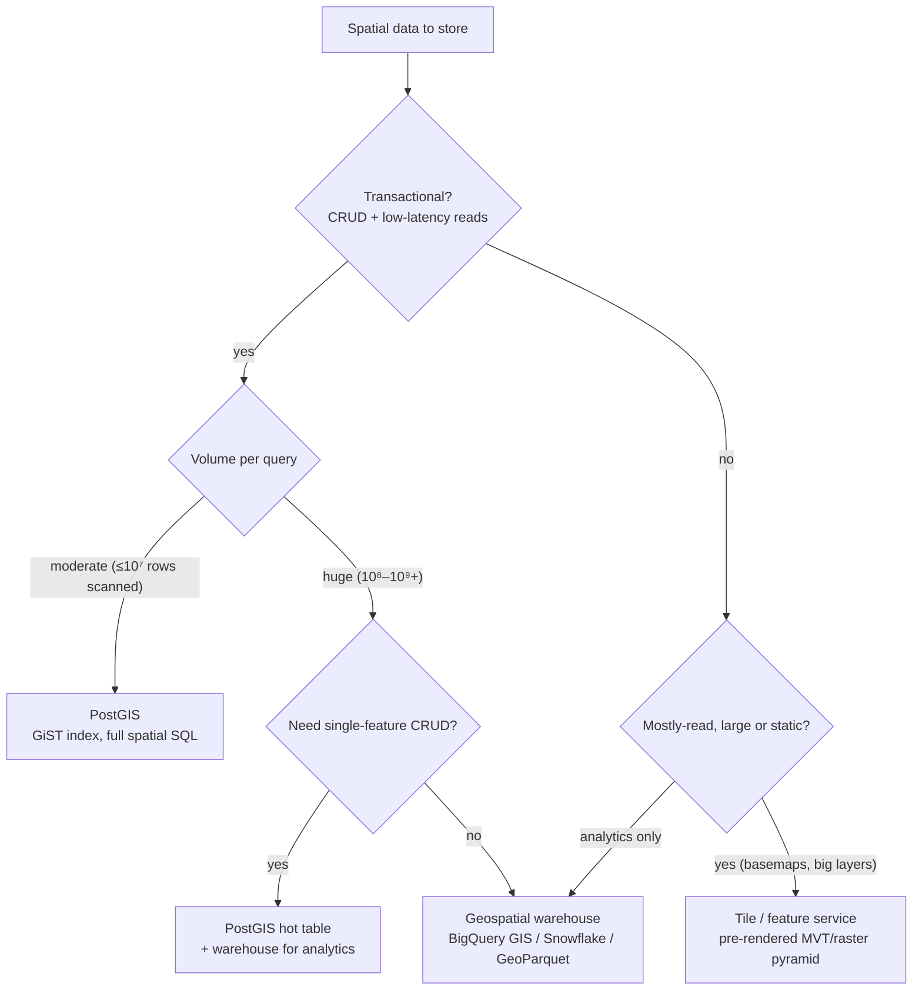
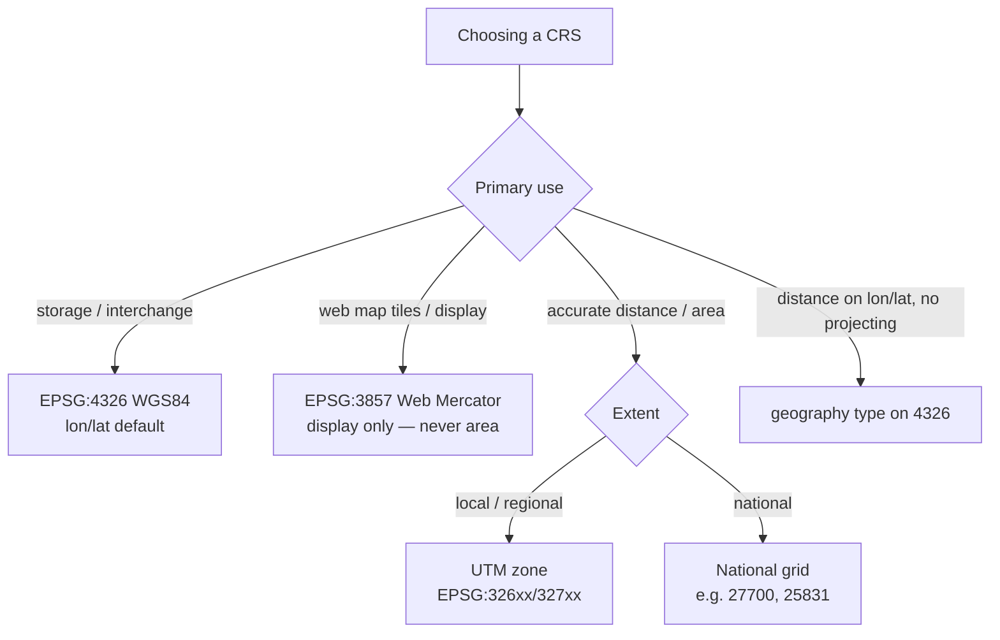
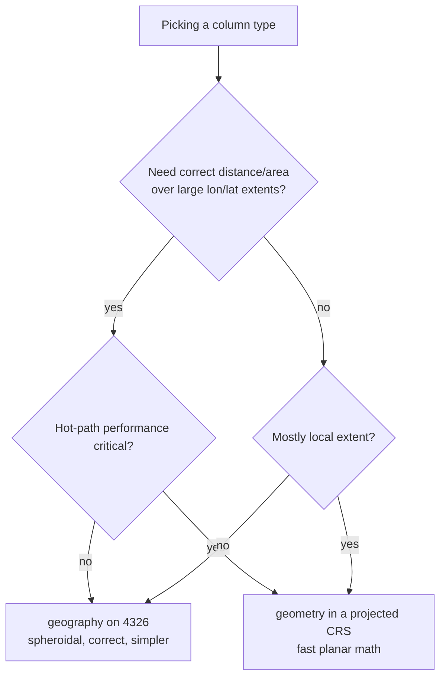
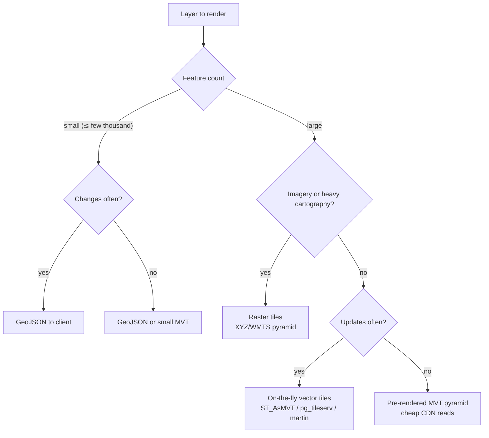

# Geospatial / GIS — Decision Trees

> Reference decision trees for the `geospatial-gis-engineering` team. Agents **traverse the relevant tree top-to-bottom before choosing** (the proactive complement to the Capability Grounding Protocol). Each `## Decision Tree` section is a Mermaid graph plus the rule it encodes.
>
> _Last reviewed: 2026-06-20 by `claude`. Principles are durable; specific product/library names live (dated) in [`geospatial-stack-2026.md`](geospatial-stack-2026.md)._

---

## Decision Tree: where should spatial data live?

**Rule:** name the workload first. Transactional + moderate → PostGIS; analytics at scale → a geospatial warehouse; mostly-read large/static → a tile/feature service. Don't use a warehouse as a map backend or PostGIS as a billion-point scanner.

---

## Decision Tree: which coordinate reference system (CRS)?

**Rule:** store 4326 by default; reproject on read. Project to a metric CRS (UTM/national grid) only for true distance/area math, or use the `geography` type. Web Mercator is for tiles, never for area.

---

## Decision Tree: geometry vs geography column type

**Rule:** `geography` when correctness on lon/lat over big extents matters and you can afford it; `geometry` (projected) when you need speed or area/length math. Decide per column, profile before optimizing.

---

## Decision Tree: serve features to a web map as…?

**Rule:** format follows feature count + cadence. Small/dynamic → GeoJSON; large/styleable → vector tiles (on-the-fly if it changes, pre-rendered if it doesn't); imagery → raster. Never ship a giant GeoJSON or render N DOM markers.

---

## See also

- [`geospatial-stack-2026.md`](geospatial-stack-2026.md) — dated tooling/library capability map (re-verify before quoting versions).
- Skills: [`../skills/choose-spatial-storage/SKILL.md`](../skills/choose-spatial-storage/SKILL.md), [`../skills/design-coordinate-reference-system/SKILL.md`](../skills/design-coordinate-reference-system/SKILL.md), [`../skills/write-spatial-queries/SKILL.md`](../skills/write-spatial-queries/SKILL.md), [`../skills/build-map-tiles-and-serving/SKILL.md`](../skills/build-map-tiles-and-serving/SKILL.md).
