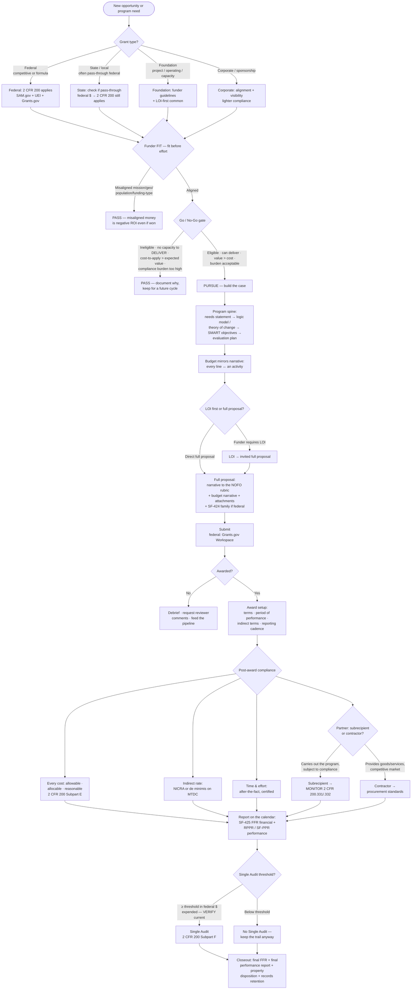

# Knowledge — Grants lifecycle decision tree

> **Last reviewed:** 2026-07-09 · **Confidence:** Medium-High (consensus on the lifecycle stages, the fit-before-effort / go-no-go framing, and the durable federal mechanics; **specific 2 CFR 200 figures, SF-form versions, de minimis rate, Single Audit threshold, and portal behavior are volatile — re-verify against the primary source (eCFR, Grants.gov, SAM.gov) before a client commitment**). **Not legal or accounting advice.**
> The most-asked grants questions are "should we even apply to this?" and "now that we won it, how do we keep it clean?". This is the decision tree the `grants-strategy-lead` and `grants-compliance-and-reporting-specialist` traverse **before** a go/no-go or a compliance call, plus the funder/grant-type matrix, the subrecipient-vs-contractor test, and the seams to adjacent plugins.

The team's discipline: **score fit before spending effort, gate pursuit on a real go/no-go, chain the program design to a logic model, and — post-award — pass every cost through allowable/allocable/reasonable before charging it.** Individual/major-donor fundraising is **not** grants management (→ `nonprofit-fundraising`); *being* the funder is **not** grants management (→ `public-sector-govtech`); the general ledger is **not** grants management (→ `accounting-bookkeeping`).

---

## Decision Tree: the grant lifecycle

Traverse top-to-bottom. Gate on **grant type** first, then **funder fit**, then the **go/no-go**, then apply → award → comply → report → close.

---

## Funder & grant-type matrix

| Funder type | Typical grant | Compliance weight | Watch out for |
|---|---|---|---|
| **Federal (direct)** | Project or formula; competitive (discretionary) or formula/block | Heaviest — full 2 CFR 200 Uniform Guidance | SAM.gov registration + UEI must be current; Grants.gov Workspace; SF-424 family; indirect rate basis |
| **State / local** | Often a **pass-through** of federal dollars | Heavy if pass-through (2 CFR 200 flows down) | Determine if the money is federal-origin — it changes everything about compliance |
| **Foundation** | Project, **general operating**, or **capacity-building** | Lighter, funder-defined | LOI-first is common; read the guidelines as the rubric; general-operating is rarer and prized |
| **Corporate / sponsorship** | Program sponsorship, cause marketing | Lightest | Alignment + brand visibility drive it; watch for strings that distort the mission |

**Grant shape orthogonal to funder:**
- **Project** (restricted to a defined program) vs **general operating** (unrestricted-ish, flexible, harder to win) vs **capacity-building** (invest in the org's infrastructure).
- **Competitive/discretionary** (you compete on a rubric) vs **formula/block** (eligibility-based allocation, less a writing contest than a compliance one).

---

## The subrecipient-vs-contractor test (2 CFR 200.331)

A **substance** test, never the label on the agreement. Get it wrong and you either miss required monitoring (a subaward mislabeled a contract) or over-burden a vendor.

| Characteristic points to a **SUBRECIPIENT** | Characteristic points to a **CONTRACTOR** |
|---|---|
| Determines *who is eligible* to receive federal assistance | Provides goods/services within its **normal business** |
| Has its **performance measured** against program objectives | Provides similar goods/services to **many** purchasers |
| Responsible for **programmatic decision-making** | Operates in a **competitive** environment |
| Responsible for adherence to applicable **federal program requirements** | Provides goods/services **ancillary** to the program |
| Uses the funds to **carry out a program** (not provide goods/services to it) | Is **not** subject to the program's compliance requirements |

- **Subrecipient** → you must do **subrecipient monitoring** (risk assessment, reviewing their reports, ensuring their Single Audit if applicable, follow-up on findings) — 2 CFR 200.332.
- **Contractor** → **procurement standards** apply (2 CFR 200.317–.327) — competition, documentation, cost/price analysis.
- Make the call on the **five characteristics** in the aggregate, document the reasoning, and don't let the paperwork's title decide it.

> **Volatile:** the exact 2 CFR section numbers, the de minimis indirect rate, and the Single Audit threshold have all moved across Uniform Guidance revisions. Treat the citations here as a 2026-07 snapshot and re-verify against **eCFR** before a client commitment.

---

## Where checks happen across the lifecycle (the block-vs-proceed of grants)

- **Pre-award gate — go/no-go.** The cheapest place to stop a bad pursuit. A *pass* here is a win, not a failure.
- **Proposal gate — the NOFO-criteria crosswalk.** Every scored criterion answered before submission; an unaddressed criterion is lost points you chose to lose.
- **Cost gate — allowable/allocable/reasonable.** Every charge, before it hits the award. "We budgeted it" is not a gate.
- **Reporting gate — the compliance calendar.** FFR/RPPR deadlines, drawdown windows, and the period of performance tracked from day one; a missed report is an avoidable failure.
- **Closeout gate — the checklist.** Final reports, property disposition, records retention — audit-ready, not a scramble.

---

## Seams (grants management is grantee-side lifecycle, not the whole funding world)

- **Individual & major-donor giving, annual fund, capital campaigns, events, donor CRM** → `nonprofit-fundraising` ("raise philanthropic dollars from people" — a different discipline from institutional grant capture).
- **Designing a funding program / authoring a NOFO as the grantMAKER / award-decision policy** → `public-sector-govtech` (the funder's side of the table).
- **The general ledger, chart of accounts, payroll, the 990** → `accounting-bookkeeping` (this team does grant cost allowability + fund reporting, not the books).
- **Institutional sponsored-programs office / F&A-rate negotiation / effort systems at scale** → `higher-education-administration`.
- **Org-wide compliance-program design beyond a grant's own terms** → `regulatory-compliance`.

---

## Provenance

- Lifecycle stages, fit-before-effort / go-no-go framing, logic-model/theory-of-change, and budget-mirrors-narrative are consensus grants-practice, reviewed 2026-07-09 — **High confidence**.
- Federal mechanics (2 CFR Part 200 Uniform Guidance cost principles + Subpart F Single Audit, indirect rates / NICRA / de minimis on MTDC, SAM.gov + UEI, Grants.gov Workspace, SF-424 family, SF-425 FFR, RPPR, 2 CFR 200.331 subrecipient-vs-contractor) reflect the Uniform Guidance as of 2026-07 — **specific figures, form versions, section numbers, the de minimis rate, and the Single Audit threshold are volatile and MUST be re-verified against eCFR / Grants.gov / SAM.gov before quoting.** **Not legal or accounting advice.**
