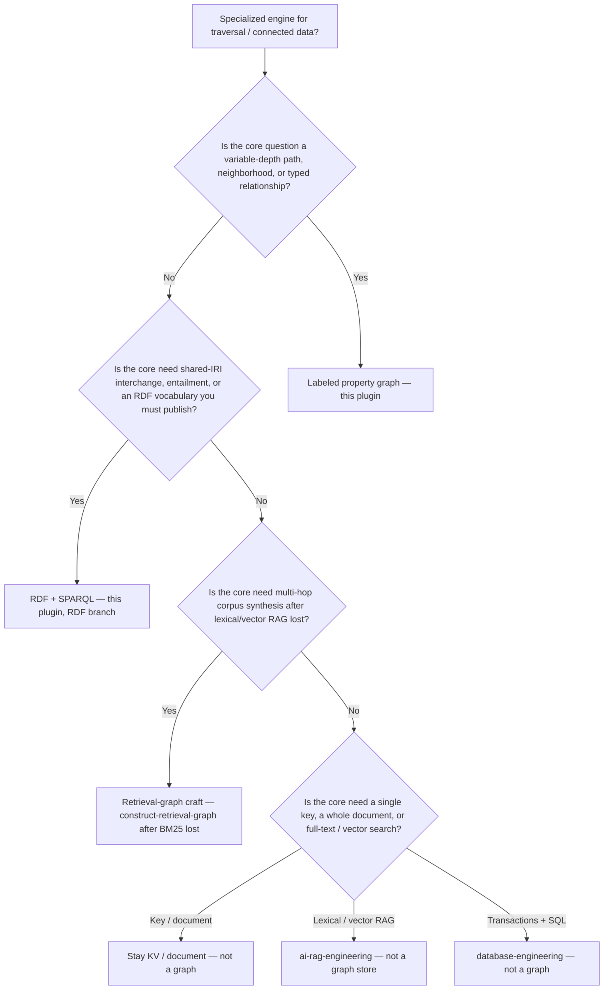

# Graph vs relational — decision tree

**Last reviewed:** 2026-08-14
**Starts from:** `database-engineering` SQL-vs-NoSQL tree leaf *“Full-text / vector / graph traversal is the core need? → Specialized engine for that one need.”* This file **is** that specialized-engine leaf for graphs.

If the workload is multi-row transactions, ad-hoc SQL, and known-schema records, **stop** and stay in [`database-engineering`](../../database-engineering/). Do not start here.

## Honest “not a graph” list

Stay off a graph when **any** of these is the real job:

- **Transactions you will roll back.** Multi-row ACID over a known schema is relational.
- **Single-key lookup.** A primary-key get is not a traversal.
- **Whole-document read/write.** That is a document store.
- **Lexical or vector RAG that has not lost yet.** Hand to `ai-rag-engineering`. GraphRAG is a *later* move.
- **“We might want a graph later.”** That is not a reason to dual-write today.

## When the LPG branch wins

The question is a **path** (who-knows-who, depends-on, bill-of-materials, fraud ring) whose depth is not known at write time, and the payload on the *edge* matters (type, properties, direction).

## When the RDF branch wins

You need **shared IRIs**, published vocabularies, or entailment (OWL/RDFS). Application traversal with rich edge properties is usually the LPG, not RDF.

## When the retrieval-graph branch wins

A corpus question is **multi-hop** (“how do these entities relate across documents?”) **and** a BM25 / hybrid-vector baseline has already lost on *your* eval set. Construction is this plugin; paradigm III.a vs BM25 is `memory-engineering`; chunking and recall@k are `ai-rag-engineering`.

## See also

- [`lpg-modeling-catalog.md`](lpg-modeling-catalog.md)
- [`graphrag-construction.md`](graphrag-construction.md)
- [`../skills/choose-graph-or-not/SKILL.md`](../skills/choose-graph-or-not/SKILL.md)
- `plugins/database-engineering/knowledge/database-engineering-decision-trees.md` (the leaf this tree starts from)

## Sources

- This-session read of `plugins/database-engineering/knowledge/database-engineering-decision-trees.md` (C04).
- W3C RDF 1.1 Primer + SPARQL (C17, C18) — https://www.w3.org/TR/rdf11-primer/ (retrieved 2026-08-14).
- Neo4j getting-started property-graph model (C17) — https://neo4j.com/docs/getting-started/graph-database/ (retrieved 2026-08-14).
