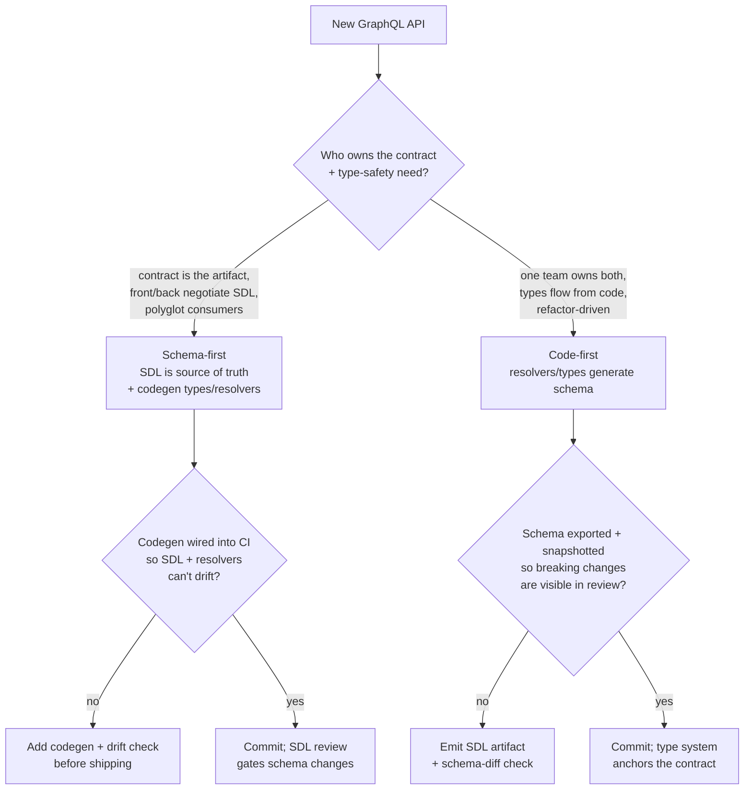
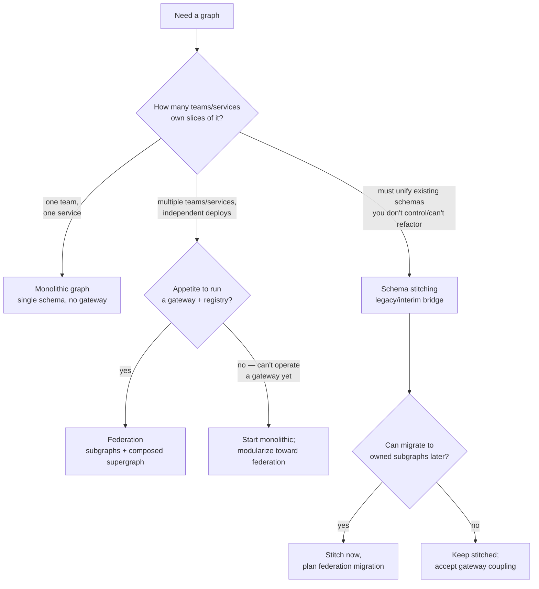
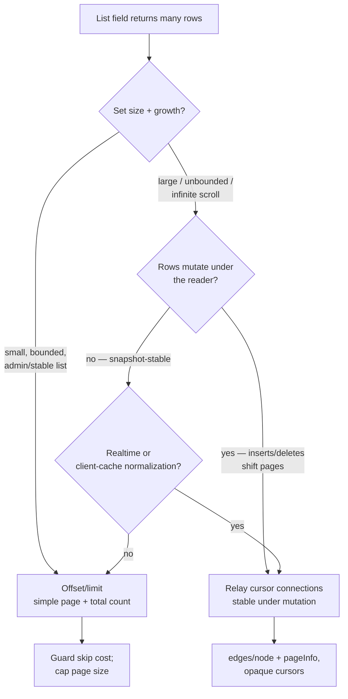

# GraphQL Engineering — Decision Trees

> Reference decision trees for the `graphql-engineering` team. Agents **traverse the relevant tree top-to-bottom before deciding** (the proactive complement to the Capability Grounding Protocol). Each `## Decision Tree` section is a Mermaid graph plus the rule it encodes.
>
> **Engineering judgment, not a spec ruling.** Anything touching a GraphQL library, the spec, or a version — feature support, transport, directive availability — is `[verify-at-use]`: confirm against the library/spec docs before it drives a build commitment. No PII.
>
> _Last reviewed: 2026-07-05 by `claude`. Principles are durable; dated specifics live in [graphql-reference-2026.md](graphql-reference-2026.md)._

---

## Decision Tree: schema-first vs code-first



**Rule:** decide on **who owns the contract and the team's type-safety path**, not framework fashion. Schema-first when the SDL is the negotiated artifact across teams/languages; code-first when one team owns both sides and types should flow from code. Either way, make the schema a reviewed, drift-checked artifact — library/codegen specifics `[verify-at-use]`.

---

## Decision Tree: monolithic graph vs federation vs schema stitching



**Rule:** let **org and ownership boundaries** pick the topology, not schema size alone. One team → monolithic graph. Multiple teams owning slices, with the operational appetite for a gateway + schema registry → federation. Reach for stitching only as a legacy/interim bridge over schemas you can't refactor, with a migration plan. Composition/gateway specifics `[verify-at-use]`.

---

## Decision Tree: pagination style — offset vs Relay cursor connections



**Rule:** default to **Relay cursor connections** for large, realtime, infinite-scroll, or mutation-heavy lists — cursors stay stable when rows shift and match client-cache conventions. Reserve **offset/limit** for small, stable admin lists where a page number and total are what's actually wanted. Watch deep-offset cost either way. Connection-spec details `[verify-at-use]`.

---

## Decision Tree: error model — top-level errors vs errors-as-data

```mermaid
flowchart TD
    A[An operation can fail] --> B{Is the failure expected<br/>domain behavior?}
    B -- "no — bug, outage,<br/>auth/system fault" --> C[Top-level errors array<br/>unexpected/system failures]
    B -- "yes — validation,<br/>not-found, conflict,<br/>business rule" --> D{Should the client<br/>handle it typed?}
    D -- yes --> E[Errors-as-data<br/>union/result payload types]
    D -- "no — treat as fatal" --> C
    E --> F[Mutation returns<br/>Success | DomainError union;<br/>client matches on __typename]
    C --> G[Map to error extensions/code;<br/>don't leak internals]
```

**Rule:** split by **expectedness**. Unexpected/system failures (bugs, outages, auth) belong in the **top-level `errors`** array with safe codes and no leaked internals. Model **expected domain failures as data** — union/result payload types the client discriminates on `__typename` — so predictable outcomes are part of the typed schema, not exception handling. Framework/union-type ergonomics `[verify-at-use]`.

---

## See also

- [graphql-reference-2026.md](graphql-reference-2026.md) — dated server-library, federation, spec-feature, security, and observability landscape (verify-at-use).
