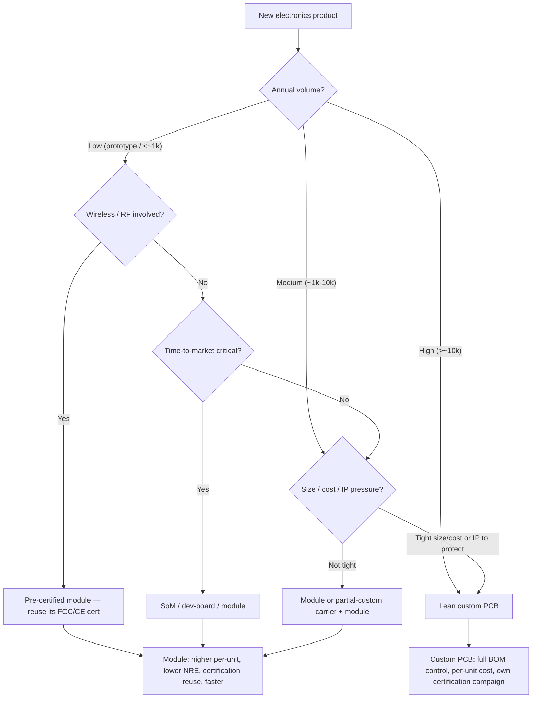

# Module vs custom-PCB decision tree

> Read this **before committing to a custom board**. Build-vs-buy is the
> highest-leverage hardware decision — a pre-certified module can save months and a
> whole EMC campaign at low volume; a custom PCB wins on per-unit cost and size at
> scale. Decide it against **volume × cost × size × certification × time-to-market**,
> not preference. Durable mechanics; the perishable part/fab specifics are in
> [`eda-fab-and-compliance-2026.md`](eda-fab-and-compliance-2026.md).

## The tree

## How to read it

1. **Volume drives it.** Low volume → the module's higher per-unit cost is dwarfed by
   the NRE, layout, and certification you avoid. High volume → the custom board's lower
   per-unit cost pays back the NRE many times.
2. **Wireless/RF is a special case.** A **pre-certified radio module** lets you reuse
   its FCC/CE modular approval — designing a discrete radio means your own (expensive,
   uncertain) intentional-radiator certification. At anything but high volume, the
   module almost always wins here.
3. **Time-to-market can override volume.** If shipping in weeks matters more than
   per-unit cost, a SoM/module/dev-board gets you there; optimize to custom later once
   the product is proven.
4. **Size, cost, and IP pull toward custom.** Tight enclosure size, aggressive BOM
   cost at volume, or a design you must protect all favor a custom board.
5. **A middle path exists.** A custom **carrier board + a module** (e.g. a SoM on your
   own baseboard) captures much of the module's certification/speed benefit with some
   custom integration — often the right medium-volume answer.

## The three failure modes this tree prevents

- **Spinning a custom board at prototype volume** — paying NRE + a full EMC campaign
  to save per-unit cost that doesn't matter yet.
- **Designing a discrete radio to save a few dollars** — then eating months and real
  money on intentional-radiator certification a module would have provided.
- **Locking into a module at high volume** — leaving per-unit margin on the table that
  a custom board would have recovered many times over.

## Seam note

Once build-vs-buy is set, the **BOM, power tree, and pre-compliance** are the
architect's; **schematic + layout + DFM** are the PCB engineer's. The dated part/fab/
regulatory specifics live in
[`eda-fab-and-compliance-2026.md`](eda-fab-and-compliance-2026.md).
