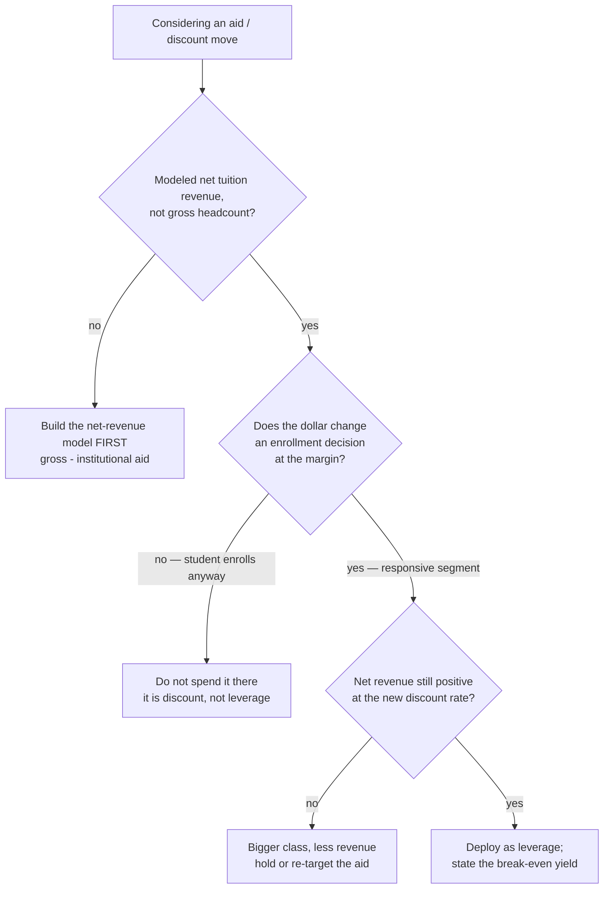
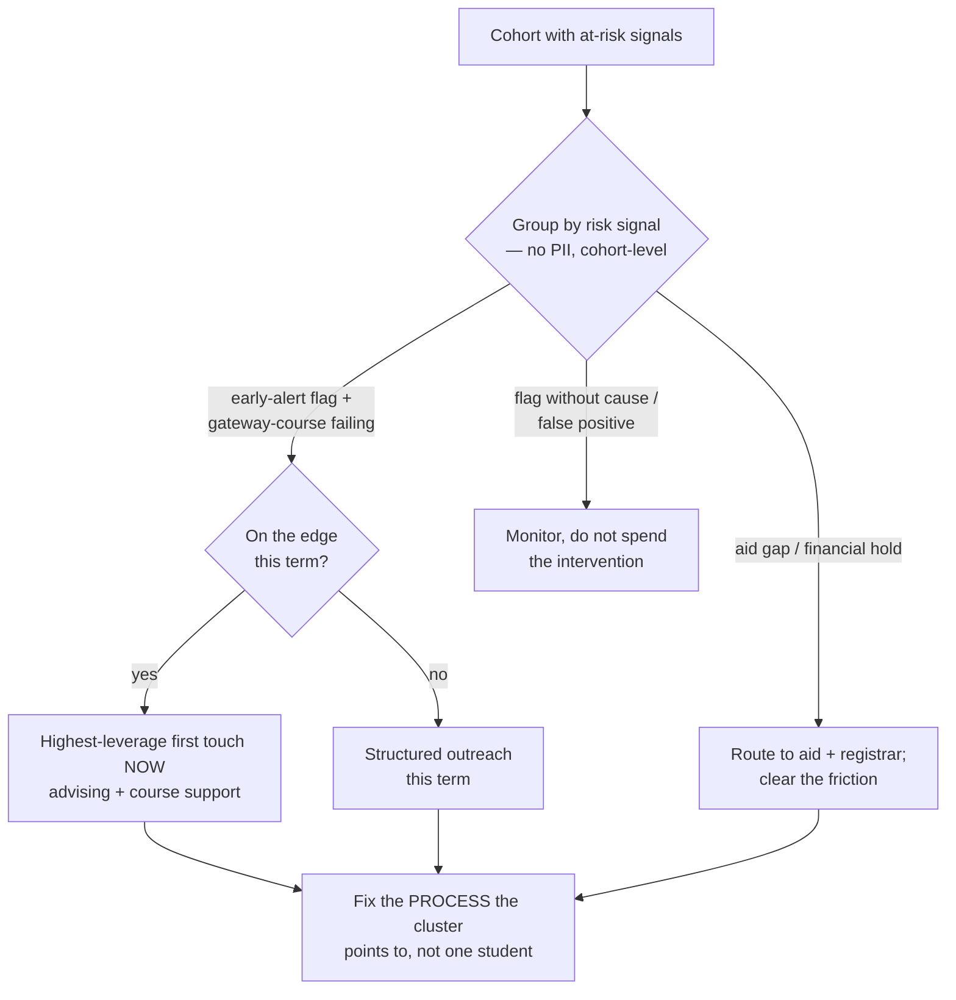
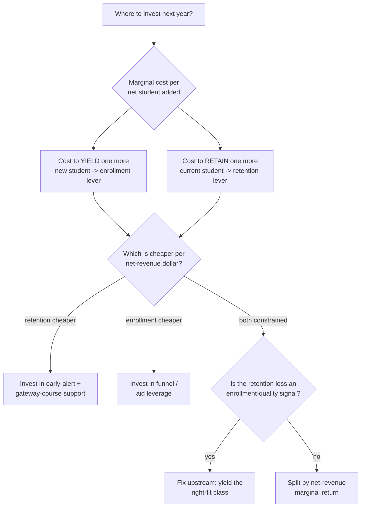

# Higher-Education Administration — Decision Trees

> Reference decision trees for the `higher-education-administration` team. Agents **traverse the relevant tree top-to-bottom before deciding** (the proactive complement to the Capability Grounding Protocol). Each `## Decision Tree` section is a Mermaid graph plus the rule it encodes.
>
> **Advisory operations knowledge, not legal, financial-aid-compliance, or academic-policy advice.** Anything touching a funnel benchmark, discount-rate norm, aid rule, or retention/persistence metric definition is `[verify-at-use]` — confirm against the institution's own IR definitions, the aid office, and the accreditor before acting. FERPA-aware: cohorts and policy only, no student PII.
>
> _Last reviewed: 2026-07-02 by `claude`. Principles are durable; dated benchmarks and metric definitions live in [`higher-ed-reference-2026.md`](higher-ed-reference-2026.md)._

---

## Decision Tree: yield / melt intervention

```mermaid
flowchart TD
    A[Class softer than target] --> B{Where in the funnel?}
    B -- "admits enrolling below plan<br/>(yield gap)" --> C{Aid competitive vs<br/>peer offers? [verify-at-use]}
    C -- no --> D[Aid-leverage move on the<br/>responsive admit segment]
    C -- yes --> E{Yield gap by segment<br/>or across the board?}
    E -- "segment" --> F[Targeted recruitment / touch<br/>on the leaking segment]
    E -- "across the board" --> G[Fit / timing / competitiveness<br/>review of the whole offer]
    B -- "deposits melting before<br/>census (melt gap)" --> H{Melt-season touch<br/>in place?}
    H -- no --> I[Fund a melt-season<br/>communication + support plan]
    H -- yes --> J[Segment melt by cause<br/>aid, transfer, fit, logistics]
```

**Rule:** defend the yield you've earned before buying more top-of-funnel. A melt-season intervention is almost always cheaper per net student than replacing the loss with new inquiries — yield is cheaper to defend than to replace. Aid moves target the segment whose decision actually changes (`[verify-at-use]`).

---

## Decision Tree: discount-rate / aid-leverage decision



**Rule:** the discount rate is a strategy, not an accident. Model net tuition revenue at each scenario, spend aid only where it does yield work at the margin, and never let the rate drift upward package-by-package. State the break-even yield before committing (`[verify-at-use]`).

---

## Decision Tree: at-risk student triage



**Rule:** retention is an early-alert problem — triage the cohort by *leverage*, not by alarm, and put the first touch where it changes an outcome. A recurring at-risk cluster is a process signal (a gateway course, an aid gap, an onboarding gap), not a series of individual bad-luck cases. Metric definitions are `[verify-at-use]`; no student PII.

---

## Decision Tree: enrollment-vs-retention lever choice



**Rule:** enrollment and retention are two levers on the *same* net-tuition-revenue outcome — compare the marginal cost of a yielded student against a retained one before allocating. A retained student usually costs less than replacing them, but a retention loss that traces to a mis-yielded class is an enrollment-quality problem to fix upstream (`[verify-at-use]`).

---

## See also

- [`higher-ed-reference-2026.md`](higher-ed-reference-2026.md) — dated benchmarks + metric definitions (verify-at-use).
- Skills: [`../skills/enrollment-funnel-and-yield/SKILL.md`](../skills/enrollment-funnel-and-yield/SKILL.md), [`../skills/financial-aid-and-discount-rate/SKILL.md`](../skills/financial-aid-and-discount-rate/SKILL.md), [`../skills/retention-and-student-success/SKILL.md`](../skills/retention-and-student-success/SKILL.md), [`../skills/registrar-and-academic-operations/SKILL.md`](../skills/registrar-and-academic-operations/SKILL.md).
