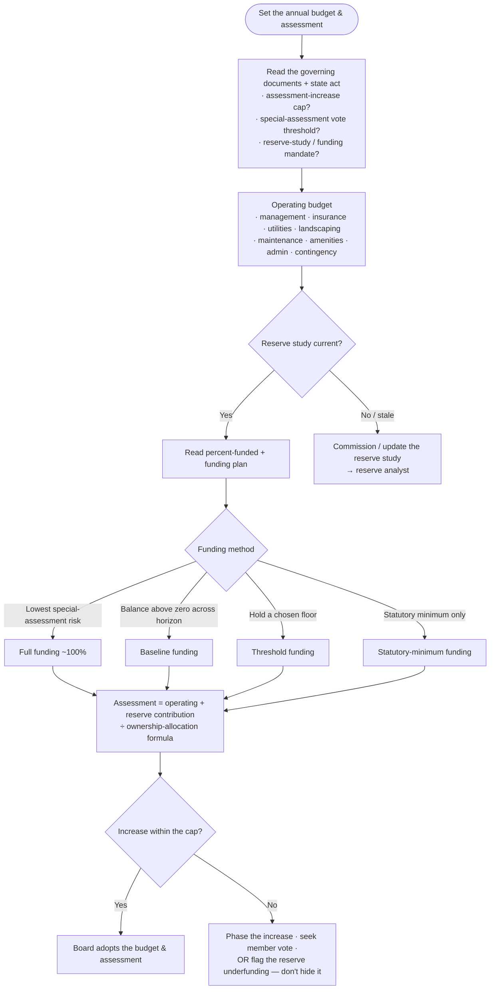
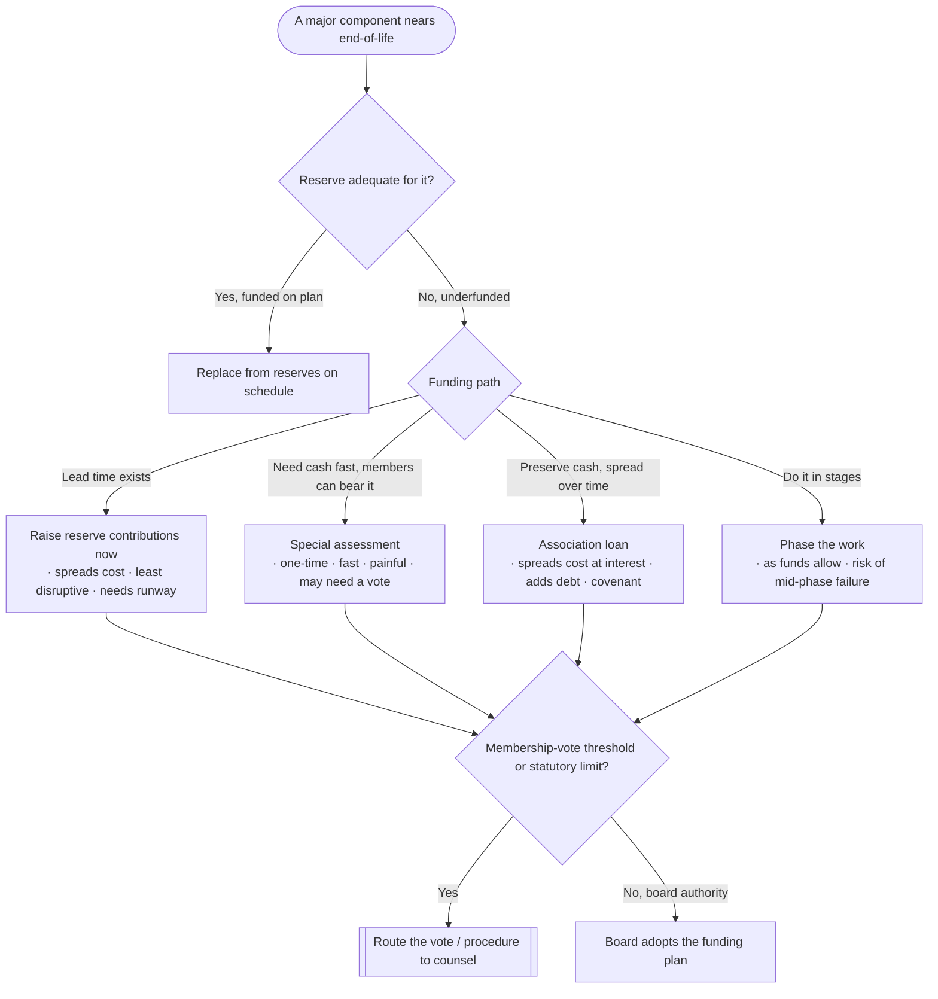
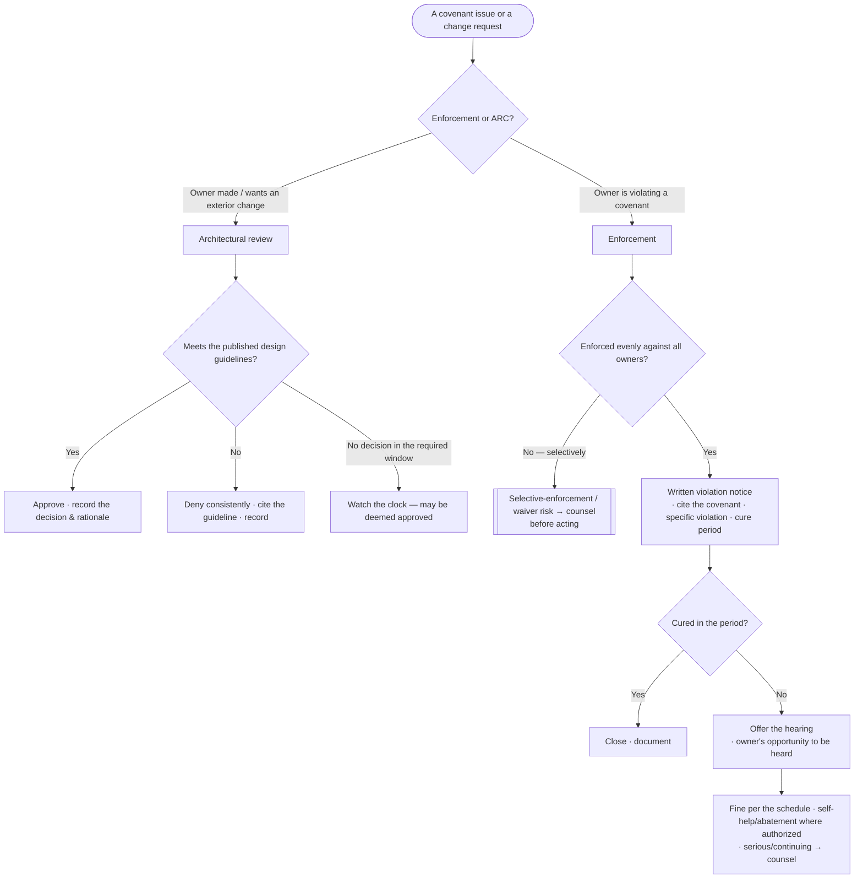
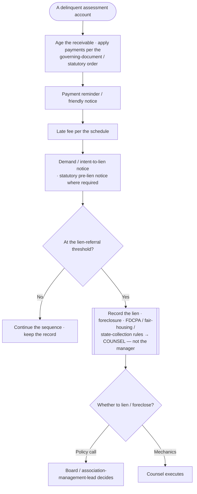

# Knowledge — HOA / community-association decision trees

> **Last reviewed:** 2026-07-17 · **Confidence:** Medium-High (consensus on the governing-document-first, budget-and-reserve, even-handed-enforcement, collections-to-the-legal-gate, insurance, and developer-transition framings, and on the board-decides/manager-advises separation; **specific HOA/condo statutes, assessment caps, special-assessment vote thresholds, lien priority & foreclosure procedure, reserve-study standards, ARC deemed-approval timeframes, notice/quorum/records-retention rules, and fair-housing/FDCPA/state-collection rules are volatile and jurisdiction-specific — re-verify before acting and route legal questions to counsel**).
> The most-asked community-association questions are "what do we budget and charge?", "how much do we fund the reserves / how do we fund the next big project?", "can we enforce this covenant / approve this change?", "when do we lien a delinquent owner?", "how do we run the meeting and keep records?", and "how do we transition from the developer?". These are the decision trees the `association-management-lead` traverses **before** setting a policy or naming an action, plus the trade-off tables and the seams to adjacent plugins.

The team's discipline: **read the governing documents first (they are the constitution), fund reserves on the study, enforce evenly by the documented process, and keep the board-decides / manager-advises line.** This is **not legal, financial, or insurance advice** — volatile statute/lien/reserve specifics carry a retrieval date and are verified at use, and legal questions route to **counsel**. A landlord's rental units and leases leave this layer for `property-management`; this plugin owns the **community association** and its common-interest governance.

---

## Decision Tree 1: budget & assessment (dues) setting

Gate on the **governing-document authority**, then budget **operating + reserves**.

---

## Decision Tree 2: reserve funding & the major-project decision

Only fund the **study's plan**; pick the **funding path** by the trade-offs.

> **The classic failure:** holding dues artificially low by **starving reserves**. Deferred reserve funding is a special assessment waiting to happen — the members pay either way, and later is more expensive and more disruptive.

---

## Decision Tree 3: covenant enforcement & architectural review

Enforce **evenly** by the **documented due process**, or don't enforce at all.

---

## Decision Tree 4: assessment collections & delinquency

Sequence the steps **evenly**; **stop at the legal line**.

> **The legal line:** the manager runs the reminders, late fees, and demand notices **evenly**; recording a **lien**, **foreclosing**, and complying with **FDCPA / fair-housing / state-collection** rules are **counsel's** — never advised in-plugin as legal steps.

---

## Trade-off table — major-project funding

| Path | Sweet spot | Watch out for |
|---|---|---|
| **Raise reserves now** | Lead time exists before the component fails | Needs runway; may exceed an assessment-increase cap |
| **Special assessment** | Cash needed fast; members can bear a one-time hit | Painful; may need a membership vote; hardship exposure |
| **Association loan** | Preserve cash, spread cost over years | Interest cost; adds debt + a lender covenant; pledges future assessments |
| **Phase the work** | Budget can't cover it all at once | Component may fail mid-phase; escalating cost |

## Trade-off table — reserve-funding methods

| Method | Sweet spot | Watch out for |
|---|---|---|
| **Full funding (~100%)** | Lowest special-assessment risk; smoothest dues | Highest current contribution |
| **Baseline** | Keep the balance above zero across the horizon | Thin cushion; a surprise can force a special assessment |
| **Threshold** | Hold a chosen percent-funded floor | Judgment call on the floor |
| **Statutory minimum** | Meets the legal floor at the lowest cost | Often underfunds — highest special-assessment risk |

## Trade-off table — insurance layers (route the design to a broker)

| Coverage | Protects | Watch out for |
|---|---|---|
| **Master property policy** | The common elements / buildings (per the declaration's coverage form) | Bare-walls vs all-in vs single-entity form — mismatch to the CC&Rs leaves a gap |
| **General liability** | The association vs common-area injury claims | Adequate limits vs the amenity risk (pool, playground) |
| **D&O (directors & officers)** | Board members vs governance/decision claims | Volunteer-board exposure; check the enforcement/discrimination coverage |
| **Fidelity / crime** | Association funds vs theft (manager/board) | Statute/document may mandate a minimum limit |

---

## Seams (this is the community-association layer, not the whole real-estate stack)

- **Lien, foreclosure, statute interpretation, fair-housing / FDCPA, governing-document amendment, contested hearings** → **counsel** (`legal-small-firm`) — this plugin runs the business process, not the legal one; it is **not legal advice**.
- **A landlord's rental units, tenant leases, rent collection, evictions** → `property-management` (rental operations of individual units; distinct from the community association).
- **Buying or selling a home in the community** (the resale certificate / estoppel package feeds it) → `residential-real-estate-brokerage`.
- **CRE brokerage / asset management** → `commercial-real-estate` (not the common-interest community).
- **The audit, tax return (e.g., Form 1120-H), and bookkeeping** → `accounting-bookkeeping`.
- **Investing / banking the reserve and operating funds** → `treasury-management` (safety > liquidity > yield on reserve cash).
- **The reserve study itself, and component-condition engineering** → a **reserve analyst / engineer** (procured, not produced in-plugin).

---

## Provenance

- Durable framings (governing-documents-first, operating + reserve budgeting, fund-reserves-on-the-study, the reserve-funding-method and major-project-funding trade-offs, even-handed documented enforcement due process, architectural review against published guidelines, the collections sequence to the legal gate, the board-decides / manager-advises separation, minutes-and-records as the legal shield, the insurance layers, and developer-to-homeowner transition) are consensus community-association-management practice reviewed 2026-07-17 — **High confidence**.
- Specific **HOA/condo statutes, assessment caps, special-assessment vote thresholds, lien priority & foreclosure procedure, reserve-study standards, ARC deemed-approval timeframes, notice/quorum/records-retention & owner-inspection rules, and fair-housing/FDCPA/state-collection rules** are **volatile and jurisdiction-specific**, carry retrieval dates, and are **not legal, financial, or insurance advice** — re-verify with `ravenclaude-core/deep-researcher` and confirm with **counsel** before acting. _(Reviewed 2026-07-17.)_
