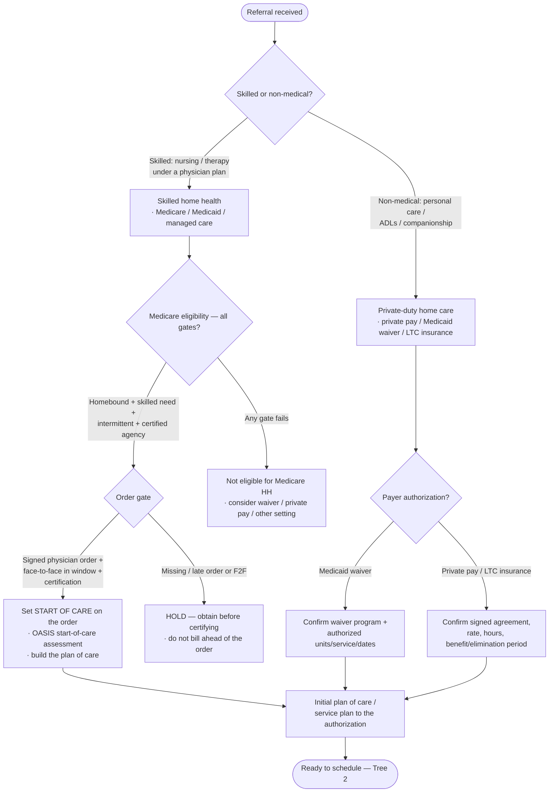
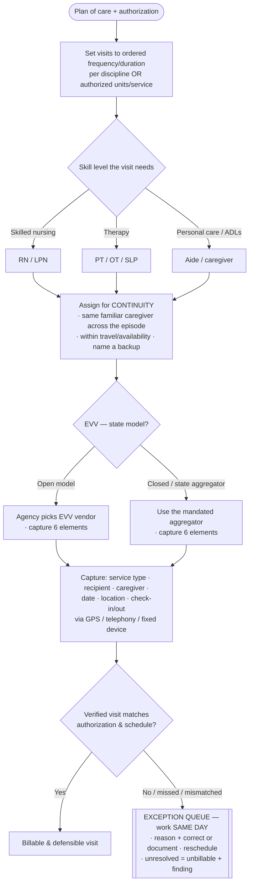
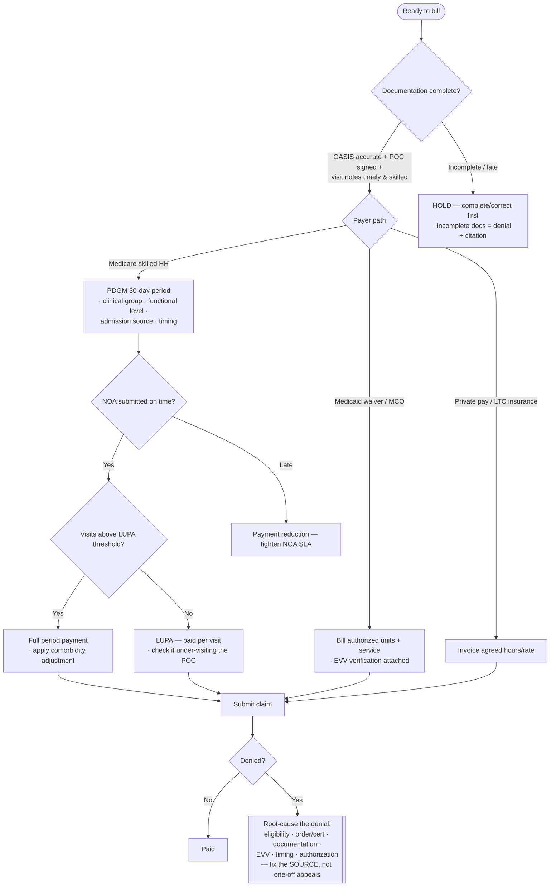
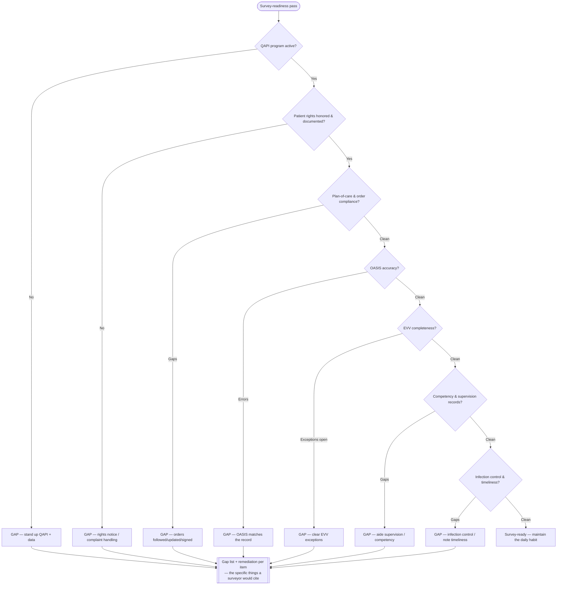

# Knowledge — Home-health-care decision trees

> **Last reviewed:** 2026-07-17 · **Confidence:** Medium-High (consensus on the service-line/eligibility, staffing-and-continuity, PDGM-billing, and survey/CoP framings, and on the "eligibility + order gate the start of care" and "EVV is mandatory" principles; **specific PDGM rates & case-mix weights, OASIS versions, EVV state models, CoP interpretive guidance, and VBP methodology are volatile — re-verify before a billing, survey, or board commitment**).
> The most-asked home-health questions are "is this patient eligible and can we get paid?", "skilled home health or non-medical home care?", "how do we schedule and verify visits?", "how do we bill the period cleanly?", and "would we pass a survey?". These are the decision trees the `home-health-agency-lead` traverses **before** naming a service line, payer, or structure, plus the trade-off tables and the seams to adjacent plugins.

The team's discipline: **verify eligibility and clear the physician order before the first visit, verify every visit (EVV), chart it before you bill it, and run survey-ready every day.** This is **not medical, legal, or reimbursement advice** — volatile CMS/PDGM/OASIS/EVV/state-Medicaid specifics carry a retrieval date and are verified at use. End-of-life referral development leaves this layer for `hospice-referral-sales`; facility-based senior living for `senior-care-operations`; hospital/physician RCM for `medical-revenue-cycle`. Home health owns care delivered **in the home** and the agency that delivers it.

---

## Decision Tree 1: intake — service line, eligibility, and the order gate

Gate the **start of care** on eligibility **and** the signed physician order — not on the referral date.

---

## Decision Tree 2: scheduling & EVV — who visits, when, and did we verify it

Schedule to the **plan of care and the authorization**; **verify every visit** (Cures-Act EVV).

---

## Decision Tree 3: billing — PDGM period vs waiver/private-pay, and denials

Gate billing on **documentation completeness**; bill the **period**, not the visits.

---

## Decision Tree 4: survey readiness — the Conditions of Participation

Run **CoP-ready every day**; the readiness pass is the billing gate, not a pre-survey scramble.

---

## Trade-off table — service lines & payers

| Service line / payer | Sweet spot | Watch out for |
|---|---|---|
| **Medicare skilled home health (PDGM)** | Intermittent skilled need post-acute; homebound patients | The four eligibility gates + the order/F2F/certification gate; PDGM case-mix and LUPA drive margin, not visits |
| **Medicaid waiver / MCO home care** | Long-term personal care for waiver-eligible members | Authorization caps; EVV mandatory; per-unit economics; managed-care denial burden |
| **Private-duty / private pay** | Family-funded personal care & companionship; flexible | Rate/hours agreement; no third-party gate but no third-party payer either; collections risk |
| **LTC insurance** | Covered custodial/skilled care | Benefit/elimination periods; documentation for the carrier |

## Trade-off table — staffing model

| Model | Sweet spot | Watch out for |
|---|---|---|
| **W2 employees** | Continuity, control, quality consistency | Higher fixed cost; utilization risk in low census |
| **Contract / 1099 (where permitted)** | Surge/geography coverage | Continuity and control weaken; classification/compliance risk |
| **Primary-caregiver assignment** | Continuity — the metric patients feel; HHCAHPS lift | Coverage fragility on PTO/turnover — name a backup |
| **Float / open scheduling** | Maximizes coverage/utilization | A revolving door of unfamiliar caregivers dents quality & retention |

## Trade-off table — EVV capture methods

| Method | Sweet spot | Watch out for |
|---|---|---|
| **Mobile app (GPS)** | Most visits; rich data; real-time | No-signal homes; device/training; privacy handling |
| **Telephony / IVR** | Landline homes; low-tech patients | Requires the patient's phone; less location certainty |
| **Fixed device / token** | Consistent location, no personal phone | Hardware logistics; single-location only |

---

## Seams (home health is the in-home-care layer, not the whole care continuum)

- **End-of-life / hospice referral development** → `hospice-referral-sales` (the terminal-care referral relationship; home health is curative/restorative in-home care).
- **Facility-based senior living / assisted living** → `senior-care-operations` (care delivered **in a facility**; home health is care delivered **in the home**).
- **Hospital / physician-group revenue cycle** → `medical-revenue-cycle` (institutional/professional claims; home health owns the **agency's** intake, billing, and survey record).
- **The caregiver/clinician hiring pipeline, comp, and retention program** → `people-operations-hr`.
- **Deep licensure / accreditation / survey-remediation program design** → `regulatory-compliance` (the agency **runs** CoP-ready; the deep remediation program is designed there).

---

## Provenance

- Durable framings (the skilled-vs-non-medical service-line split, the four Medicare eligibility gates + the order/F2F/certification gate, start-of-care gated on the order, PDGM period-based billing and the LUPA concept, EVV as the Cures-Act mandate, continuity-of-caregiver as the felt quality metric, documentation-is-the-claim, and survey-readiness-as-a-daily-habit against the Conditions of Participation) are consensus home-health/home-care practice reviewed 2026-07-17 — **High confidence**.
- Specific PDGM rates & case-mix weights, NOA timing, OASIS versions, EVV **state** models and aggregators, CoP interpretive guidance, and the HHVBP/Star methodology are **volatile**, carry retrieval dates, and are **not medical/legal/reimbursement advice** — re-verify with `ravenclaude-core/deep-researcher` and a qualified professional before a billing, survey, or board commitment. _(Reviewed 2026-07-17.)_
