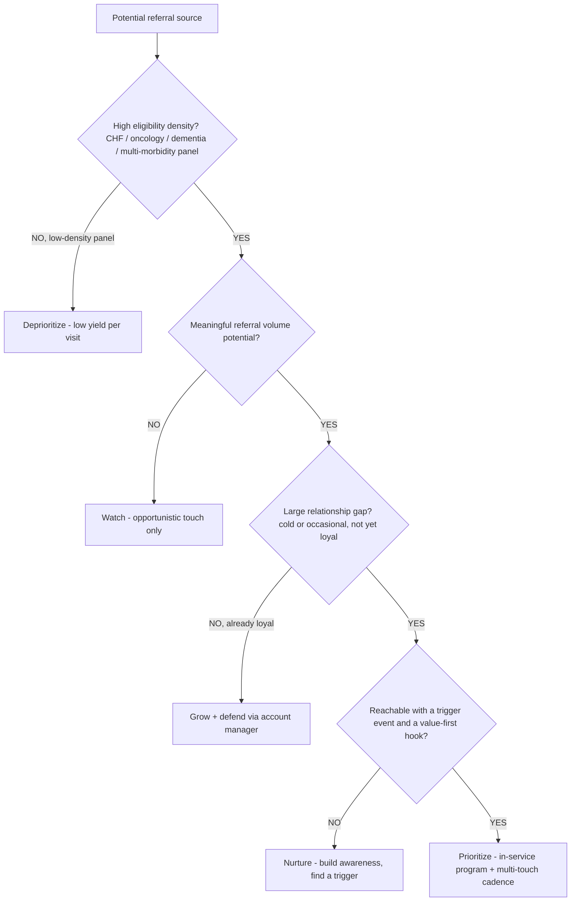
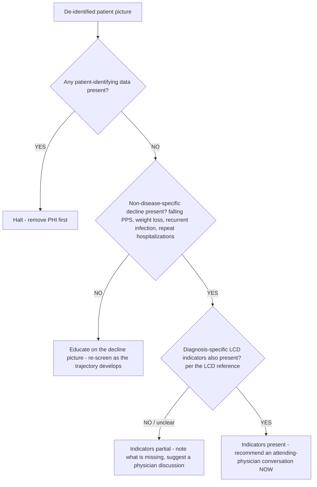
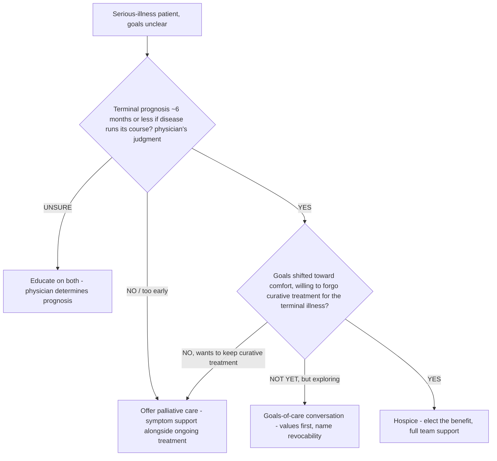
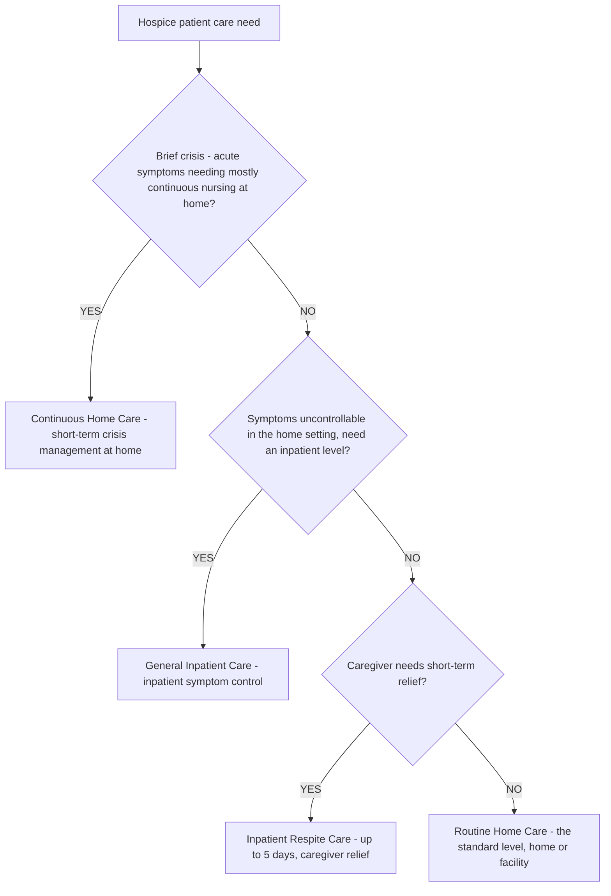
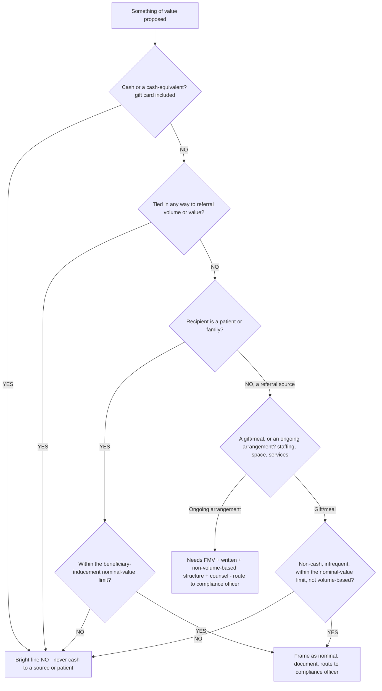
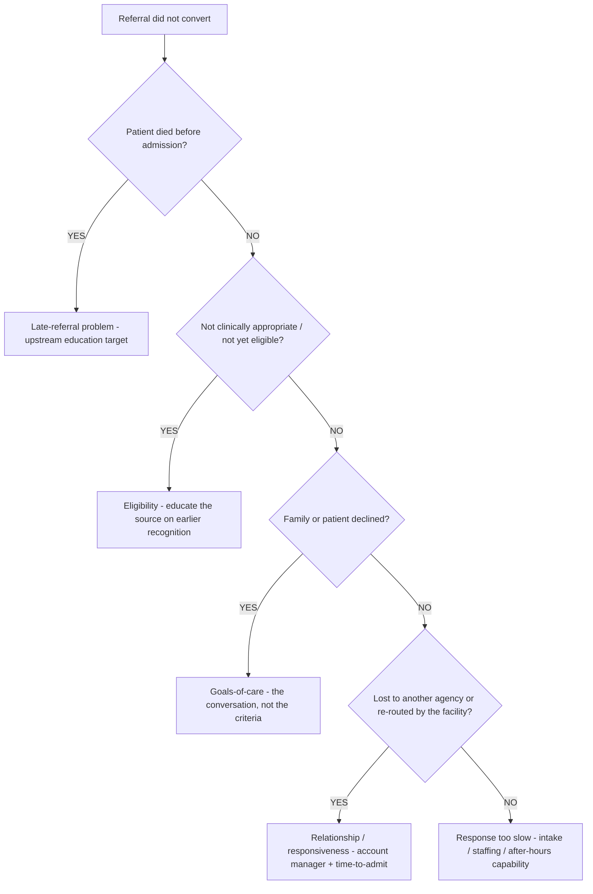

# Hospice referral-sales decision trees

> **Last reviewed: 2026-06-05 by `claude`.** Canonical decision trees for the recurring routing/strategy calls a hospice sales / community-education representative makes. Each tree has an observable entry condition, a `Last verified` date, a Mermaid graph, per-leaf rationale, and a tradeoffs table where there are ≥3 leaves. These encode **industry-standard** hospice referral-development practice and **published CMS rule structure** — not any agency's confidential method. **Two trees end deliberately at a hand-off, not a verdict:** the eligibility-screen tree ends at "route to physician" (the rep educates; the physician certifies) and the anti-kickback gate ends at "route to compliance officer" (the advisor frames; the compliance officer rules). Thresholds are heuristics — **calibrate to the current LCD, the current CMS rule, and your own program.**
>
> **Decision-tree traversal (priors).** When a situation matches an entry condition, traverse the relevant graph **top-to-bottom before deciding** — do not pattern-match on keywords. The first branch that resolves cleanly is the leaf to apply.

Refresh triggers: a revised hospice LCD, a CMS rule change (benefit periods, per-diem, face-to-face), a new OIG advisory opinion or work-plan item, or a structural shift in how referral sources operate.

---

## Decision Tree: Referral-source prioritization

**When this applies:** planning a territory and deciding which sources to invest in first.

**Last verified:** 2026-06-05 against standard hospice referral-development practice.

**Rationale per leaf:**

- **Deprioritize** — a low-eligibility-density panel yields few hospice-appropriate patients however warm the relationship; spend the time where the patients are.
- **Watch** — high density but low volume; keep aware, don't build a program.
- **Grow + defend** — already loyal; this is account-management whitespace, not net-new prospecting (route to `referral-account-manager`).
- **Nurture** — high potential but no opening yet; build awareness and watch for a trigger.
- **Prioritize** — high density + high volume + a real gap + a reachable opening = the best investment; build the in-service program.

**Tradeoffs summary:**

| Leaf | Eligibility density | Volume | Effort | Best for |
| --- | --- | --- | --- | --- |
| Prioritize | High | High | High | The unserved-eligible-patient territory |
| Grow + defend | High | High | Medium | Existing loyal partners |
| Nurture | High | High | Low-medium | High potential, no trigger yet |
| Watch | High | Low | Low | Small high-density sources |
| Deprioritize | Low | Any | Minimal | Low-yield panels |

---

## Decision Tree: Patient ready for a hospice conversation (EDUCATIONAL — ends at "route to physician")

**When this applies:** a de-identified profile or a teaching case, to decide whether the picture warrants a physician conversation. **This screens for a conversation, never for eligibility — the agent does not certify.**

**Last verified:** 2026-06-05 against the published non-disease-specific decline guidelines and diagnosis LCDs.

**Rationale per leaf:**

- **Halt** — PHI in the input stops everything; the rep removes identifying data before any screen.
- **Educate** — no decline picture yet; teach the source what to watch for and re-screen later.
- **Indicators partial** — some indicators; name what is missing to know and suggest the physician discussion.
- **Indicators present** — the published decline picture is here; recommend the physician conversation now (the too-late referral is the core failure). **Never "eligible" — always "route to physician."**

Every leaf ends with: _the attending physician and hospice medical director certify eligibility on clinical judgment._

---

## Decision Tree: Hospice vs palliative vs continue-curative

**When this applies:** the right offer for a patient/family is genuinely unclear, and honesty about which fits builds trust.

**Last verified:** 2026-06-05 against the hospice/palliative distinction and the Medicare Hospice Benefit structure.

**Rationale per leaf:**

- **Palliative care** — not terminal, or wants to continue curative treatment; palliative is the honest fit and builds trust for a later hospice referral.
- **Educate on both** — prognosis is the physician's call; teach the family both options.
- **Goals-of-care conversation** — terminal but the family is still exploring; lead with values, name that hospice is revocable (route to `goals-of-care-conversation-coach`).
- **Hospice** — terminal prognosis and goals aligned with comfort; the benefit fits.

**Tradeoffs summary:**

| Leaf | Prognosis | Curative treatment | Honest move |
| --- | --- | --- | --- |
| Palliative care | Any stage | Continues | Offer now; revisit hospice later |
| Educate on both | Unsure | TBD | Physician determines prognosis |
| Goals-of-care talk | Terminal | Exploring | Values-first, no pressure |
| Hospice | ~6 mo or less | Forgone for terminal illness | Elect the benefit |

---

## Decision Tree: Level-of-care selection (RHC / CHC / GIP / IRC)

**When this applies:** explaining or matching the four Medicare hospice levels of care to a patient situation. **The clinical determination is the hospice team's; this is education on what each level is for.**

**Last verified:** 2026-06-05 against the four Medicare hospice levels of care.

**Rationale per leaf:**

- **Continuous Home Care (CHC)** — a short period of mainly continuous nursing during a crisis to keep the patient at home; clinically gated.
- **General Inpatient Care (GIP)** — symptom control that can't be managed at home, in an inpatient setting; an OIG-scrutinized level (don't oversell it).
- **Inpatient Respite Care (IRC)** — short (up to ~5 days) inpatient stay to relieve the caregiver.
- **Routine Home Care (RHC)** — the standard, most common level, wherever the patient lives.

**Tradeoffs summary:**

| Level | Setting | Trigger | Note |
| --- | --- | --- | --- |
| RHC | Home/facility | Standard care | The large majority of hospice days |
| CHC | Home | Acute crisis, continuous nursing | Clinically gated; short-term |
| GIP | Inpatient | Uncontrolled symptoms | OIG-scrutinized; never oversell |
| IRC | Inpatient | Caregiver relief | Short, ~5-day limit |

---

## Decision Tree: Gift / meal / arrangement anti-kickback gate (ends at "route to compliance officer")

**When this applies:** anything of value is about to flow toward a referral source or a patient. **The agent frames; the compliance officer rules.**

**Last verified:** 2026-06-05 against the Anti-Kickback Statute, beneficiary-inducement CMP, and safe-harbor structure.

**Rationale per leaf:**

- **Bright-line NO** — cash/cash-equivalents, or anything tied to referral volume/value, is never permissible. Stop.
- **Route to compliance officer (gift/meal or patient nominal item)** — even a structurally-clean nominal gift is documented and confirmed with the compliance officer before it happens; the agent never green-lights.
- **Arrangement → FMV structure + counsel** — staffing/space/services need a written, fair-market-value, non-volume-based agreement and counsel review (the OIG-scrutinized zone).

Every non-NO leaf ends at: _route to the compliance officer / counsel before acting._

---

## Decision Tree: Declined-referral root-cause

**When this applies:** a referral did not convert to an admission, and you need the cause and the owner.

**Last verified:** 2026-06-05 against the referral-to-admission funnel taxonomy.

**Rationale per leaf:**

- **Late-referral problem** — the highest-value upstream target; the fix is earlier eligibility education, not intake.
- **Eligibility** — the patient wasn't yet appropriate; educate the source to recognize candidates earlier (and re-screen as they decline).
- **Goals-of-care** — the family declined; the lever is the conversation (`goals-of-care-conversation-coach`), never pressure.
- **Relationship / responsiveness** — lost to a competitor or re-routed; route to `referral-account-manager` and check time-to-admit.
- **Response too slow** — an operational fix (intake capacity, after-hours/same-day admit capability).

**Tradeoffs summary:**

| Leaf | Owner | Lever |
| --- | --- | --- |
| Late-referral | Eligibility educator | Earlier recognition education |
| Eligibility | Eligibility educator | Recognition + re-screen |
| Goals-of-care | Conversation coach | The values-first conversation |
| Relationship | Account manager | Responsiveness + multi-thread |
| Too slow | Intake / ops | Same-day / after-hours capability |
