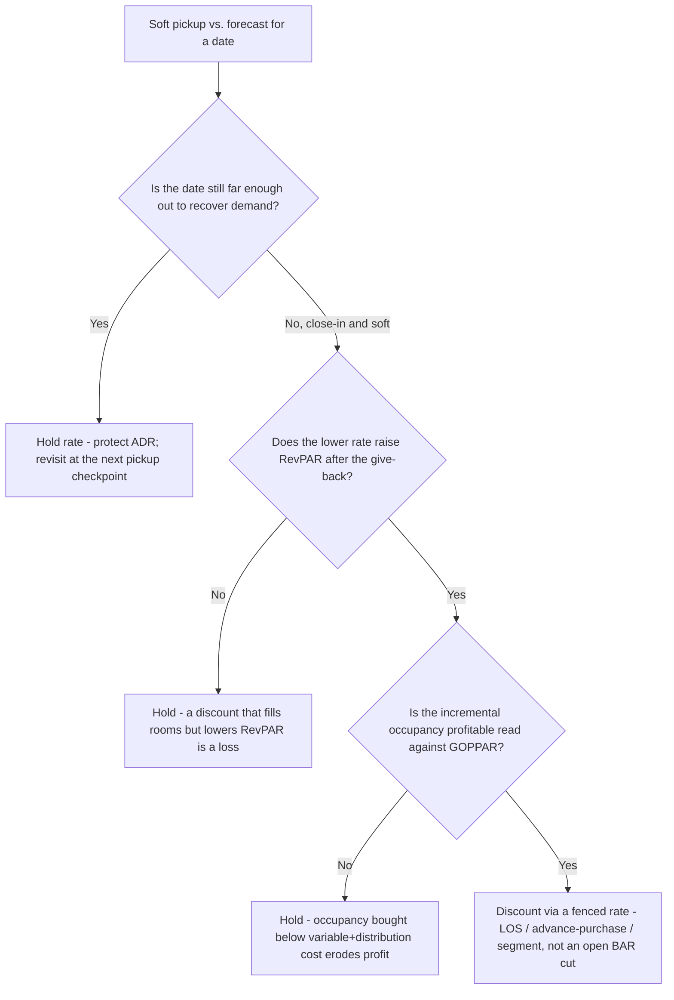
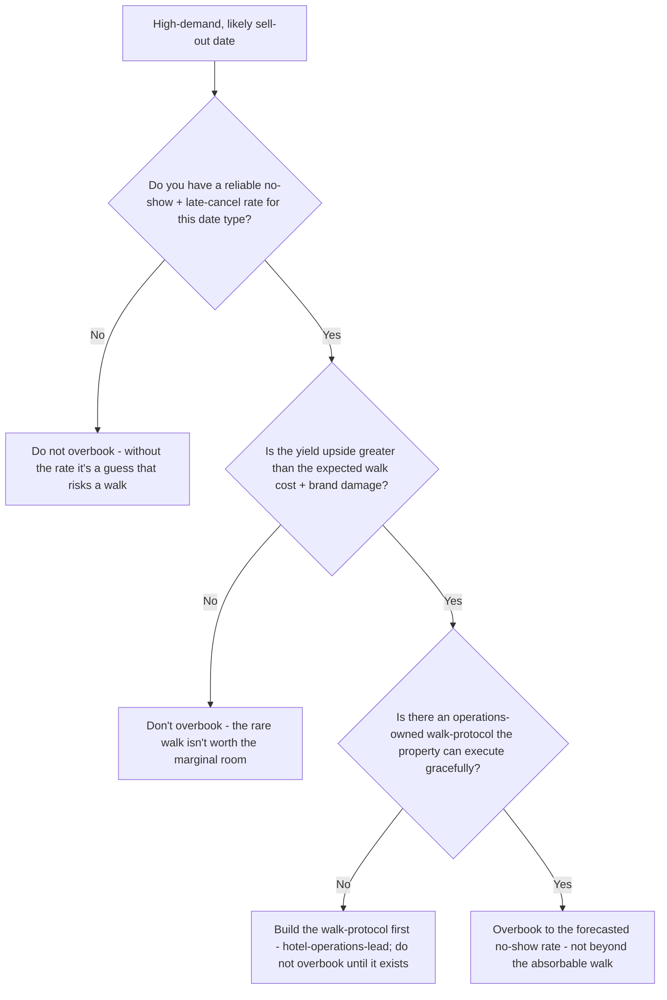
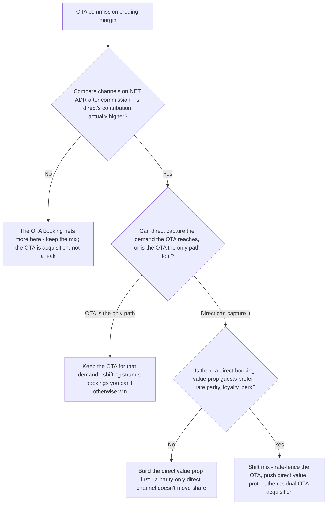
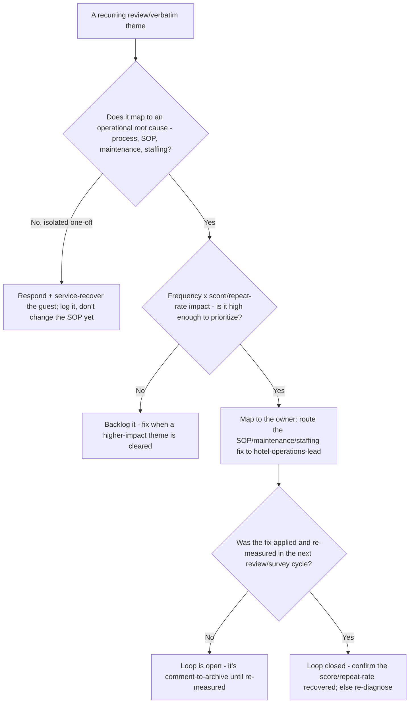
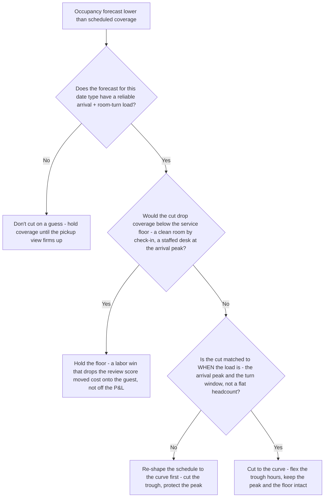

# Hospitality / Hotel Operations — Decision Trees

_Decision trees + a dated system/channel map. Capability rows are `[verify-at-build]` — re-check against the vendor before quoting. Last reviewed: 2026-06-08._

Traverse before making a rate move, deciding to overbook, shifting channel mix, or triaging a review-driven defect.

## Decision Tree: Discount for occupancy or hold rate?

RevPAR is the target — never buy occupancy with a giveaway that lowers revenue per available room.

_A full hotel at a giveaway rate and an empty hotel at rack are both failures. Optimize RevPAR, check it against GOPPAR._

## Decision Tree: Should we overbook this date?

Overbooking is a yield tool with a guarantee attached — size it to the forecasted no-show rate, never past the walk you can absorb.

_A walk is a broken promise. The overbook size is the revenue-manager's; the walk-protocol is operations'._

## Decision Tree: Shift channel mix toward direct?

Drive direct to cut distribution cost — but never strand the demand the OTAs uniquely reach.

_The OTA is a paid acquisition channel with a known cost. The question is the right mix, never zero OTA._

## Decision Tree: Triage a review-driven defect

The review is a defect report — close the loop to an operational fix, don't archive it.

_Measuring satisfaction is worthless without the action it drives. Rank by impact, not volume alone._

## Decision Tree: Cut labor for this shift?

Labor is the biggest controllable cost and the biggest service lever — schedule to the curve, never below the service floor.

_Schedule to the occupancy forecast; the service floor is the line a cost number never crosses._

---

## System & channel map (2026, `[verify-at-build]`)

| Layer | Options | Notes |
|---|---|---|
| PMS (property management system) | Oracle OPERA, Cloudbeds, Mews, apaleo, StayNTouch, Little Hotelier | System of record for room status, rate, folio, guest profile `[verify-at-build]` |
| RMS (revenue management system) | IDeaS, Duetto, Atomize, Pace, BEONx | Automates demand forecasting + rate recommendations; verify model + PMS integration `[verify-at-build]` |
| Channel manager | SiteMinder, Cloudbeds, RateGain, Derbysoft | Distributes rate/availability to OTAs + GDS; watch parity + sync latency `[verify-at-build]` |
| OTAs / distribution | Booking.com, Expedia Group, Airbnb, Google Hotels, GDS | Commission typically ~15-25% — compare on net ADR, treat as acquisition `[verify-at-build]` |
| Reputation / reviews | TripAdvisor, Google, Booking.com reviews, Revinate, TrustYou, Medallia | Theme/sentiment coding feeds the comment-to-action loop `[verify-at-build]` |
| Guest satisfaction / survey | Medallia, Qualtrics, Revinate, GuestRevu | NPS / GSS / CSAT + verbatim capture; route significance tests to applied-statistics `[verify-at-build]` |
| Loyalty / CRM | Brand programs (Marriott Bonvoy, Hilton Honors, etc.), Revinate, Cendyn, Salesforce | Measure on repeat rate / direct share / CLV, not member count `[verify-at-build]` |

_KPI reference: RevPAR = ADR × Occupancy = Room Revenue ÷ Available Rooms; ADR = Room Revenue ÷ Rooms Sold; Occupancy = Rooms Sold ÷ Available Rooms; GOPPAR = Gross Operating Profit ÷ Available Rooms (the profit check on a RevPAR strategy). Net ADR = headline rate − commission/channel cost − discount/loyalty give-back. Re-verify any vendor/commission specific before quoting it to a consumer._
