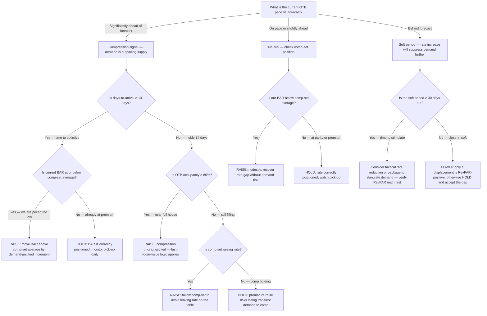
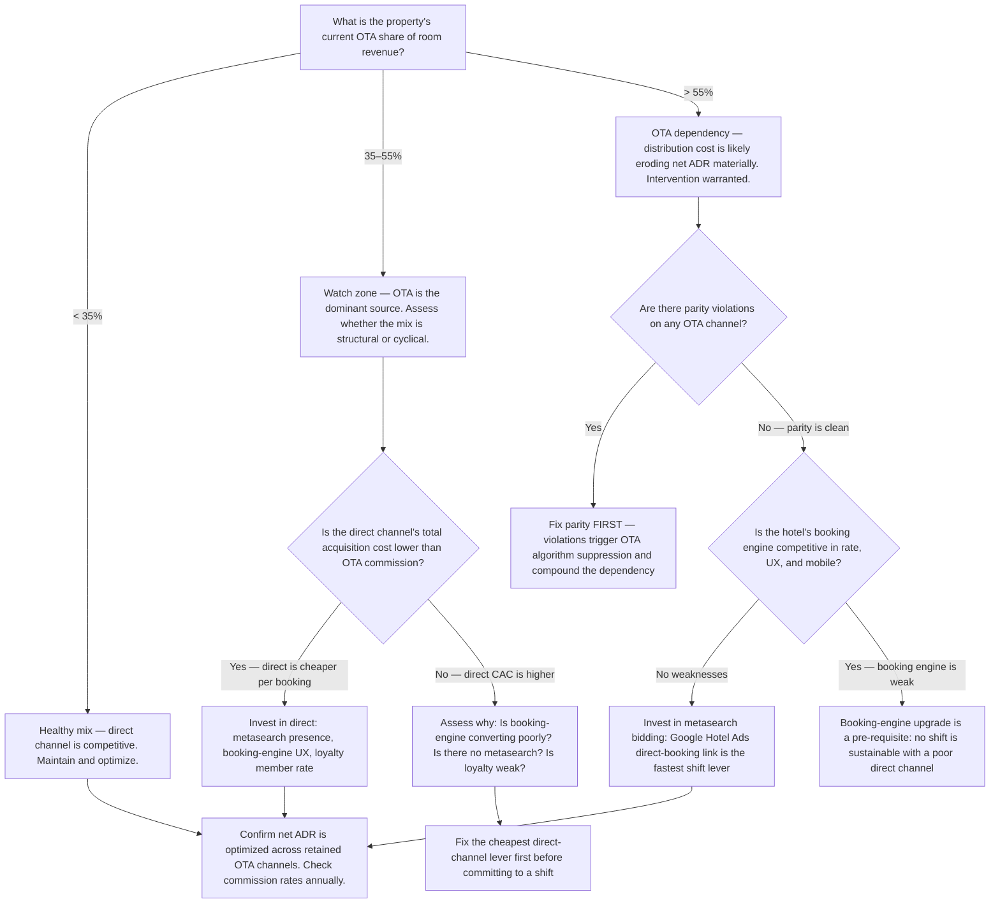
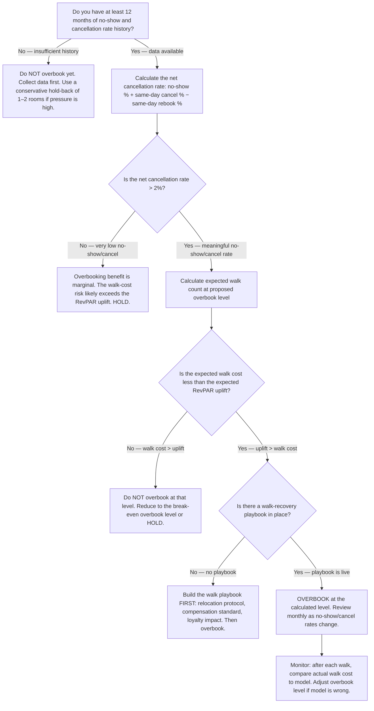

# Hospitality Hotels — Decision Trees + 2026 Capability Map

> Canonical knowledge bank for `hospitality-hotels`. **Traverse the relevant Mermaid tree
> top-to-bottom before choosing** — the proactive complement to the Capability Grounding Protocol.
> Volatile product/version/pricing facts in the capability map carry a retrieval date and a
> re-verify-at-use rider. Mark any volatile figure you cite with `[verify-at-use]`.

---

## Decision Tree 1: Raise or Hold Rate (BAR Strategy)

**Leaf rule:** never move rate without citing the demand basis (OTB pace, comp-set position, or
days-to-arrival window). A rate set on intuition is a guess. On compression nights, the
**last-room-value principle** applies: the marginal room is worth the most when supply is tightest
— do not discount it. A soft-period rate reduction is only RevPAR-positive if the incremental
occupied rooms cover the revenue surrendered on already-committed demand.

---

## Decision Tree 2: Direct Booking vs. OTA Channel

**Leaf rule:** OTA commission is a customer-acquisition cost, not a fixed tariff. Compare it to the
hotel's all-in direct CAC (booking-engine fee + payment processing + metasearch bid cost) before
declaring OTA "too expensive." At scale, direct is typically cheaper — but only if the booking
engine converts. Fix the weakest direct-channel lever before investing in a mix shift. Parity
violations must be resolved before any shift investment, because OTA algorithm suppression from
a violation actively redirects direct bookings back through the OTA.

---

## Decision Tree 3: Overbook or Not

**Leaf rule:** overbooking is a calculated risk, never a fixed percentage applied without history.
The math required before any overbook recommendation: (1) 12-month no-show + same-day cancel rate
from the PMS; (2) expected same-day rebookings that offset; (3) a walk-cost model (relocation rate
+ compensation + loyalty impact per walked guest); (4) the RevPAR uplift of selling the rooms that
would otherwise go empty. Without all four inputs, the correct answer is "do not overbook." A walk
that damages a loyal guest relationship has a cost that extends beyond the night's room revenue.

---

## 2026 Capability Map — Hotel Technology Stack

_Retrieved 2026-06-08. Product pricing, feature sets, and market positions are volatile —
re-confirm at use; this is orientation, not a procurement recommendation. [verify-at-use] for all
specific figures._

| Category | Leading Options (2026) | Notes |
| --- | --- | --- |
| **PMS (Property Management System)** | **Opera Cloud** (Oracle — dominant full-service and branded), **Mews** (cloud-native, strong mid-market and lifestyle), **Cloudbeds** (all-in-one for independents and smaller properties), **Apaleo** (API-first, composable stack) | Opera Cloud is the most common enterprise/branded choice; Mews and Cloudbeds are the fastest-growing cloud-native alternatives. Apaleo is favored by tech-forward independents needing API flexibility. [verify-at-use] |
| **RMS (Revenue Management System)** | **IDeaS G3 RMS** (SAS-owned, market leader for mid-size to large), **Duetto GameChanger** (known for Open Pricing, strong in upscale/luxury), **Infor HMS Revenue**, **OTA Insight / Lighthouse** (rate intelligence + RMS entry-level) | IDeaS and Duetto are the dominant enterprise RMS. OTA Insight (now rebranding as Lighthouse) is widely used for rate-shopping intelligence even by hotels with a separate RMS. [verify-at-use] |
| **Channel Manager** | **SiteMinder** (global market leader for independent hotels), **Cloudbeds Channel Manager** (bundled), **RateGain**, **Booking.com Connectivity** | A channel manager syncs availability and rates to OTAs in near-real time. SiteMinder connects to 450+ OTA channels. [verify-at-use] |
| **Booking Engine (Direct Channel)** | **SynXis** (Sabre — dominant for branded and larger independents), **Booking Button** (Booking.com's direct engine), **SiteMinder Booking Engine**, **Mews Booking Engine**, **Cloudbeds Booking Engine** | The booking engine's conversion rate and mobile UX are the most critical direct-channel metrics. [verify-at-use] |
| **GDS** | **Sabre GDS**, **Amadeus GDS**, **Travelport (Galileo/Worldspan)** | GDS is the backbone of corporate/agency and consortia (BCD, AMEX GBT, Carlson Wagonlit) bookings. Rates loaded via a CRS (Central Reservation System) or direct connect. [verify-at-use] |
| **Review / Reputation Management** | **TrustYou** (aggregates reviews, produces Trust Score), **ReviewPro** (Shiji group — GRI score, widely used in branded hotels), **Revinate** (email marketing + reputation combined), **Medallia (formerly Helixa)** | TrustYou and ReviewPro are the two primary reputation-score aggregation platforms in hospitality. Both produce a composite score from OTA, TripAdvisor, and Google reviews. [verify-at-use] |
| **Rate Shopping / Competitive Intelligence** | **OTA Insight / Lighthouse**, **RateGain**, **Duetto Pulse**, **Hotelligence (TravelClick/Amadeus)** | Rate shopping tools provide near-real-time comp-set BAR visibility. Most RMS platforms include a built-in rate-shopping feed. [verify-at-use] |
| **CRM / Guest Data** | **Salesforce (Hospitality Cloud)**, **Revinate CRM**, **Cendyn**, **Amadeus GMS** | Guest CRM powers personalization, repeat-guest recognition, and pre-arrival upsell programs. Most are PMS-integrated via profile sync. [verify-at-use] |

> Provenance: hotel-technology landscape knowledge based on publicly available vendor documentation
> and industry analyst reports as of 2026-06-08. Market share figures, pricing, and product names
> are volatile — re-verify at use. No invented products.

---

## See also

- [`../CLAUDE.md`](../CLAUDE.md) — team constitution & seams.
- [`../best-practices/README.md`](../best-practices/README.md) — the named, citable rules.
- [`../scripts/hotel_calc.py`](../scripts/hotel_calc.py) — the RevPAR / ADR / GOPPAR / net-ADR
  calculator. Run it for the arithmetic in any decision-tree leaf.

_Last reviewed: 2026-06-08 by `claude`._
