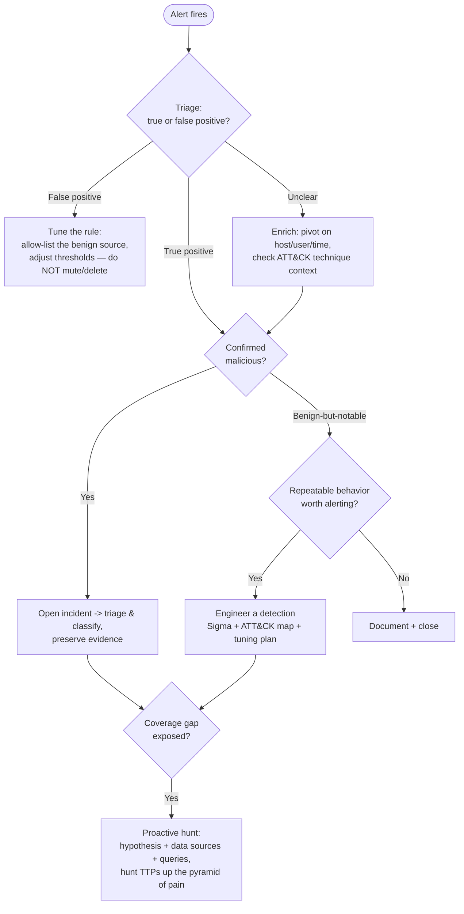
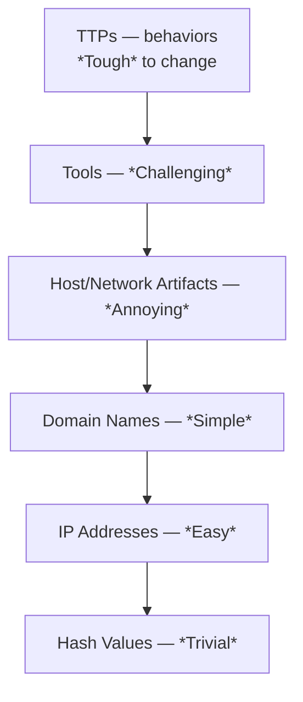

# Knowledge — Detection engineering & threat-hunting reference

> **Last reviewed:** 2026-07-01 · **Confidence:** High for the frameworks (MITRE ATT&CK tactics, the pyramid of pain, Sigma structure are stable); **volatile** for the current ATT&CK version and enterprise technique IDs — **re-verify at use** against attack.mitre.org.
> The `detection-and-forensics-engineer` traverses this tree **before** disposing of an alert. Every detection maps to ATT&CK; every hunt is a hypothesis; effort climbs the pyramid of pain.

The discipline: **alert → triage (true/false positive) → escalate / tune / hunt** — and prefer TTP-level detections over IOC-level ones.

---

## Decision Tree: alert → triage → escalate / tune / hunt

## MITRE ATT&CK — the enterprise tactics (the "why", in kill-chain-ish order)

| Tactic | Adversary goal |
|---|---|
| Reconnaissance | Gather info to plan the operation |
| Resource Development | Establish infrastructure/tooling |
| Initial Access | Get into the network |
| Execution | Run adversary code |
| Persistence | Maintain a foothold across reboots/creds |
| Privilege Escalation | Gain higher permissions |
| Defense Evasion | Avoid detection |
| Credential Access | Steal account credentials |
| Discovery | Learn the environment |
| Lateral Movement | Move through the environment |
| Collection | Gather target data |
| Command and Control | Communicate with compromised systems |
| Exfiltration | Steal data out |
| Impact | Manipulate, interrupt, or destroy |

> A **technique** (e.g. T1059 Command & Scripting Interpreter) is the "how" under a tactic; **sub-techniques** (T1059.001 PowerShell) are more specific. Detections tag the technique so coverage can be mapped (e.g. on an ATT&CK Navigator heatmap).

## The pyramid of pain (David Bianco)

Detect as high on the pyramid as your telemetry allows: hashes/IPs are trivial for an adversary to rotate; **TTPs** cost them a rework of how they operate. IOC-based detections catch *this* campaign; TTP-based detections catch the *next* one too.

## Sigma rule anatomy (portable detection-as-code)

| Section | Contents |
|---|---|
| Metadata | `title`, `id` (UUID), `status` (experimental→test→stable), `author`, `references` |
| `logsource` | `category` / `product` / `service` the rule reads |
| `detection` | `selection` field-matches + a `condition` boolean expression |
| `level` + `tags` | severity + ATT&CK tags (`attack.execution`, `attack.t1059.001`) |
| `falsepositives` | documented benign sources — the seed of the tuning plan |

## Provenance
- MITRE ATT&CK (attack.mitre.org) for tactics/techniques — **version and technique IDs are volatile, re-verify at use**. The pyramid of pain per David J. Bianco. Sigma project (SigmaHQ) for the rule format. Last reviewed 2026-07-01.
- See also [`../best-practices/every-detection-maps-to-attack-and-has-a-tuning-plan.md`](../best-practices/every-detection-maps-to-attack-and-has-a-tuning-plan.md).
