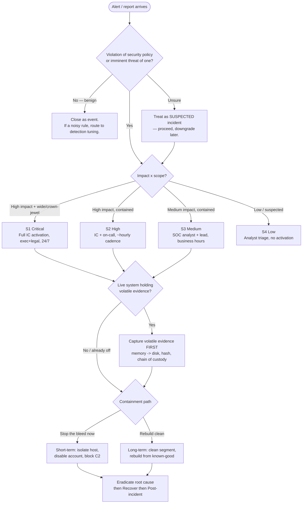
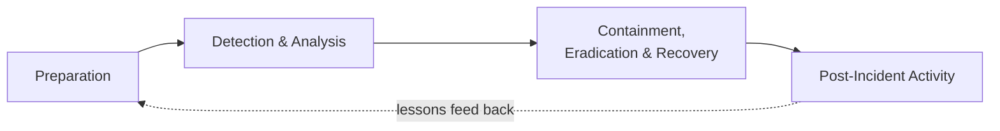

# Knowledge — Incident lifecycle & severity decision tree

> **Last reviewed:** 2026-07-01 · **Confidence:** High (NIST SP 800-61r2 phases are settled doctrine; the severity matrix is an industry-common impact × scope model — tune the thresholds to the org). **Not legal advice** — notification obligations are a legal call; flag them.
> The `dfir-response-lead` traverses this tree **before** naming a severity or a containment path. The governing question is always business impact × scope, never the alert's tone.

The discipline: **is-it-an-incident? → severity (impact × scope) → containment path** — then run the NIST phases in order. Never jump to eradication before scoping and containing.

---

## Decision Tree: triage → severity → containment

## The NIST SP 800-61r2 phases (run in order)

| Phase | Core work | Exit gate |
|---|---|---|
| Preparation | Plan, roster, tools, logs, out-of-band comms, legal contacts | Ready to respond |
| Detection & Analysis | Confirm, scope vector/blast radius, build timeline, map to ATT&CK | Scope known + **volatile evidence captured** |
| Containment / Eradication / Recovery | Stop spread → remove root cause → restore known-good | Adversary confirmed out, systems restored + monitored |
| Post-Incident Activity | Blameless review, root cause, follow-ups | Lessons tracked and fed back |

## Severity matrix (impact × scope)

| | Isolated / single host | Wide / crown-jewel |
|---|---|---|
| **High impact** (exfil, ransomware, integrity loss, regulated data) | S2 | **S1** |
| **Medium impact** (contained malware, policy violation w/ limited exposure) | S3 | S2 |
| **Low / suspected** (blocked phishing, failed exploit) | S4 | S3 |

> Take the **higher** of impact/scope when in doubt. Regulated/personal data in scope escalates and starts the notification clock at *awareness*.

## Provenance
- NIST SP 800-61r2 *Computer Security Incident Handling Guide* (the four-phase lifecycle). Severity model is an industry-common impact × scope classification (adapt thresholds per org). Notification obligations are legal — see [`../best-practices/notification-timelines-are-legal-deadlines-not-guidelines.md`](../best-practices/notification-timelines-are-legal-deadlines-not-guidelines.md). Last reviewed 2026-07-01.
- See also [`forensics-and-evidence-handling.md`](forensics-and-evidence-handling.md) for the evidence-capture gate.
