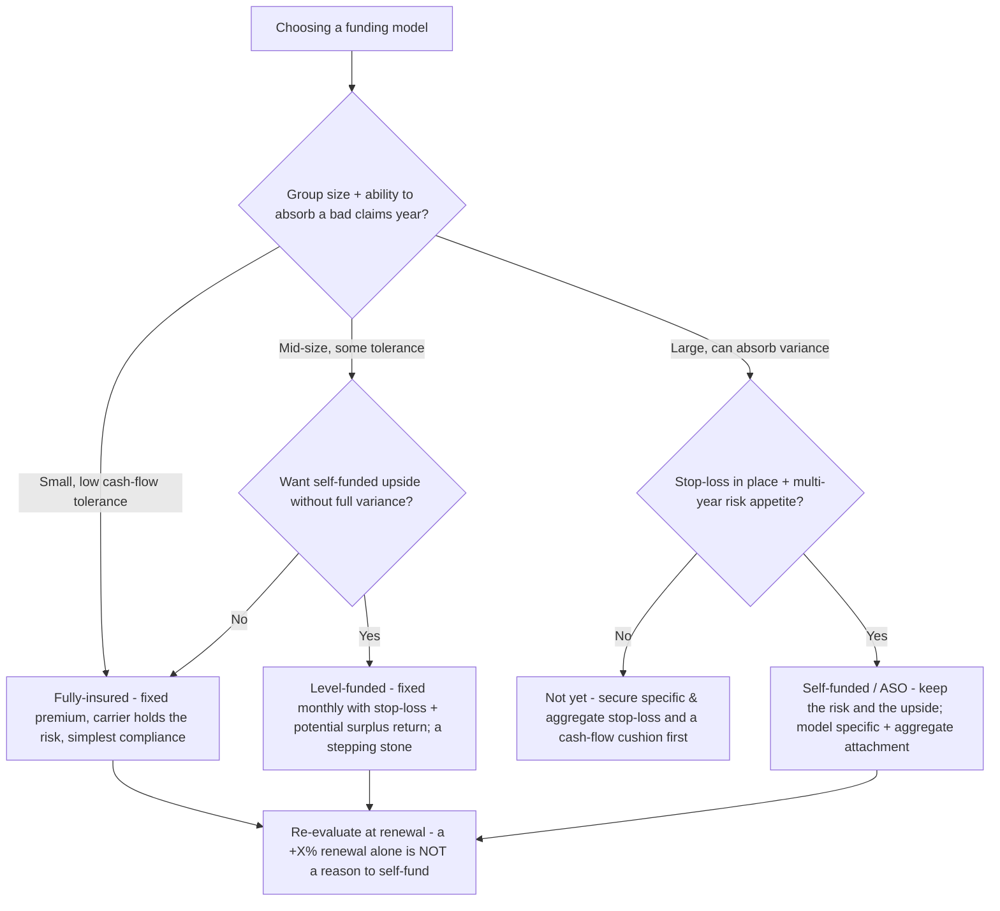
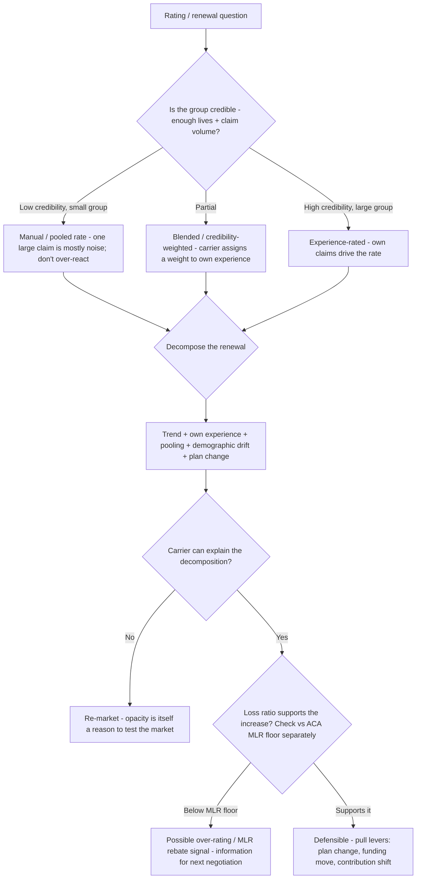
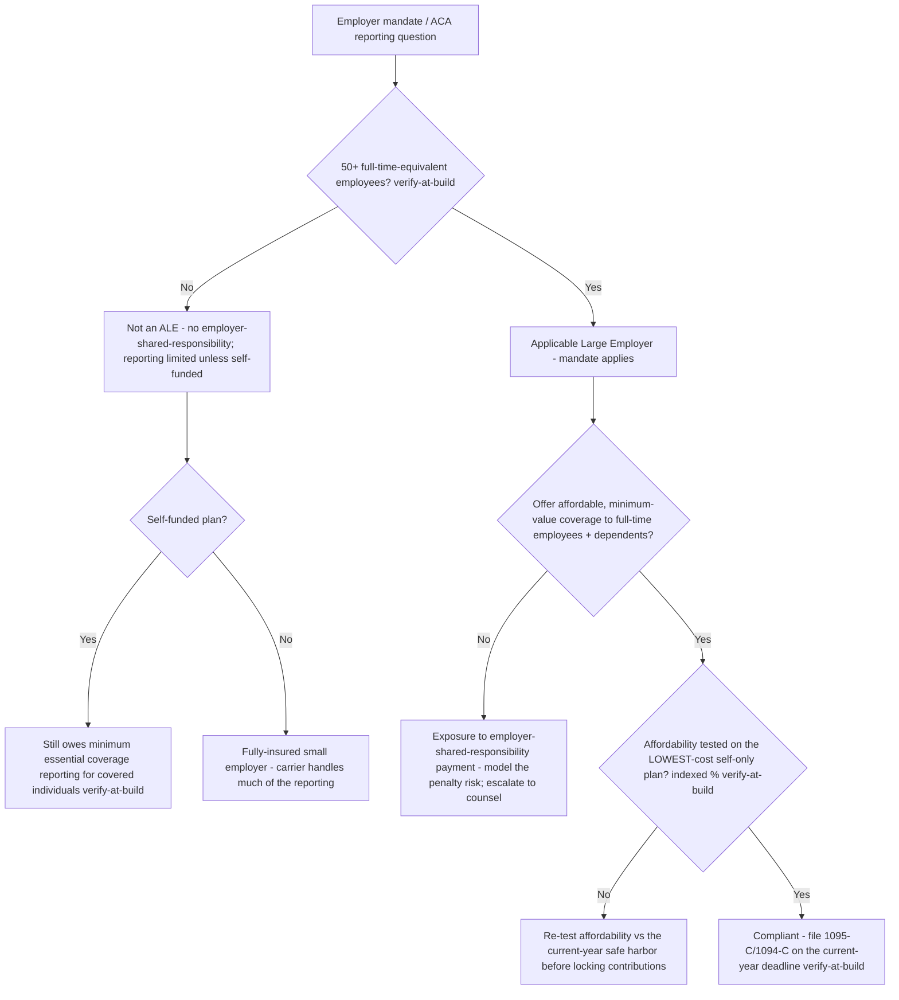
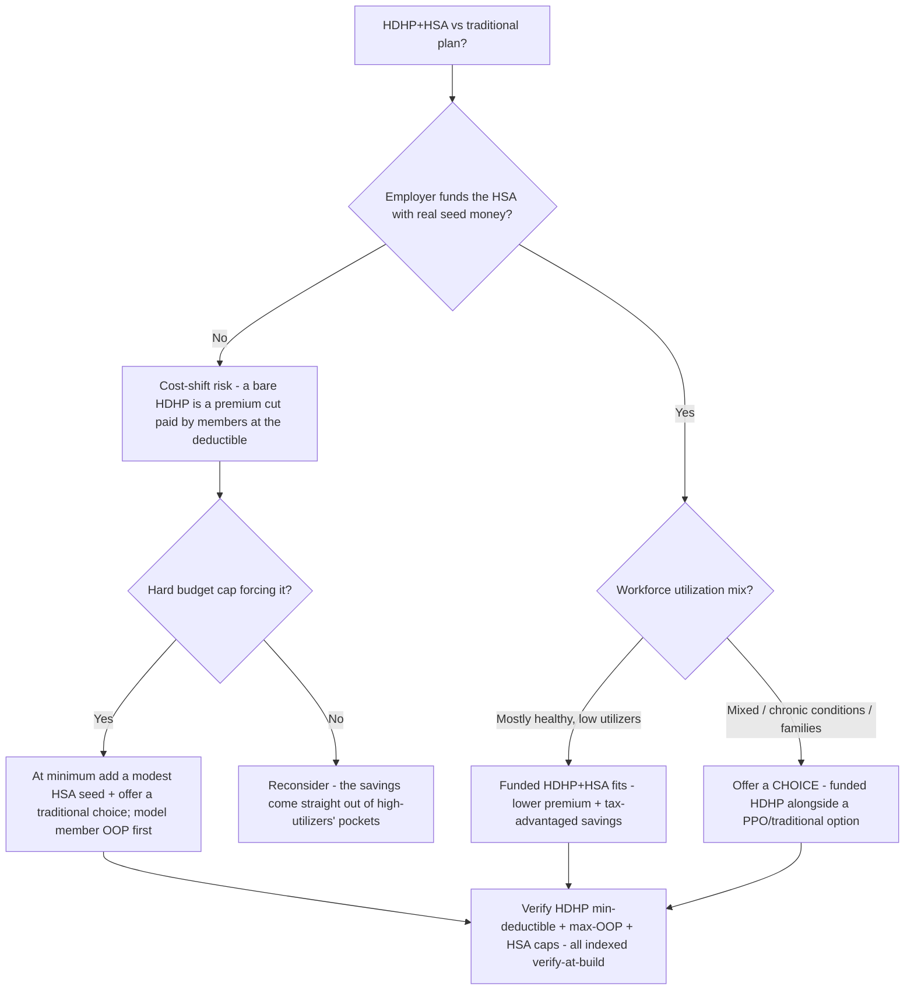
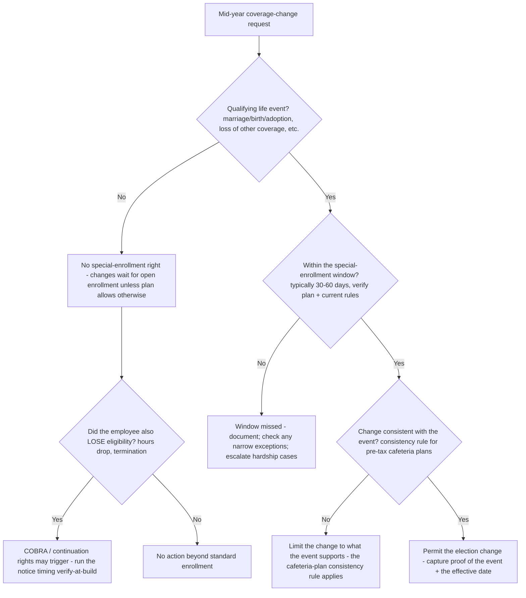

# Life / Health / Employee-Benefits — Decision Trees

_Decision trees + a dated reference map. Every quantitative row is `[verify-at-build]` — ACA thresholds, MLR percentages, COBRA/ERISA timing, and form numbers shift year to year; re-check against the current IRS / DOL / CMS source before quoting. **Educational scaffolding, not legal, tax, or actuarial advice** — a licensed broker, credentialed actuary, or ERISA counsel signs off. Last reviewed: 2026-06-08._

Traverse before choosing a funding model or reading a renewal.

## Decision Tree: Fully-insured, level-funded, or self-funded?

Funding is a risk posture sized to the group — not a reaction to one bad renewal.

_Self-funding is a multi-year risk decision, not a one-year escape hatch. A group too small to absorb claims variance, or with no stop-loss / cash cushion, should not self-fund to dodge a renewal._

## Decision Tree: How is this group rated, and is the renewal defensible?

Credibility decides whether the group's own experience drives its rate; a renewal is a sum of parts.

_Underwriting loss ratio (claims ÷ premium) is NOT the ACA medical-loss-ratio regulatory test — don't conflate them. Decompose every renewal; "+X%" is not a finding._

## Decision Tree: Is this group an ACA Applicable Large Employer, and what does it owe?

The ALE test gates the employer mandate, affordability, minimum value, and 1095-C/1094-C reporting. Verify the current-year figures.

_The ALE count, affordability %, and minimum-value floor are all indexed/dated — `[verify-at-build]` against the current IRS source. Educational scaffolding; ERISA counsel confirms the obligation._

## Decision Tree: HDHP+HSA or a traditional plan for this member/population?

A funded HDHP can be a genuine benefit or a cost-shift dressed as one — the employer HSA contribution and the member's utilization decide which.

_An HDHP with no employer HSA contribution is a cost-shift, not a benefit. Model member total cost across a realistic claims distribution; give a mixed workforce a choice. `[verify-at-build]` the indexed HDHP/HSA limits._

## Decision Tree: A qualifying life event hit mid-year — is there a special-enrollment right?

QLE / special-enrollment windows are precise and date-driven; a missed window is a real member harm. Write the rules down.

_Eligibility and special-enrollment windows are rules and a calendar, not vibes — write them down and verify current-year timing. A coverage loss can trigger COBRA; run the notice clock. Educational scaffolding._

---

## Reference map (2026, `[verify-at-build]`)

| Topic | Reference point | Notes |
|---|---|---|
| ALE threshold (ACA employer mandate) | 50+ full-time-equivalent employees → applicable large employer | Triggers employer-shared-responsibility + 1095-C/1094-C reporting `[verify-at-build]` |
| ACA affordability | Employee self-only premium ≤ a set % of household income (indexed annually) | The % is re-indexed each year — verify the current-year figure `[verify-at-build]` |
| ACA minimum value | Plan pays ≥ 60% of total allowed costs | Bronze-equivalent floor for the employer mandate `[verify-at-build]` |
| Medical-loss-ratio (MLR) thresholds | 80% individual / small-group, 85% large-group | Below the floor → rebate to policyholders; distinct from the underwriting loss ratio `[verify-at-build]` |
| COBRA continuation | Generally 18 months (up to 29 with disability, 36 for certain events); 20+ employee employers | Notice/election timing is precise — verify current rules `[verify-at-build]` |
| ERISA Form 5500 | Annual filing for ERISA plans (plus Summary Annual Report); small-plan exemptions apply | Deadline and schedules shift — verify current-year `[verify-at-build]` |
| SPD / SBC distribution | Summary Plan Description (ERISA) + Summary of Benefits and Coverage (ACA) required disclosures | Distribution timing rules apply `[verify-at-build]` |
| HSA / HDHP | HDHP must meet minimum deductible + max OOP limits (indexed); HSA contribution caps indexed annually | Pair an HDHP with employer HSA funding or it's a cost-shift `[verify-at-build]` |
| Plan types | HMO, PPO, EPO, POS, HDHP+HSA | Trade network breadth vs cost-share vs premium `[verify-at-build]` |
| Funding models | Fully-insured, level-funded, self-funded (ASO + specific/aggregate stop-loss) | Sized to group size + risk tolerance + cash flow `[verify-at-build]` |
| Lines of coverage | Medical, dental, vision, group term life + AD&D, short-term & long-term disability | Choose as a system; disability income is the most under-bought `[verify-at-build]` |

_All figures, thresholds, and deadlines above are indexed/revised periodically by the IRS, DOL, and CMS. Re-verify every quantitative value against the authoritative current-year source before relying on it. This is educational scaffolding, not legal, tax, or actuarial advice._
