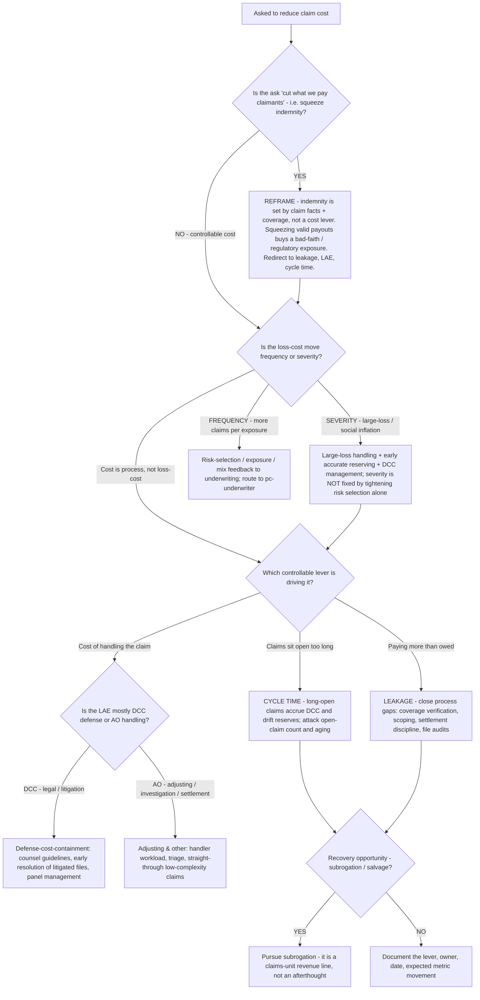

# P&C claims decision tree — controlling leakage, LAE, and cycle time

**Last reviewed:** 2026-06-05 · **Confidence:** medium (standard P&C claims-management practice + CAS/industry LAE literature, web-verified this date). The leaves are operational defaults, not rules; calibrate to the book and jurisdiction. Claims handling has a hard floor — never under-pay a valid claim (bad-faith and regulatory exposure). Decision-support, not legal advice (CLAUDE.md §2). Date and `[verify-at-use]`-mark any benchmark (§3 #8).

> Canonical decision tree for the `claims-specialist` (claims operations) with a numbers assist from `actuarial-pricing-analyst` (the LAE ratio, frequency/severity). Traverse top-to-bottom before prescribing a claims cost action. **This COMPLEMENTS [`pc-decision-trees.md`](pc-decision-trees.md)** — that file's large-loss tree handles *triage/escalation of one loss* (ROR, counsel, reinsurer notice); this tree handles the *operational cost levers across the claims book* (leakage, LAE, cycle time). The house position: claims is a leakage-and-cycle-time problem, not just minimized payout (§3 #7).

---

## When this applies

Leadership wants to "reduce claim costs" or the LAE ratio is drifting, and you must decide which lever to pull. The trap this tree blocks: cutting indemnity (what's rightly owed) instead of the controllable cost (leakage, LAE, cycle time).

## The tree



## Rationale per leaf

- **Reframe the indemnity ask** — indemnity (the amount owed) is a function of the claim's facts and the coverage; it is **not** a cost lever. Under-paying valid claims to "improve the loss ratio" buys a bad-faith and regulatory exposure that dwarfs the saving. Redirect the ask to the controllable costs: leakage, LAE, cycle time (§3 #7).
- **Severity vs frequency first** — confirm whether the loss-cost move is severity (large-loss / social inflation) or frequency (more claims), because they have opposite responses (§3 #3). A severity story responds to large-loss handling, early reserving, and DCC control — *not* to under-paying valid claims; a frequency story feeds back to underwriting risk selection.
- **Leakage** — paying more than owed through process gaps (missed coverage defenses, over-scoped estimates, weak settlement discipline). File audits and closed-claim review quantify it; it is pure controllable cost.
- **LAE = DCC + AO.** Loss adjustment expense splits into **Defense & Cost Containment** (legal/litigation/medical-cost-containment) and **Adjusting & Other** (handling, investigation, settlement) [verify-at-use]. The fix differs: DCC → counsel guidelines, panel management, early resolution of litigated files; AO → handler workload, triage, straight-through processing of low-complexity claims.
- **Cycle time** — long-open claims accrue DCC (more time under defense = more spend) and drift case reserves; open-claim count is a leading severity warning. Attacking aging cuts LAE *and* tightens reserve accuracy at once.
- **Subrogation / salvage** — recovery is a genuine claims-unit revenue line, not an afterthought; a recovery dollar improves the net result exactly like a saved indemnity dollar, without the bad-faith risk.

## The metric set (what to actually measure)

```
loss ratio        = (indemnity + LAE) / earned premium       ← LAE is IN the loss cost
LAE ratio         = LAE / earned premium      (split DCC vs AO)
leakage           = paid − (what file review says was owed)
cycle time        = report date → close date  (and open-claim aging buckets)
recovery rate     = subrogation + salvage recovered / recoverable
```

Manage the **controllable** four (LAE ratio, leakage, cycle time, recovery) — judge the operation on accurate, fast resolution, not minimized payout (§3 #7). The [`../scripts/pc_calc.py`](../scripts/pc_calc.py) `loss-ratio` mode confirms the frequency-vs-severity split before any indemnity discussion.

## Gotchas

- **"Cut payouts" is the wrong frame** — it under-pays valid claims (bad-faith exposure) and ignores the controllable cost. Refuse it; redirect to leakage/LAE/cycle time.
- **DCC and AO have different fixes** — lumping them as "LAE" hides that defense cost (DCC) is a legal-management problem while handling cost (AO) is a workload/triage problem.
- **Cycle time is a cost multiplier, not just a service metric** — every extra month a litigated file stays open accrues DCC and risks reserve drift.
- **Don't double-count** — LAE is already inside the loss cost; the LAE ratio is a *decomposition*, not an additional expense to stack on the combined ratio.

## Escalation & guardrails

- A specific large or litigated loss → the large-loss triage tree in [`pc-decision-trees.md`](pc-decision-trees.md) (ROR timing, counsel, reinsurer notice).
- A frequency story rooted in risk selection → escalate to [`pc-underwriter`](../agents/pc-underwriter.md) via the Team Lead.
- Anything touching policyholder/claimant PII or a coverage dispute → stop and route per CLAUDE.md §2; never store claimant records.
- Every figure entering a deliverable carries a source URL + retrieval date or an `[unverified — training knowledge]` / `[ESTIMATE]` mark (§3 #8).

## Sources (retrieved 2026-06-05)

- Founder Shield — Loss adjustment expense (LAE) definition: https://foundershield.com/insurance-terms/definition/loss-adjustment-expense/
- Huggins Actuarial — reserving considerations for Adjusting & Other (DCC vs AO split): https://hugginsactuarial.com/reserving-considerations-for-adjusting-and-other-expenses/
- CAS — *Statement of Principles, Loss & LAE Reserves* (DCC/AO definitions): https://www.casact.org/sites/default/files/2021-04/statement_of_principles_Loss_Loss_Adjustment%20_Expense%20_Reserves_2021.pdf
