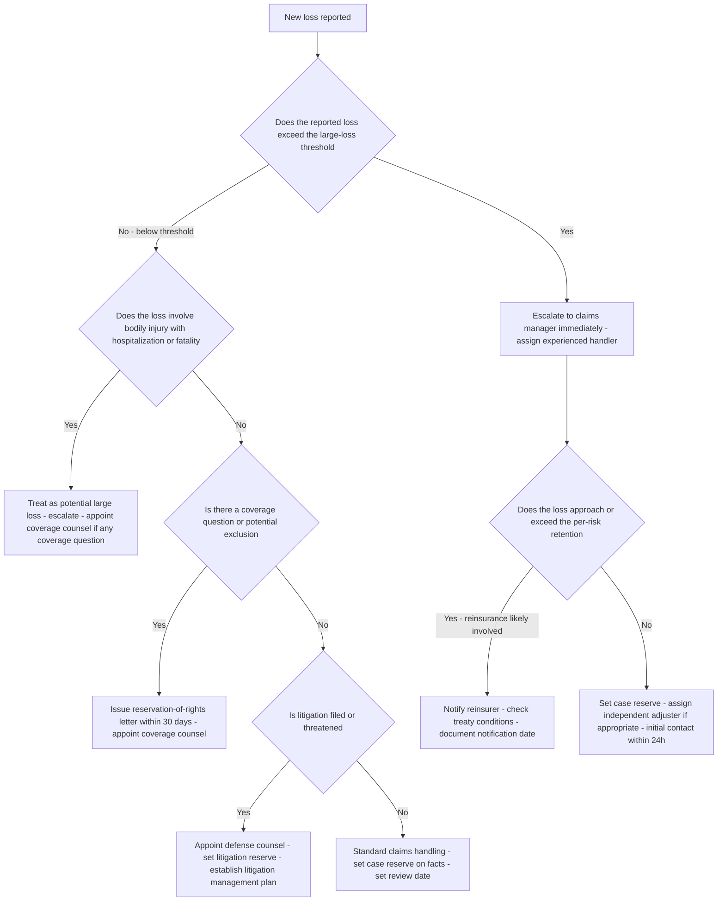
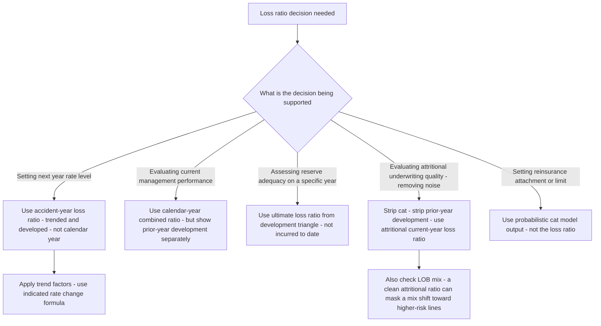
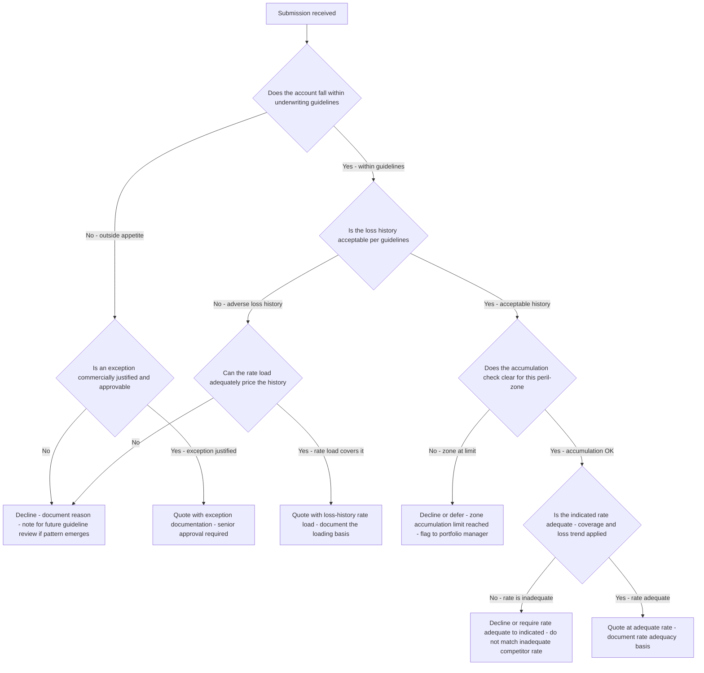

# P&C decision trees

Which analysis for which symptom — traverse top-to-bottom before picking a method.

## Decision Tree: Combined ratio deteriorated

1) Split loss vs expense (§3 #1). 2) Strip cat (§3 #4). 3) Separate frequency vs severity (§3 #3). 4) Check reserve development (§3 #5).

## Decision Tree: Is the rate adequate?

1) Build the indicated rate (§3 #2). 2) Compare to filed. 3) Stress for loss trend (§3 #3).

## Decision Tree: Which lines to grow/shrink

1) Decompose NCR by line (§3 #6). 2) Strip cat per line (§3 #4). 3) Map mix decisions to the result.

## How to read these trees

Traverse top-to-bottom and stop at the first matching branch — the order encodes the cheap-checks-before-expensive-checks discipline (§3). Each leaf names a skill, a specialist, or a house-opinion to apply. Never skip a higher branch because a lower one looks more interesting; a denominator, seasonal, or definitional artifact masquerades as a finding more often than not.

## Decision Tree: Which skill for which task

- **Decompose the combined ratio** → use when: Split the combined ratio into loss and expense, then attritional and catastrophe, so a deteriorating result is diagnosed correctly. ([`../skills/decompose-the-combined-ratio/SKILL.md`](../skills/decompose-the-combined-ratio/SKILL.md))
- **Price to rate adequacy** → use when: Price risk to expected loss plus expense plus profit load against loss trend, not to the competitor, so growth doesn't grow a loss. ([`../skills/price-to-rate-adequacy/SKILL.md`](../skills/price-to-rate-adequacy/SKILL.md))
- **Separate frequency from severity** → use when: Decompose a loss-ratio move into frequency and severity, since they have opposite responses, before prescribing. ([`../skills/separate-frequency-and-severity/SKILL.md`](../skills/separate-frequency-and-severity/SKILL.md))
- **Review claims leakage** → use when: Read indemnity leakage, LAE, and cycle time as managed metrics, not minimized payout, to find the controllable gap. ([`../skills/review-claims-leakage/SKILL.md`](../skills/review-claims-leakage/SKILL.md))
- **Read the portfolio result** → use when: Read the underwriting result by line of business, attritional-vs-cat and net-of-reinsurance, so the mix story is visible. ([`../skills/read-the-portfolio-result/SKILL.md`](../skills/read-the-portfolio-result/SKILL.md))

## Decision Tree: Which specialist owns this

- **The engagement** → [`underwriting-lead`](../agents/underwriting-lead.md)
- **Risk selection and pricing** → [`pc-underwriter`](../agents/pc-underwriter.md)
- **Claims operations** → [`claims-specialist`](../agents/claims-specialist.md)
- **The numbers** → [`actuarial-pricing-analyst`](../agents/actuarial-pricing-analyst.md)

When two leaves apply, route to the **lead** first to scope and sequence — overlapping symptoms usually mean two drivers at once, and the lead keeps the analysis from collapsing into a single-cause story.

## Decision Tree: Which house-opinion gates the call

Before picking any method, check whether one of the standing biases (§3) already decides the framing:

1. The combined ratio is loss plus expense — read both — if this is in question, apply §3 #1 before any method.
2. Underwrite to the loss ratio, not the competitor's rate — if this is in question, apply §3 #2 before any method.
3. Separate frequency from severity — if this is in question, apply §3 #3 before any method.
4. Isolate the catastrophe load — if this is in question, apply §3 #4 before any method.
5. Reserve adequacy is the truth-teller — if this is in question, apply §3 #5 before any method.
6. Line-of-business mix drives the portfolio result — if this is in question, apply §3 #6 before any method.
7. Claims is a leakage-and-cycle-time problem, not just payout — if this is in question, apply §3 #7 before any method.
8. Cite the source and date for every benchmark — if this is in question, apply §3 #8 before any method.

## Escalation & guardrails

- Anything touching client PII / regulated records → stop and route to `ravenclaude-core` `security-reviewer`.
- Any external figure entering a deliverable → carry a source URL + retrieval date, or mark it `[unverified — training knowledge]` / `[ESTIMATE]` (§3, final house opinion).
- A recommendation ships only with an owner, a date, and an expected metric movement.
## Sourcing note

Figures in this file are from the author's domain knowledge and are marked `[unverified — training knowledge]` or `[ESTIMATE]` at point of use. Validate against a primary source before putting any figure in a client deliverable (§3 cite-or-mark rule).

---

## Decision Tree: Claims — How to respond to a large or complex loss report

**When this applies:** A new loss is reported that exceeds a defined large-loss threshold, involves a potentially complex coverage question, or has characteristics signaling potential severity (serious injury, litigation involvement, regulatory interest, reputational risk). The claims-specialist must triage and escalate appropriately.

**Last verified:** 2026-06-05 against standard P&C large-loss management and claims-triage practice.

**Rationale per leaf:**
- *Large loss escalation* — large losses managed by senior handlers from day one close materially better than those escalated late; time lost in the first 30 days is often unrecoverable in liability cases.
- *Severity potential* — a serious bodily injury claim can escalate orders of magnitude from the initial report; treat early as large loss even if current reserve is below threshold.
- *Reservation of rights* — a delay in issuing an ROR letter can create coverage-by-estoppel in many US jurisdictions; 30 days is the standard outer limit, earlier is better.
- *Litigation* — the moment litigation is filed, the claims handler's discretion narrows and defense counsel takes the lead; a litigation management plan from day one avoids duplicated effort.
- *Reinsurance notification* — late notification of a reinsurer is often a condition of coverage under the treaty; missing the notice deadline can result in a coverage dispute with the reinsurer.

**Tradeoffs summary:**

| Loss type | First action | Timing | Escalation level |
|---|---|---|---|
| Large loss - confirmed | Escalate + experienced handler | Immediate | Claims manager |
| Potential severity - BI | Treat as large loss | Same day | Claims manager |
| Coverage question | ROR letter + coverage counsel | Within 30 days | Claims manager + counsel |
| Litigation filed | Defense counsel + lit plan | Within 5 business days | Claims manager + legal |
| Routine below threshold | Standard handling | 24h initial contact | Handler |

---

## Decision Tree: Portfolio — Which loss ratio is most relevant for the decision

**When this applies:** Management or the underwriting team is citing a loss ratio to support a pricing, portfolio, or reserve decision and must select the most appropriate loss-ratio metric for the specific decision. Different decisions require different perspectives on the same underlying loss data.

**Last verified:** 2026-06-05 against standard P&C actuarial and management reporting conventions.

**Rationale per leaf:**
- *Accident-year for pricing* — the accident year allocates losses to the period they were written; trending from the accident year to the future policy period is the actuarially correct basis for rate adequacy.
- *Calendar year for management* — the calendar-year combined ratio is what appears in GAAP/STAT financials; it is the right metric for investor communication but must show prior-year development separately to be useful for management.
- *Ultimate for reserve adequacy* — the current incurred ratio is partially developed; reserve adequacy requires projecting to ultimate using loss development factors.
- *Attritional for underwriting quality* — stripping cat and prior-year development isolates the performance of the current-year, current-period underwriting team; this is the "clean" view of underwriting quality.
- *Cat model for reinsurance* — the loss ratio is backward-looking frequency/severity data; reinsurance attachment and limit decisions require probabilistic forward-looking modeled output.

**Tradeoffs summary:**

| Decision | Best loss ratio | Key caveat |
|---|---|---|
| Rate level setting | Trended developed accident-year | Trend assumption drives the result |
| Financial reporting | Calendar-year combined ratio | Must disclose prior-year development |
| Reserve review | Ultimate loss ratio from triangle | LDF selection uncertainty |
| Underwriting quality | Attritional current-year | Mix shift can mask line-level deterioration |
| Reinsurance design | Cat model probabilistic | Model uncertainty loading required |

---

## Decision Tree: Underwriting — Should we write this account or decline

**When this applies:** An underwriter has a submission in hand and must decide whether to quote, quote with conditions, or decline. The decision involves rate adequacy, guideline compliance, accumulation check, and account quality assessment.

**Last verified:** 2026-06-05 against standard P&C underwriting decision practice and the plugin's house opinions.

**Rationale per leaf:**
- *Decline outside guidelines* — writing outside appetite without a documented exception is a control failure, not an underwriting decision; every decline is also data for guideline calibration.
- *Exception path* — exceptions are valid when commercially justified and properly approved; the cost is documentation and senior-level time, not the exception itself.
- *Loss-history rate load* — adverse history can be written if the rate fully loads the expected additional loss cost; the loading must be calculated, not estimated.
- *Accumulation decline* — zone limits exist to protect the portfolio from cat concentration; an individual account's merit is secondary to the portfolio-level discipline.
- *Rate adequacy decline* — matching an inadequate competitor rate is explicitly the house opinion against; a rate-adequate decline preserves the book's loss ratio.

**Tradeoffs summary:**

| Outcome | Condition | Documentation required |
|---|---|---|
| Quote - standard | Within guidelines - adequate rate - accumulation clear | Rate adequacy indication |
| Quote with load | Adverse history - loadable | Rate-load calculation + basis |
| Exception quote | Outside guideline - justified | Exception record + senior approval |
| Decline - accumulation | Zone at limit | Portfolio accumulation report |
| Decline - rate | Rate below indicated | Rate adequacy indication showing gap |
| Decline - appetite | Outside guidelines - not approvable | Declination note |
